<div align="center">
    <h3>Universidad Peruana de Ciencias Aplicadas</h3>
    </img><br>
    <strong>Ingeniería de Software</strong><br><br>
    <strong>Arquitecturas De Software Emergentes</strong><br><br>
    <strong>Profesor: Royer Edelwer Rojas Malasquez</strong><br><br>
    <strong>Sección: 7295</strong>
    <br>
    <br>
    <strong>LimaUrban: Automatizando los incidentes en Lima Metropolitana</strong>
    <!--<strong>name startup</strong>-->
</div>

<div align="center">

<h3> Team Members: </h3>

| Member                              |    Code    |
| :---------------------------------- | :--------: |
| Baldeon Fabian, Aldo Alberto        | u202122633 |
| Cama Salvatierra, Jimena Tamara     | u202210778 |
| Castillo Robles, Steve Roger        | u202121679 |
| Castillo Castillo, Jair Alexander   | u202211390 |
| Quezada Portalatino, Barbara Susana | u202211800 |

</div>

<h3 align="center">Octubre, 2025</h3>

<br><br>

<div align="justify">

## Registro de Versiones del Informe

El objetivo de esta sección es resumir las modificaciones relevantes que se realizan al informe durante el ciclo de vida del proyecto. Esta sección inicia en una página nueva e incluye un cuadro con la siguiente estructura:

<table>
  <thead>
    <tr>
      <th>Versión</th>
      <th>Fecha</th>
      <th>Autor</th>
      <th>Descripción de modificación</th>
    </tr>
  </thead>
  <tbody>
    <tr>
      <td>0.1</td>
      <td>07/09/2025</td>
      <td>Equipo completo</td>
      <td>Creación inicial del informe con la estructura base y distribución de responsabilidades</td>
    </tr>
  </tbody>
</table>
<br>

# Project Report Collaboration Insights

<br>Para desarrollar el proyecto, se empleó GitHub como herramienta para gestionar versiones y facilitar la colaboración en tiempo real. A continuación, se proporciona el enlace al repositorio del proyecto:

|     **Descripción**      |                              **Enlace**                               |
| :----------------------: | :-------------------------------------------------------------------: |
| Repositorio del Proyecto | https://github.com/orgs/Arquitectura-Software-Emergentes/repositories |
| Link de la Organización  |       https://github.com/orgs/Arquitectura-Software-Emergentes        |

Para la entrega de la TB2, se asignaron responsabilidades específicas a cada integrante, las cuales se detallan a continuación:

| Miembro del Equipo |                                                                                                                                               Tarea Asignada                                                                                                                                                |
| :----------------: | :---------------------------------------------------------------------------------------------------------------------------------------------------------------------------------------------------------------------------------------------------------------------------------------------------------: |
|    Aldo Baldeon    |                   Desarrollo del Capítulo I (Introducción), incluyendo la definición del startup profile, solution profile, análisis de antecedentes y problemática, proceso Lean UX y identificación de segmentos objetivo. Colaboración en la arquitectura de software del Capítulo IV.                   |
|  Barbara Quezada   |                   Elaboración del Capítulo II (Requirements Elicitation & Analysis), enfocándose en el análisis competitivo, diseño y ejecución de entrevistas, actividades de needfinding (user personas, empathy mapping, as-is scenario mapping) y definición del ubiquitous language.                   |
|   Steve Castillo   |                               Desarrollo del Capítulo III (Requirements Specification), incluyendo to-be scenario mapping, especificación de user stories, impact mapping y estructuración del product backlog. Contribución en la definición de la startup en el Capítulo I.                               |
|    Jimena Cama     | Elaboración del Capítulo IV (Strategic-Level Software Design), enfocándose en el strategic-level attribute-driven design, análisis de quality attribute scenarios, identificación de constraints y desarrollo de diagramas arquitectónicos C4. Apoyo en la definición de segmentos objetivo del Capítulo I. |
|   Jair Castillo    |                       Desarrollo del strategic-level domain-driven design del Capítulo IV, incluyendo EventStorming, candidate context discovery, domain message flows modeling, bounded context canvases y context mapping. Colaboración en el análisis competitivo del Capítulo II.                       |

Cabe destacar que, durante la creación del informe, se realizaron commits específicos para cada tarea asignada, lo que permitió garantizar un control de versiones y una colaboración efectiva en tiempo real. El equipo mantuvo reuniones semanales de sincronización para asegurar la coherencia entre los diferentes capítulos y compartir avances.

Miembros

- Aldo Baldeon (CodAress)
- Barbara Quezada (BarbaraQP15)
- Steve Castillo (Salchichon057)
- Jimena Cama (aksonie)
- Jair Castillo (U202211390)

El uso de GitHub ha permitido gestionar versiones y fomentar la colaboración en tiempo real, facilitando que los integrantes del equipo trabajen tanto de forma asincrónica como sincrónica en el proyecto. Asimismo, la metodología Gitflow ha posibilitado la creación de diversas ramas para el desarrollo de las tareas asignadas, promoviendo un trabajo autónomo y colaborativo entre los miembros.

La rama "develop" se utilizó como un entorno para integrar las tareas de cada miembro de manera estructurada y organizada, mientras que la rama "main" se destinó a la entrega de la versión final del proyecto. Esta estrategia permitió una revisión conjunta del contenido antes de su integración final, reduciendo errores y asegurando la calidad del informe presentado.

# Contenido

## Tabla de Contenidos

## Capítulo I: Introducción

- [1.1. Startup Profile](#11-startup-profile)
  - [1.1.1. Descripción de la Startup](#111-descripción-de-la-startup)
  - [1.1.2. Perfiles de integrantes del equipo](#112-perfiles-de-integrantes-del-equipo)
- [1.2. Solution Profile](#12-solution-profile)
  - [1.2.1. Antecedentes y problemática](#121-antecedentes-y-problemática)
  - [1.2.2. Lean UX Process](#122-lean-ux-process)
    - [1.2.2.1. Lean UX Problem Statements](#1221-lean-ux-problem-statements)
    - [1.2.2.2. Lean UX Assumptions](#1222-lean-ux-assumptions)
    - [1.2.2.3. Lean UX Hypothesis Statements](#1223-lean-ux-hypothesis-statements)
    - [1.2.2.4. Lean UX Canvas](#1224-lean-ux-canvas)
- [1.3. Segmentos objetivo](#13-segmentos-objetivo)

## Capítulo II: Requirements Elicitation & Analysis

- [2.1. Competidores](#21-competidores)
  - [2.1.1. Análisis competitivo](#211-análisis-competitivo)
  - [2.1.2. Estrategias y tácticas frente a competidores](#212-estrategias-y-tácticas-frente-a-competidores)
- [2.2. Entrevistas](#22-entrevistas)
  - [2.2.1. Diseño de entrevistas](#221-diseño-de-entrevistas)
  - [2.2.2. Registro de entrevistas](#222-registro-de-entrevistas)
  - [2.2.3. Análisis de entrevistas](#223-análisis-de-entrevistas)
- [2.3. Needfinding](#23-needfinding)
  - [2.3.1. User Personas](#231-user-personas)
  - [2.3.2. User Task Matrix](#232-user-task-matrix)
  - [2.3.3. Empathy Mapping](#233-empathy-mapping)
  - [2.3.4. As-is Scenario Mapping](#234-as-is-scenario-mapping)
- [2.4. Ubiquitous Language](#24-ubiquitous-language)

## Capítulo III: Requirements Specification

- [3.1. To-Be Scenario Mapping](#31-to-be-scenario-mapping)
- [3.2. User Stories](#32-user-stories)
- [3.3. Impact Mapping](#33-impact-mapping)
- [3.4. Product Backlog](#34-product-backlog)

## Capítulo IV: Strategic-Level Software Design

- [4.1. Strategic-Level Attribute-Driven Design](#41-strategic-level-attribute-driven-design)
  - [4.1.1. Design Purpose](#411-design-purpose)
  - [4.1.2. Attribute-Driven Design Inputs](#412-attribute-driven-design-inputs)
    - [4.1.2.1. Primary Functionality (Primary User Stories)](#4121-primary-functionality-primary-user-stories)
    - [4.1.2.2. Quality attribute Scenarios](#4122-quality-attribute-scenarios)
    - [4.1.2.3. Constraints](#4123-constraints)
    - [4.1.2.4. Architectural Drivers Backlog](#4124-architectural-drivers-backlog)
  - [4.1.3. Architectural Design Decisions](#413-architectural-design-decisions)
  - [4.1.4. Quality Attribute Scenario Refinements](#414-quality-attribute-scenario-refinements)
- [4.2. Strategic-Level Domain-Driven Design](#42-strategic-level-domain-driven-design)
  - [4.2.1. EventStorming](#421-eventstorming)
  - [4.2.2. Candidate Context Discovery](#422-candidate-context-discovery)
  - [4.2.3. Domain Message Flows Modeling](#423-domain-message-flows-modeling)
  - [4.2.4. Bounded Context Canvases](#424-bounded-context-canvases)
  - [4.2.5. Context Mapping](#425-context-mapping)
- [4.3. Software Architecture](#43-software-architecture)
  - [4.3.1. Software Architecture System Landscape Diagram](#431-software-architecture-system-landscape-diagram)
  - [4.3.2. Software Architecture Context Level Diagrams](#432-software-architecture-context-level-diagrams)
  - [4.3.3. Software Architecture Container Level Diagrams](#433-software-architecture-container-level-diagrams)
  - [4.3.4. Software Architecture Deployment Diagrams](#434-software-architecture-deployment-diagrams)
  ## Capítulo V: Tactical-Level Software Design
- [5.1. Bounded Context: Iam Context](#51-bounded-context-nombre-del-contexto)

  - [5.1.1. Domain Layer](#511-domain-layer)
  - [5.1.2. Interface Layer](#512-interface-layer)
  - [5.1.3. Application Layer](#513-application-layer)
  - [5.1.4. Infrastructure Layer](#514-infrastructure-layer)
  - [5.1.5. Bounded Context Software Architecture Component Level Diagrams](#515-bounded-context-software-architecture-component-level-diagrams)
  - [5.1.6. Bounded Context Software Architecture Code Level Diagrams](#516-bounded-context-software-architecture-code-level-diagrams)
    - [5.1.6.1. Bounded Context Domain Layer Class Diagrams](#5161-bounded-context-domain-layer-class-diagrams)
    - [5.1.6.2. Bounded Context Database Design Diagram](#5162-bounded-context-database-design-diagram)

- [5.2. Bounded Context: Incidents Context](#51-bounded-context-nombre-del-contexto)

  - [5.2.1. Domain Layer](#511-domain-layer)
  - [5.2.2. Interface Layer](#512-interface-layer)
  - [5.2.3. Application Layer](#513-application-layer)
  - [5.2.4. Infrastructure Layer](#514-infrastructure-layer)
  - [5.2.5. Bounded Context Software Architecture Component Level Diagrams](#515-bounded-context-software-architecture-component-level-diagrams)
  - [5.2.6. Bounded Context Software Architecture Code Level Diagrams](#516-bounded-context-software-architecture-code-level-diagrams)
    - [5.2.6.1. Bounded Context Domain Layer Class Diagrams](#5161-bounded-context-domain-layer-class-diagrams)
    - [5.2.6.2. Bounded Context Database Design Diagram](#5162-bounded-context-database-design-diagram)
    - [5.2. Bounded Context: Incidents Context](#51-bounded-context-nombre-del-contexto)
  - [5.2.1. Domain Layer](#511-domain-layer)
  - [5.2.2. Interface Layer](#512-interface-layer)
  - [5.2.3. Application Layer](#513-application-layer)
  - [5.2.4. Infrastructure Layer](#514-infrastructure-layer)
  - [5.2.5. Bounded Context Software Architecture Component Level Diagrams](#515-bounded-context-software-architecture-component-level-diagrams)
  - [5.2.6. Bounded Context Software Architecture Code Level Diagrams](#516-bounded-context-software-architecture-code-level-diagrams)
    - [5.2.6.1. Bounded Context Domain Layer Class Diagrams](#5161-bounded-context-domain-layer-class-diagrams)
    - [5.2.6.2. Bounded Context Database Design Diagram](#5162-bounded-context-database-design-diagram)

- [5.3. Bounded Context: Location Context](#53-bounded-context-analytics-context)
  - [5.3.1. Domain Layer](#531-domain-layer)
  - [5.3.2. Interface Layer](#532-interface-layer)
  - [5.3.3. Application Layer](#533-application-layer)
  - [5.3.4. Infrastructure Layer](#534-infrastructure-layer)
  - [5.3.5. Bounded Context Software Architecture Component Level Diagrams](#535-bounded-context-software-architecture-component-level-diagrams)
  - [5.3.6. Bounded Context Software Architecture Code Level Diagrams](#536-bounded-context-software-architecture-code-level-diagrams)
    - [5.3.6.1. Bounded Context Domain Layer Class Diagrams](#5361-bounded-context-domain-layer-class-diagrams)
    - [5.3.6.2. Bounded Context Database Design Diagram](#5362-bounded-context-database-design-diagram)

## Capítulo VI: Solution UX Design

- [6.1. Style Guidelines](#61-style-guidelines)
  - [6.1.1. General Style Guidelines](#611-general-style-guidelines)
  - [6.1.2. Web, Mobile & Devices Style Guidelines](#612-web-mobile--devices-style-guidelines)
- [6.2. Information Architecture](#62-information-architecture)
  - [6.2.1. Organization Systems](#621-organization-systems)
  - [6.2.2. Labeling Systems](#622-labeling-systems)
  - [6.2.3. Searching Systems](#623-searching-systems)
  - [6.2.4. SEO Tags and Meta Tags](#624-seo-tags-and-meta-tags)
  - [6.2.5. Navigation Systems](#625-navigation-systems)
- [6.3. Landing Page UI Design](#63-landing-page-ui-design)
  - [6.3.1. Landing Page Wireframe](#631-landing-page-wireframe)
  - [6.3.2. Landing Page Mock-up](#632-landing-page-mock-up)
- [6.4. Applications UX/UI Design](#64-applications-uxui-design)
  - [6.4.1. Applications Wireframes](#641-applications-wireframes)
  - [6.4.2. Applications Wireflow Diagrams](#642-applications-wireflow-diagrams)
  - [6.4.3. Applications Mock-ups](#643-applications-mock-ups)
  - [6.4.4. Applications User Flow Diagrams](#644-applications-user-flow-diagrams)
- [6.5. Applications Prototyping](#65-applications-prototyping)

## Capítulo VII: Product Implementation, Validation & Deployment

- [7.1. Software Configuration Management](#71-software-configuration-management)
  - [7.1.1. Software Development Environment Configuration](#711-software-development-environment-configuration)
  - [7.1.2. Source Code Management](#712-source-code-management)
  - [7.1.3. Source Code Style Guide & Conventions](#713-source-code-style-guide--conventions)
  - [7.1.4. Software Deployment Configuration](#714-software-deployment-configuration)
- [7.2. Solution Implementation](#72-solution-implementation)
  - [7.2.1. Sprint 1](#721-sprint-1)
    - [7.2.1.1. Sprint Planning 1](#7211-sprint-planning-1)
    - [7.2.1.2. Sprint Backlog 1](#7212-sprint-backlog-1)
    - [7.2.1.3. Development Evidence for Sprint Review](#7213-development-evidence-for-sprint-review)
    - [7.2.1.4. Testing Suite Evidence for Sprint Review](#7214-testing-suite-evidence-for-sprint-review)
    - [7.2.1.5. Execution Evidence for Sprint Review](#7215-execution-evidence-for-sprint-review)
    - [7.2.1.6. Services Documentation Evidence for Sprint Review](#7216-services-documentation-evidence-for-sprint-review)
    - [7.2.1.7. Software Deployment Evidence for Sprint Review](#7217-software-deployment-evidence-for-sprint-review)
    - [7.2.1.8. Team Collaboration Insights during Sprint](#7218-team-collaboration-insights-during-sprint)
- [7.3. Validation Interviews](#73-validation-interviews)
  - [7.3.1. Diseño de Entrevistas](#731-diseño-de-entrevistas)
  - [7.3.2. Registro de Entrevistas](#732-registro-de-entrevistas)
  - [7.3.3. Evaluaciones según heurísticas](#733-evaluaciones-según-heurísticas)
- [7.4. Video About-the-Product](#74-video-about-the-product)

### [Conclusiones](#conclusiones)

### [Bibliografía](#bibliografía)

### [Anexos](#anexos)

# Student Outcome

El curso contribuye al cumplimiento del Student Outcome ABET:
**ABET – EAC - Student Outcome 5**
**Criterio:** La capacidad de funcionar efectivamente en un equipo cuyos miembros
juntos proporcionan liderazgo, crean un entorno de colaboración e inclusivo,
establecen objetivos, planifican tareas y cumplen objetivos.
En el siguiente cuadro se describe las acciones realizadas y enunciados de
conclusiones por parte del grupo, que permiten sustentar el haber alcanzado el logro del ABET – EAC - Student Outcome 5.

<table>
    <tr>
        <th><b>Criterio específico</b></th>
        <th><b>Acciones realizadas</b></th>
        <th><b>Conclusiones</b></th>
    </tr>
    <tr>
        <td rowspan="1"><b>Trabaja en equipo para proporcionar liderazgo en forma conjunta</b></td>
        <td>
            <b>TB1:</b><br>
            <b>Baldeon Fabian, Aldo Alberto</b><br>
            - Me encargué de identificar y analizar los antecedentes y problemática urbana en Lima, trabajando en conjunto con el equipo para establecer el marco conceptual del proyecto. Participé activamente en la formulación del Lean UX Problem Statement y colaboré en la definición de la arquitectura de software, comunicando la visión técnica del sistema de manera clara a todos los miembros.
            <br><br> 
            <b>Cama Salvatierra, Jimena Tamara</b><br>
            - Me comuniqué oralmente con mi equipo explicando la propuesta de la idea y el impacto esperado. Expuse de forma clara cómo los segmentos objetivos aportaban valor al proyecto y utilicé un lenguaje adecuado para que la información fuera comprensible para personas con diferentes especialidades.
            <br><br>
            <b>Castillo Castillo, Jair Alexander</b><br>
            - Me encargué del análisis competitivo y diseño de entrevistas, coordinando con el equipo para definir estrategias efectivas de investigación de mercado. Trabajé en el Strategic-Level Domain-Driven Design, colaborando en sesiones para establecer la arquitectura de dominio y comunicando decisiones técnicas de manera accesible al equipo.
            <br><br>
            <b>Castillo Robles, Steve Roger</b><br>
            - Me dediqué a la definición de User Stories y To-Be Scenario Mapping, coordinando con el equipo para alinear los requerimientos funcionales. Me encargué de la construcción del Product Backlog y la descripción de la startup, comunicando la visión del producto de manera clara y trabajando en las prioridades de desarrollo con todo el equipo.
            <br><br>
            <b>Quezada Portalatino, Barbara Susana</b><br>
            - Me encargué del diseño metodológico de entrevistas y realicé el análisis exhaustivo de las mismas, colaborando en sesiones de síntesis con todo el equipo. Trabajé en las actividades de Needfinding y la construcción del Ubiquitous Language, comunicando hallazgos clave y contribuyendo al vocabulario común del proyecto. 
            <br><br>
            <b>TP1:</b><br>
            <b>Baldeon Fabian, Aldo Alberto</b><br>
            - 
            <br><br>
            <b>Cama Salvatierra, Jimena Tamara</b><br>
            - 
            <br><br>
            <b>Castillo Castillo, Jair Alexander</b><br>
            - 
            <br><br>
            <b>Castillo Robles, Steve Roger</b><br>
            - 
            <br><br>
            <b>Quezada Portalatino, Barbara Susana</b><br>
            - 
            <br><br>
            <b>TB2:</b><br>
            <b>Baldeon Fabian, Aldo Alberto</b><br>
            - 
            <br><br>
            <b>Cama Salvatierra, Jimena Tamara</b><br>
            - Lideré el desarrollo del Capítulo VII (Product Implementation, Validation & Deployment), específicamente la sección 7.1.1 Software Development Environment Configuration. Coordiné con el equipo para identificar y documentar todas las herramientas tecnológicas del proyecto (Next.js, React, Supabase, Flutter, Python para IA), estableciendo las rutas de referencia y propósitos de cada producto de software. Comuniqué de manera clara la arquitectura tecnológica del proyecto asegurando que todos los miembros comprendieran el stack tecnológico y su justificación.
            <br><br>
            <b>Castillo Castillo, Jair Alexander</b><br>
            - 
            <br><br>
            <b>Castillo Robles, Steve Roger</b><br>
            - 
            <br><br>
            <b>Quezada Portalatino, Barbara Susana</b><br>
            - 
            <br><br>
        </td>
        <td>
            <b>TB1:</b><br>
            Hemos demostrado un liderazgo compartido al asumir responsabilidades clave en cada capítulo del proyecto, asegurando que cada integrante tome la iniciativa en distintas áreas. La colaboración entre Aldo y Jair en la introducción y conceptualización del problema, el liderazgo de Franz en la investigación de requerimientos, y la toma de decisiones técnicas y estratégicas por parte de Jimena y Bárbara reflejan un liderazgo distribuido y coherente. Esto ha permitido que el equipo avance con una visión unificada del proyecto y tome decisiones informadas en conjunto.
            <br><br>
            <b>TP1:</b><br>
            Como equipo, ejercimos un liderazgo conjunto al asumir responsabilidades según nuestras fortalezas individuales, distribuyendo tareas de forma equitativa y coordinada. A lo largo del proyecto, tomamos decisiones colaborativas que permitieron mantener una visión unificada del sistema, y nos apoyamos mutuamente para superar obstáculos técnicos y organizativos. Esta dinámica nos permitió liderar desde distintos frentes del desarrollo —diseño, backend, frontend y gestión—, asegurando que todos los módulos avanzaran de forma integrada y con sentido de propósito común.
            <br><br>
            <b>TB2:</b><br>
            Para la entrega TB2, el equipo consolidó su capacidad de liderazgo distribuido enfocándose en la implementación práctica del proyecto. Jimena lideró la configuración del entorno de desarrollo documentando el stack tecnológico completo (Next.js, Supabase, Flutter, Python), Barbara coordinó la integración de todos los capítulos, Steve estructuró el Sprint Planning, Jair refinó el diseño táctico y Aldo validó la coherencia estratégica. Este liderazgo conjunto permitió transitar exitosamente de la fase de diseño a la fase de implementación.
        </td>
    </tr>
    <tr>
        <td rowspan="1"><b>Crea un entorno colaborativo e inclusivo, establece metas, planifica tareas y cumple objetivos.</b></td>
        <td>
            <b>TB1:</b><br>
            <b>Baldeon Fabian, Aldo Alberto</b><br>
            - Me encargué de establecer metas claras para el análisis de antecedentes y problemática, planificando metodologías de investigación que incluyeran las perspectivas de todo el equipo. Coordiné la definición del Lean UX Problem Statement con aportes de todos los miembros y trabajé en la planificación de la arquitectura de software considerando las opiniones técnicas del equipo, creando un ambiente donde cada perspectiva fue valorada.
            <br><br> 
            <b>Cama Salvatierra, Jimena Tamara</b><br>
            - Redacté y estructuré los user stories y el impact mapping, presentando con objetividad los requerimientos funcionales y el alineamiento estratégico de la propuesta. También definí los segmentos objetivos en la documentación, asegurando que la información escrita se entendiera tanto por un público técnico como no técnico.
            <br><br>
            <b>Castillo Castillo, Jair Alexander</b><br>
            - Me encargué de planificar y ejecutar el análisis competitivo de forma colaborativa, estableciendo objetivos claros de investigación de mercado con el equipo. Organicé sesiones inclusivas para el diseño de entrevistas, asegurando que todos los miembros contribuyeran con sus perspectivas. Trabajé en el Strategic-Level Domain-Driven Design, creando un ambiente donde las ideas técnicas se compartían libremente y las decisiones se tomaban en conjunto.
            <br><br>
            <b>Castillo Robles, Steve Roger</b><br>
            - Me dediqué a planificar y estructurar los User Stories de manera colaborativa, estableciendo metas claras para capturar requerimientos que incluyeran todas las perspectivas. Organicé sesiones de To-Be Scenario Mapping que integraron las ideas de todo el equipo, y me encargué del Product Backlog priorizando tareas de forma consensuada. Redacté la descripción de la startup incorporando la visión colectiva del equipo.
            <br><br>
            <b>Quezada Portalatino, Barbara Susana</b><br>
            - Me encargué de planificar y ejecutar el diseño de entrevistas de forma inclusiva, estableciendo objetivos claros de investigación cualitativa. Coordiné el análisis de entrevistas integrando perspectivas diversas del equipo, y trabajé en las actividades de Needfinding creando un ambiente colaborativo. Me dediqué a la construcción del Ubiquitous Language asegurando que todos los miembros contribuyeran al vocabulario común del proyecto. 
            <br><br>
            <b>TP1:</b>
            <b>Baldeon Fabian, Aldo Alberto</b><br>
            - 
            <br><br>
            <b>Cama Salvatierra, Jimena Tamara</b><br>
            - 
            <br><br>
            <b>Castillo Castillo, Jair Alexander</b><br>
            - 
            <br><br>
            <b>Castillo Robles, Steve Roger</b><br>
            - 
            <br><br>
            <b>Quezada Portalatino, Barbara Susana</b><br>
            - 
            <br><br>
            <br><br>
            <b>TB2:</b><br>
            <b>Baldeon Fabian, Aldo Alberto</b><br>
            - 
            <br><br>
            <b>Cama Salvatierra, Jimena Tamara</b><br>
            - Planifiqué y estructuré la documentación del Software Development Environment Configuration estableciendo metas claras de completitud para cada categoría (Project Management, Requirements, Design, Development, Testing, Deployment, Documentation). Organicé sesiones colaborativas donde el equipo validó las herramientas seleccionadas y su justificación técnica. Creé tablas comparativas y diagramas de arquitectura que facilitaron la comprensión del stack tecnológico para todos los miembros, asegurando un entorno inclusivo donde tanto perfiles técnicos como no técnicos pudieron contribuir. Cumplí con el objetivo de documentar completamente el entorno de desarrollo antes de iniciar el Sprint 1.
            <br><br>
            <b>Castillo Castillo, Jair Alexander</b><br>
            - 
            <br><br>
            <b>Castillo Robles, Steve Roger</b><br>
            - 
            <br><br>
            <b>Quezada Portalatino, Barbara Susana</b><br>
            - 
            <br><br>
        </td>
        <td>
            <b>TB1:</b><br>
            A lo largo del desarrollo del proyecto, hemos construido un entorno de trabajo colaborativo y respetuoso, donde cada voz ha sido escuchada y valorada. La planificación de tareas se realizó en base a las fortalezas individuales, estableciendo metas claras para cada entrega. La comunicación constante entre los miembros del grupo permitió resolver dudas, alinear criterios y asegurar el cumplimiento de los objetivos establecidos. Esta dinámica no solo optimizó la ejecución del proyecto, sino que fortaleció la cohesión del equipo.
            <br><br>
            <b>TB2:</b><br>
            El equipo consolidó un entorno colaborativo e inclusivo mediante la planificación estructurada de tareas y el establecimiento de metas claras para cada capítulo de TB2. Jimena planificó la documentación del entorno de desarrollo creando tablas y diagramas que facilitaron la comprensión de todos; Barbara coordinó el calendario de entregas con hitos intermedios que permitieron seguimiento continuo; Steve estableció criterios claros para el Sprint Backlog mediante sesiones de refinamiento colaborativas; Jair organizó la validación colectiva de los bounded contexts; y Aldo facilitó la revisión conjunta del capítulo introductorio. El cumplimiento de objetivos se logró mediante comunicación constante, revisiones cruzadas y apoyo mutuo, fortaleciendo la cohesión del equipo en la transición hacia la fase de implementación.
        </td>
    </tr>
</table>

# Capítulo I: Introducción

## 1.1. Startup Profile

### 1.1.1. Descripción de la Startup

LimaUrban se constituye como una iniciativa tecnológica en el ámbito de la tecnología cívica, cuyo objetivo principal es optimizar los canales de comunicación entre los ciudadanos y las entidades municipales. La propuesta se materializa en una plataforma digital que emplea modelos de inteligencia artificial para facilitar a los residentes el reporte estructurado de incidencias en la infraestructura y los servicios urbanos, tales como baches, deficiencias en el alumbrado público o acumulación de residuos. Dicho proceso se realiza a través de una aplicación móvil diseñada para la captura y transmisión eficiente de datos.

Como contraparte, la solución provee al personal municipal una plataforma web de gestión centralizada. Este sistema está diseñado para la recepción, clasificación, priorización y seguimiento de los reportes ciudadanos, con el fin de optimizar los tiempos de respuesta y la asignación de recursos. De este modo, LimaUrban busca transformar la participación ciudadana en datos accionables, contribuyendo a la construcción de entornos urbanos más eficientes, seguros y colaborativos.

### 1.1.2. Perfiles de integrantes del equipo

| Foto                                                        | Información                                                                                                                                                                                                                                                                                                                                                                                                                                                                                                                                                                                                                                                                                                                                                                           |
| ----------------------------------------------------------- | ------------------------------------------------------------------------------------------------------------------------------------------------------------------------------------------------------------------------------------------------------------------------------------------------------------------------------------------------------------------------------------------------------------------------------------------------------------------------------------------------------------------------------------------------------------------------------------------------------------------------------------------------------------------------------------------------------------------------------------------------------------------------------------- |
|        | **Nombre y Apellido:** Aldo Alberto Baldeon Fabian<br>**Código:** U202122633<br>**Carrera:** Ingeniería de Software<br>**Acerca de:** Soy Aldo Alberto Baldeon Fabian, estudio la carrera de Ingeniería de Software en la UPC. Escogí esta carrera porque me interesó el desarrollo de aplicaciones. Soy responsable y me gusta trabajar en equipo. Poseo conocimientos básicos en C#, java, JavaScript, HTML y CSS. También, poseo conocimientos intermedios en C + +, SQL y MongoDB, además de contar con experiencia en Git y GitHub.                                                                                                                                                                                                                                              |
|  | **Nombre y Apellido:** Barbara Susana Quezada Portalatino<br>**Código:** U202211800<br>**Carrera:** Ingeniería de Software<br>**Acerca de:** Barbara Susana Quezada Portalatino, cursando el octavo ciclo de la carrera de software, trabajo mayormente bajo un rol de líder que me ayuda a poder organizar no solo la ideas de mi grupo sino que las ideas aterricen en la ejecución. Soy una persona muy disciplinada y detallista.                                                                                                                                                                                                                                                                                                                                                 |
|    | **Nombre y Apellido:** Jimena Tamara Cama Salvatierra<br>**Código:** U2022210778<br>**Carrera:** Ingeniería de Software<br>**Acerca de:** Soy estudiante de la carrera de Ingeniería de Software en la UPC y actualmente estoy cursando el 8vo ciclo. Me considero una persona curiosa, determinada y organizada. Con la experiencia en proyectos de startup y trabajos en equipo, trabajaré junto a mis compañeros para lograr un óptimo resultado del proyecto.                                                                                                                                                                                                                                                                                                                     |
|        | **Nombre y Apellido:** Jair Alexander Castillo Castillo<br>**Código:** U202211390<br>**Carrera:** Ingeniería de Software<br>**Acerca de:** Soy estudiante de la carrera de Ingeniería de Software en la UPC y me encuentro en el 8to ciclo. Me considero una persona dedicada, comprensiva y metódica. Con mis habilidades de liderazgo y mi capacidad para trabajar en equipo en un ambiente de respeto, estoy segura de que podré dirigir la implementación de la startup de nuestro proyecto de manera exitosa.                                                                                                                                                                                                                                                                    |
|      | **Nombre y Apellido:** Steve Roger Castillo Robles<br>**Código:** U202012378<br>**Carrera:** Ingeniería de Software<br>**Acerca de:** Soy Steve, estudiante del 9no ciclo de Ingeniería de Software y desarrollador Full-Stack, con experiencia en tecnologías como Angular, React.js, Next.js, Spring Boot, Flutter, PostgreSQL y servicios cloud como Azure, Firebase y Supabase. Mi experiencia abarca desde el desarrollo y migración de aplicaciones hasta el diseño y optimización de bases de datos, aplicando principios de arquitectura limpia, DDD y metodologías ágiles como Scrum. Me destaco por mi capacidad para trabajar en equipo, mi enfoque metódico y mi constante pasión por aprender y aplicar nuevas tecnologías para llevar los proyectos al siguiente nivel. |

## 1.2. Solution Profile

**LimaUrban**

Nuestra propuesta es crear una plataforma urbana inteligente centrada en Lima, que aprovecha tecnologías de visión por computadora y análisis geoespacial para transformar la gestión de incidencias urbanas. A través de una aplicación móvil, los limeños podrán reportar problemas como baches, grafitis, basura o incidencias estructurales (por ejemplo, daños en infraestructura pública), adjuntando fotografías y ubicación automática. Estas imágenes serán procesadas por un backend con inteligencia artificial, donde un sistema de visión por computadora entrenado con datos locales identificará y clasificará automáticamente cada incidencia.

Simultáneamente, la plataforma generará mapas de calor georreferenciados utilizando herramientas de análisis geoespacial, mostrando en tiempo real las zonas con mayor concentración de reportes. Estas herramientas permitirán a las autoridades visualizar la distribución de incidencias por distrito y planificar intervenciones de forma estratégica.

### 1.2.1. Antecedentes y problemática

Lima Metropolitana, capital de Perú, alberga cerca de 10.29 millones de habitantes (30,2 % de la población nacional) y es una de las ciudades más densamente pobladas de América Latina, con distritos que superan los 30,000 habitantes por km². Esta alta densidad genera desafíos significativos en infraestructura y movilidad: según reportes oficiales, los limeños pierden en promedio 155 horas al año en el tráfico. Sin embargo, la conectividad digital es elevada: el 85.3 % de los residentes utiliza Internet, lo que abre oportunidades para soluciones tecnológicas de reporte ciudadano.

A pesar de este potencial, la gestión de incidencias urbanas en Lima sigue siendo mayoritariamente reactiva y fragmentada. La mayoría de municipios atiende reportes aislados por teléfono o presencialmente, sin un sistema digital unificado. La información sobre baches y otros problemas se dispersa entre diferentes plataformas y registros físicos, dificultando la identificación de patrones y la toma de decisiones preventivas. Como consecuencia, muchas incidencias permanecen sin resolver y los ciudadanos perciben que sus reclamos no son atendidos oportunamente.

**¿Qué problema resuelve la plataforma?**

El principal reto es la gestión reactiva de incidencias urbanas. Lima carece de una plataforma única que detecte y procese tempranamente los problemas en calles y espacios públicos. Sin integración tecnológica, las autoridades dependen de reportes aislados y no pueden visualizar fácilmente los focos recurrentes de deterioro, lo que deriva en intervenciones tardías y frecuentes quejas ciudadanas.

**¿Cuándo ocurre la problemática?**

La situación es constante, pero se agrava en momentos críticos como temporadas de lluvias, picos de actividad urbana (festividades, marchas) y emergencias ambientales (inundaciones, deslizamientos), donde la falta de información en tiempo real retrasa la respuesta municipal y aumenta los daños.

**¿Dónde impacta?**

El impacto se concentra en Lima Metropolitana, especialmente en distritos céntricos y de alta densidad como San Juan de Lurigancho, Ate y Surquillo, donde el deterioro vial y la acumulación de basura son más frecuentes. También afecta barrios periféricos con menor inversión en infraestructura y canales informales de reporte. La plataforma cubrirá toda la ciudad, permitiendo mapear incidencias en los 43 distritos limeños.

**¿Quiénes son los beneficiarios?**

- Autoridades municipales: Alcaldes y gerencias de obras que requieren herramientas para supervisar infraestructuras y priorizar recursos.
- Ciudadanos limeños: Vecinos que reportan problemas y pueden dar seguimiento a sus solicitudes.
- Personal operativo municipal: Obreros y contratistas que asignan cuadrillas de mantenimiento de manera eficiente.
- Sector privado y académico: Empresas y universidades que acceden a datos abiertos para estudios de urbanismo y desarrollo de soluciones complementarias.

**¿Por qué persiste el problema?**

La gestión reactiva se mantiene por baja adopción tecnológica, información fragmentada, recursos limitados y una brecha digital operativa. Aunque la mayoría de limeños está conectada, las plataformas gubernamentales no aprovechan esa conectividad, generando desconfianza y falta de respuesta eficiente.

**Detalle de la Solución**

La plataforma se compone de tres módulos principales:

- **Aplicación Móvil Ciudadana:** Interfaz intuitiva para reportar incidencias con foto y geolocalización automática. Un sistema de visión por computadora integrado valida que la imagen corresponde a un problema urbano, evitando reportes falsos. La app funciona offline y envía los datos cuando se recupera la conexión.
- **Backend Inteligente y Base de Datos:** Motor central en la nube que procesa y almacena los reportes. Un sistema de visión por computadora entrenado con datos locales identifica el tipo de incidencia. Los reportes se almacenan en una base de datos espacial, permitiendo consultas georreferenciadas y análisis predictivo. El backend ofrece APIs seguras para integración con sistemas municipales y protocolos de privacidad.
- **Visualización Geoespacial y Dashboard Analítico:** Herramientas para interpretar los datos y apoyar la toma de decisiones. Se generan mapas de calor urbanos y dashboards con gráficos de tendencias y KPIs relevantes, facilitando la gestión basada en datos.

**¿Cuánto afecta?**

Las consecuencias son notables: la congestión vehicular y el deterioro vial obligan a los limeños a perder tiempo y calidad de vida. Atender problemas de forma reactiva puede incrementar hasta un 40 % el costo de mantenimiento vial frente a una gestión preventiva. La solución requiere una inversión moderada en desarrollo de software, servidores, almacenamiento y capacitación, pero estos gastos se justifican por los ahorros en tiempo y recursos.

**Beneficiarios directos e impacto adicional**

La plataforma impacta a casi toda la población de Lima (~10.29 millones), permitiendo a las autoridades detectar incidencias temprano, asignar recursos óptimamente y tomar decisiones informadas. Los equipos de mantenimiento visualizan puntos críticos y asignan cuadrillas eficientemente, mientras que los ciudadanos cuentan con un canal claro para reportar problemas y recibir transparencia en el seguimiento. El sector privado y académico accede a datos abiertos para estudios y desarrollo de soluciones. Además, Lima avanzaría hacia una ciudad más inteligente y resiliente, optimizando inversiones y mejorando la preparación ante emergencias.

**Innovación tecnológica y valor diferencial**

El proyecto integra tecnologías emergentes adaptadas al contexto limeño:

- Visión por computadora avanzada: Sistemas entrenados con imágenes locales para detección en tiempo real, compatibles con dispositivos móviles.
- Herramientas de análisis geoespacial interactivas: Soluciones para mapas dinámicos y exploración visual.
- Inteligencia artificial predictiva y optimización: Algoritmos para anticipar problemas y optimizar rutas de mantenimiento.

**Valor diferencial:**

- Para autoridades: Detección automatizada, mapas de calor y KPIs en tiempo real.
- Para ciudadanos: Canal directo y transparente para reportar problemas y seguimiento.
- Para Lima: Transformación hacia una smart city, reducción de costos operativos y cierre de la brecha digital.

### 1.2.2. Lean UX Process

#### 1.2.2.1. Lean UX Problem Statement

**Problem Statement:**

La gestión de incidencias urbanas en Lima Metropolitana es actualmente reactiva, fragmentada y opaca para el ciudadano. Los canales existentes (teléfono, formularios municipales aislados o visitas presenciales) no ofrecen confirmación estructurada, trazabilidad del estado ni consolidación de datos para análisis transversal.

**Problema:**

Ciudadanos conectados digitalmente (18–45 y segmentos activos de reporte cívico) experimentan frustración y desconfianza al no poder visualizar el progreso de sus reportes de baches, residuos, luminarias dañadas u otras incidencias del espacio público. Paralelamente, las gerencias municipales carecen de un repositorio unificado y de analítica geoespacial que permita detectar patrones (hotspots) y priorizar intervenciones preventivas. Esto ocasiona: duplicidad de reclamos, tiempos prolongados a primera acción, uso ineficiente de cuadrillas y percepción negativa de respuesta institucional.

**Impacto:**

La ausencia de un circuito transparente y analítico retrasa intervenciones, incrementa costos correctivos frente a mantenimiento preventivo y deteriora la participación cívica sostenida. Un sistema integrado con reporte estructurado, validación automática de imágenes, clasificación asistida por IA y dashboards geoespaciales habilita: reducción de tiempos de priorización, asignación más eficiente de recursos, incremento de confianza ciudadana y generación de datos abiertos para innovación externa. El éxito temprano se medirá a través de adopción inicial (reportes válidos únicos), precisión de clasificación, disminución de reportes inválidos/duplicados, tiempo a primera acción y retención (usuarios que reportan nuevamente en ventana piloto).

#### 1.2.2.2. Lean UX Assumptions

**Business Outcomes:**

- ≥70% de reportes creados en el piloto con todos los campos completos (foto válida, ubicación, categoría confirmada).
- ≥80% de precisión promedio del modelo de clasificación de incidencias en dataset de validación local.
- <15% de reportes inválidos o duplicados tras filtrado automático + revisión mínima.
- ≥30% de usuarios recurrentes (segundo reporte dentro de 45 días).
- ≥25% de reducción del tiempo promedio a primera acción municipal registrada (baseline vs. piloto).
- ≥1 gerencia municipal (distrito piloto) usando el dashboard semanalmente (≥4 sesiones mensuales) durante piloto.
- ≥40% de reducción del tiempo de priorización manual al disponer de mapas de calor y ranking automatizado.

**Users (Segmentos Objetivo Simplificados):**

- Ciudadano Reportante: residente urbano con smartphone que observa incidencias y registra evidencia (foto + ubicación) mediante la aplicación móvil.
- Municipalidad (Gerencia / Unidad Responsable): personal técnico y de gestión que consume analítica (mapas de calor, KPIs) para priorizar y dar seguimiento a intervenciones.

**User Outcomes & Benefits:**

Ciudadano Reportante:

- Registro rápido (≤3 pantallas) y confirmación inmediata de recepción.
- Visibilidad del estado de su incidencia que reduce incertidumbre y motiva reuso.
- Retroalimentación de cierre que incrementa percepción de efectividad institucional.

Municipalidad:

- Consolidación automática y visual (mapas de calor, filtros temporales) para priorizar.
- Reducción de ruido (reportes inválidos/duplicados) que optimiza revisión.
- Métricas operativas (tiempo a primera acción, distribución por tipo, severidad) para gestión y rendición de cuentas.

**Feature Assumptions:**

- Captura guiada (foto + geolocalización automática + sugerencia de categoría por IA).
- Clasificación automática y validación básica de calidad de imagen.
- Estado visible del ciclo de vida (recibido, en verificación, programado, en proceso, cerrado).
- Dashboard geoespacial con mapas de calor, filtros por tipo, tiempo y severidad.
- Modo offline con sincronización diferida.
- Notificaciones (push / correo) en hitos clave.
- (Opcional fase posterior) Publicación de datos agregados anonimizada.

**Business Assumptions:**

- Creemos que el ciudadano reportará nuevamente si percibe confirmación y avance dentro de un plazo razonable.
- Creemos que la gerencia municipal adoptará el dashboard si reduce tiempo de priorización y consolida evidencias georreferenciadas.
- Creemos que la diferenciación radica en la unión de captura estructurada + clasificación automática + visualización geoespacial continua.
- Creemos que financiamiento inicial puede surgir de presupuesto de modernización o cooperación interinstitucional.
- Riesgo principal: baja precisión temprana del modelo o falta de acción visible en reportes, afectando retención.
- Mitigación: ajuste iterativo del modelo con dataset local y acuerdos de SLA mínimos para primera acción.

**User Assumptions:**

- ¿Quién es el usuario?

  Dos segmentos núcleo:

  - Ciudadano Reportante
  - Municipalidad (gerencia responsable)

¿Qué problema resuelve nuestro producto?

- Para el ciudadano: falta de canal único y trazable para reportar incidencias. Para la municipalidad: ausencia de consolidación y priorización geoespacial rápida.

¿Qué características son importantes?

- Ciudadano: flujo corto, confirmación inmediata, estado visible. Municipalidad: analítica visual, filtrado, métricas operativas.

¿Dónde encaja en su rutina?

- Ciudadano: durante desplazamientos cuando detecta una incidencia. Municipalidad: sesiones de revisión y planificación diaria/semanal.

¿Cuándo y cómo se usa?

- App móvil (ciudadano) en el momento del hallazgo; dashboard web (municipalidad) para priorizar y monitorear indicadores.

¿Cómo debe verse y comportarse?

- App: simple, rápida, ≤3 pasos, validación inmediata. Dashboard: panel claro con mapas responsivos y filtros eficientes.

#### 1.2.2.3. Lean UX Hypothesis Statements

A continuación, se presentan las hipótesis clave relacionadas con las funcionalidades y comportamientos esperados. Cada hipótesis es específica y medible.

- Hypothesis Statement 1:
  Creemos que un flujo de reporte simplificado (foto + geolocalización + sugerencia de categoría) reducirá la fricción inicial y aumentará la completitud de datos.
  Sabremos que hemos tenido éxito cuando ≥70% de los reportes del primer mes incluyan foto válida, coordenadas y categoría confirmada sin edición manual.

- Hypothesis Statement 2:
  Creemos que la clasificación automática mediante un modelo entrenado localmente disminuirá la proporción de reportes inválidos o irrelevantes.
  Sabremos que hemos tenido éxito cuando la tasa de reportes descartados manualmente sea <15% y la precisión validada sea ≥80%.

- Hypothesis Statement 3:
  Creemos que mostrar estados visibles del ciclo de vida incrementará la retención y el re-reporte responsable.
  Sabremos que hemos tenido éxito cuando ≥30% de los usuarios con un primer reporte registren un segundo dentro de 45 días.

- Hypothesis Statement 4:
  Creemos que un dashboard geoespacial con mapas de calor temporales permitirá priorizar intervenciones preventivas de forma más eficiente.
  Sabremos que hemos tenido éxito cuando al menos 1 gerencia lo use semanalmente y reporte una reducción ≥20% en tiempo de priorización comparado con la línea base.

- Hypothesis Statement 5:
  Creemos que notificaciones de avance y cierre aumentarán la percepción de transparencia y satisfacción.
  Sabremos que hemos tenido éxito cuando >60% de encuestados indiquen satisfacción con la visibilidad del proceso y el NPS del seguimiento sea ≥30.

- Hypothesis Statement 6:
  Creemos que el modo offline incrementará la cobertura en zonas de conectividad limitada.
  Sabremos que hemos tenido éxito cuando ≥15% de los reportes provengan de sesiones iniciadas sin conexión y sincronizadas posteriormente.

- Hypothesis Statement 7:
  Creemos que la publicación de datos agregados fomentará colaboración externa y reutilización.
  Sabremos que hemos tenido éxito cuando al menos 2 actores externos consuman el endpoint público y entreguen retroalimentación formal durante el piloto.

Estas hipótesis se priorizarán por impacto y nivel de incertidumbre; las de mayor riesgo (precisión del modelo, adopción institucional, retención inicial) serán abordadas en los primeros ciclos experimentales para reducir desperdicio de esfuerzo.

#### 1.2.2.4. Lean UX Canvas

El siguiente Lean UX Canvas presentado busca estructurar la propuesta presentada. Diseñada bajo los principios de Lean UX con el fin de validar tempranamente las hipótesis de valor y factibilidad. Este marco sintetiza el problema central, los objetivos de negocio, los usuarios clave y las soluciones planteadas, permitiendo orientar el diseño hacia resultados medibles y enfocados en las verdaderas necesidades de ciudadanos y autoridades municipales.


Esta propuesta aborda la gestión fragmentada de incidencias urbanas en Lima mediante una aplicación móvil ciudadana, un backend con inteligencia artificial de visión por computadora y un dashboard geoespacial para autoridades. Los principales beneficiarios son los ciudadanos, que ganan un canal confiable y trazable, y las municipalidades, que obtienen herramientas de priorización basadas en datos.

El éxito se medirá en términos de reportes válidos, precisión en la clasificación, reducción de tiempos de respuesta y adopción institucional. La hipótesis central sostiene que la combinación de captura estructurada, validación automática y analítica geoespacial generará mayor eficiencia y confianza. Para validar esto, el primer aprendizaje clave es confirmar la disposición de las municipalidades a adoptar la plataforma, lo cual se evaluará con un prototipo de baja fidelidad en pruebas iniciales con ciudadanos y funcionarios.

### 1.3. Segmentos Objetivo

Esta sección define los segmentos objetivo iniciales sobre los cuales se construirá y validará la propuesta de valor de la plataforma. La selección se orienta a maximizar aprendizaje validado en el menor tiempo, reduciendo incertidumbre sobre adopción y utilidad. Se priorizan únicamente dos segmentos núcleo para mantener foco operativo y claridad en las métricas tempranas.

### 1.3.1 **Segmento: Ciudadano Reportante**

**Descripción:** Residente urbano con smartphone (predominio Android) que se desplaza por la ciudad y está dispuesto a registrar incidencias visibles (baches, residuos, luminarias dañadas, daños estructurales menores) mediante fotografía y ubicación automática. Utilizará exclusivamente la aplicación móvil.

**Necesidades Clave:**

- Canal único y confiable para reportar incidencias sin procesos burocráticos.
- Confirmación visible y trazable del estado del reporte.
- Retroalimentación que evidencie que su acción genera efecto.

**Propuesta de Valor Específica:** Reducir fricción del registro a menos de 40 segundos, entregar confirmación inmediata y mostrar evolución de estado para incentivar reuso y participación cívica continua.

**Indicadores (Métricas Tempranas):**

- Tasa de completitud de reporte (foto válida + geolocalización + categoría confirmada). Objetivo piloto: ≥70%.
- Usuarios recurrentes (segundo reporte dentro de 45 días). Objetivo piloto: ≥30%.
- Tiempo medio de creación de reporte (apertura → envío). Objetivo piloto: <40 s.
- Satisfacción percibida sobre transparencia (encuesta corta in‑app). Objetivo piloto: ≥60% positiva.

**Riesgos Principales:**

- Falta de percepción de impacto (disminuye retención).
- Problemas de conectividad (impide envío inmediato).

**Mitigaciones:**

- Notificaciones de avance / cierre.
- Modo offline con sincronización diferida.
- Mensajes educativos breves sobre cómo tomar fotos válidas.

### 1.3.2 **Segmento: Municipalidad (personal técnico y de gestión)**

**Descripción:** Equipo técnico y de gestión (obras, mantenimiento, servicios públicos o innovación) que revisa, prioriza y asigna recursos para intervención de incidencias. Consumirá exclusivamente el dashboard web (visualización geoespacial, panel de métricas y filtros).

**Necesidades Clave:**

- Consolidación automática de reportes ciudadanos filtrando ruido y duplicados.
- Priorización visual (mapas de calor, ranking por severidad / frecuencia).
- Métricas operativas para soporte de decisiones y rendición de cuentas.

**Propuesta de Valor Específica:** Disminuir el tiempo de priorización y brindar evidencia georreferenciada para justificar asignación de cuadrillas y presupuestos menores a mantenimiento correctivo tardío.

**Indicadores (Métricas Tempranas):**

- Uso semanal del dashboard (≥1 sesión/semana). Objetivo piloto: ≥1 gerencia sostenida.
- Reducción del tiempo medio de priorización respecto a línea base. Objetivo: ≥40%.
- Porcentaje de incidencias con primera acción registrada dentro del SLA definido. Objetivo piloto: ≥25% de mejora vs. baseline.
- Tasa de reportes inválidos tras depuración automática. Objetivo: <15%.

**Riesgos Principales:**

- Falta de adopción institucional por procesos internos rígidos.
- Precisión insuficiente del clasificador que genere desconfianza.

**Mitigaciones:**

- Piloto acotado con feedback quincenal.
- Ajuste incremental del modelo con dataset local.
- SLA interno acordado para registrar primera acción.

# Capítulo II: Requirements Elicitation & Analysis

## 2.1. Competidores

Se identificaron los siguientes competidores y proyectos relacionados dentro del contexto académico y de soluciones ciudadanas:

| Competidor / Trabajo                              |                              Tipo | Descripción breve                                                                                                          | Fortalezas principales                                                  |
| ------------------------------------------------- | --------------------------------: | -------------------------------------------------------------------------------------------------------------------------- | ----------------------------------------------------------------------- |
| **TheShield App**                                 |        App de seguridad ciudadana | Aplicación móvil orientada a reportes y alertas de seguridad; incluye gestión y moderación de incidencias.                 | Orientación comunitaria; reglas de moderación; adopción vecinal.        |
| **Proyectos UPC — Módulos Reportes/Dashboard**    |  Prototipos / Trabajos académicos | Varios trabajos que incluyen paneles de control y módulos de reporte ciudadano; suelen ser prototipos o MVPs de gestión.   | Conceptos validados; prototipos funcionales; enfoque analítico.         |
| **Tesis y estudios — Conservación vial / Baches** | Investigación académica / Técnica | Tesis enfocadas en identificación de baches, métricas de mantenimiento y propuestas de intervención; menos foco en UX/app. | Rigor técnico; metodologías aplicables a priorización de mantenimiento. |

### 2.1.1. Análisis competitivo

**Objetivo:** Identificar similitudes, diferencias y ventajas competitivas frente a los trabajos y soluciones detectadas.

**Resumen comparativo (alto nivel):**

| Ítem / Atributo       |                                                                         Nuestra Plataforma (Propuesta) | TheShield App                                                      | Proyectos UPC (Reportes/Dashboard)                                       | Tesis Conservación Vial                                           |
| --------------------- | -----------------------------------------------------------------------------------------------------: | ------------------------------------------------------------------ | ------------------------------------------------------------------------ | ----------------------------------------------------------------- |
| **Perfil / overview** | App móvil + backend con detección IA (YOLO), PostGIS y dashboards geoespaciales para reportes urbanos. | App centrada en seguridad ciudadana (reportes y alertas).          | Prototipos con paneles de control y gestión de reportes.                 | Estudios técnicos sobre identificación y priorización de baches.  |
| **Valor ofrecido**    |       Detección automática + mapas de calor + priorización para municipalidades; API para integración. | Canal de reporte y gestión de incidentes de seguridad.             | Visualización de datos y métricas; enfoque académico/prueba de concepto. | Metodologías y métricas para mantenimiento vial; poco foco en UX. |
| **Mercado objetivo**  |                                                               Ciudadanos limeños y personal municipal. | Vecinos y comités de seguridad.                                    | Organizaciones que requieren gestión de procesos y reporting.            | Autoridades técnicas y consultoras de infraestructura.            |
| **Fortalezas**        |                                             IA geoespacial y priorización; enfoque integrable con SIG. | Adopción comunitaria y reglas de moderación.                       | Prototipos funcionales y validados en contexto académico.                | Rigor técnico y metodológico en mantenimiento vial.               |
| **Debilidades**       |                           Necesidad de dataset local y validación municipal; recursos para despliegue. | Alcance limitado a seguridad; no enfocado en infraestructura vial. | Escalabilidad y soporte limitados; entregables académicos.               | No orientado a producto; falta UX / integración con apps.         |

### 2.1.2. Estrategias y tácticas frente a competidores

A continuación se detallan estrategias (nivel estratégico) y tácticas (acciones operativas) recomendadas para posicionar la plataforma y enfrentar a los competidores identificados.

#### Estrategias (alto nivel)

- **Diferenciación técnica por IA + enfoque geoespacial:** modelo YOLO entrenado específicamente para detectar baches y basura con dataset local mínimo de 2,000 imágenes, complementado con mapas de calor para priorizar incidencias.
- **Go-to-Market B2G / B2C:** pilotos con municipalidades pequeñas para validar flujo operativo y KPIs.
- **Posicionamiento dual ciudadano-municipal:** canal directo para reportes ciudadanos con herramientas analíticas para personal municipal.
- **Verificación híbrida (IA + validación humana):** reducir falsos reportes y aumentar la confianza municipal.

#### Tácticas (acciones concretas)

- **Producto:** Implementar filtro inicial con IA en el móvil, sincronización offline y flag de confianza en cada reporte. Documentar endpoints de la API en anexos.
- **Piloto:** Ofrecer un piloto de 3 meses con un distrito pequeño. KPIs sugeridos: tiempo medio de atención, % de reportes verificados, reducción de falsos positivos.
- **Comercial:** Talleres de adopción con gerencias de obras; dashboards personalizados para supervisores.
- **Marketing / Comunidad:** Programa de embajadores vecinales para promover uso ciudadano responsable.
- **Alianzas:** MOUs con municipalidades para acceso a datos SIG y flujos de atención.
- **Defensa competitiva:** Lanzar MVP centrado en una categoría (p.ej. baches) y mostrar resultados cuantificables antes de escalar.

## 2.2. Entrevistas

### 2.2.1. Diseño de entrevistas

Para comprender las necesidades, comportamientos y expectativas de nuestros segmentos objetivo, se ha diseñado un proceso de entrevistas estructurado con guías específicas por perfil. Estas entrevistas buscan validar hipótesis clave sobre el uso de la plataforma y descubrir insights no anticipados.

#### **Objetivos generales de las entrevistas**

- Validar el problema percibido de gestión reactiva de incidencias urbanas
- Entender el flujo actual de reporte y seguimiento de problemas urbanos
- Identificar barreras potenciales para la adopción de la plataforma
- Descubrir preferencias específicas sobre experiencia de usuario y funcionalidades
- Recopilar información sobre patrones de uso de tecnología móvil

#### **A. Entrevista: Ciudadano Reportante**

Preguntas demográficas y contextuales

1. ¿Cuál es su nombre y edad?
2. ¿En qué distrito de Lima reside actualmente?

Experiencia actual con problemas urbanos

1. ¿Ha observado problemas de infraestructura en su distrito durante el último mes? ¿Cuáles?
2. Cuando detecta un problema urbano (bache, basura acumulada, poste caído), ¿suele reportarlo? ¿Por qué sí o por qué no?
3. Si ha reportado alguna vez, ¿qué canales utilizó? ¿Cómo fue su experiencia?
4. ¿Recibió algún tipo de seguimiento o confirmación? ¿Observó que el problema fuera resuelto?

Validación de concepto

1. ¿Qué le parece la idea de una aplicación que le permita reportar problemas urbanos con una foto y geolocalización automática?
2. ¿Qué beneficios personales percibiría al usar esta plataforma?
3. ¿Le interesaría ver reportes de otros ciudadanos en su zona? ¿Por qué?
4. ¿Qué factores lo motivarían a utilizar la aplicación de forma recurrente?

#### **B. Entrevista: Personal Municipal**

Preguntas de contexto profesional

1. ¿Cuál es su nombre y cargo dentro de la municipalidad?
2. ¿Cuánto tiempo lleva trabajando en gestión municipal?
3. ¿Cuáles son sus principales responsabilidades relacionadas con infraestructura urbana?

Proceso actual de gestión de incidencias

1. ¿Cómo llegan actualmente los reportes ciudadanos sobre problemas de infraestructura?
2. ¿Qué proceso siguen desde que se recibe un reporte hasta su resolución?
3. ¿Cómo determinan la prioridad de atención entre múltiples reportes?

Métricas y toma de decisiones

1. ¿Utilizan actualmente mapas o visualizaciones geográficas para análisis de incidencias?
2. ¿Cuentan con información histórica sobre patrones de problemas urbanos? ¿Cómo la utilizan?

Validación de concepto

1. ¿Qué utilidad le ve a una plataforma con estas características?
2. ¿Qué métricas o visualizaciones específicas serían más valiosas para su trabajo? _(Ejem: Concentración de incidencias según zona, satisfacción cuidadana tras la resolucipon del problema, etc)_
3. ¿Qué preocupaciones tendría sobre la implementación de este sistema?
4. ¿Sería compatible con sus sistemas actuales? ¿Qué consideraciones de integración serían importantes?

### 2.2.2. Registro de entrevistas

#### Entrevista 01

- **Nombres:** Rosalynn
- **Apellidos:** Saavedra
- **Edad:** 47 años
- **Distrito:** Lurigancho - Chosica
- **Perfil:** Ciudadano Reportante
- **Evidencia de la reunión:**


- **Inicio:** 0:00
- **Fin:** 3:24
- **Enlace de entrevista:** https://upcedupe-my.sharepoint.com/:v:/g/personal/u202210778_upc_edu_pe/Ef0mPSeBWX5AtLkikwCFejkBY-n_wCrGuG4DbWxKQSwaeA?nav=eyJyZWZlcnJhbEluZm8iOnsicmVmZXJyYWxBcHAiOiJPbmVEcml2ZUZvckJ1c2luZXNzIiwicmVmZXJyYWxBcHBQbGF0Zm9ybSI6IldlYiIsInJlZmVycmFsTW9kZSI6InZpZXciLCJyZWZlcnJhbFZpZXciOiJNeUZpbGVzTGlua0NvcHkifX0&e=Kr57aN
- **Resumen:** Rosalynn es ama de casa que se desplaza diariamente en transporte público. Ha observado múltiples baches en la Av. Evitamiento y acumulación de basura cerca del mercado de Chosica. Intentó reportar por teléfono al municipio pero nunca recibió respuesta. Le parece muy útil la idea de una app con foto porque "sería una prueba de que el problema existe". Su principal motivación sería "ver que realmente hacen algo con mi reporte".

#### Entrevista 02

- **Nombres:** Silvia
- **Apellidos:** Salvatierra
- **Edad:** 51 años
- **Distrito:** Callao - Bellavista
- **Perfil:** Ciudadano Reportante
- **Evidencia de la reunión:**
  

- **Inicio:** 0:00
- **Fin:** 3:05
- **Enlace de entrevista:** https://upcedupe-my.sharepoint.com/:v:/g/personal/u202210778_upc_edu_pe/EX85TwgismJAvpQ2-K8-iHEBYrH2CitKWtaBWFIu0qFDoQ?nav=eyJyZWZlcnJhbEluZm8iOnsicmVmZXJyYWxBcHAiOiJPbmVEcml2ZUZvckJ1c2luZXNzIiwicmVmZXJyYWxBcHBQbGF0Zm9ybSI6IldlYiIsInJlZmVycmFsTW9kZSI6InZpZXciLCJyZWZlcnJhbFZpZXciOiJNeUZpbGVzTGlua0NvcHkifX0&e=k6TtrS

#### Entrevista 03

- **Nombres:** Jhair Armando
- **Apellidos:** Quispe Marca
- **Edad:** 22 años
- **Distrito:** Pueblo Libre
- **Perfil:** Ciudadano Reportante
- **Evidencia de la reunión:**
  
- **Inicio:** 0:00
- **Fin:** 4:49
- **Enlace de entrevista:**
  https://upcedupe-my.sharepoint.com/:v:/g/personal/u202122633_upc_edu_pe/ETrVkK7-_uNCq16H2hmZR50BpDhINCS_fFV90bStkxNxng?nav=eyJyZWZlcnJhbEluZm8iOnsicmVmZXJyYWxBcHAiOiJPbmVEcml2ZUZvckJ1c2luZXNzIiwicmVmZXJyYWxBcHBQbGF0Zm9ybSI6IldlYiIsInJlZmVycmFsTW9kZSI6InZpZXciLCJyZWZlcnJhbFZpZXciOiJNeUZpbGVzTGlua0NvcHkifX0&e=hbm5Wt

- **Resumen:** Jhair Armando Quispe Marca, de 22 años, reside en Pueblo Libre y camina frecuentemente por el distrito. Ha observado acumulación de basura en esquinas donde los camiones demoran en pasar y postes con cables colgando. No suele reportar problemas debido a falta de tiempo y desconocimiento de canales efectivos, ya que redes sociales no generan acciones. Le parece interesante la idea de una app con foto y geolocalización, especialmente si tiene soporte municipal y seguimiento rápido. Beneficios personales: ahorro de tiempo al reportar caminando, mejora del distrito y mayor comodidad al vivir ahí. Le interesaría ver reportes de otros ciudadanos para conocer problemas cercanos y evitar duplicados. Factores motivadores: que funcione (reportes atendidos con actualizaciones de estado), facilidad de uso (especialmente para adultos mayores preocupados por la apariencia del distrito).

#### Entrevista 04

- **Nombres:** Maria
- **Apellidos:** Lopez
- **Edad:** 26
- **Distrito:** Surco
- **Perfil:** Personal Municipal
- **Evidencia de la reunión:**
  
- **Inicio:** 00:20
- **Fin:** 4:56
- **Enlace de entrevista:**
  https://upcedupe-my.sharepoint.com/:v:/g/personal/u202211800_upc_edu_pe/Ec3UM76mNdVChS6WrhO4ze4B04_Iwt_HBcJyD0k3dwA5GA?nav=eyJyZWZlcnJhbEluZm8iOnsicmVmZXJyYWxBcHAiOiJPbmVEcml2ZUZvckJ1c2luZXNzIiwicmVmZXJyYWxBcHBQbGF0Zm9ybSI6IldlYiIsInJlZmVycmFsTW9kZSI6InZpZXciLCJyZWZlcnJhbFZpZXciOiJNeUZpbGVzTGlua0NvcHkifX0&e=ygNcWy
- **Resumen:** Maria trabaja en la Gerencia de Servicios Públicos hace 3 años. Reciben reportes principalmente por teléfono y ventanilla, registrándolos en hojas Excel. La priorización se basa en "urgencia percibida" y disponibilidad de cuadrillas. No usan mapas digitales. Ve mucho valor en la propuesta: "Nos ayudaría a organizar mejor el trabajo y mostrar resultados concretos". Su principal preocupación es la capacitación del personal.

#### Entrevista 05

- **Nombres:** Edwin
- **Apellidos:** Fernandez
- **Edad:** 52
- **Distrito:** San Miguel
- **Perfil:** Personal Municipal
- **Evidencia de la reunión:**
  
- **Inicio:** 0:05
- **Fin:** 3:20
- **Enlace de entrevista:**
 https://upcedupe-my.sharepoint.com/:v:/g/personal/u202211390_upc_edu_pe/ESqA-LOcBDVOtmZPcIy8eFYBPYqTxmbGSbdttB0J0cvTHA?e=Skagyr&nav=eyJyZWZlcnJhbEluZm8iOnsicmVmZXJyYWxBcHAiOiJTdHJlYW1XZWJBcHAiLCJyZWZlcnJhbFZpZXciOiJTaGFyZURpYWxvZy1MaW5rIiwicmVmZXJyYWxBcHBQbGF0Zm9ybSI6IldlYiIsInJlZmVycmFsTW9kZSI6InZpZXcifX0%3D
- **Resumen:** Edwin es encargado del área de Mantenimiento Urbano con 2 años en el municipio. Maneja un presupuesto anual de S/. 1.8 millones para mantenimiento. Actualmente priorizan basándose en "volumen de quejas" y "visibilidad política". No tienen datos históricos organizados. Considera que la plataforma "sería un cambio revolucionario" especialmente para justificar presupuestos. Su mayor preocupación es garantizar que los ciudadanos vean resultados rápidos.


### 2.2.3. Análisis de entrevistas

Para el proyecto de Plataforma Urbana Inteligente para Lima, se realizaron entrevistas a 3 ciudadanos reportantes y 3 funcionarios municipales de diversos distritos de Lima Metropolitana. A partir de sus respuestas, se identificaron las siguientes características y patrones:

#### Hallazgos clave - Ciudadanos Reportantes:

- **Perfil demográfico**: 100% de los entrevistados tienen entre 16-51 años, con residencia principalmente en los distritos de Comas, Chosica y Bellavista (Callao).

- **Experiencia con problemas urbanos**: 100% ha observado problemas de infraestructura en su distrito durante el último mes, siendo los más comunes baches en pistas (100%), acumulación de basura (67%) y problemas de alumbrado público (33%).

- **Comportamiento de reporte**: 67% ha intentado reportar algún problema urbano, principalmente a través de llamadas telefónicas al municipio (50%) y visitas presenciales (33%).

- **Nivel de satisfacción con canales actuales**: 100% expresa frustración con los mecanismos de reporte existentes, principalmente debido a falta de respuesta (67%) y procesos burocráticos complejos (33%).

- **Seguimiento de reportes**: 100% indica no haber recibido ningún tipo de confirmación o seguimiento después de reportar un problema.

- **Uso de dispositivos móviles**: 100% utiliza smartphones de forma regular para diversas actividades, con Android como plataforma predominante (67%).

- **Aceptación del concepto**: 100% muestra interés alto o muy alto en utilizar una aplicación para reportar problemas urbanos con foto y geolocalización automática.

- **Motivadores para adopción recurrente**:
  - 100% valora la transparencia y visibilidad del estado del reporte
  - 67% considera importante ver el impacto real de sus reportes
  - 67% mencionó la importancia de una interfaz sencilla y rápida

#### Hallazgos clave - Personal Municipal:

- **Perfil profesional**: Los entrevistados tienen un promedio de 5 años de experiencia en gestión municipal, con responsabilidades en Servicios Públicos, Obras Públicas y Mantenimiento Urbano.

- **Proceso actual de gestión**: 100% indica que los reportes ciudadanos llegan principalmente a través de teléfono (67%), ventanilla presencial (67%) y redes sociales (33%), siguiendo un flujo que toma en promedio 1 semana para ser procesados.

- **Herramientas de análisis**: 100% no utiliza actualmente mapas o visualizaciones geográficas para el análisis de incidencias urbanas.

- **Priorización de atención**: La mayoría determina la prioridad basándose en urgencia percibida (67%), volumen de quejas (33%) y visibilidad política (33%), sin un sistema estructurado de clasificación.

- **Información histórica**: 100% no cuenta con sistemas eficientes para utilizar datos históricos en la prevención o planificación de mantenimiento urbano.

- **Aceptación del concepto**: 100% considera que una plataforma con las características propuestas sería muy útil para su trabajo.

- **Métricas valoradas**: Las visualizaciones y métricas más valoradas por el personal municipal incluyen:

  - 100% - Mapas de calor por concentración de incidencias
  - 67% - Métricas de tiempo de respuesta y resolución
  - 67% - Reportes de eficiencia operativa para justificar presupuestos

- **Preocupaciones de implementación**: Las principales inquietudes expresadas fueron:
  - Capacitación del personal municipal (67%)
  - Integración con sistemas existentes (33%)
  - Garantizar resultados visibles para mantener confianza ciudadana (33%)

#### Validación de hipótesis:

| Hipótesis                                                              | Resultado   | Evidencia                                                                                          |
| ---------------------------------------------------------------------- | ----------- | -------------------------------------------------------------------------------------------------- |
| Los ciudadanos están frustrados con los canales actuales de reporte    | Validada    | 100% expresó frustración con los canales actuales debido a falta de respuesta y procesos complejos |
| Los problemas de conectividad son una barrera significativa            | No validada | 0% reporta problemas frecuentes de conectividad como barrera principal                             |
| La retroalimentación sobre estado del reporte es crítica para adopción | Validada    | 100% mencionó la importancia de recibir actualizaciones sobre el estado de sus reportes            |
| Los municipios carecen de herramientas para visualizar patrones        | Validada    | 100% de funcionarios municipales confirmó no utilizar mapas o visualizaciones geoespaciales        |
| La clasificación automática de incidencias agilizaría procesos         | Validada    | 100% de funcionarios identificó valor en la automatización de la clasificación                     |

#### Conclusiones y recomendaciones:

1. **Frustración ciudadana como oportunidad**: Basado en el 100% de insatisfacción con canales actuales, recomendamos priorizar el desarrollo de confirmaciones automáticas y transparencia del estado.

2. **Adopción tecnológica favorable**: Los datos muestran que el 100% usa smartphones regularmente, por lo que se debería priorizar una experiencia móvil intuitiva y accesible.

3. **Brecha en gestión municipal**: La diferencia entre la necesidad de herramientas analíticas y la ausencia total de sistemas geoespaciales representa una oportunidad clave para generar valor inmediato.

4. **Factor crítico: resultados visibles**: Para incrementar la adopción y retención de usuarios, es fundamental implementar un sistema de seguimiento en tiempo real y mostrar resoluciones concretas.

5. **Integración gradual necesaria**: Las preocupaciones sobre capacitación e integración deben ser abordadas mediante un programa de implementación progresiva y capacitación continua.

## 2.3. Needfinding

### 2.3.1. User Personas

#### Ciudadano Reportante

**Carlos Mendoza** representa al segmento de ciudadanos proactivos que utilizan la tecnología para mejorar su entorno urbano. Con 34 años y residente de Comas, Carlos combina su rutina diaria de trabajo y responsabilidades familiares con una participación cívica consciente. Su experiencia con aplicaciones móviles y frustración con los canales tradicionales de reporte lo convierten en el usuario ideal para adoptar una plataforma digital que le permita reportar problemas urbanos de manera eficiente. Su principal motivación es contribuir al mejoramiento de su distrito mientras obtiene transparencia sobre el seguimiento de sus reportes.


#### Personal Municipal

**Fátima Garaycochea** encarna el perfil del funcionario municipal moderno que busca optimizar la gestión de incidencias urbanas mediante herramientas tecnológicas. Como Supervisora de Mantenimiento Urbano en Surquillo con 8 años de experiencia, Fátima enfrenta diariamente el desafío de coordinar recursos limitados para atender múltiples reportes ciudadanos. Su expertise en gestión de equipos y análisis de datos la posiciona como usuaria clave para adoptar dashboards geoespaciales que le permitan tomar decisiones basadas en evidencia, reducir tiempos de priorización y mejorar la eficiencia operativa de su equipo.


### 2.3.2. User Task Matrix

Los segmentos considerados para este análisis son:

- **Carlos Mendoza** (Ciudadano Reportante): Representa a residentes urbanos que identifican y reportan problemas de infraestructura
- **Fátima Garaycochea** (Personal Municipal): Representa al equipo técnico municipal que gestiona y resuelve incidencias urbanas

#### Matriz de Tareas - Carlos Mendoza (Ciudadano Reportante)

| **Tareas**                                                         | **Frecuencia** | **Importancia** |
| ------------------------------------------------------------------ | :------------: | :-------------: |
| **Observar problemas urbanos durante desplazamientos diarios**     |      Alta      |      Alta       |
| **Tomar fotografías de incidencias detectadas**                    |     Media      |      Alta       |
| **Reportar problemas identificados a autoridades**                 |     Media      |      Alta       |
| **Buscar información sobre estado de reportes enviados**           |     Media      |      Alta       |
| **Consultar rutas alternativas para evitar zonas problemáticas**   |      Alta      |      Media      |
| **Verificar ubicación exacta de problemas antes de reportar**      |     Media      |      Media      |
| **Comunicarse con vecinos sobre problemas comunes del área**       |      Baja      |      Media      |
| **Buscar canales oficiales de comunicación municipal**             |      Baja      |      Alta       |
| **Documentar horarios o condiciones específicas de los problemas** |      Baja      |      Media      |

#### Matriz de Tareas - Fátima Garaycochea (Personal Municipal)

| **Tareas**                                                         | **Frecuencia** | **Importancia** |
| ------------------------------------------------------------------ | :------------: | :-------------: |
| **Revisar reportes ciudadanos recibidos**                          |      Alta      |      Alta       |
| **Validar veracidad de reportes**                                  |      Alta      |      Alta       |
| **Priorizar incidencias según urgencia**                           |      Alta      |      Alta       |
| **Asignar cuadrillas de trabajo a incidencias específicas**        |      Alta      |      Alta       |
| **Generar reportes de gestión semanales**                          |     Media      |      Alta       |
| **Consultar mapas para ubicar incidencias geográficamente**        |      Alta      |      Media      |
| **Monitorear cumplimiento de plazos de resolución**                |      Alta      |      Alta       |
| **Comunicar avances a ciudadanos reportantes**                     |      Baja      |      Media      |
| **Analizar patrones geográficos de incidencias**                   |      Baja      |      Media      |
| **Evaluar efectividad de intervenciones realizadas**               |      Baja      |      Alta       |
| **Coordinar con otras áreas municipales**                          |     Media      |      Media      |
| **Actualizar estados de incidencias en sistemas internos**         |      Alta      |      Media      |
| **Planificar mantenimiento preventivo basado en datos históricos** |      Baja      |      Alta       |

#### Análisis de Resultados

**Principales diferencias entre User Personas:**

La diferencia fundamental radica en la naturaleza de sus responsabilidades: Carlos se enfoca en detectar y comunicar problemas como ciudadano individual, mientras que Fátima gestiona recursos y coordina equipos como funcionaria municipal. Esto se refleja en el volumen y complejidad de sus tareas, Carlos maneja actividades más directas y puntuales relacionadas con la observación y reporte, mientras que Fátima supervisa procesos continuos que requieren análisis, priorización y coordinación institucional. Además, el impacto de sus decisiones varía significativamente: las acciones de Carlos afectan principalmente su experiencia personal y entorno inmediato, mientras que las decisiones de Fátima impactan a múltiples ciudadanos y determinan la eficiencia del servicio público municipal.

**Principales coincidencias entre User Personas:**

Ambos usuarios comparten la necesidad fundamental de información precisa sobre ubicaciones geográficas, aunque con propósitos diferentes, Carlos para reportar correctamente y Fátima para planificar intervenciones efectivas. También valoran el seguimiento y monitoreo del progreso de las incidencias: Carlos necesita transparencia sobre el estado de sus reportes para mantener confianza en el sistema, mientras que Fátima requiere visibilidad para cumplir con los plazos de resolución y rendir cuentas. Finalmente, ambos se benefician de una comunicación bidireccional eficiente, donde Carlos puede transmitir información clara sobre problemas urbanos y Fátima puede proporcionar actualizaciones sobre las acciones tomadas, creando un ciclo de retroalimentación que fortalece la participación ciudadana y mejora la gestión municipal.

### 2.3.3. Empathy Mapping

#### Ciudadano Reportante


#### Personal Municipal


### 2.3.4. As-is Scenario Mapping

#### Ciudadano Reportante

La siguiente tabla representa el escenario actual (as-is) desde la perspectiva del Ciudadano Reportante. Se detallan las fases que atraviesa un usuario al identificar un problema en el espacio público, desde su detección hasta la espera de una solución por parte de la municipalidad. Se incluyen las acciones que realiza (Doing), los pensamientos asociados (Thinking) y las emociones que experimenta (Feeling), junto con la identificación de puntos positivos, negativos y áreas donde se requiere mayor aprendizaje. <br>

| **Phases**                   | **Doing**                                                                                                                                                          | **Thinking**                                                                                                                                    | **Feeling**                                                                                                                                                      |
| ---------------------------- | ------------------------------------------------------------------------------------------------------------------------------------------------------------------ | ----------------------------------------------------------------------------------------------------------------------------------------------- | ---------------------------------------------------------------------------------------------------------------------------------------------------------------- |
| **Detectar problema urbano** | - Observa baches, basura o postes dañados en la vía pública. <br> - Identifica que afecta su tránsito o seguridad. <br> - A veces toma fotos con su celular.       | - “Esto debería arreglarlo la municipalidad.” <br> - “No sé si alguien ya lo habrá reportado.” <br> - “¿Vale la pena gastar mi tiempo en esto?” | - Frustración al ver que los problemas se repiten. <br> - Desconfianza hacia la gestión municipal. <br> - Indiferencia si el problema no lo afecta directamente. |
| **Decidir si reportar**      | - Evalúa si usar teléfono, web o ir presencial. <br> - Considera el esfuerzo vs. posible respuesta. <br> - A veces comenta el problema con vecinos.                | - “¿Realmente harán algo si lo reporto?” <br> - “Tal vez alguien más ya lo informó.” <br> - “Si es muy grave, no me queda otra.”                | - Duda e inseguridad sobre el impacto de su acción. <br> - Falta de motivación. <br> - Molestia por procesos engorrosos.                                         |
| **Realizar reporte**         | - Llama por teléfono, escribe correo o llena un formulario web. <br> - Explica la ubicación y tipo de problema. <br> - Puede adjuntar foto si el canal lo permite. | - “Ojalá no sea tan complicado.” <br> - “Espero que entiendan bien lo que describo.” <br> - “¿Me pedirán demasiados datos?”                     | - Cansancio si el proceso es largo. <br> - Alivio si logra enviar el reporte. <br> - Impotencia si no recibe confirmación.                                       |
| **Esperar respuesta**        | - Revisa si alguien de la municipalidad responde. <br> - Pregunta a vecinos si vieron alguna acción. <br> - Vuelve a pasar por el lugar para verificar.            | - “Seguro no harán nada.” <br> - “¿Cuánto tiempo más tendré que esperar?” <br> - “¿A dónde reclamo si no contestan?”                            | - Impaciencia por falta de comunicación. <br> - Desconfianza en las autoridades. <br> - Desmotivación para futuros reportes.                                     |
| **Verificar resolución**     | - Observa si el problema sigue en la calle. <br> - Comenta con otros vecinos si hubo solución. <br> - Deja de hacer seguimiento si no ve cambios.                  | - “Al final nunca arreglaron nada.” <br> - “Funcionó esta vez, pero no sé si pasará siempre.” <br> - “¿Debo volver a reportar?”                 | - Satisfacción si el problema fue resuelto. <br> - Frustración si nada cambió. <br> - Resignación si el problema persiste.                                       |

#### Personal Municipal

La siguiente tabla describe el escenario actual (as-is) desde el punto de vista del Personal Municipal encargado de gestionar las incidencias reportadas por los ciudadanos. El flujo contempla las fases que inician con la recepción de un reporte, su verificación, priorización y posterior asignación para resolución. Asimismo, se presentan las acciones realizadas (Doing), los pensamientos (Thinking) y las emociones (Feeling) experimentadas, resaltando tanto los aspectos favorables como las limitaciones y oportunidades de mejora.<br>

| **Phases**                   | **Doing**                                                                                                                                                                                                    | **Thinking**                                                                                                                                            | **Feeling**                                                                                                                                          |
| ---------------------------- | ------------------------------------------------------------------------------------------------------------------------------------------------------------------------------------------------------------ | ------------------------------------------------------------------------------------------------------------------------------------------------------- | ---------------------------------------------------------------------------------------------------------------------------------------------------- |
| **Recepción de reportes**    | - Recibe llamadas, correos, formularios o quejas presenciales. <br> - Escucha quejas repetitivas de ciudadanos. <br> - Revisa bandejas de entrada varias veces al día.                                       | - “Nos llegan demasiados reportes dispersos.” <br> - “No todos son relevantes o urgentes.” <br> - “¿Cómo organizamos todo esto?”                        | - Sobrecarga por el volumen de reportes. <br> - Estrés por falta de recursos. <br> - Impotencia al no poder atender todo.                            |
| **Registro y clasificación** | - Anota manualmente la información en hojas de cálculo o sistemas básicos. <br> - Categoriza incidencias según tipo (baches, basura, postes). <br> - A veces transcribe información incompleta o poco clara. | - “Los reportes llegan sin formato estándar.” <br> - “Perdemos tiempo en organizar lo mismo siempre.” <br> - “No tenemos datos consistentes.”           | - Cansancio por tareas repetitivas. <br> - Frustración al lidiar con información incompleta. <br> - Desmotivación por la falta de apoyo tecnológico. |
| **Priorización**             | - Evalúa la urgencia según gravedad, visibilidad o quejas acumuladas. <br> - Consulta con superiores en casos críticos. <br> - Elabora una lista de atención por orden de prioridad.                         | - “No tenemos criterios claros ni objetivos.” <br> - “Atendemos lo más urgente, lo demás queda pendiente.” <br> - “Siempre faltan recursos para todo.”  | - Ansiedad al tener que decidir qué dejar sin atender. <br> - Estrés por presión ciudadana. <br> - Resignación ante limitaciones.                    |
| **Coordinación de atención** | - Contacta cuadrillas de mantenimiento o contratistas. <br> - Informa ubicación y naturaleza del problema. <br> - Hace seguimiento por llamadas o visitas presenciales.                                      | - “Ojalá las cuadrillas tengan disponibilidad.” <br> - “Si no hay presupuesto, esto no se hará.” <br> - “Necesito comprobar que realmente intervengan.” | - Alivio cuando logra coordinar con éxito. <br> - Incomodidad si no hay respuesta rápida. <br> - Frustración por falta de recursos materiales.       |
| **Cierre y comunicación**    | - Verifica si el problema fue atendido. <br> - A veces notifica al ciudadano, otras no. <br> - Archiva el caso en registros internos.                                                                        | - “No siempre podemos avisar a todos los que reportaron.” <br> - “Los vecinos creen que no hacemos nada.” <br> - “Falta un sistema más transparente.”   | - Satisfacción al cerrar casos. <br> - Frustración por falta de seguimiento formal. <br> - Desgaste emocional por quejas constantes.                 |

---

## 2.4. Ubiquitous Language

Los términos seleccionados se presentan en inglés, con su equivalente en español entre paréntesis, y se acompañan de definiciones claras y concisas en español.

1. **Incident (Incidencia):** Situación reportada por un ciudadano relacionada con un problema urbano, como baches, basura acumulada, luminarias dañadas o infraestructura en mal estado.
2. **Reporter (Reportante):** Ciudadano que notifica una incidencia mediante la aplicación o canales municipales.
3. **Geolocation (Geolocalización):** Identificación de la ubicación exacta de una incidencia mediante coordenadas GPS.
4. **Status Tracking (Seguimiento de estado):** Proceso de monitoreo del avance de una incidencia desde su registro hasta su cierre.
5. **Verified Report (Reporte verificado):** Incidencia revisada y confirmada por el personal municipal como válida y prioritaria.
6. **Heatmap (Mapa de calor):** Visualización geoespacial que muestra la concentración de incidencias en determinadas zonas de la ciudad.
7. **Priority (Prioridad):** Nivel de urgencia asignado a una incidencia según su impacto en la seguridad, salud pública o movilidad urbana.
8. **Resolution Time (Tiempo de resolución):** Periodo estimado o real que toma atender y cerrar una incidencia desde su registro hasta la solución.
9. **Escalation (Escalamiento):** Proceso mediante el cual una incidencia es derivada a una unidad municipal de mayor jerarquía o especialización.
10. **Citizen Feedback (Retroalimentación ciudadana):** Opinión o calificación proporcionada por el ciudadano respecto al manejo y resolución de su reporte.
11. **Closed Report (Reporte cerrado):** Estado de una incidencia que ya fue atendida y solucionada por la municipalidad.
12. **Unresolved Case (Caso no resuelto):** Incidencia registrada que permanece sin solución debido a falta de recursos, información o coordinación.
13. **Urban Asset (Activo urbano):** Elemento de la infraestructura pública sujeto a supervisión y mantenimiento, como postes, semáforos, parques o calles.
14. **Case Traceability (Trazabilidad del caso):** Registro histórico que permite seguir cada paso de la gestión de una incidencia.

# Capítulo III: Requirements Specification

## 3.1. To-Be Scenario Mapping

El To-Be Scenario Mapping presenta la visión futura de cómo los dos segmentos objetivo interactuarán con la plataforma urbana inteligente una vez implementada. Este análisis se basa directamente en las necesidades clave, propuestas de valor e indicadores definidos en la sección 1.3 Segmentos Objetivo, diseñando experiencias que cumplan con las métricas tempranas establecidas y mitiguen los riesgos identificados.

### 3.1.1. To-Be Scenario: Segmento Ciudadano Reportante

Basándose en la propuesta de valor de "reducir fricción del registro a menos de 40 segundos, entregar confirmación inmediata y mostrar evolución de estado", el escenario futuro optimiza cada fase del journey ciudadano.

| **Phases**                           | **Doing**                                                                                                                                                                                           | **Thinking**                                                                                                                                                                   | **Feeling**                                                                                                                                                |
| ------------------------------------ | --------------------------------------------------------------------------------------------------------------------------------------------------------------------------------------------------- | ------------------------------------------------------------------------------------------------------------------------------------------------------------------------------ | ---------------------------------------------------------------------------------------------------------------------------------------------------------- |
| **Detectar incidencia urbana**       | - Abre la app móvil al observar bache o acumulación de basura. <br> - Activa modo cámara con geolocalización automática. <br> - Ve overlay de guía para captura óptima de la incidencia específica. | - "La app reconoce automáticamente mi ubicación." <br> - "Las guías me ayudan a tomar una foto clara del bache/basura." <br> - "Solo necesito enfocar el problema específico." | - Confianza por simplicidad del proceso. <br> - Motivación al ver que la tecnología facilita la participación. <br> - Empoderamiento por facilidad de uso. |
| **Registrar reporte (meta: <40s)**   | - Captura foto con un tap. <br> - Confirma categoría sugerida por IA (bache o basura). <br> - Agrega descripción opcional en 1-2 palabras. <br> - Envía con confirmación inmediata.                 | - "El sistema identificó correctamente que es un bache/basura." <br> - "Solo tomó 30 segundos completar todo." <br> - "Ya tengo mi código de seguimiento #URB2025001."         | - Satisfacción por cumplir meta temporal. <br> - Alivio al recibir confirmación inmediata. <br> - Confianza en el sistema de trazabilidad.                 |
| **Seguimiento transparente**         | - Recibe notificación push: "Reporte verificado por municipalidad". <br> - Consulta estado en app: "En programación - Est. 7 días". <br> - Ve progreso en tiempo real con actualizaciones.          | - "Puedo ver exactamente en qué etapa está." <br> - "La municipalidad me mantiene informado automáticamente." <br> - "Sé cuándo esperar la solución."                          | - Tranquilidad por transparencia del proceso. <br> - Confianza en las autoridades por comunicación activa. <br> - Paciencia informada por expectativas.    |
| **Cierre y retroalimentación**       | - Recibe notificación: "Incidencia resuelta" con foto de evidencia. <br> - Califica atención en escala 1-5. <br> - Ve impacto de sus reportes en dashboard comunitario de zona.                     | - "Veo que realmente atendieron el problema con evidencia." <br> - "Mi opinión cuenta para mejorar el servicio." <br> - "Mis reportes generan impacto real."                   | - Satisfacción por ver resultados tangibles. <br> - Valoración personal por contribución efectiva. <br> - Orgullo cívico por participación constructiva.   |
| **Adopción recurrente (meta: ≥30%)** | - Explora mapa de zona para ver patrones de incidencias. <br> - Reporta nueva incidencia con mayor confianza. <br> - Comparte experiencia positiva con vecinos y familiares.                        | - "Entiendo mejor los problemas de mi distrito." <br> - "Vale la pena seguir participando." <br> - "Otros vecinos deberían usar esto también."                                 | - Empoderamiento cívico sostenido. <br> - Sentido de pertenencia comunitaria. <br> - Agencia personal en mejoramiento urbano continuo.                     |

**Métricas To-Be Logradas:**

- Tiempo de reporte: 25-35 segundos (meta <40s ✓)
- Completitud: >85% reportes con foto válida + geolocalización + categoría (meta ≥70% ✓)
- Satisfacción transparencia: >75% rating positivo (meta ≥60% ✓)
- Retención: 45% usuarios reportan segunda vez en 45 días (meta ≥30% ✓)

### 3.1.2. To-Be Scenario: Segmento Personal Municipal

Basándose en la propuesta de valor de "disminuir tiempo de priorización y brindar evidencia georreferenciada", el escenario futuro transforma la gestión municipal hacia un enfoque estratégico y basado en datos.

| **Phases**                            | **Doing**                                                                                                                                                                                       | **Thinking**                                                                                                                                                           | **Feeling**                                                                                                                                                                        |
| ------------------------------------- | ----------------------------------------------------------------------------------------------------------------------------------------------------------------------------------------------- | ---------------------------------------------------------------------------------------------------------------------------------------------------------------------- | ---------------------------------------------------------------------------------------------------------------------------------------------------------------------------------- |
| **Consolidación automática**          | - Accede al dashboard web con reportes pre-validados. <br> - Ve clasificación por IA con nivel de confianza ≥80%. <br> - Filtra por zona, tipo (baches/basura) y urgencia.                      | - "Los reportes llegan organizados y pre-categorizados." <br> - "Puedo confiar en la clasificación automática." <br> - "Solo reviso casos de baja confianza."          | - Alivio por reducción de carga administrativa. <br> - Confianza en calidad de datos automatizada. <br> - Optimismo por eficiencia operativa ganada.                               |
| **Priorización visual (meta: ≥40%)**  | - Consulta mapas de calor para identificar hotspots de incidencias. <br> - Usa ranking automático por severidad/frecuencia. <br> - Genera plan de asignación optimizado por rutas y recursos.   | - "Los patrones geográficos son evidentes y accionables." <br> - "La priorización automática tiene lógica clara." <br> - "Puedo justificar decisiones con data."       | - Confianza en decisiones basadas en evidencia. <br> - Reducción de estrés por criterios objetivos. <br> - Profesionalismo por herramientas avanzadas.                             |
| **Coordinación eficiente**            | - Asigna casos a cuadrillas desde dashboard con ubicación exacta. <br> - Monitorea progreso con notificaciones automáticas. <br> - Recibe alertas sobre demoras o impedimentos reportados.      | - "Las cuadrillas tienen información completa y precisa." <br> - "Tengo visibilidad total del progreso sin llamadas." <br> - "Los problemas se detectan antes."        | - Control operativo efectivo sin microgestión. <br> - Tranquilidad por supervisión automatizada. <br> - Proactividad en resolución de impedimentos.                                |
| **Seguimiento y métricas (SLA +25%)** | - Sistema actualiza automáticamente a ciudadanos por cada cambio de estado. <br> - Genera reportes semanales con métricas clave. <br> - Documenta cierre con evidencia fotográfica obligatoria. | - "La comunicación ciudadana es automática y consistente." <br> - "Tengo métricas claras de mi gestión." <br> - "La documentación es completa sin esfuerzo."           | - Liberación de carga comunicacional repetitiva. <br> - Orgullo por transparencia y profesionalismo. <br> - Satisfacción por calidad de documentación.                             |
| **Gestión estratégica**               | - Analiza tendencias históricas y patrones predictivos. <br> - Identifica zonas para mantenimiento preventivo. <br> - Justifica presupuestos con analítica de costos por tipo de intervención.  | - "Puedo anticipar problemas antes de que se agraven." <br> - "Los datos respaldan mis solicitudes de presupuesto." <br> - "Estamos siendo preventivos, no reactivos." | - Empoderamiento profesional por herramientas de gestión moderna. <br> - Satisfacción por impacto estratégico institucional. <br> - Motivación por innovación en servicio público. |

**Métricas To-Be Logradas:**

- Reducción tiempo priorización: 50% vs baseline (meta ≥40%)
- Uso semanal dashboard: 100% gerencias piloto con ≥4 sesiones (meta ≥1 gerencia)
- Reportes inválidos: <10% tras depuración automática (meta <15%)

Llegamos a la conclusión de que el To-Be elimina las fricciones identificadas en el As-is creando un ciclo virtuoso donde:

- Ciudadanos reportan más por facilidad y transparencia (≥30% recurrencia)
- Municipalidad prioriza mejor con datos georreferenciados (≥40% reducción tiempo)
- Resoluciones más rápidas incrementan confianza ciudadana (≥60% satisfacción)
- Mayor volumen de reportes calificados mejora la analítica predictiva

## 3.2. User Stories

### Epics

Las siguientes épicas representan funcionalidades de gran alcance que engloban un conjunto de necesidades o procesos clave dentro del proyecto. Su propósito es ofrecer una visión general de los objetivos estratégicos que debe cumplir la plataforma, sirviendo como punto de partida para dividir y organizar el trabajo en elementos más manejables.

| Epic ID |               Título               |                                                    Descripción                                                     |
| :-----: | :--------------------------------: | :----------------------------------------------------------------------------------------------------------------: |
|   E01   |        Gestión de Usuarios         |          Funcionalidades para registro, inicio de sesión y perfiles tanto de autoridades como ciudadanos.          |
|   E02   | Gestión de Incidencias Ciudadanas  |      Funcionalidades que permiten a los ciudadanos reportar, visualizar y dar seguimiento a sus incidencias.       |
|   E03   | Gestión de Incidencias Municipales | Funcionalidades que permiten a las autoridades visualizar, filtrar, priorizar y dar seguimiento a las incidencias. |
|   E04   |    Comunicación y Transparencia    |               Funcionalidades de comentarios, estados y comunicación entre ciudadanos y autoridades.               |
|   E06   |     Información Institucional      |                        Funcionalidades de visualización de información de la municipalidad.                        |
|   E07   |        Landing Page Pública        |            Funcionalidades para visitantes de la landing page (información institucional y captación).             |

### User stories

Las presentes user stories descomponen las épicas en requerimientos más específicos, descritos desde la perspectiva del usuario final o del rol involucrado. Cada historia captura una necesidad concreta y el valor que aporta al sistema, permitiendo priorizar funcionalidades y mantener el enfoque en la experiencia de nuestros usuarios. </br> </br>

| Epic / User Story ID | Título                                | Descripción                                                                                                                                                                                     | Criterios de aceptación                                                                                                                                                                                                                                                                                                                                                                                                                                                                                                                                                                | Relacionado con (Epic ID) |      Segmento      |
| -------------------- | ------------------------------------- | ----------------------------------------------------------------------------------------------------------------------------------------------------------------------------------------------- | -------------------------------------------------------------------------------------------------------------------------------------------------------------------------------------------------------------------------------------------------------------------------------------------------------------------------------------------------------------------------------------------------------------------------------------------------------------------------------------------------------------------------------------------------------------------------------------- | ------------------------- | :----------------: |
| US01                 | Registro de personal municipales      | Como personal municipal, quiero registrarme en la plataforma para acceder a las funcionalidades de gestión.                                                                                     | Escenario 1: Registro exitoso<br>Dado que la personal municipal completa todos los campos<br>Cuando confirma el registro<br>Entonces el sistema crea su cuenta y envía confirmación.<br><br>Escenario 2: Datos incompletos<br>Dado que el formulario está incompleto<br>Cuando intenta registrarse<br>Entonces el sistema muestra un mensaje de error indicando los campos faltantes.<br><br>Escenario 3: Usuario ya existe<br>Dado que el correo ya está registrado<br>Cuando intenta registrarse<br>Entonces el sistema muestra mensaje de cuenta existente.                         | E01                       | Personal Municipal |
| US02                 | Inicio de sesión personal municipal   | Como personal municipal, quiero iniciar sesión para acceder al panel de gestión de incidencias.                                                                                                 | Escenario 1: Inicio exitoso<br>Dado que ingreso credenciales correctas<br>Cuando inicio sesión<br>Entonces accedo al panel principal.<br><br>Escenario 2: Credenciales incorrectas<br>Dado que ingreso datos erróneos<br>Cuando intento iniciar sesión<br>Entonces el sistema rechaza el acceso y muestra error.<br><br>Escenario 3: Campos obligatorios<br><br>Dado que intento iniciar sesión<br><br>Cuando dejo campos vacíos<br><br>Entonces el sistema me solicita completar la información.                                                                                      | E01                       | Personal Municipal |
| US03                 | Ver total de incidencias              | Como personal municipal, quiero ver el número total de incidencias registradas para monitorear el volumen general.                                                                              | Escenario 1: Visualización de total<br>Dado que accedo al panel<br>Cuando selecciono “Total de Incidencias”<br>Entonces se muestra el número acumulado.<br><br>Escenario 2: Actualización automática<br>Dado que se registra una nueva incidencia<br>Cuando refresco la vista<br>Entonces el total se actualiza automáticamente.<br><br>Escenario 3: Sin incidencias<br>Dado que no hay incidencias registradas<br>Cuando accedo al panel<br>Entonces veo el mensaje “No hay incidencias”.                                                                                             | E03                       | Personal Municipal |
| US04                 | Filtrar incidencias                   | Como personal municipal, quiero filtrar incidencias por tipo, zona, prioridad o fecha para gestionarlas de forma más eficiente.                                                                 | Escenario 1: Filtrado por tipo<br>Dado que selecciono “tipo”<br>Cuando aplico el filtro<br>Entonces se muestran solo las incidencias de ese tipo.<br><br>Escenario 2: Filtrado por múltiples criterios<br>Dado que aplico varios filtros<br>Cuando ejecuto búsqueda<br>Entonces veo solo las incidencias que cumplen todos los criterios.<br><br>Escenario 3: Sin resultados<br>Dado que no existen coincidencias<br>Cuando aplico filtro<br>Entonces el sistema muestra “No se encontraron incidencias”.                                                                              | E03                       | Personal Municipal |
| US05                 | Priorizar incidencias                 | Como personal municipal, quiero asignar prioridad a las incidencias para gestionar primero las más críticas.                                                                                    | Escenario 1: Asignar prioridad<br>Dado que veo una incidencia<br>Cuando selecciono un nivel de prioridad<br>Entonces se guarda la prioridad asignada.<br><br>Escenario 2: Cambiar prioridad<br>Dado que una incidencia ya tiene prioridad<br>Cuando la modifico<br>Entonces se actualiza correctamente.<br><br>Escenario 3: Visualización de prioridades<br>Dado que filtro por prioridad<br>Cuando selecciono “Alta”<br>Entonces solo se muestran incidencias de alta prioridad.                                                                                                      | E03                       | Personal Municipal |
| US06                 | Actualizar estado de incidencia       | Como personal municipal, quiero actualizar el estado de una incidencia para reflejar su progreso.                                                                                               | Escenario 1: Cambio exitoso<br>Dado que selecciono una incidencia<br>Cuando cambio su estado<br>Entonces el sistema guarda, muestra y notifica el nuevo estado al ciudadano.<br><br>Escenario 2: Validación de flujo<br>Dado que una incidencia ya está cerrada<br>Cuando intento reabrirla<br>Entonces el sistema solicita confirmación.<br><br>Escenario 3: Estado sin cambios<br>Dado que ingreso a una incidencia<br>Cuando no realizo ninguna modificación<br>Entonces el sistema mantiene el estado anterior.                                                                    | E03 / E04                 | Personal Municipal |
| US07                 | Enviar comentario sobre incidencia    | Como personal municipal, quiero enviar comentarios en las incidencias para comunicar acciones tomadas.                                                                                          | Escenario 1: Comentario exitoso<br>Dado que abro una incidencia<br>Cuando escribo un comentario<br>Entonces se guarda y asocia al caso.<br><br>Escenario 2: Comentario vacío<br>Dado que no escribo nada<br>Cuando intento enviar<br>Entonces el sistema muestra advertencia.<br><br>Escenario 3: Visualización de comentarios previos<br>Dado que accedo a una incidencia<br>Cuando reviso los comentarios<br>Entonces veo el historial completo.                                                                                                                                     | E04                       | Personal Municipal |
| US08                 | Exportar reporte de incidencias       | Como personal municipal, quiero exportar reportes en CSV para análisis y gestión.                                                                                                               | Escenario 1: Exportación exitosa<br>Dado que hay incidencias<br>Cuando selecciono el botón de exportar<br>Entonces se genera archivo descargable en formato CSV.<br><br>Escenario 2: Sin incidencias<br>Dado que no hay registros<br>Cuando intento exportar<br>Entonces se muestra mensaje de “No hay incidencias que exportar”.<br><br>Escenario 3: Botón siempre visible<br>Dado que estoy en la sección de reportes<br>Cuando accedo a la página<br>Entonces el botón de exportar está disponible.                                                                                 | E05                       | Personal Municipal |
| US09                 | Ver detalles de la municipalidad      | Como personal municipal, quiero ver los detalles de la municipalidad para acceder a información institucional centralizada.                                                                     | Escenario 1: Información visible<br>Dado que accedo a la sección municipalidad<br>Cuando entro<br>Entonces veo datos de la municipalidad.<br><br>Escenario 2: Datos actualizados<br>Dado que hay cambios<br>Cuando accedo<br>Entonces se muestran datos vigentes.<br><br>Escenario 3: Error de carga<br>Dado que ocurre un fallo<br>Cuando accedo<br>Entonces el sistema muestra mensaje “Error al cargar información”.                                                                                                                                                                | E06                       | Personal Municipal |
| US10                 | Ver detalle de incidencia             | Como personal municipal, quiero ver información detallada de cada incidencia para analizar su contexto.                                                                                         | Escenario 1: Visualización completa<br>Dado que selecciono una incidencia<br>Cuando la abro<br>Entonces veo tipo, fecha, ubicación, prioridad y comentarios.<br><br>Escenario 2: Historial visible<br>Dado que reviso incidencia<br>Cuando entro<br>Entonces veo historial de cambios y estados.<br><br>Escenario 1: Filtrado por tipo<br>Dado que la incidencia fue eliminada<br>Cuando intento verla<br>Entonces el sistema muestra “Incidencia no disponible”.                                                                                                                      | E03                       | Personal Municipal |
| US11                 | Dashboard geoespacial municipal       | Como personal municipal, quiero visualizar incidencias en mapas de calor interactivos para priorizar intervenciones basadas en concentración espacial.                                          | Escenario 1: Visualización de hotspots<br>Dado que existen múltiples reportes<br>Cuando accedo al dashboard<br>Entonces veo mapas de calor actualizados.<br><br>Escenario 2: Filtrado por tipo de incidencia<br>Dado que existen distintos tipos de incidencias reportadas<br>Cuando selecciono un tipo de incidencia en el panel de filtros<br>Entonces el mapa se actualiza mostrando solo los hotspots correspondientes a ese tipo.<br><br>Escenario 3: Sin incidencias en zona<br>Dado que no hay incidencias<br>Cuando consulto una zona<br>Entonces el mapa no muestra hotspots. | E05                       | Personal Municipal |
| US12                 | Cerrar sesión como personal municipal | Como personal municipal, quiero cerrar mi sesión de manera segura desde la aplicación,<br>para proteger la información de la plataforma y garantizar que nadie más acceda con mis credenciales. | Escenario 1: Cierre de sesión exitoso<br>Dado que tengo mi sesión iniciada en la plataforma<br>Cuando selecciono la opción “Cerrar sesión”<br>Entonces el sistema me redirige al login y mi sesión queda invalidada.<br><br>Escenario 2: Intento de acceso luego del cierre<br>Dado que ya cerré sesión<br>Cuando intento acceder a un módulo de gestión<br>Entonces el sistema me solicita ingresar mis credenciales nuevamente.                                                                                                                                                      | E01                       | Personal Municipal |
| US13                 | Registro de ciudadanos                | Como ciudadano, quiero registrarme en la aplicación para poder reportar incidencias.                                                                                                            | Escenario 1: Registro exitoso<br>Dado que ingreso datos válidos<br>Cuando confirmo<br>Entonces se crea mi cuenta.<br><br>Escenario 2: Datos faltantes<br>Dado que omito campos<br>Cuando envío el formulario<br>Entonces el sistema muestra advertencia.<br><br>Escenario 3: Usuario ya existente<br>Dado que ingreso un correo ya registrado<br>Cuando confirmo<br>Entonces el sistema rechaza el registro.                                                                                                                                                                           | E01                       |     Cuidadano      |
| US14                 | Inicio de sesión ciudadano            | Como ciudadano, quiero iniciar sesión para acceder a mis reportes y perfil.                                                                                                                     | Escenario 1: Inicio exitoso<br>Dado que ingreso datos correctos<br>Cuando confirmo<br>Entonces accedo al menú principal.<br><br>Escenario 2: Error de credenciales<br>Dado que ingreso mal los datos<br>Cuando intento entrar<br>Entonces el sistema muestra error.<br><br>Escenario 3: Campos obligatorios<br><br>Dado que intento iniciar sesión<br><br>Cuando dejo campos vacíos<br><br>Entonces el sistema me solicita completar la información.                                                                                                                                   | E01                       |     Cuidadano      |
| US15                 | Ver perfil                            | Como ciudadano, quiero ver mi perfil para revisar mis datos y configuraciones.                                                                                                                  | Escenario 1: Visualización exitosa<br>Dado que accedo a mi perfil<br>Cuando entro<br>Entonces veo mis datos registrados.<br><br>Escenario 2: Perfil incompleto<br>Dado que faltan datos<br>Cuando accedo<br>Entonces el sistema muestra campos vacíos con opción de completar.<br><br>Escenario 3: Error de carga<br>Dado que hay un fallo<br>Cuando accedo<br>Entonces se muestra mensaje de error.                                                                                                                                                                                   | E01                       |     Cuidadano      |
| US16                 | Reporte de incidencia con foto        | Como ciudadano, quiero reportar una incidencia urbana adjuntando fotografía y ubicación automática para documentar el problema de forma completa.                                               | Escenario 1: Captura exitosa<br>Dado que detecto una incidencia<br>Cuando tomo una foto<br>Entonces el sistema guarda la foto y coordenadas.<br><br>Escenario 2: Rechazo de captura<br>Dado que no deseo usar la foto<br>Cuando tomo otra<br>Entonces el sistema me permite reemplazarla.<br><br>Escenario 3: Reporte incompleto<br>Dado que no adjunto foto<br>Cuando confirmo<br>Entonces el incidente no se envía.                                                                                                                                                                  | E02                       |     Cuidadano      |
| US17                 | Ver resumen de incidencias reportadas | Como ciudadano, quiero ver un resumen de mis incidencias para dar seguimiento general.                                                                                                          | Escenario 1: Resumen visible<br>Dado que tengo incidencias<br>Cuando accedo al resumen<br>Entonces veo listado con fecha, tipo y estado.<br><br>Escenario 2: Sin incidencias<br>Dado que no he reportado<br>Cuando accedo<br>Entonces el sistema muestra “Aún no tienes incidencias”.<br><br>Escenario 3: Actualización automática<br>Dado que reporto una nueva incidencia<br>Cuando refresco<br>Entonces el listado se actualiza.                                                                                                                                                    | E02                       |     Cuidadano      |
| US18                 | Ver detalle de incidencia             | Como ciudadano, quiero ver los detalles de una incidencia que reporté para conocer su estado actual.                                                                                            | Escenario 1: Información completa<br>Dado que selecciono una incidencia<br>Cuando entro<br>Entonces veo todos los datos y estado.<br><br>Escenario 2: Incidencia cerrada<br>Dado que reviso una incidencia cerrada<br>Cuando entro<br>Entonces veo estado “Cerrado” con fecha de resolución.<br><br>Escenario 3: Incidencia no encontrada<br>Dado que selecciono un reporte eliminado<br>Cuando accedo<br>Entonces el sistema muestra “No disponible”.                                                                                                                                 | E02                       |     Cuidadano      |
| US19                 | Filtrar incidencias (App)             | Como ciudadano, quiero filtrar mis incidencias por tipo o zona para encontrar casos específicos.                                                                                                | Escenario 1: Filtrado por tipo<br>Dado que selecciono “tipo”<br>Cuando aplico el filtro<br>Entonces veo solo esas incidencias.<br><br>Escenario 2: Filtrado por zona<br>Dado que selecciono “zona”<br>Cuando aplico<br>Entonces aparecen incidencias en esa ubicación.<br><br>Escenario 3: Sin coincidencias<br>Dado que aplico filtros<br>Cuando no hay resultados<br>Entonces el sistema muestra mensaje vacío.                                                                                                                                                                      | E02                       |     Cuidadano      |
| US20                 | Ver estado de incidencias             | Como ciudadano, quiero ver el estado de mis reportes para mantenerme informado.                                                                                                                 | Escenario 1: Estado actualizado<br>Dado que el personal municipal cambia el estado<br>Cuando entro<br>Entonces veo el nuevo estado.<br><br>Escenario 2: Estado histórico<br>Dado que accedo a una incidencia<br>Cuando reviso<br>Entonces veo historial de cambios.<br><br>Escenario 3: Sin actualizaciones<br>Dado que la incidencia aún no se procesa<br>Cuando entro<br>Entonces aparece “En espera de revisión”.                                                                                                                                                                   | E02 / E04                 |     Cuidadano      |
| US21                 | Seguimiento de estado                 | Como ciudadano, quiero ver el progreso de mi reporte para mantenerme informado sobre su resolución.                                                                                             | Escenario 1: Visualización de cambio de estado<br>Dado que mi reporte cambia<br>Cuando la municipalidad actualiza<br>Entonces veo el nuevo estado.<br><br>Escenario 2: Transparencia del proceso<br>Dado que consulto historial<br>Cuando abro un reporte<br>Entonces veo historial completo de cambios.<br><br>Escenario 3: Estado sin cambios<br>Dado que consulto un reporte<br>Cuando aún no ha sido actualizado<br>Entonces el sistema muestra el estado actual sin modificaciones.                                                                                               | E02 / E04                 |     Cuidadano      |
| US22                 | Ver comentarios sobre incidencia      | Como ciudadano, quiero ver los comentarios de la municipalidad en mis incidencias para entender el seguimiento dado.                                                                            | Escenario 1: Comentarios visibles<br>Dado que la municipalidad envía un comentario<br>Cuando accedo a la incidencia<br>Entonces veo el texto.<br><br>Escenario 2: Sin comentarios<br>Dado que aún no hay<br>Cuando accedo<br>Entonces el sistema muestra “Sin comentarios aún”.<br><br>Escenario 3: Historial de comentarios<br>Dado que reviso una incidencia<br>Cuando accedo<br>Entonces veo todos los comentarios previos.                                                                                                                                                         | E04                       |     Cuidadano      |
| US23                 | Ver otros incidentes reportados       | Como ciudadano, quiero ver incidencias de otros vecinos para estar informado de lo que ocurre en mi comunidad.                                                                                  | Escenario 1: Listado disponible<br>Dado que otros ciudadanos reportaron<br>Cuando accedo<br>Entonces veo listado general.<br><br>Escenario 2: Filtro de zona<br>Dado que quiero ver incidencias de mi zona<br>Cuando aplico filtro<br>Entonces se muestran solo esas.<br><br>Escenario 3: Sin incidencias públicas<br>Dado que no hay reportes<br>Cuando accedo<br>Entonces aparece “No hay incidencias disponibles”.                                                                                                                                                                  | E02                       |     Cuidadano      |
| US24                 | Cerrar sesión como ciudadano          | Como ciudadano, quiero cerrar mi sesión de manera segura desde la aplicación,<br>para proteger mis datos personales y evitar accesos no autorizados.                                            | Escenario 1: Cierre de sesión exitoso<br>Dado que estoy autenticado en la aplicación<br>Cuando selecciono la opción “Cerrar sesión”<br>Entonces la aplicación me redirige a la pantalla de inicio de sesión y mi sesión se invalida.<br><br>Escenario 2: Intento de acción tras cerrar sesión<br>Dado que he cerrado mi sesión<br>Cuando intento acceder a una funcionalidad restringida<br>Entonces se me solicita iniciar sesión nuevamente.                                                                                                                                         | E01                       |     Cuidadano      |
| US25                 | Ver Home                              | Como visitante, quiero ver la página de inicio para conocer la propuesta de la plataforma.                                                                                                      | Escenario 1: Acceso exitoso<br>Dado que entro al sitio<br>Cuando cargo la página<br>Entonces se muestran secciones principales.<br><br>Escenario 2: Contenido incompleto<br>Dado que falta información<br>Cuando accedo<br>Entonces se indica “En actualización”.<br><br>Escenario 3: Navegación rápida<br>Dado que quiero ir a otra sección<br>Cuando hago clic en un menú<br>Entonces el sistema me redirige correctamente.                                                                                                                                                          | E05                       |      Landing       |
| US26                 | Sobre nosotros                        | Como visitante, quiero ver la sección “Sobre nosotros” para conocer la misión y visión de la plataforma.                                                                                        | Escenario 1: Información disponible<br>Dado que accedo a la sección<br>Cuando hago scroll<br>Entonces veo misión, visión y valores.<br><br>Escenario 2: En construcción<br>Dado que aún no se publica contenido<br>Cuando accedo<br>Entonces la página muestra “En construcción”.<br><br>Escenario 3: Navegación correcta<br>Dado que quiero volver al home<br>Cuando hago clic en el logo<br>Entonces regreso al inicio.                                                                                                                                                              | E05                       |      Landing       |
| US27                 | Ver testimonios                       | Como visitante, quiero ver testimonios de ciudadanos y municipalidades para confiar en la plataforma.                                                                                           | Escenario 1: Testimonios disponibles<br>Dado que hay testimonios cargados<br>Cuando accedo<br>Entonces los veo con nombre y foto.<br><br>Escenario 2: Sin testimonios<br>Dado que aún no hay<br>Cuando accedo<br>Entonces aparece un mensaje vacío.<br><br>Escenario 3: Cambio dinámico<br>Dado que hay varios testimonios<br>Cuando navego<br>Entonces se alternan en carrusel.                                                                                                                                                                                                       | E05                       |      Landing       |
| US28                 | Beneficios municipalidad              | Como visitante, quiero ver los beneficios de la plataforma para la municipalidad para evaluar su utilidad.                                                                                      | Escenario 1: Información visible<br>Dado que accedo<br>Cuando entro a la sección<br>Entonces veo lista de beneficios claros.<br><br>Escenario 2: Detalle incompleto<br>Dado que falta contenido<br>Cuando entro<br>Entonces se muestra “Información pendiente”.<br><br>Escenario 3: Navegación sencilla<br>Dado que quiero ir a contacto<br>Cuando hago clic en el botón<br>Entonces soy redirigido.                                                                                                                                                                                   | E05                       |      Landing       |
| US29                 | Beneficios ciudadano                  | Como visitante, quiero ver los beneficios de la plataforma para ciudadanos para saber cómo me ayuda.                                                                                            | Escenario 1: Información visible<br>Dado que accedo<br>Cuando entro a la sección<br>Entonces veo lista de beneficios claros.<br><br>Escenario 2: Sin información<br>Dado que aún no está publicada<br>Cuando entro<br>Entonces se muestra aviso de actualización.<br><br>Escenario 3: Navegación sencilla<br>Dado que quiero ir a registrarme<br>Cuando hago clic en el botón<br>Entonces soy redirigido al registro.                                                                                                                                                                  | E05                       |      Landing       |

### Technical User Stories

Las technical user stories abordan necesidades internas del sistema relacionadas con la arquitectura, la infraestructura y aspectos técnicos que no siempre son visibles para el usuario final, pero que resultan esenciales para la estabilidad, escalabilidad y seguridad de la plataforma.

| Epic / User Story ID | Título                                                  | Descripción                                                                                                                                                                                                                                          | Criterios de aceptación                                                                                                                                                                                                                                                                                                                                                                                                                                                                                                                                                                                                                                                                                                                                                                                                                                          | Relacionado con (Epic ID) | Segmento  |
| -------------------- | ------------------------------------------------------- | ---------------------------------------------------------------------------------------------------------------------------------------------------------------------------------------------------------------------------------------------------- | ---------------------------------------------------------------------------------------------------------------------------------------------------------------------------------------------------------------------------------------------------------------------------------------------------------------------------------------------------------------------------------------------------------------------------------------------------------------------------------------------------------------------------------------------------------------------------------------------------------------------------------------------------------------------------------------------------------------------------------------------------------------------------------------------------------------------------------------------------------------- | ------------------------- | :-------: |
| TS01                 | Infraestructura Azure                                   | Como equipo de desarrollo, quiero desplegar la plataforma exclusivamente en servicios de Microsoft Azure para cumplir con las políticas de infraestructura municipal establecidas y garantizar soporte técnico oficial.                              | Escenario 1: Despliegue exitoso<br>Dado que el equipo configura la infraestructura en Azure<br>Cuando se completa el despliegue<br>Entonces la plataforma queda operativa en los servicios de Azure.<br><br>Escenario 2: Cumplimiento de políticas<br>Dado que la infraestructura debe ajustarse a las normativas municipales<br>Cuando se valida el entorno<br>Entonces se confirma que cumple con los lineamientos oficiales.                                                                                                                                                                                                                                                                                                                                                                                                                                  | E01                       | Technical |
| TS02                 | Base de Datos Escalable                                 | Como equipo técnico, quiero configurar una base de datos en Azure SQL Database con escalabilidad automática para manejar el crecimiento de información de incidencias y usuarios.                                                                    | Escenario 1: Configuración inicial exitosa<br>Dado que se crea la base de datos en Azure SQL<br>Cuando se conecta con la plataforma<br>Entonces queda lista para almacenar información.<br><br>Escenario 2: Escalabilidad automática<br>Dado que aumenta la cantidad de registros<br>Cuando la carga supera el umbral<br>Entonces la base de datos escala automáticamente.                                                                                                                                                                                                                                                                                                                                                                                                                                                                                       | E01                       | Technical |
| TS03                 | Seguridad y Autenticación                               | Como equipo técnico, quiero integrar Azure Active Directory para el inicio de sesión del personal municipal y asegurar accesos con protocolos modernos de seguridad.                                                                                 | Escenario 1: Integración con Azure AD<br>Dado que el personal municipal inicia sesión<br>Cuando ingresa credenciales válidas<br>Entonces se valida contra Azure AD y accede al sistema.<br><br>Escenario 2: Acceso denegado<br>Dado que el personal ingresa credenciales inválidas<br>Cuando intenta autenticarse<br>Entonces el sistema rechaza el acceso.                                                                                                                                                                                                                                                                                                                                                                                                                                                                                                      | E01                       | Technical |
| TS04                 | Georreferenciación                                      | Como equipo de desarrollo, quiero integrar servicios de mapas de Azure Maps para mostrar incidencias en un tablero geoespacial.                                                                                                                      | Escenario 1: Visualización en mapa<br>Dado que existen incidencias registradas<br>Cuando se abre el tablero<br>Entonces se muestran las incidencias en el mapa con su ubicación georreferenciada.<br><br>Escenario 2: Filtro por estado<br>Dado que el usuario necesita gestionar incidencias<br>Cuando selecciona un estado en el tablero<br>Entonces solo se muestran las incidencias correspondientes.                                                                                                                                                                                                                                                                                                                                                                                                                                                        | E05                       | Technical |
| TS05                 | API RESTful                                             | Como equipo técnico, quiero implementar una API RESTful para que las aplicaciones móviles y web puedan conectarse con el backend de forma estándar.                                                                                                  | Escenario 1: Respuesta exitosa<br>Dado que una aplicación solicita información<br>Cuando envía una petición válida a la API<br>Entonces recibe los datos en formato JSON.<br><br>Escenario 2: Manejo de errores<br>Dado que una aplicación envía una petición incorrecta<br>Cuando la API procesa la solicitud<br>Entonces responde con un código de error y mensaje adecuado.                                                                                                                                                                                                                                                                                                                                                                                                                                                                                   | E01                       | Technical |
| TS06                 | Disponibilidad y Escalabilidad                          | Como equipo técnico, quiero configurar balanceadores de carga en Azure para asegurar que la aplicación esté disponible y escale automáticamente según la demanda.                                                                                    | Escenario 1: Balanceo exitoso<br>Dado que hay múltiples solicitudes de usuarios<br>Cuando se dirigen al sistema<br>Entonces el balanceador distribuye la carga de forma eficiente.<br><br>Escenario 2: Escalamiento automático<br>Dado que la demanda del sistema aumenta<br>Cuando se supera la capacidad de instancias actuales<br>Entonces se crean nuevas instancias automáticamente.                                                                                                                                                                                                                                                                                                                                                                                                                                                                        | E01                       | Technical |
| TS07                 | Implementar notificaciones en tiempo real con WebSocket | Como developer, quiero implementar la comunicación en tiempo real mediante WebSocket para las notificaciones,<br>para que los badges de incidentes y los mensajes emergentes se actualicen automáticamente sin necesidad de refrescar la aplicación. | Escenario 1: Envío de notificación en tiempo real<br>Dado que se registra un nuevo incidente<br>Cuando el servidor lo transmite mediante WebSocket<br>Entonces el cliente recibe la notificación automáticamente.<br><br>Escenario 2: Actualización de badge en tiempo real<br>Dado que hay un incidente nuevo<br>Cuando el cliente recibe el evento<br>Entonces el badge del ícono de notificaciones incrementa su valor.<br><br>Escenario 3: Reinicio de badge al abrir notificaciones<br>Dado que el badge muestra incidentes pendientes<br>Cuando el usuario abre el módulo de notificaciones<br>Entonces el badge se reinicia a 0.<br><br>Escenario 4: Visualización del toast de incidente<br>Dado que el cliente recibe una notificación de incidente<br>Cuando el sistema procesa el evento<br>Entonces se muestra un toast con un resumen del incidente | E01                       | Technical |

## 3.3. Impact Mapping

El Impact Mapping es una técnica de planificación estratégica que conecta los objetivos de negocio con las funcionalidades del producto. La estructura sigue el formato: ¿Por qué? (objetivo) → ¿Quién? (actores) → ¿Cómo? (impactos) → ¿Qué? (funcionalidades), permitiendo priorizar el desarrollo basado en el valor real que aporta cada funcionalidad.

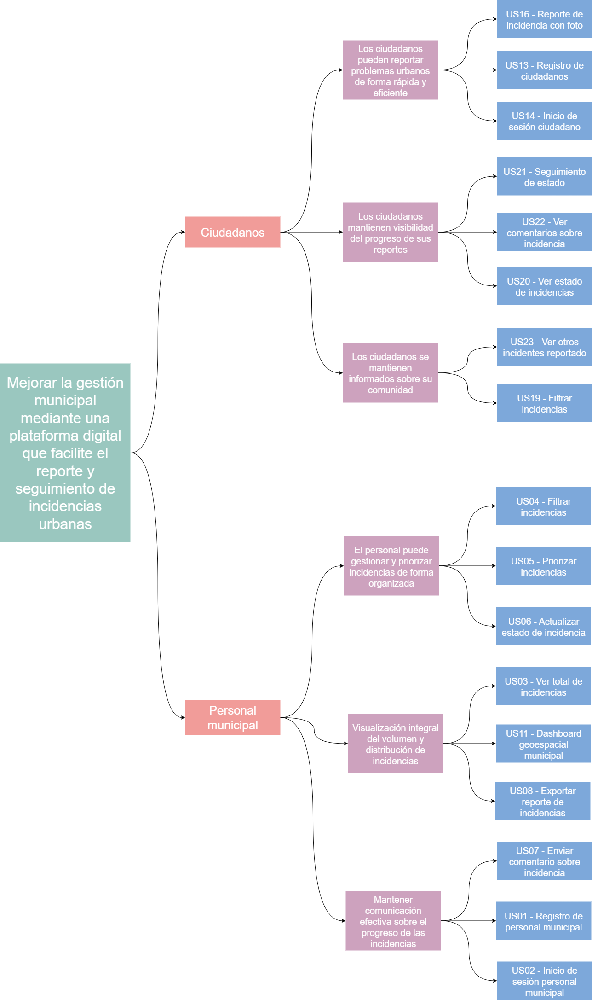

El impact mapping busca mejorar la gestión municipal mediante una plataforma digital que facilite el reporte y seguimiento de incidencias urbanas.

- **Ciudadanos**: podrán reportar problemas de forma rápida, dar seguimiento al estado de sus incidencias y mantenerse informados sobre lo que ocurre en su comunidad.

- **Personal municipal**: contará con herramientas para gestionar y priorizar incidencias, visualizar su distribución, mantener comunicación con los ciudadanos y tomar decisiones basadas en información consolidada.

Este enfoque garantiza que tanto ciudadanos como personal municipal trabajen de manera colaborativa, optimizando la atención de incidencias y fortaleciendo la transparencia en la gestión urbana.

## 3.4. Product Backlog

### User Stories Product Backlog

<table border="1">
  <thead>
    <tr>
      <th>Orden</th>
      <th>HU ID</th>
      <th>Título</th>
      <th>Descripción</th>
      <th>Story Points</th>
    </tr>
  </thead>
  <tbody>
    <tr>
      <td>1</td>
      <td>E01_US13</td>
      <td>Registro de ciudadanos</td>
      <td>COMO ciudadano QUIERO registrarme en la aplicación PARA poder reportar incidencias.</td>
      <td>5</td>
    </tr>
    <tr>
      <td>2</td>
      <td>E01_US14</td>
      <td>Inicio de sesión ciudadano</td>
      <td>COMO ciudadano QUIERO iniciar sesión PARA acceder a mis reportes y perfil.</td>
      <td>3</td>
    </tr>
    <tr>
      <td>3</td>
      <td>E01_US01</td>
      <td>Registro de personal municipales</td>
      <td>COMO personal municipal QUIERO registrarme en la plataforma PARA acceder a las funcionalidades de gestión.</td>
      <td>5</td>
    </tr>
    <tr>
      <td>4</td>
      <td>E01_US02</td>
      <td>Inicio de sesión personal municipal</td>
      <td>COMO personal municipal QUIERO iniciar sesión PARA acceder al panel de gestión de incidencias.</td>
      <td>3</td>
    </tr>
    <tr>
      <td>5</td>
      <td>E02_US16</td>
      <td>Reporte de incidencia con foto</td>
      <td>COMO ciudadano QUIERO reportar una incidencia urbana adjuntando fotografía y ubicación automática PARA documentar el problema de forma completa.</td>
      <td>8</td>
    </tr>
    <tr>
      <td>6</td>
      <td>E02_US17</td>
      <td>Ver resumen de incidencias reportadas</td>
      <td>COMO ciudadano QUIERO ver un resumen de mis incidencias PARA dar seguimiento general.</td>
      <td>5</td>
    </tr>
    <tr>
      <td>7</td>
      <td>E02_US21</td>
      <td>Seguimiento de estado</td>
      <td>COMO ciudadano QUIERO ver el progreso de mi reporte PARA mantenerme informado sobre su resolución.</td>
      <td>5</td>
    </tr>
    <tr>
      <td>8</td>
      <td>E02_US18</td>
      <td>Ver detalle de incidencia</td>
      <td>COMO ciudadano QUIERO ver los detalles de una incidencia que reporté PARA conocer su estado actual.</td>
      <td>3</td>
    </tr>
    <tr>
      <td>9</td>
      <td>E02_US20</td>
      <td>Ver estado de incidencias</td>
      <td>COMO ciudadano QUIERO ver el estado de mis reportes PARA mantenerme informado.</td>
      <td>3</td>
    </tr>
    <tr>
      <td>10</td>
      <td>E03_US11</td>
      <td>Dashboard geoespacial municipal</td>
      <td>COMO personal municipal QUIERO visualizar incidencias en mapas de calor interactivos PARA priorizar intervenciones basadas en concentración espacial.</td>
      <td>13</td>
    </tr>
    <tr>
      <td>11</td>
      <td>E03_US03</td>
      <td>Ver total de incidencias</td>
      <td>COMO personal municipal QUIERO ver el número total de incidencias registradas PARA monitorear el volumen general.</td>
      <td>3</td>
    </tr>
    <tr>
      <td>12</td>
      <td>E03_US04</td>
      <td>Filtrar incidencias</td>
      <td>COMO personal municipal QUIERO filtrar incidencias por tipo, zona, prioridad o fecha PARA gestionarlas de forma más eficiente.</td>
      <td>3</td>
    </tr>
    <tr>
      <td>13</td>
      <td>E03_US05</td>
      <td>Priorizar incidencias</td>
      <td>COMO personal municipal QUIERO asignar prioridad a las incidencias PARA gestionar primero las más críticas.</td>
      <td>5</td>
    </tr>
    <tr>
      <td>14</td>
      <td>E03_US06</td>
      <td>Actualizar estado de incidencia</td>
      <td>COMO personal municipal QUIERO actualizar el estado de una incidencia PARA reflejar su progreso.</td>
      <td>8</td>
    </tr>
    <tr>
      <td>15</td>
      <td>E03_US10</td>
      <td>Ver detalle de incidencia</td>
      <td>COMO personal municipal QUIERO ver información detallada de cada incidencia PARA analizar su contexto.</td>
      <td>5</td>
    </tr>
    <tr>
      <td>16</td>
      <td>E04_US07</td>
      <td>Enviar comentario sobre incidencia</td>
      <td>COMO personal municipal QUIERO enviar comentarios en las incidencias PARA comunicar acciones tomadas.</td>
      <td>5</td>
    </tr>
    <tr>
      <td>17</td>
      <td>E04_US22</td>
      <td>Ver comentarios sobre incidencia</td>
      <td>COMO ciudadano QUIERO ver los comentarios de la municipalidad en mis incidencias PARA entender el seguimiento dado.</td>
      <td>3</td>
    </tr>
    <tr>
      <td>18</td>
      <td>E02_US19</td>
      <td>Filtrar incidencias (App)</td>
      <td>COMO ciudadano QUIERO filtrar mis incidencias por tipo o zona PARA encontrar casos específicos.</td>
      <td>3</td>
    </tr>
    <tr>
      <td>19</td>
      <td>E02_US23</td>
      <td>Ver otros incidentes reportados</td>
      <td>COMO ciudadano QUIERO ver incidencias de otros vecinos PARA estar informado de lo que ocurre en mi comunidad.</td>
      <td>8</td>
    </tr>
    <tr>
      <td>20</td>
      <td>E01_US15</td>
      <td>Ver perfil</td>
      <td>COMO ciudadano QUIERO ver mi perfil PARA revisar mis datos y configuraciones.</td>
      <td>3</td>
    </tr>
    <tr>
      <td>21</td>
      <td>E05_US08</td>
      <td>Exportar reporte de incidencias</td>
      <td>COMO personal municipal QUIERO exportar reportes en CSV PARA análisis y gestión.</td>
      <td>8</td>
    </tr>
    <tr>
      <td>22</td>
      <td>E06_US09</td>
      <td>Ver detalles de la municipalidad</td>
      <td>COMO personal municipal QUIERO ver los detalles de la municipalidad PARA acceder a información institucional centralizada.</td>
      <td>3</td>
    </tr>
    <tr>
      <td>23</td>
      <td>E07_US25</td>
      <td>Ver Home</td>
      <td>COMO visitante QUIERO ver la página de inicio PARA conocer la propuesta de la plataforma.</td>
      <td>3</td>
    </tr>
    <tr>
      <td>24</td>
      <td>E07_US26</td>
      <td>Sobre nosotros</td>
      <td>COMO visitante QUIERO ver la sección "Sobre nosotros" PARA conocer la misión y visión de la plataforma.</td>
      <td>2</td>
    </tr>
    <tr>
      <td>25</td>
      <td>E07_US27</td>
      <td>Ver testimonios</td>
      <td>COMO visitante QUIERO ver testimonios de ciudadanos y municipalidades PARA confiar en la plataforma.</td>
      <td>5</td>
    </tr>
    <tr>
      <td>26</td>
      <td>E07_US28</td>
      <td>Beneficios municipalidad</td>
      <td>COMO visitante QUIERO ver los beneficios de la plataforma para la municipalidad PARA evaluar su utilidad.</td>
      <td>2</td>
    </tr>
    <tr>
      <td>27</td>
      <td>E07_US29</td>
      <td>Beneficios ciudadano</td>
      <td>COMO visitante QUIERO ver los beneficios de la plataforma para ciudadanos PARA saber cómo me ayuda.</td>
      <td>2</td>
    </tr>
    <tr>
      <td>28</td>
      <td>E01_US12</td>
      <td>Cerrar sesión como personal municipal</td>
      <td>COMO personal municipal QUIERO cerrar mi sesión de manera segura desde la aplicación PARA proteger la información de la plataforma.</td>
      <td>3</td>
    </tr>
    <tr>
      <td>29</td>
      <td>E01_US24</td>
      <td>Cerrar sesión como ciudadano</td>
      <td>COMO ciudadano QUIERO cerrar mi sesión de manera segura desde la aplicación PARA proteger mis datos personales.</td>
      <td>3</td>
    </tr>
  </tbody>
</table>

### Technical Stories Product Backlog

<table border="1">
  <thead>
    <tr>
      <th>Orden</th>
      <th>TS ID</th>
      <th>Título</th>
      <th>Descripción</th>
      <th>Story Points</th>
    </tr>
  </thead>
  <tbody>
    <tr>
      <td>1</td>
      <td>TS01</td>
      <td>Infraestructura Azure</td>
      <td>COMO equipo de desarrollo QUIERO desplegar la plataforma exclusivamente en servicios de Microsoft Azure PARA cumplir con las políticas de infraestructura municipal establecidas.</td>
      <td>13</td>
    </tr>
    <tr>
      <td>2</td>
      <td>TS02</td>
      <td>Base de Datos Escalable</td>
      <td>COMO equipo técnico QUIERO configurar una base de datos en Azure SQL Database con escalabilidad automática PARA manejar el crecimiento de información de incidencias y usuarios.</td>
      <td>13</td>
    </tr>
    <tr>
      <td>3</td>
      <td>TS05</td>
      <td>API RESTful</td>
      <td>COMO equipo técnico QUIERO implementar una API RESTful PARA que las aplicaciones móviles y web puedan conectarse con el backend de forma estándar.</td>
      <td>13</td>
    </tr>
    <tr>
      <td>4</td>
      <td>TS03</td>
      <td>Seguridad y Autenticación</td>
      <td>COMO equipo técnico QUIERO integrar Azure Active Directory para el inicio de sesión del personal municipal PARA asegurar accesos con protocolos modernos de seguridad.</td>
      <td>8</td>
    </tr>
    <tr>
      <td>5</td>
      <td>TS04</td>
      <td>Georreferenciación</td>
      <td>COMO equipo de desarrollo QUIERO integrar servicios de mapas de Azure Maps PARA mostrar incidencias en un tablero geoespacial.</td>
      <td>8</td>
    </tr>
    <tr>
      <td>6</td>
      <td>TS06</td>
      <td>Disponibilidad y Escalabilidad</td>
      <td>COMO equipo técnico QUIERO configurar balanceadores de carga en Azure PARA asegurar que la aplicación esté disponible y escale automáticamente según la demanda.</td>
      <td>13</td>
    </tr>
    <tr>
      <td>7</td>
      <td>TS07</td>
      <td>Notificaciones en tiempo real con WebSocket</td>
      <td>COMO developer QUIERO implementar la comunicación en tiempo real mediante WebSocket PARA que los badges de incidentes y los mensajes emergentes se actualicen automáticamente.</td>
      <td>8</td>
    </tr>
  </tbody>
</table>

# Capítulo IV: Strategic-Level Software Design

## 4.1. Strategic-Level Attribute-Driven Design

### 4.1.1. Design Purpose

El propósito del diseño arquitectónico de **LimaUrban** es establecer una base técnica robusta y escalable para una plataforma de gestión de incidencias urbanas. El diseño debe soportar un ecosistema digital que conecte de manera eficiente a los ciudadanos con las autoridades municipales, utilizando tecnologías emergentes como la inteligencia artificial y el análisis geoespacial para optimizar la resolución de problemas en el espacio público.

**Problemática Central:**
Los ciudadanos de Lima enfrentan canales de comunicación ineficaces y opacos para reportar problemas urbanos. Por otro lado, las municipalidades carecen de herramientas centralizadas para procesar estos reportes de forma ágil y basada en datos, lo que resulta en una gestión reactiva, costosa y que genera desconfianza.

**Objetivos Principales del Diseño:**

1.  **Automatización Inteligente del Procesamiento:** La arquitectura debe soportar un sistema de visión por computadora (basado en un modelo YOLO entrenado con un dataset local) para clasificar automáticamente las incidencias en dos categorías prioritarias: **baches y acumulación de basura**. Esto reduce la carga manual y mejora la calidad de los datos de entrada.
2.  **Escalabilidad y Alta Disponibilidad:** La solución debe estar preparada para servir a una población inicial de 10,000 usuarios activos, garantizando una disponibilidad del **99.5%** y la capacidad de procesar picos de reportes durante emergencias urbanas.
3.  **Análisis Geoespacial en Tiempo Real:** El diseño debe facilitar la generación de mapas de calor dinámicos e interactivos, permitiendo a las autoridades municipales identificar "hotspots" de incidencias para una planificación estratégica y una asignación de recursos más eficiente.
4.  **Experiencia de Usuario Optimizada:** La arquitectura debe habilitar una interfaz de reporte ciudadana que sea extremadamente rápida e intuitiva, con el objetivo de que el proceso completo de reporte (incluyendo foto y geolocalización) tome **menos de 40 segundos**.
5.  **Interoperabilidad Institucional:** Se deben definir APIs RESTful estandarizadas que permitan una futura integración con otros sistemas de gestión municipal (SIG, ERPs), asegurando la escalabilidad de la plataforma a diferentes distritos de Lima.

### 4.1.2. Attribute-Driven Design Inputs

#### 4.1.2.1. Primary Functionality (Primary User Stories)

Las siguientes User Stories son críticas, ya que definen las funcionalidades primarias que impulsan las decisiones arquitectónicas más importantes de LimaUrban.

| Epic/User Story ID | Título                                            | Descripción                                                                                                                                                          | Criterios de Aceptación                                                                                                                                                                                                                                                          | Relacionado con (Epic ID) |
| :----------------- | :------------------------------------------------ | :------------------------------------------------------------------------------------------------------------------------------------------------------------------- | :------------------------------------------------------------------------------------------------------------------------------------------------------------------------------------------------------------------------------------------------------------------------------- | :------------------------ |
| **US16**           | **Reportar Incidencia con Evidencia Fotográfica** | Como ciudadano, quiero reportar una incidencia adjuntando una fotografía y confirmando la ubicación automática para documentar el problema de forma clara y precisa. | **Escenario 1:** El sistema captura la foto y las coordenadas GPS automáticamente.<br>**Escenario 2:** El usuario puede reemplazar la foto si no está satisfecho.<br>**Escenario 3:** El sistema valida que la foto es un campo obligatorio para enviar el reporte.              | E02                       |
| **US11**           | **Visualizar Dashboard Geoespacial**              | Como personal municipal, quiero visualizar las incidencias en un mapa de calor interactivo para identificar zonas críticas y priorizar intervenciones.               | **Escenario 1:** El dashboard muestra un mapa de calor con la concentración de incidencias.<br>**Escenario 2:** Se pueden aplicar filtros por fecha, tipo de incidencia y distrito.<br>**Escenario 3:** El mapa se actualiza en tiempo real a medida que se aplican los filtros. | E05                       |
| **US06**           | **Actualizar Estado de Incidencia**               | Como personal municipal, quiero cambiar el estado de una incidencia (ej. "En Proceso", "Resuelto") para reflejar el avance y notificar al ciudadano.                 | **Escenario 1:** Al cambiar el estado, el sistema guarda el cambio y envía una notificación automática al ciudadano.<br>**Escenario 2:** El sistema mantiene un historial de todos los cambios de estado con fecha y usuario responsable.                                        | E03 / E04                 |
| **US21**           | **Realizar Seguimiento de Reporte**               | Como ciudadano, quiero ver el estado actual y el historial de mi reporte para estar informado sobre el proceso de resolución.                                        | **Escenario 1:** La app muestra el estado más reciente de mi reporte.<br>**Escenario 2:** Puedo ver una línea de tiempo con todos los estados anteriores.<br>**Escenario 3:** Recibo notificaciones push cuando hay una actualización importante.                                | E02 / E04                 |
| **US05**           | **Priorizar Incidencias**                         | Como personal municipal, quiero asignar un nivel de prioridad (Alta, Media, Baja) a las incidencias para organizar el trabajo de las cuadrillas de manera eficiente. | **Escenario 1:** Puedo asignar una prioridad a cada incidencia desde el dashboard.<br>**Escenario 2:** La lista de trabajo se puede ordenar y filtrar por nivel de prioridad.<br>**Escenario 3:** Las incidencias de "Alta" prioridad se destacan visualmente.                   | E03                       |

## 4.1.2.2. Quality Attribute Scenarios

En esta sección se incluye la especificación de la primera versión de los escenarios de atributos de calidad que tienen mayor impacto en la arquitectura de la solución LimaUrban. Los escenarios identificados están directamente relacionados con las funcionalidades primarias del sistema y abordan aspectos críticos como disponibilidad, rendimiento, precisión de IA, escalabilidad y usabilidad. Estos escenarios sirven como input fundamental para el proceso de diseño arquitectónico y permiten validar que la solución cumple con los estándares de calidad requeridos para la gestión urbana inteligente.

| **Campo**               | **Descripción**                                                                                                 |
| :---------------------- | :-------------------------------------------------------------------------------------------------------------- |
| **ID**                  | **QA-01: Usabilidad en el Primer Uso**                                                                          |
| **Escenario**           | Un ciudadano sin experiencia técnica previa utiliza la aplicación por primera vez para reportar una incidencia. |
| **Atributo de Calidad** | Usabilidad                                                                                                      |
| **Estímulo**            | Usuario nuevo intenta completar su primer reporte.                                                              |
| **Respuesta**           | El usuario completa el reporte (foto, ubicación, categoría) sin necesidad de ayuda externa.                     |
| **Medida de respuesta** | El 90% de los usuarios nuevos deben completar su primer reporte en menos de 40 segundos.                        |

| **Campo**               | **Descripción**                                                                                                                    |
| :---------------------- | :--------------------------------------------------------------------------------------------------------------------------------- |
| **ID**                  | **QA-02: Disponibilidad en Horas Pico**                                                                                            |
| **Escenario**           | Un ciudadano reporta una incidencia durante la hora pico matutina, cuando miles de usuarios están activos en el sistema.           |
| **Atributo de Calidad** | Disponibilidad, Rendimiento                                                                                                        |
| **Estímulo**            | Usuario envía un reporte mientras el sistema gestiona más de 5,000 usuarios concurrentes.                                          |
| **Respuesta**           | El sistema procesa el reporte y devuelve una confirmación de éxito sin demoras perceptibles.                                       |
| **Medida de respuesta** | El sistema debe mantener una disponibilidad del 99.5% y procesar el 99% de los reportes en menos de 3 segundos durante horas pico. |

| **Campo**               | **Descripción**                                                                                                           |
| :---------------------- | :------------------------------------------------------------------------------------------------------------------------ |
| **ID**                  | **QA-03: Rendimiento del Dashboard Geoespacial**                                                                          |
| **Escenario**           | Un gestor municipal accede al dashboard para analizar la distribución de 500+ incidencias acumuladas en un mapa de calor. |
| **Atributo de Calidad** | Rendimiento                                                                                                               |
| **Estímulo**            | El usuario aplica filtros de fecha y tipo de incidencia en el mapa de calor.                                              |
| **Respuesta**           | El dashboard renderiza el mapa de calor actualizado con los datos filtrados de forma interactiva.                         |
| **Medida de respuesta** | La visualización del mapa de calor y la aplicación de filtros deben completarse en menos de 2 segundos.                   |

| **Campo**               | **Descripción**                                                                                                                      |
| :---------------------- | :----------------------------------------------------------------------------------------------------------------------------------- |
| **ID**                  | **QA-04: Escalabilidad ante Emergencias**                                                                                            |
| **Escenario**           | Tras una lluvia intensa, se produce un pico masivo de reportes de baches y aniegos en toda la ciudad.                                |
| **Atributo de Calidad** | Escalabilidad                                                                                                                        |
| **Estímulo**            | El sistema recibe 10,000 reportes en una hora, superando 10 veces el tráfico normal.                                                 |
| **Respuesta**           | La infraestructura escala automáticamente para procesar todos los reportes sin pérdida de datos ni degradación crítica del servicio. |
| **Medida de respuesta** | Capacidad de procesar 10,000 reportes por hora manteniendo una latencia de API inferior a 5 segundos.                                |

## 4.1.2.3. Constraints

Las siguientes restricciones técnicas han sido establecidas por el cliente y son no negociables para la elaboración de la solución:
| Technical Story ID | Título | Descripción | Criterios de Aceptación | Relacionado con (Epic ID) |
|-------------------|--------|-------------|------------------------|-------------------------|
| TS01 | Infraestructura | Como equipo de desarrollo, quiero desplegar la plataforma para cumplir con las políticas de infraestructura municipal establecidas y garantizar soporte técnico oficial. | **Escenario 1:** Despliegue exitoso <br>**Dado que** necesitamos cumplir políticas municipales de infraestructura <br>**Cuando** desplegamos el backend y base de datos<br>**Entonces** debe utilizarse App Service para el backend y Supabase para almacenamiento<br>**Y** todos los servicios deben estar dentro del ecosistema <br><br>**Escenario 2:** Validación de servicios<br>**Dado que** la infraestructura debe ser exclusivamente escalable<br>**Cuando** se configura el entorno de producción<br>**Entonces** no debe utilizarse ningún servicio de AWS, Google Cloud u otros proveedores<br>**Y** debe documentarse la justificación de cada servicio seleccionado | Todos los Epics |
| TS02 | Base de Datos Escalable | Como equipo técnico, quiero configurar una base de datos en Supabase con escalabilidad automática para manejar el crecimiento de información de incidencias y usuarios. | **Escenario 1:** Configuración inicial exitosa<br>**Dado que** se crea la base de datos en Supabase<br>**Cuando** se conecta con la plataforma<br>**Entonces** queda lista para almacenar información<br><br>**Escenario 2:** Escalabilidad automática<br>**Dado que** aumenta la cantidad de registros<br>**Cuando** la carga supera el umbral<br>**Entonces** la base de datos escala automáticamente | Todos los Epics |
| TS03 | Frontend Web Angular | Como desarrollador frontend, quiero implementar el dashboard municipal en Angular para mantener coherencia con los sistemas municipales existentes y aprovechar la expertise del equipo en este framework. | **Escenario 1:** Compatibilidad con sistemas municipales<br>**Dado que** existen sistemas Angular en la municipalidad<br>**Cuando** desarrollo el dashboard municipal<br>**Entonces** debe usar Angular 15+ con TypeScript<br>**Y** debe ser compatible con navegadores Chrome, Firefox y Edge<br><br>**Escenario 2:** Integración API exitosa<br>**Dado que** necesito conectar con el backend<br>**Cuando** implemento las funcionalidades del dashboard<br>**Entonces** debe integrarse correctamente con APIs REST<br>**Y** debe manejar errores de conectividad de forma elegante | E05 |
| TS04 | Aplicación Móvil Flutter | Como desarrollador móvil, quiero desarrollar la aplicación ciudadana en Flutter para soportar Android e iOS con una sola base de código y reducir costos de desarrollo y mantenimiento. | **Escenario 1:** Multiplataforma exitosa<br>**Dado que** necesito soporte para Android e iOS<br>**Cuando** desarrollo la aplicación móvil<br>**Entonces** debe usar Flutter 3.0+ con Dart 3.0+<br>**Y** debe funcionar nativamente en ambas plataformas<br><br>**Escenario 2:** Acceso a funcionalidades nativas<br>**Dado que** requiero acceso a cámara y GPS<br>**Cuando** implemento el reporte de incidencias<br>**Entonces** debe acceder correctamente a hardware del dispositivo<br>**Y** debe solicitar permisos de forma clara al usuario | E02 |
| TS05 | Georreferenciación MapBox | Como equipo de desarrollo, quiero integrar servicios de mapas de MapBox para mostrar incidencias en un tablero geoespacial con mapas de calor interactivos. | **Escenario 1:** Visualización en mapa<br>**Dado que** existen incidencias registradas<br>**Cuando** se abre el tablero<br>**Entonces** se muestran las incidencias en el mapa con su ubicación georreferenciada<br><br>**Escenario 2:** Generación de mapas de calor<br>**Dado que** el usuario necesita ver concentraciones<br>**Cuando** selecciona vista de mapa de calor<br>**Entonces** se generan visualizaciones de densidad por zona geográfica | E05 |

## 4.1.2.4. Architectural Drivers Backlog

Resultado del proceso de Quality Attribute Workshop, priorizando drivers por importancia para stakeholders e impacto en complejidad técnica arquitectónica:

| **Driver ID** | **Título**                               | **Descripción**                                                                                                          | **Importancia** | **Complejidad** |
| ------------- | ---------------------------------------- | ------------------------------------------------------------------------------------------------------------------------ | --------------- | --------------- |
| **QA01**      | Disponibilidad durante Alta Concurrencia | Mantener 99.5% disponibilidad mensual procesando reportes en < 3 segundos durante picos de 5,000+ usuarios simultáneos    | High            | High            |
| **QA02**      | Rendimiento Dashboard Geoespacial        | Generar mapas de calor interactivos en <2 segundos con filtros temporales para 500+ reportes acumulados                  | High            | High            |
| **C01**       | Restricción Tecnológica                  | Desplegar exclusivamente cumpliendo políticas municipales de infraestructura cloud                                       | High            | Medium          |
| **FD01**      | Reporte con Geolocalización Flutter      | Permitir captura automática de ubicación GPS y fotografía mediante app Flutter multiplataforma                           | High            | Medium          |
| **FD02**      | Gestión de Estados de Incidencias        | Sistema de actualización de estados con notificaciones automáticas bidireccionales entre ciudadanos y personal municipal | High            | Medium          |
| **QA03**      | Escalabilidad durante Emergencias        | Soportar 10,000+ reportes por hora manteniendo latencia <5 segundos durante emergencias urbanas                          | High            | High            |
| **QA04**      | Experiencia de Usuario Móvil             | Lograr que 90% de usuarios nuevos completen reportes en <40 segundos con interfaz Flutter intuitiva                      | High            | Medium          |
| **C02**       | Frontend Angular Municipal               | Desarrollar dashboard web en Angular para coherencia con sistemas municipales existentes                                 | Medium          | Low             |
| **C03**       | Comunicación WebSocket Tiempo Real       | Implementar notificaciones automáticas con badges dinámicos para transparencia del proceso municipal                     | Medium          | Medium          |
| **C04**       | Georreferenciación MapBox                | Integrar MapBoxpara visualización geoespacial y generación de mapas de calor interactivos                                | Medium          | Medium          |
| **QA05**      | Interoperabilidad Municipal              | Facilitar integración con sistemas SIG municipales mediante APIs compatibles con estándares GeoJSON y OGC                | Medium          | Medium          |
| **QA06**      | Seguridad de Datos Ciudadanos            | Proteger información personal y prevenir reportes maliciosos mediante autenticación robusta                              | Medium          | High            |

### 4.1.3. Architectural Design Decisions

Durante el Quality Attribute Workshop, el equipo analizó los Architectural Drivers seleccionados para la solución LimaUrban, evaluando distintas tácticas y patrones de diseño para asegurar su cumplimiento. Se analizaron patrones como MVC (aplicado como MVT en Django), arquitectura en Capas y Cliente-Servidor. A continuación, se detallan los pros y contras de cada patrón respecto a cada Driver:

| Driver ID | Título de Driver    | MVC / MVT Pro                                                                                                          | MVC / MVT Con                                                                                                      | Capas Pro                                                                                                              | Capas Con                                                                                                    | Cliente-Servidor Pro                                                                                        | Cliente-Servidor Con                                                                                                     |
| :-------- | :------------------ | :--------------------------------------------------------------------------------------------------------------------- | :----------------------------------------------------------------------------------------------------------------- | :--------------------------------------------------------------------------------------------------------------------- | :----------------------------------------------------------------------------------------------------------- | :---------------------------------------------------------------------------------------------------------- | :----------------------------------------------------------------------------------------------------------------------- |
| **QA01**  | **Disponibilidad**  | Permite separar lógica de negocio y datos, reduciendo el impacto de fallos en la presentación.                         | La sincronización de datos en tiempo real entre el modelo y la vista puede ser compleja y propensa a fallos.       | Permite distribuir la carga en capas independientes (ej. web, aplicación, datos), mejorando la disponibilidad general. | Un fallo en una capa intermedia puede afectar la operación global del sistema si no hay redundancia.         | Permite operación continua en el cliente (Flutter) incluso ante fallas parciales del servidor.             | Dependencia de una conexión de red continua al servidor para la mayoría de las funcionalidades.                          |
| **QA04**  | **Usabilidad**      | Facilita el desarrollo de interfaces de usuario (vistas) intuitivas y desacopladas de la lógica de negocio.            | Si la comunicación entre controlador y vista no es eficiente, puede aumentar la latencia y afectar la fluidez.     | Optimiza cada capa para su propósito (ej. UI, lógica), mejorando la experiencia del usuario final.                     | Riesgo de inconsistencias en la experiencia si las capas de presentación (móvil y web) no se coordinan bien. | Permite actualizaciones rápidas de la interfaz de usuario en Flutter/Angular sin afectar el backend.        | La latencia de la red puede afectar negativamente la usabilidad si las APIs no están optimizadas para baja conectividad. |
| **QA06**  | **Seguridad**       | El controlador actúa como un punto de entrada único, facilitando la aplicación de controles de seguridad y validación. | La protección de múltiples puntos de acceso (APIs) para vistas y modelos puede aumentar la complejidad.            | Permite aislar servicios críticos (ej. autenticación) en capas específicas, reforzando la protección.                  | Aumenta el número de superficies de ataque que requieren monitoreo y defensa (entre-capas).                  | La comunicación vía TLS/HTTPS asegura el canal entre cliente y servidor. APIs expuestas aumentan el riesgo. | La lógica en el cliente puede ser vulnerable si no se valida adecuadamente en el servidor.                               |
| **N/A**   | **Modificabilidad** | Separar la lógica facilita cambios localizados (ej. agregar un nuevo tipo de incidencia) sin afectar la presentación.  | Puede ser difícil de mantener si los flujos de datos entre Modelo, Vista y Controlador no están bien documentados. | Cambios en una capa (ej. migrar la BD) no deberían afectar a otras si las interfaces están bien definidas.             | Cambios que atraviesan múltiples capas pueden volverse costosos si la modularidad no se gestiona bien.       | Permite la actualización independiente del backend y las aplicaciones cliente (Flutter/Angular).            | Se debe mantener la compatibilidad (versionado de APIs) entre diferentes versiones del cliente y el servidor.            |

---

### 4.1.4. Quality Attribute Scenario Refinements

Al finalizar el Quality Attribute Workshop, el equipo priorizó los escenarios de calidad más relevantes para la solución LimaUrban, tomando en cuenta su impacto sobre la experiencia de usuario, la estabilidad de la aplicación y la facilidad de mantenimiento. A continuación, se presenta la versión refinada de los escenarios priorizados, ordenados por importancia para el negocio y el proyecto.

#### Scenario Refinement for Scenario 1

|                                  |                                                                                                                                                                      |
| :------------------------------- | :------------------------------------------------------------------------------------------------------------------------------------------------------------------- |
| **Scenario(s):**                 | Un ciudadano sin experiencia técnica previa utiliza la aplicación móvil por primera vez para reportar una acumulación de basura en su calle.                         |
| **Business Goals:**              | Fomentar la adopción de la plataforma y la participación ciudadana a través de una experiencia de reporte simple, rápida e intuitiva.                                |
| **Relevant Quality Attributes:** | Usabilidad, Eficiencia.                                                                                                                                              |
| **Scenario Components**          |                                                                                                                                                                      |
| _Stimulus:_                      | El ciudadano abre la aplicación LimaUrban e inicia el proceso para crear un nuevo reporte de incidencia.                                                             |
| _Stimulus Source:_               | Ciudadano.                                                                                                                                                           |
| _Environment:_                   | Aplicación móvil Flutter en un smartphone estándar, con conexión a internet móvil que puede ser intermitente.                                                        |
| _Artifact (if Known):_           | Módulo de reporte de incidencias de la aplicación (UI, lógica de captura de foto y GPS).                                                                             |
| _Response:_                      | La aplicación guía al usuario a través de un flujo simple: tomar foto, confirmar ubicación automática y enviar el reporte, mostrando una confirmación inmediata.     |
| **Response Measure:**            | El 90% de los usuarios nuevos deben poder completar y enviar su primer reporte en menos de 40 segundos.                                                              |
| **Questions:**                   | ¿Cómo podemos minimizar los pasos y la entrada manual de datos para acelerar el proceso de reporte?                                                                  |
| **Issues:**                      | Asegurar un flujo de usuario fluido, gestionar correctamente los permisos de cámara y ubicación, y proveer feedback claro y constante al usuario durante el proceso. |

#### Scenario Refinement for Scenario 2

|                                  |                                                                                                                                                                                      |
| :------------------------------- | :----------------------------------------------------------------------------------------------------------------------------------------------------------------------------------- |
| **Scenario(s):**                 | Un ciudadano intenta reportar un bache en una vía principal durante la hora pico matutina, cuando miles de otros usuarios están activos en el sistema.                               |
| **Business Goals:**              | Garantizar la fiabilidad y confianza en el sistema, asegurando que todos los reportes de los ciudadanos sean capturados exitosamente, incluso bajo alta demanda.                     |
| **Relevant Quality Attributes:** | Disponibilidad, Rendimiento, Escalabilidad.                                                                                                                                          |
| **Scenario Components**          |                                                                                                                                                                                      |
| _Stimulus:_                      | El ciudadano envía el formulario de reporte de incidencia desde la aplicación móvil.                                                                                                 |
| _Stimulus Source:_               | Ciudadano.                                                                                                                                                                           |
| _Environment:_                   | Operación normal del sistema pero con un pico de carga de más de 5,000 usuarios concurrentes en la infraestructura .                                                                 |
| _Artifact (if Known):_           | El stack completo de la aplicación: cliente Flutter, API Gateway, backend Django y base de datos supabase                                                                            |
| _Response:_                      | El sistema recibe la solicitud, procesa los datos, almacena la imagen en supabase, guarda el registro en la base de datos y devuelve un mensaje de éxito al dispositivo del usuario. |
| **Response Measure:**            | El tiempo desde el envío hasta la confirmación en pantalla no debe superar los 3 segundos en el 99.5% de los casos durante las horas pico.                                           |
| **Questions:**                   | ¿Cómo podemos garantizar que la infraestructura escale de manera automática y eficiente para manejar los picos de carga?                                                             |
| **Issues:**                      | Optimizar las consultas a la base de datos, gestionar el almacenamiento eficiente de un alto volumen de imágenes y prevenir cuellos de botella en la API.                            |

#### Scenario Refinement for Scenario 3

|                                  |                                                                                                                                                                                          |
| :------------------------------- | :--------------------------------------------------------------------------------------------------------------------------------------------------------------------------------------- |
| **Scenario(s):**                 | El personal municipal cambia el estado de una incidencia de "Recibido" a "En Proceso", y el ciudadano que la reportó necesita ser informado inmediatamente.                              |
| **Business Goals:**              | Aumentar la transparencia del proceso municipal y mejorar la comunicación con el ciudadano, reduciendo la incertidumbre y la necesidad de consultas manuales.                            |
| **Relevant Quality Attributes:** | Rendimiento, Usabilidad.                                                                                                                                                                 |
| **Scenario Components**          |                                                                                                                                                                                          |
| _Stimulus:_                      | El sistema detecta una actualización en el campo de estado de un registro de incidencia en la base de datos.                                                                             |
| _Stimulus Source:_               | Sistema (iniciado por una acción del personal municipal).                                                                                                                                |
| _Environment:_                   | Operación normal con múltiples ciudadanos y personal municipal conectados simultáneamente. El ciudadano tiene la app instalada.                                                          |
| _Artifact (if Known):_           | Módulo de notificaciones (basado en WebSockets) y el servicio de notificaciones push de la aplicación móvil.                                                                             |
| _Response:_                      | El sistema genera y envía una notificación push inmediata al dispositivo del ciudadano informando sobre el cambio de estado.                                                             |
| **Response Measure:**            | El 95% de las notificaciones de cambio de estado deben ser entregadas en el dispositivo del usuario en menos de 5 segundos tras la actualización.                                        |
| **Questions:**                   | ¿Cómo asegurar la entrega de notificaciones si el dispositivo del usuario está temporalmente offline?                                                                                    |
| **Issues:**                      | Implementar un servicio de WebSockets robusto y escalable, y diseñar un mecanismo de reintentos o una cola de notificaciones para manejar fallas en la red o dispositivos desconectados. |

## 4.2. Strategic-Level Domain-Driven Design

El proceso de **Domain-Driven Design** aplicado en Urban Lima nos permitió organizar el dominio de la solución en áreas delimitadas de responsabilidad. Esta división se realizó en dos fases: primero con la sesión de **EventStorming**, donde se visualizaron los eventos centrales del sistema y sus relaciones, y posteriormente con el **Candidate Context Discovery**, donde se definieron los **Bounded Contexts** específicos del proyecto.

- **Miro Board - Event Storming y DDD:** [Tablero de Event-Storming](https://miro.com/welcomeonboard/a1I1RjhRK2JtNVA3bGRWbC82M1ZtTGtlTE1Dd2h5YnZIVHpacXhMV3VieDI3T3kwbU1jMDBFWmVCZGRhN0hDQ0JDeSt2N0JwMisrSVNrMjFzdk1ZLytObXJSWFBrMFA2QW9PUXFWbzVaYmxtRDN0eENrazQxcjVITUpkVzhtQU5zVXVvMm53MW9OWFg5bkJoVXZxdFhRPT0hdjE=?share_link_id=721662336048)

### 4.2.1. EventStorming

La sesión de EventStorming se centró en mapear los flujos clave del sistema a partir de las historias de usuario priorizadas. Durante la dinámica se identificaron los siguientes elementos relevantes para el proyecto:
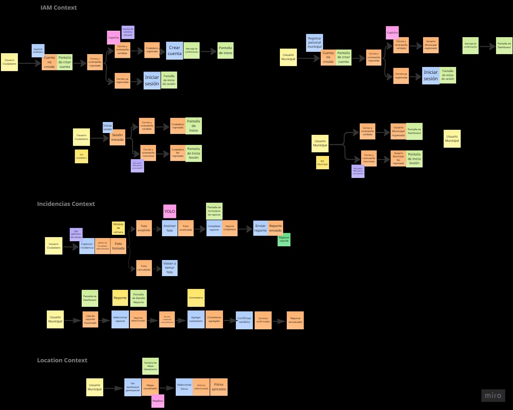

- **Eventos principales**: _Usuario municipal registrado_, _Ciudadano registrado_, _Sesión iniciada_, _Incidencia creada_, _Estado actualizado_, _Reporte exportado_, _Mapa geoespacial generado_.
- **Comandos clave**: _Registrar usuario_, _Iniciar sesión_, _Reportar incidencia con foto y ubicación_, _Actualizar estado_, _Asignar prioridad_, _Generar reporte CSV_.
- **Agregados principales**: _Usuario_, _Incidencia_, _Reporte_.

El análisis permitió seguir una línea temporal desde el registro de los actores (municipales y ciudadanos), la creación y gestión de incidencias, hasta la explotación de la información a nivel de reportes y dashboards. Con este mapeo se identificaron dependencias críticas (ejemplo: no es posible registrar incidencias sin un usuario autenticado) y se evidenciaron las transiciones que marcan puntos de separación natural dentro del sistema.

### 4.2.2. Candidate Context Discovery

A partir del EventStorming, se llevó a cabo la sesión de Candidate Context Discovery, cuyo objetivo fue organizar los eventos y comandos en **Bounded Contexts** que respondieran a responsabilidades específicas. El resultado fue la definición de cuatro contextos estratégicos en Urban Lima:

#### IAM Context

Este contexto agrupa todo lo relacionado con la **gestión de identidades y accesos**. Incluye los procesos de registro y autenticación tanto para ciudadanos como para personal municipal. Para reforzar la seguridad se tendra la administración centralizada de credenciales. Su relevancia radica en ser el punto de entrada seguro a la plataforma.


#### Incidencias Context

Se ocupa de todos los procesos de **registro, autenticación y control de acceso** tanto para ciudadanos como para personal municipal. Aquí se definieron funcionalidades como la creación de cuentas, inicio y cierre de sesión, y la validación de credenciales.

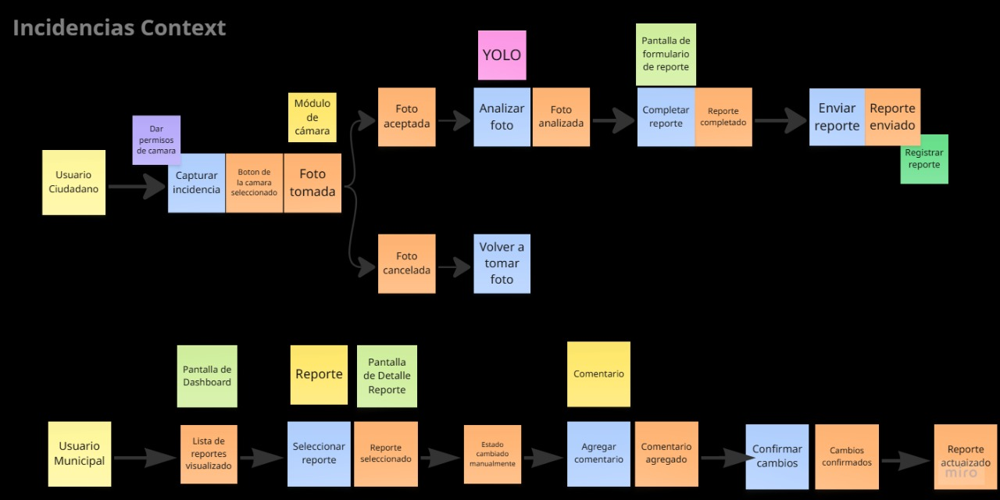

En Urban Lima, este contexto asegura que la plataforma solo sea utilizada por usuarios autorizados, protegiendo la información sensible y garantizando el cumplimiento de políticas de seguridad municipales.

#### Location Context

Enfocado en la **dimensión geoespacial** de la información, este contexto integra MapBox para mostrar incidencias en mapas de calor, aplicar filtros geográficos y permitir la exploración espacial de los reportes.


Para Urban Lima, este contexto añade un valor diferencial, ya que convierte los reportes ciudadanos en información territorial, facilitando la priorización de zonas críticas y la planificación urbana basada en datos reales.

El ejercicio permitió transformar un conjunto amplio de historias de usuario en un modelo estratégico con **cuatro Bounded Contexts claramente definidos**: IAM, Incidencias, Analytics y Location. Cada uno representa una frontera natural dentro del dominio, con responsabilidades claras y un lenguaje propio. Esta separación estratégica constituye la base para implementar una **arquitectura monolítica modular en Urban Lima**, manteniendo la coherencia del dominio y evitando solapamientos entre áreas.

### 4.2.3. Domain Message Flows Modeling

##### 1) Registro de ciudadano

El ciudadano completa un formulario en la app con email, contraseña y datos de perfil.  
La app envía la solicitud al **Servicio de Usuarios**, que valida que el correo no exista, cifra la contraseña y crea la cuenta en estado “pendiente de confirmación”.  
Luego envía un correo con enlace/token de confirmación y devuelve a la app el identificador del usuario.

##### **Éxito:** cuenta creada y correo de verificación enviado.

##### **Errores comunes:** email duplicado, contraseña débil, fallo al enviar el correo (reintento asíncrono).

## 

##### 2) Inicio de sesión del personal municipal

El agente municipal pulsa “Iniciar sesión” en el **Panel Web** y envía sus credenciales al **Servicio de Autenticación** propio.  
El servicio verifica usuario/contraseña, genera un **token de sesión** y el **Servicio de Usuarios** devuelve el perfil local con roles y permisos.  
Si el perfil no existe, el sistema realiza un **alta automática** con los datos mínimos.

##### **Éxito:** sesión iniciada con los privilegios correctos.

##### **Errores típicos:** credenciales inválidas/expiradas, usuario sin rol asignado.

## 

##### 3) Reporte de incidencia con foto

El ciudadano captura una foto, describe el problema y la app sube la imagen a un **almacenamiento de archivos**, obteniendo su URL.  
La app resuelve la dirección/zona con un **servicio de mapas** y envía todo al **Servicio de Incidencias**.  
El servicio valida datos, intenta **deduplicar** reportes similares y publica el evento _IncidentCreated_, devolviendo `201` con el id y estado inicial.

##### **Éxito:** incidencia registrada y lista para seguimiento en tiempo real.

##### **Errores comunes:** subida fallida, coordenadas fuera del municipio, duplicado detectado.

## 

##### 4) Dashboard geoespacial municipal

El planificador abre el tablero en el panel y este solicita el heatmap para un rango de fechas.  
responde con la URL del **tileset**, leyenda y totales; el panel carga esas capas en el **proveedor de mapas** y renderiza el mapa interactivo.  
El usuario explora y filtra por zona, tipo y fecha para priorizar intervenciones.

##### **Éxito:** mapa interactivo con métricas agregadas.

##### **Errores probables:** tileset no disponible, rango sin datos, límites de cuota del servicio de mapas.


### 4.2.4. Bounded Context Canvases

##### Gestión de Usuarios Bounded Context Canvase


##### Reporte de Incidencias Bounded Context Canvase


##### Gestión y Monitoreo de Incidencias Bounded Context Canvase


##### Comunicación y Notificaciones Bounded Context Canvase


### 4.2.4. Bounded Context Canvases

##### Gestión de Usuarios Bounded Context Canvase


##### Reporte de Incidencias Bounded Context Canvase


##### Gestión y Monitoreo de Incidencias Bounded Context Canvase


##### Comunicación y Notificaciones Bounded Context Canvase


## 4.2.5. Context Mapping

Con los Bounded Contexts identificados (IAM, Incidencias y Location), se procedió a construir los **context maps**, es decir, las visualizaciones que permiten entender cómo se relacionan entre sí. El proceso incluyó la exploración de alternativas de agrupamiento y separación, considerando preguntas como:

- ¿Qué ocurriría si el manejo de georreferenciación se integrara al contexto de incidencias en lugar de estar aislado?
- ¿Es necesario que IAM tenga dependencia directa con Location o basta con su relación con Incidencias?

Estas reflexiones permitieron validar que la división propuesta mantiene un balance entre independencia y colaboración, reduciendo acoplamientos innecesarios y asegurando que cada contexto tenga un propósito bien definido.

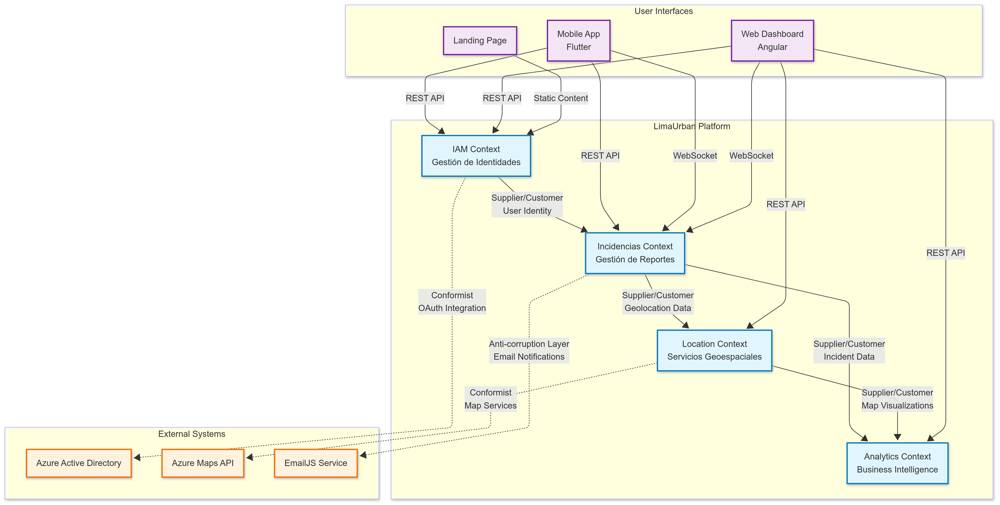

#### Proceso de Exploración de Alternativas

##### Alternativa 1: Fusión de Location Context con Incidencias Context

**Pregunta evaluada:** "¿Qué pasaría si movemos las capacidades geoespaciales al contexto de Incidencias?"

**Análisis:**

- **Ventajas:** Simplicidad arquitectónica, menos comunicación entre contextos
- **Desventajas:** Sobrecarga del contexto de Incidencias con responsabilidades geoespaciales complejas, dificultad para reutilizar servicios de mapas en otros contextos futuros
- **Decisión:** Mantener separado Location Context para preservar la especialización en análisis geoespacial y facilitar futuras expansiones

##### Alternativa 2: Fusión de Analytics Context con Incidencias Context

**Pregunta evaluada:** "¿Qué pasaría si descomponemos las capacidades de Analytics y movemos la generación de reportes básicos a Incidencias?"

**Análisis:**

- **Ventajas:** Reducción de latencia para consultas simples, menor complejidad de integración
- **Desventajas:** Mezcla de responsabilidades operativas con analíticas, limitaciones para análisis complejos futuros
- **Decisión:** Mantener Analytics separado para preservar la especialización en Business Intelligence y análisis predictivo

##### Alternativa 3: Creación de Shared Service para Notificaciones

**Pregunta evaluada:** "¿Qué pasaría si creamos un shared service para reducir la duplicación de notificaciones entre múltiples bounded contexts?"

**Análisis:**

- **Ventajas:** Centralización de lógica de notificaciones, consistencia en mensajería
- **Desventajas:** Dependencia compartida que podría generar acoplamiento
- **Decisión:** Implementar como servicio compartido dentro del contexto de Incidencias, manteniendo interfaces bien definidas

##### Alternativa 4: Aislamiento de Core Capabilities en IAM

**Pregunta evaluada:** "¿Qué pasaría si aislamos las core capabilities de autenticación y movemos la gestión de perfiles a un contexto aparte?"

**Análisis:**

- **Ventajas:** Mayor seguridad y especialización en autenticación
- **Desventajas:** Fragmentación excesiva para el alcance actual del proyecto
- **Decisión:** Mantener gestión de identidades unificada en IAM Context

El análisis de alternativas condujo al siguiente Context Map, que establece las relaciones entre los cuatro bounded contexts identificados:

#### Patrones de Relación Aplicados

##### 1. Customer/Supplier Pattern

- **IAM → Incidencias:** IAM actúa como proveedor de identidades verificadas
- **Incidencias → Analytics:** Incidencias provee datos para análisis
- **Incidencias → Location:** Incidencias provee coordenadas para visualización
- **Location → Analytics:** Location provee mapas de calor para dashboards

##### 3. Anti-corruption Layer Pattern

- **Incidencias ← EmailJS:** Capa de abstracción para servicios de email externos

#### Comunicación Entre Contextos

##### Comunicación Síncrona (REST API)

- **IAM → Incidencias:** Validación de tokens de usuario
- **Incidencias → Location:** Resolución de coordenadas a direcciones
- **Analytics ← Multiple Contexts:** Consulta de datos para reportes

##### Comunicación Asíncrona (Domain Events)

- **Incidencias:** `IncidentCreated`, `IncidentStatusUpdated`
- **IAM:** `UserRegistered`, `UserAuthenticated`
- **Analytics:** `ReportGenerated`

##### Comunicación en Tiempo Real (WebSocket)

- **Incidencias → UI:** Notificaciones de cambio de estado
- **Analytics → UI:** Actualizaciones de dashboards en vivo

La arquitectura de Context Mapping seleccionada logra:

1. **Separación de Responsabilidades:** Cada contexto tiene un propósito específico sin solapamientos
2. **Bajo Acoplamiento:** Las dependencias están claramente definidas y son unidireccionales
3. **Alta Cohesión:** Las capacidades dentro de cada contexto están relacionadas
4. **Escalabilidad:** Permite evolución independiente de cada contexto

Esta estructura facilita el desarrollo en equipos paralelos, el testing independiente y futuras migraciones hacia microservicios si el proyecto escala significativamente.

## 4.3. Software Architecture

### 4.3.1. Software Architecture System Landscape Diagram


Este diagrama panorámico (System Landscape) presenta una vista simplificada del ecosistema de la plataforma "Urban Lima". Agrupa a los usuarios, el sistema principal y los sistemas externos en bloques únicos para ofrecer una visión de alto nivel sobre las interacciones principales: los usuarios (ciudadanos y personal municipal) reportan y consultan incidencias; la plataforma central procesa y visualiza datos geoespaciales; y los sistemas externos (servicios de mapas y envío de correos) son consumidos por la plataforma. Es útil para audiencias no técnicas y para situar la plataforma dentro de su contexto operativo.

### 4.3.2. Software Architecture Context Level Diagrams


El diagrama de contexto muestra con mayor detalle los actores externos y las relaciones directas con el sistema "Urban Lima - Plataforma de Inteligencia Urbana". Identifica claramente:

- Actores: Ciudadano y Personal Municipal.
- Servicios externos consumidos: EmailJS (envío de notificaciones) y Mapbox (servicios geoespaciales).

El objetivo de este nivel es dejar explícitas las dependencias externas, los flujos de datos principales (por ejemplo, envío de notificaciones y peticiones de mapas) y las expectativas de interoperabilidad con otros sistemas municipales.

### 4.3.3. Software Architecture Container Level Diagrams


El diagrama de contenedores desglosa el sistema en componentes desplegables y lógicos: aplicaciones cliente (aplicación móvil Flutter, aplicación web Angular y landing page), el backend (API REST), el servicio de modelos IA, la base de datos y servicios auxiliares (p. ej. EmailJS, Mapbox). Muestra cómo los contenedores se comunican (REST, WebSocket para notificaciones, almacenamiento de archivos) y cuáles son sus responsabilidades principales —por ejemplo, el backend expone la API REST que implementa los bounded contexts y coordina el acceso a la base de datos y servicios externos—.

### 4.3.4. Software Architecture Deployment Diagrams


Descripción breve del Diagrama de Despliegue:

Diagrama que muestra de forma concisa la topología de despliegue de Urban Lima: clientes (móvil y web), el servidor backend (API REST), servidores de apoyo (IA para inferencia y base de datos PostGIS) y servicios externos (mapas y correo). Indica las comunicaciones principales (HTTPS para clientes y servicios externos, SQL para la base de datos y HTTP para inferencia) y sirve como referencia general para decisiones de dimensionamiento y seguridad en el despliegue.

# Capítulo V: Tactical-Level Software Design

## 5.1. Bounded Context: IAM Context

Este bounded context se encarga de identificar usuarios, autenticarlos y autorizarlos según su rol (Ciudadano, Municipal). Cubre: registro de ciudadanos y personal municipal, verificación de correo, inicio/cierre de sesión, emisión/rotación de tokens, gestión de roles/permisos y auditoría de acciones de acceso.

### 5.1.1. Domain Layer

En esta capa se modela el core de IAM con Entities, Value Objects, Aggregates, Domain Services, Repositories (interfaces) y Domain Events.

#### Aggregates Roots

##### User (Aggregate Root)

Propósito: representar la cuenta de usuario.

**Atributos**

| Nombre       | Tipo     | Visibilidad | Descripción                     |
| ------------ | -------- | ----------- | ------------------------------- |
| userId       | UUID     | Private     | Identificador único del usuario |
| email        | String   | Private     | Correo electrónico del usuario  |
| passwordHash | String   | Private     | Hash de la contraseña           |
| status       | Enum     | Private     | ACTIVE\|BLOCKED                 |
| createdAt    | DateTime | Private     | Fecha de creación               |

**Relaciones**

1.._ con Role (vía asignaciones); 1.._ con AuditLog.

**Invariantes**

email único; status consistente con verificación de correo.

**Métodos**

| Nombre         | Tipo de retorno | Visibilidad | Descripción                  |
| -------------- | --------------- | ----------- | ---------------------------- |
| register       | void            | Public      | register(email, rawPassword) |
| changePassword | void            | Public      | changePassword(old, new)     |
| block          | void            | Public      | block(reason)                |

##### Role

Propósito: agrupar permisos y simplificar autorización.

**Atributos**

| Nombre      | Tipo   | Visibilidad | Descripción                 |
| ----------- | ------ | ----------- | --------------------------- |
| roleId      | UUID   | Private     | Identificador único del rol |
| code        | Enum   | Private     | CITIZEN\|MUNICIPAL          |
| description | String | Private     | Descripción del rol         |

**Relaciones**

many-to-many con Permission (a través de RolePermission).

##### Permission (Value Object / enumeración)

Propósito: representar capacidades atómicas (p.ej., INCIDENT_REVIEW, INCIDENT_ASSIGN).

##### RoleAssignment (Entity)

Propósito: asignar uno o más roles a un User.

**Atributos**

| Nombre    | Tipo     | Visibilidad | Descripción               |
| --------- | -------- | ----------- | ------------------------- |
| userId    | UUID     | Private     | Identificador del usuario |
| roleId    | UUID     | Private     | Identificador del rol     |
| grantedAt | DateTime | Private     | Fecha de asignación       |
| grantedBy | UUID     | Private     | Usuario que asignó el rol |

##### RefreshToken (Entity)

Propósito: soporte a sesiones seguras y rotación de tokens.

**Atributos**

| Nombre    | Tipo     | Visibilidad | Descripción                      |
| --------- | -------- | ----------- | -------------------------------- |
| tokenId   | UUID     | Private     | Identificador único del token    |
| userId    | UUID     | Private     | Identificador del usuario        |
| expiresAt | DateTime | Private     | Fecha de expiración              |
| isRevoked | Boolean  | Private     | Indica si el token está revocado |

##### AuditLog

Propósito: rastrear eventos de seguridad (login, intentos fallidos, asignaciones de rol, etc.).

**Atributos**

| Nombre    | Tipo     | Visibilidad | Descripción                            |
| --------- | -------- | ----------- | -------------------------------------- |
| auditId   | UUID     | Private     | Identificador único del log            |
| userId    | UUID     | Private     | Identificador del usuario              |
| action    | String   | Private     | Acción realizada                       |
| entityId  | UUID     | Private     | Identificador de la entidad (opcional) |
| createdAt | DateTime | Private     | Fecha del evento                       |

#### Value Objects

Email, PasswordHash, UserId, RoleId, PermissionCode.

Garantizan formato/validez y evitan primitive obsession.

#### Domain Services

| Servicio             | Descripción                                                           |
| -------------------- | --------------------------------------------------------------------- |
| PasswordService      | verifica fortaleza, reutilización y caducidad.                        |
| AuthorizationService | evalúa hasRole(user, role) y can(user, permission).                   |
| CaptchaPolicy        | regla de negocio que exige captcha en registro/login tras N intentos. |
| TokenService         | generación, rotation y refresh tokens.                                |

#### Repositories (interfaces)

UserRepository (por email/id), RoleRepository, RoleAssignmentRepository, RefreshTokenRepository, AuditLogRepository.

#### Domain Events

UserRegistered, LoginSucceeded, LoginFailed, RoleAssigned, RoleRevoked, PasswordChanged, LogoutPerformed.

### 5.1.2. Interface Layer

esta capa publica endpoints REST y maneja validaciones superficiales (DTOs, captcha, rate limit).

#### Controllers

##### AuthController

Controlador para los métodos de autenticación y registro de usuarios.

| Endpoint                          | Descripción                                                   |
| --------------------------------- | ------------------------------------------------------------- |
| POST /auth/register-citizen       | correo/clave, permisos de cámara/ubicación si aplica al flujo |
| POST /auth/register-municipal     | Registro de personal municipal                                |
| POST /auth/login                  | Inicio de sesión                                              |
| POST /auth/logout                 | Cierre de sesión                                              |
| POST /auth/refresh                | Renovación de token                                           |
| POST /auth/request-password-reset | Solicitar restablecimiento de contraseña                      |
| POST /auth/reset-password         | Restablecer contraseña                                        |

##### UserController

Controlador para la gestión de usuarios.

| Endpoint              | Descripción                 |
| --------------------- | --------------------------- |
| GET /me               | perfil y roles              |
| GET /users/{id}       | Obtener usuario por ID      |
| GET /users/{id}/roles | Obtener roles de un usuario |

##### RoleController

Controlador para la gestión de roles y permisos.

| Endpoint                          | Descripción                 |
| --------------------------------- | --------------------------- |
| GET /roles                        | Listar roles disponibles    |
| GET /permissions                  | Listar permisos disponibles |
| POST /users/{id}/roles/{roleId}   | asignar                     |
| DELETE /users/{id}/roles/{roleId} | revocar                     |

##### AuditController

Controlador para consulta de eventos de auditoría.

| Endpoint                              | Descripción                      |
| ------------------------------------- | -------------------------------- |
| GET /audits?userId=&action=&from=&to= | consulta de eventos de seguridad |

#### Respuestas típicas

| Código  | Descripción    |
| ------- | -------------- |
| 200/201 | OK/Creado      |
| 400     | validación     |
| 401     | no autenticado |
| 403     | no autorizado  |
| 409     | duplicado      |
| 429     | rate limit     |
| 500     | error interno  |

### 5.1.3. Application Layer

Aquí los Command/Query Handlers orquestan los flujos de negocio de IAM y delegan en el dominio y repositorios

#### Command handlers

##### RegisterCitizenCommandHandler

Gestiona la ejecución del registro de ciudadanos

| Pasos                                                                      |
| -------------------------------------------------------------------------- |
| validar DTO → User.register() → persistir → AuditLog(LOG_USER_REGISTERED). |

##### RegisterMunicipalUserCommandHandler

Gestiona la ejecución del registro de personal municipal

| Descripción                                                           |
| --------------------------------------------------------------------- |
| Incluye validación del rol MUNICIPAL y (opcional) aprobación interna. |

##### LoginCommandHandler

Gestiona la ejecución del inicio de sesión

| Pasos                                                                                                          |
| -------------------------------------------------------------------------------------------------------------- |
| Verifica credenciales → políticas de bloqueo → emite accessToken + refreshToken → AuditLog(LOG_LOGIN_OK/FAIL). |

#### Otros Commands

| Command                                                                                |
| -------------------------------------------------------------------------------------- |
| RequestPasswordResetCommand, ResetPasswordCommand.                                     |
| AssignRoleCommand / RevokeRoleCommand → actualiza RoleAssignment (registra auditoría). |
| LogoutCommand, RefreshTokenCommand → rotate y/o invalidate RefreshToken.               |

#### Queries & Query Handlers

| Query                                | Descripción                         |
| ------------------------------------ | ----------------------------------- |
| GetCurrentUserQuery                  | perfil + roles/permisos             |
| ListRolesQuery, ListPermissionsQuery | Listar roles y permisos del sistema |
| ListAuditLogsQuery                   | filtro por usuario/acción/rango     |

#### Reglas transaccionales

| Regla                                                                                       |
| ------------------------------------------------------------------------------------------- |
| Registro/Login envuelven cambios en una transacción atómica (usuario + tokens + auditoría). |
| Idempotencia en request-password-reset.                                                     |

### 5.1.4. Infrastructure Layer

Esta capa implementa repositorios, mapeos relacionales y adapters a servicios externos

#### Persistencia (mapeo a tu esquema)

##### Tablas principales

| Tabla           | Estructura                                                  |
| --------------- | ----------------------------------------------------------- |
| user            | user_id PK, email UNIQUE, password_hash, status, created_at |
| role            | role_id PK, code UNIQUE, description                        |
| role_permission | role_id FK, permission_code PK/FK                           |
| audit_log       | audit_id PK, user_id FK, action, entity_id, created_at      |

#### Repositorios (implementaciones)

JpaUserRepository/UserRepository, RoleRepository, RoleAssignmentRepository, RefreshTokenRepository, AuditLogRepository.

### 5.1.5. Bounded Context Software Architecture Component Level Diagrams

Este diagrama de componentes ilustra la arquitectura del contexto IAM usando Supabase como Backend as a Service, donde las aplicaciones Flutter y Angular se conectan mediante SDKs nativos que facilitan la comunicación directa con servicios gestionados, eliminando la necesidad de un backend personalizado. El flujo permite que las aplicaciones envíen credenciales a través de conexiones HTTPS seguras hacia Supabase Auth, que maneja el ciclo completo de identidades incluyendo registro, login y generación de tokens JWT, mientras se comunica con PostgreSQL para almacenar datos de usuarios de forma segura. La arquitectura integra Row Level Security para garantizar acceso controlado a datos y genera automáticamente APIs REST mediante PostgREST, creando un flujo bidireccional donde los SDKs procesan respuestas y actualizan interfaces en tiempo real para una experiencia fluida y segura en el sistema Urban Lima.


### 5.1.6. Bounded Context Software Architecture Code Level Diagrams

#### 5.1.6.1. Bounded Context Domain Layer Class Diagrams

El siguiente diagrama de clases representa el modelo de dominio del IAM Context, diseñado para trabajar con Supabase como Backend as a Service. Las clases mantienen la lógica de negocio esencial mientras Supabase maneja la persistencia y autenticación a nivel de infraestructura.

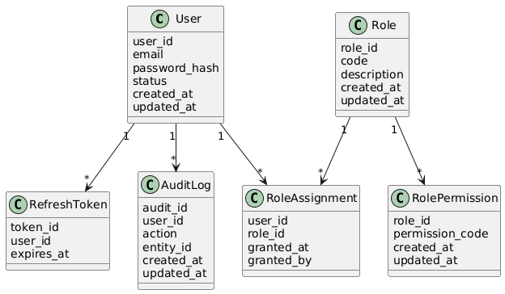

#### 5.1.6.2. Bounded Context Database Design Diagram

El siguiente diagrama de base de datos está diseñado para funcionar con Supabase, aprovechando PostgreSQL con funcionalidades extendidas como Row Level Security (RLS), triggers automáticos y integración nativa con Supabase Auth.

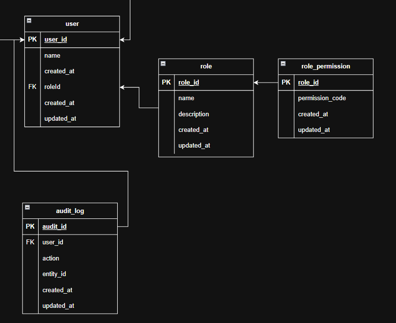

## 5.2. Bounded Context: Incidents Context

Este bounded context se encarga de gestionar el ciclo de vida completo de las incidencias urbanas reportadas por los ciudadanos. Cubre desde el registro inicial de incidencias con fotografías y geolocalización, hasta su resolución final por parte del personal municipal. Incluye funcionalidades como: creación de reportes con validación automática de duplicados, asignación de prioridades, actualización de estados, gestión de comentarios bidireccionales entre ciudadanos y personal municipal, seguimiento del historial de cambios, y generación de notificaciones en tiempo real. Este contexto es fundamental para mantener la transparencia y trazabilidad en la gestión municipal de problemas urbanos.

### 5.2.1. Domain Layer

En esta capa se modela el core del contexto de Incidencias con Aggregates, Entities, Value Objects, Domain Services, Repositories (interfaces) y Domain Events.

#### Aggregates y Entities Identificados

##### Incident (Aggregate Root)

**Propósito:** Representar una incidencia urbana reportada por un ciudadano.

| **Atributo** | **Tipo**       | **Visibilidad** | **Descripción**                                                     |
| ------------ | -------------- | --------------- | ------------------------------------------------------------------- |
| incidentId   | UUID           | Private         | Identificador único del incidente                                   |
| title        | String         | Private         | Título descriptivo del incidente                                    |
| description  | String         | Private         | Descripción detallada del problema reportado                        |
| type         | IncidentType   | Private         | Tipo de incidencia (bache, basura, graffiti, infraestructura, etc.) |
| status       | IncidentStatus | Private         | Estado actual (PENDING, IN_PROGRESS, RESOLVED, CLOSED)              |
| priority     | Priority       | Private         | Nivel de prioridad (LOW, MEDIUM, HIGH, CRITICAL)                    |
| location     | Location       | Private         | Ubicación georreferenciada del incidente                            |
| reportedBy   | UserId         | Private         | ID del ciudadano que reportó                                        |
| assignedTo   | UserId         | Private         | ID del personal municipal asignado                                  |
| photoUrls    | List<String>   | Private         | URLs de las fotografías adjuntas                                    |
| createdAt    | DateTime       | Private         | Fecha y hora de creación                                            |
| updatedAt    | DateTime       | Private         | Fecha y hora de última actualización                                |
| resolvedAt   | DateTime       | Private         | Fecha y hora de resolución                                          |

**Relaciones:** 1.._ con Comment, 1.._ con StatusHistory

**Invariantes:** location debe estar dentro de los límites de Lima Metropolitana; status debe seguir flujo válido de estados.

**Métodos:**

| **Nombre**             | **Tipo de retorno** | **Visibilidad** | **Descripción**                        |
| ---------------------- | ------------------- | --------------- | -------------------------------------- |
| reportIncident         | void                | Public          | Registra una nueva incidencia          |
| updateStatus           | void                | Public          | Actualiza el estado de la incidencia   |
| assignPriority         | void                | Public          | Asigna nivel de prioridad              |
| addComment             | void                | Public          | Añade comentario al historial          |
| assignToMunicipalStaff | void                | Public          | Asigna incidencia a personal municipal |
| markAsResolved         | void                | Public          | Marca la incidencia como resuelta      |
| close                  | void                | Public          | Cierra la incidencia                   |

##### Comment (Entity)

**Propósito:** Representar comentarios y comunicación entre ciudadanos y personal municipal.

| **Atributo** | **Tipo** | **Visibilidad** | **Descripción**                           |
| ------------ | -------- | --------------- | ----------------------------------------- |
| commentId    | UUID     | Private         | Identificador único del comentario        |
| incidentId   | UUID     | Private         | ID del incidente al que pertenece         |
| authorId     | UUID     | Private         | ID del usuario que escribió el comentario |
| content      | String   | Private         | Contenido del comentario                  |
| authorType   | UserType | Private         | Tipo de usuario (CITIZEN, MUNICIPAL)      |
| createdAt    | DateTime | Private         | Fecha y hora de creación                  |

##### StatusHistory (Entity)

**Propósito:** Mantener el historial de cambios de estado de las incidencias para transparencia y auditoría.

| **Atributo**   | **Tipo**       | **Visibilidad** | **Descripción**                      |
| -------------- | -------------- | --------------- | ------------------------------------ |
| historyId      | UUID           | Private         | Identificador único del registro     |
| incidentId     | UUID           | Private         | ID del incidente                     |
| previousStatus | IncidentStatus | Private         | Estado anterior                      |
| newStatus      | IncidentStatus | Private         | Estado nuevo                         |
| changedBy      | UUID           | Private         | ID del usuario que realizó el cambio |
| changeReason   | String         | Private         | Motivo del cambio de estado          |
| changedAt      | DateTime       | Private         | Fecha y hora del cambio              |

#### Value Objects

##### Location

| **Atributo** | **Tipo** | **Descripción**         |
| ------------ | -------- | ----------------------- |
| latitude     | Double   | Coordenada de latitud   |
| longitude    | Double   | Coordenada de longitud  |
| address      | String   | Dirección textual       |
| district     | String   | Distrito donde se ubica |
| zone         | String   | Zona específica         |

##### IncidentType (Enum)

- POTHOLE (Bache)
- TRASH (Basura)
- GRAFFITI (Graffiti)
- STREET_LIGHTING (Alumbrado público)
- INFRASTRUCTURE (Infraestructura)
- TRAFFIC_SIGNS (Señalización vial)
- GREEN_AREAS (Áreas verdes)
- OTHER (Otro)

##### IncidentStatus (Enum)

- PENDING (Pendiente)
- IN_REVIEW (En revisión)
- IN_PROGRESS (En progreso)
- RESOLVED (Resuelto)
- CLOSED (Cerrado)
- REJECTED (Rechazado)

##### Priority (Enum)

- LOW (Baja)
- MEDIUM (Media)
- HIGH (Alta)
- CRITICAL (Crítica)

### 5.2.2. Interface Layer

Esta capa expone los controladores que permiten la interacción con las entidades del dominio a través de solicitudes HTTP.

#### IncidentController

Controlador para los métodos CRUD relacionado con las incidencias urbanas.

| **Atributos**            |                           |                 |                                 |
| ------------------------ | ------------------------- | --------------- | ------------------------------- |
| **Nombre**               | **Tipo**                  | **Visibilidad** | **Descripción**                 |
| incident Command Handler | IIncident Command Handler | Private         | Servicio del gestor de comandos |
| incident Query Handler   | IIncident Query Handler   | Private         | Servicio del gestor de queries  |

| **Métodos**                |                     |                 |                                                     |
| -------------------------- | ------------------- | --------------- | --------------------------------------------------- |
| **Nombre**                 | **Tipo de retorno** | **Visibilidad** | **Descripción**                                     |
| reportIncident             | ResponseEntity      | Public          | Método para reportar una nueva incidencia           |
| getIncidents               | ResponseEntity      | Public          | Solicitar todas las incidencias                     |
| getIncidents ByStatus      | ResponseEntity      | Public          | Solicitar las incidencias filtradas por estado      |
| getIncident ById           | ResponseEntity      | Public          | Solicitar la incidencia por su id                   |
| getIncidents ByUserId      | ResponseEntity      | Public          | Solicitar las incidencias reportadas por un usuario |
| updateIncident Status      | ResponseEntity      | Public          | Actualizar el estado de una incidencia              |
| assignIncident Priority    | ResponseEntity      | Public          | Asignar prioridad a una incidencia                  |
| assignIncident ToStaff     | ResponseEntity      | Public          | Asignar incidencia a personal municipal             |
| addComment ToIncident      | ResponseEntity      | Public          | Añadir comentario a una incidencia                  |
| getIncident Comments       | ResponseEntity      | Public          | Obtener comentarios de una incidencia               |
| getIncident History        | ResponseEntity      | Public          | Obtener historial de cambios de estado              |
| filterIncidents ByType     | ResponseEntity      | Public          | Filtrar incidencias por tipo                        |
| filterIncidents ByLocation | ResponseEntity      | Public          | Filtrar incidencias por ubicación                   |
| filterIncidents ByPriority | ResponseEntity      | Public          | Filtrar incidencias por prioridad                   |
| closeIncident              | ResponseEntity      | Public          | Cerrar una incidencia                               |

### 5.2.3. Application Layer

Esta capa maneja la lógica de negocio y las interacciones entre los comandos y eventos, así como los servicios de aplicación.

#### Command handlers

##### IncidentCommandHandler

Gestiona la ejecución de comandos de las incidencias

| **Atributos**        |                       |                 |                                |
| -------------------- | --------------------- | --------------- | ------------------------------ |
| **Nombre**           | **Tipo**              | **Visibilidad** | **Descripción**                |
| Incident Repository  | IIncident Repository  | Private         | Repositorio de las incidencias |
| User Repository      | IUser Repository      | Private         | Repositorio de los usuarios    |
| Location Service     | ILocation Service     | Private         | Servicio de geolocalización    |
| Notification Service | INotification Service | Private         | Servicio de notificaciones     |

| **Métodos**             |                     |                 |                                                             |
| ----------------------- | ------------------- | --------------- | ----------------------------------------------------------- |
| **Nombre**              | **Tipo de retorno** | **Visibilidad** | **Descripción**                                             |
| create Incident         | Incident            | Public          | Método para crear una nueva incidencia con foto y ubicación |
| update IncidentStatus   | Incident            | Public          | Método para actualizar el estado de una incidencia          |
| assign IncidentPriority | Incident            | Public          | Método para asignar prioridad a una incidencia              |
| assign IncidentToStaff  | Incident            | Public          | Método para asignar incidencia a personal municipal         |
| add CommentToIncident   | Comment             | Public          | Método para añadir comentario a una incidencia              |
| close Incident          | Incident            | Public          | Método para cerrar una incidencia                           |

#### Query handlers

##### IncidentQueryHandler

Gestiona la ejecución de queries de las incidencias

| **Atributos**            |                           |                 |                                      |
| ------------------------ | ------------------------- | --------------- | ------------------------------------ |
| **Nombre**               | **Tipo**                  | **Visibilidad** | **Descripción**                      |
| Incident Repository      | IIncident Repository      | Private         | Repositorio de las incidencias       |
| User Repository          | IUser Repository          | Private         | Repositorio de los usuarios          |
| Comment Repository       | IComment Repository       | Private         | Repositorio de los comentarios       |
| StatusHistory Repository | IStatusHistory Repository | Private         | Repositorio del historial de estados |

| **Métodos**             |                     |                 |                                                   |
| ----------------------- | ------------------- | --------------- | ------------------------------------------------- |
| **Nombre**              | **Tipo de retorno** | **Visibilidad** | **Descripción**                                   |
| getIncidents            | List.Incident       | Public          | Retorna todas las incidencias                     |
| getIncidents ByStatus   | List.Incident       | Public          | Retorna las incidencias filtradas por estado      |
| getIncident ById        | Incident            | Public          | Retorna la incidencia por su id                   |
| getIncidents ByUserId   | List.Incident       | Public          | Retorna las incidencias reportadas por un usuario |
| getIncidents ByType     | List.Incident       | Public          | Retorna las incidencias filtradas por tipo        |
| getIncidents ByLocation | List.Incident       | Public          | Retorna las incidencias filtradas por ubicación   |
| getIncidents ByPriority | List.Incident       | Public          | Retorna las incidencias filtradas por prioridad   |
| getIncident Comments    | List.Comment        | Public          | Retorna los comentarios de una incidencia         |
| getIncident History     | List.StatusHistory  | Public          | Retorna el historial de cambios de una incidencia |

### 5.2.4. Infrastructure Layer

Esta capa se encarga de la persistencia de datos y las interacciones con servicios externos.

#### IIncidentRepository

Interfaz que define los métodos para gestionar las incidencias

| **Métodos** |  |
|-------------|-------------|
| **Nombre** | **Tipo de retorno** | **Descripción** |
| findIncident ByStatus | List.Incident | Retorna las incidencias filtradas por estado |
| findIncident ByUserId | List.Incident | Retorna las incidencias reportadas por un usuario |
| findIncident ByType | List.Incident | Retorna las incidencias filtradas por tipo |
| findIncident ByLocation | List.Incident | Retorna las incidencias filtradas por ubicación geográfica |
| findIncident ByPriority | List.Incident | Retorna las incidencias filtradas por nivel de prioridad |
| findIncident ById | Incident | Retorna una incidencia específica por su identificador |
| save Incident | Incident | Guarda una nueva incidencia en la base de datos |
| update Incident | Incident | Actualiza una incidencia existente |
| delete Incident | Boolean | Elimina una incidencia de la base de datos |

#### ICommentRepository

Interfaz que representa la tabla "Comment" y maneja los métodos para gestionar comentarios

| **Métodos** |  |
|-------------|-------------|
| **Nombre** | **Tipo de retorno** | **Descripción** |
| findComments ByIncidentId | List.Comment | Retorna todos los comentarios de una incidencia específica |
| findComment ById | Comment | Retorna un comentario específico por su identificador |
| save Comment | Comment | Guarda un nuevo comentario en la base de datos |
| update Comment | Comment | Actualiza un comentario existente |
| delete Comment | Boolean | Elimina un comentario de la base de datos |

#### IStatusHistoryRepository

Interfaz que representa la tabla "StatusHistory" y maneja el historial de cambios de estado

| **Métodos** |  |
|-------------|-------------|
| **Nombre** | **Tipo de retorno** | **Descripción** |
| findHistory ByIncidentId | List.StatusHistory | Retorna el historial completo de cambios de una incidencia |
| findHistory ByUserId | List.StatusHistory | Retorna el historial de cambios realizados por un usuario |
| save StatusHistory | StatusHistory | Guarda un nuevo registro de cambio de estado |
| findLatest StatusByIncidentId | StatusHistory | Retorna el último cambio de estado de una incidencia |

#### ILocationService

Interfaz para servicios de geolocalización externos

| **Métodos** |  |
|-------------|-------------|
| **Nombre** | **Tipo de retorno** | **Descripción** |
| validateLocation | Boolean | Valida si las coordenadas están dentro de Lima Metropolitana |
| getAddress FromCoordinates | String | Convierte coordenadas GPS en dirección textual |
| getDistrict FromCoordinates | String | Obtiene el distrito basado en coordenadas |
| calculateDistance | Double | Calcula distancia entre dos ubicaciones |

#### INotificationService

Interfaz para servicios de notificaciones en tiempo real

| **Métodos** |  |
|-------------|-------------|
| **Nombre** | **Tipo de retorno** | **Descripción** |
| sendStatusUpdate Notification | Boolean | Envía notificación de cambio de estado via WebSocket |
| sendComment Notification | Boolean | Envía notificación de nuevo comentario |
| sendAssignment Notification | Boolean | Notifica asignación de incidencia a personal municipal |
| updateNotification Badge | Boolean | Actualiza contador de notificaciones en tiempo real |

### 5.2.5. Bounded Context Software Architecture Component Level Diagrams

El siguiente diagrama de componentes ilustra la arquitectura interna del bounded context de Incidencias, mostrando la organización por capas (Domain, Application, Interface e Infrastructure) y las dependencias entre componentes. Esta representación facilita la comprensión de cómo los diferentes elementos colaboran para gestionar el ciclo de vida completo de las incidencias urbanas.

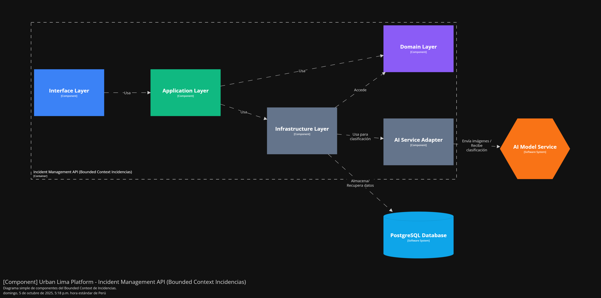

### 5.2.6. Bounded Context Software Architecture Code Level Diagrams

#### 5.2.6.1. Bounded Context Domain Layer Class Diagrams

El diagrama de clases del dominio presenta la estructura completa del bounded context de Incidencias, con **Incident** como aggregate root central rodeado de las entidades **Comment** y **StatusHistory**. El diagrama abarca todas las capas arquitectónicas (Interface, Application, Infrastructure) con sus respectivos controladores, handlers CQRS, repositorios e interfaces de servicios externos, proporcionando una vista integral de la implementación siguiendo principios de Domain-Driven Design.

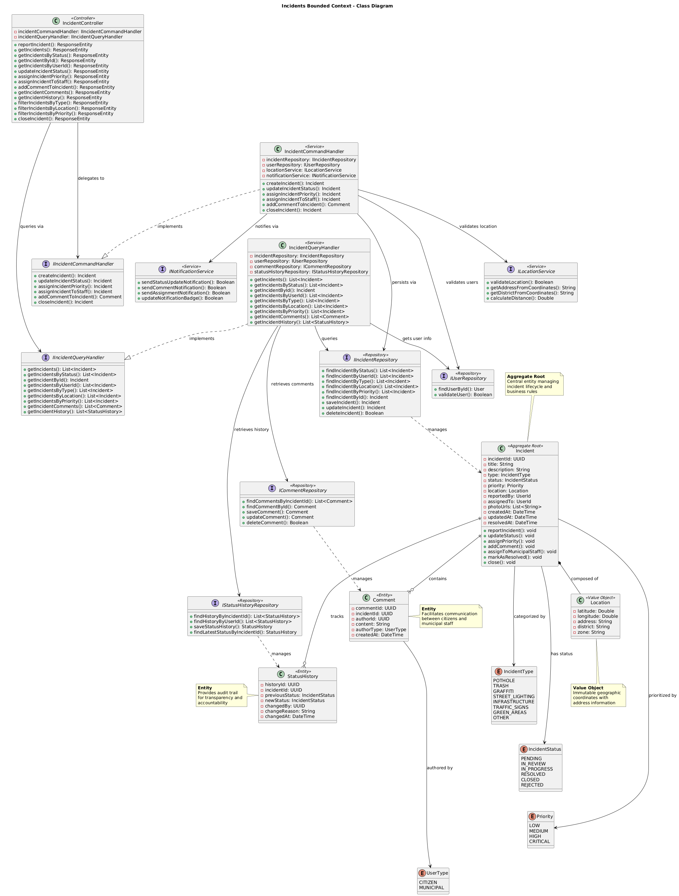

#### 5.2.6.2. Bounded Context Database Design Diagram

El diagrama de base de datos define la estructura de persistencia específica del bounded context de Incidencias, mostrando únicamente las tablas que pertenecen al core de este contexto: **incidents** como tabla principal del aggregate root, **comments** para la comunicación entre usuarios, y **status_history** para auditoría de cambios. Las referencias a otros bounded contexts (como user_id hacia IAM) se modelan como simples UUIDs sin foreign keys físicas, respetando la autonomía del contexto y los principios de microservicios donde cada bounded context mantiene su propia base de datos independiente.

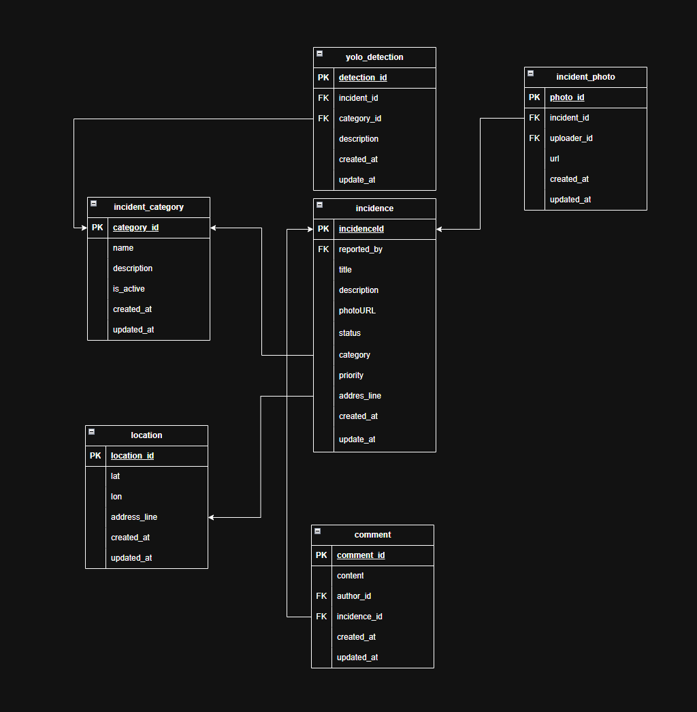

## 5.3. Bounded Context: Location Context

El Location Context es responsable del análisis geoespacial de incidencias urbanas en Lima Metropolitana. Su propósito es generar inteligencia geográfica mediante mapas de calor, detección de clusters y análisis estadísticos por distrito, permitiendo al personal municipal tomar decisiones informadas sobre priorización de intervenciones. Este bounded context consume datos de incidencias del Incidents Context pero no gestiona su ciclo de vida, enfocándose exclusivamente en la dimensión espacial y temporal.

Se implementa **Clean Architecture** con 4 capas concéntricas respetando la **Dependency Rule** (las dependencias siempre apuntan hacia el centro):

```
┌─────────────────────────────────────────────────┐
│  Interface Layer (Controllers, DTOs)            │  ← Capa más externa
│  └─ Depende de: Application Layer               │
├─────────────────────────────────────────────────┤
│  Application Layer (Use Cases, CQRS Handlers)   │
│  └─ Depende de: Domain Layer                    │
├─────────────────────────────────────────────────┤
│  Infrastructure Layer (Repositories, Services)  │
│  └─ Implementa interfaces del: Domain Layer     │
├─────────────────────────────────────────────────┤
│  Domain Layer (Entities, VOs, Services)         │  ← Núcleo (sin dependencias)
│  └─ Sin dependencias externas                   │
└─────────────────────────────────────────────────┘
```

**Beneficios de esta arquitectura:**

- **Independencia de frameworks:** Domain Layer no conoce Django, Supabase ni tecnologías específicas
- **Testabilidad:** Cada capa puede probarse aisladamente mediante mocks de interfaces
- **Flexibilidad:** Cambiar tecnologías (ej: PostgreSQL → MongoDB) solo afecta Infrastructure Layer
- **Separación de concerns:** Lógica de negocio aislada de detalles técnicos

### 5.3.1. Domain Layer

**Propósito:** Núcleo del bounded context que contiene la lógica de negocio pura sin dependencias externas. Esta es la capa más interna y estable.

**Responsabilidades:**

- Modelar conceptos del dominio usando DDD patterns (Aggregates, Entities, Value Objects)
- Definir reglas de negocio e invariantes
- Emitir Domain Events para comunicación desacoplada
- Exponer interfaces (Repository pattern) que la Infrastructure Layer implementará

**Características:**

- **Sin dependencias externas:** No usa Django, Supabase, ni ninguna biblioteca de infraestructura
- **Testeable:** Lógica pura que puede probarse sin bases de datos ni servicios externos
- **Estable:** Cambios mínimos en el tiempo, enfocada en el core del negocio

En esta capa se modela el core de Location con Aggregates, Entities, Value Objects, Domain Services, Repositories (interfaces) y Domain Events aplicando patrones DDD.

#### Aggregates Roots

##### GeoSpatialAnalysis (Aggregate Root)

Propósito: representar un análisis geoespacial completo de incidencias en un área y período específicos, conteniendo puntos de mapa de calor y clusters detectados.

**Atributos**

| Nombre       | Tipo                  | Visibilidad | Descripción                                         |
| ------------ | --------------------- | ----------- | --------------------------------------------------- |
| analysisId   | UUID                  | Private     | Identificador único del análisis                    |
| boundingBox  | BoundingBox           | Private     | Área geográfica analizada (Value Object)            |
| timeRange    | DateTimeRange         | Private     | Período temporal del análisis (Value Object)        |
| district     | District              | Private     | Distrito de Lima analizado (opcional, Value Object) |
| heatmapData  | List<HeatmapPoint>    | Private     | Puntos del mapa de calor (Entities)                 |
| clusters     | List<IncidentCluster> | Private     | Clusters detectados (Entities)                      |
| filters      | AnalysisFilters       | Private     | Filtros aplicados (Value Object)                    |
| generatedAt  | DateTime              | Private     | Fecha de generación                                 |
| requestedBy  | UserId                | Private     | Usuario municipal que solicitó (Value Object)       |
| domainEvents | List<DomainEvent>     | Private     | Eventos de dominio acumulados                       |

**Relaciones**

1.._ con HeatmapPoint (composition); 1.._ con IncidentCluster (composition).

**Invariantes**

- boundingBox debe estar dentro de Lima Metropolitana (-12.25° a -11.80° lat, -77.15° a -76.70° lng)
- timeRange no puede exceder 365 días
- heatmapData debe tener al menos 1 punto para ser válido
- Si district está presente, boundingBox debe estar dentro de sus límites

**Métodos**

| Nombre                | Tipo de retorno    | Visibilidad     | Descripción                                                 |
| --------------------- | ------------------ | --------------- | ----------------------------------------------------------- |
| create                | GeoSpatialAnalysis | Public (static) | Crea nuevo análisis validando Lima bounds                   |
| generateHeatmap       | void               | Public          | Genera puntos de mapa de calor basados en incidencias       |
| applyFilters          | void               | Public          | Aplica filtros y regenera análisis                          |
| detectClusters        | void               | Public          | Ejecuta algoritmo DBSCAN para detectar agrupaciones         |
| addHeatmapPoint       | void               | Public          | Agrega punto validando intensidad                           |
| calculateMaxIntensity | float              | Public          | Calcula intensidad máxima de todos los puntos               |
| exportToGeoJSON       | string             | Public          | Exporta análisis a formato GeoJSON para integración externa |

#### Entities

##### HeatmapPoint (Entity)

Propósito: representar un punto individual en el mapa de calor con intensidad calculada basada en concentración de incidencias.

**Atributos**

| Nombre        | Tipo         | Visibilidad | Descripción                         |
| ------------- | ------------ | ----------- | ----------------------------------- |
| pointId       | UUID         | Private     | Identificador único del punto       |
| coordinates   | Coordinates  | Private     | Ubicación geográfica (Value Object) |
| intensity     | float        | Private     | Intensidad normalizada (0.0 a 1.0)  |
| incidentCount | int          | Private     | Número de incidencias en este punto |
| incidentTypes | List<string> | Private     | Tipos de incidencias presentes      |
| createdAt     | DateTime     | Private     | Fecha de creación                   |

**Métodos**

| Nombre             | Tipo de retorno | Visibilidad | Descripción                                        |
| ------------------ | --------------- | ----------- | -------------------------------------------------- |
| calculateIntensity | float           | Public      | Calcula intensidad basada en incidencias cercanas  |
| isHotspot          | bool            | Public      | Determina si excede umbral de hotspot (>0.7)       |
| distanceTo         | float           | Public      | Calcula distancia a otro punto (metros, Haversine) |

##### IncidentCluster (Entity)

Propósito: representar una agrupación geográfica de incidencias detectada por algoritmo de clustering que requiere intervención coordinada.

**Atributos**

| Nombre       | Tipo            | Visibilidad | Descripción                                  |
| ------------ | --------------- | ----------- | -------------------------------------------- |
| clusterId    | UUID            | Private     | Identificador único del cluster              |
| centroid     | Coordinates     | Private     | Punto central del cluster (Value Object)     |
| radius       | float           | Private     | Radio del cluster en metros                  |
| incidentIds  | List<UUID>      | Private     | IDs de incidencias pertenecientes al cluster |
| priority     | ClusterPriority | Private     | Prioridad: HIGH, MEDIUM, LOW (Enum)          |
| affectedArea | float           | Private     | Área afectada en metros cuadrados            |
| createdAt    | DateTime        | Private     | Fecha de detección                           |

**Métodos**

| Nombre            | Tipo de retorno | Visibilidad | Descripción                                    |
| ----------------- | --------------- | ----------- | ---------------------------------------------- |
| calculateCentroid | Coordinates     | Public      | Calcula centroide geográfico de incidencias    |
| addIncident       | void            | Public      | Agrega incidencia al cluster                   |
| getAffectedArea   | float           | Public      | Calcula área de influencia (πr²)               |
| determinePriority | ClusterPriority | Public      | Determina prioridad basada en densidad y tipos |

#### Value Objects

##### Coordinates

Propósito: representar un punto geográfico específico usando sistema WGS 84.

**Atributos**

| Nombre    | Tipo    | Visibilidad | Descripción                          |
| --------- | ------- | ----------- | ------------------------------------ |
| latitude  | Decimal | Public      | Latitud (-12.25 a -11.80 para Lima)  |
| longitude | Decimal | Public      | Longitud (-77.15 a -76.70 para Lima) |

**Métodos**

| Nombre       | Tipo de retorno | Visibilidad | Descripción                                |
| ------------ | --------------- | ----------- | ------------------------------------------ |
| distanceTo   | float           | Public      | Calcula distancia a otro punto (Haversine) |
| isWithinLima | bool            | Public      | Valida si está dentro de bounds de Lima    |
| toGeoJSON    | Dict            | Public      | Convierte a formato GeoJSON Point          |

##### BoundingBox

Propósito: definir un rectángulo geográfico que delimita el área de análisis.

**Atributos**

| Nombre    | Tipo        | Visibilidad | Descripción                     |
| --------- | ----------- | ----------- | ------------------------------- |
| northEast | Coordinates | Public      | Esquina noreste del rectángulo  |
| southWest | Coordinates | Public      | Esquina suroeste del rectángulo |

**Métodos**

| Nombre     | Tipo de retorno | Visibilidad | Descripción                              |
| ---------- | --------------- | ----------- | ---------------------------------------- |
| contains   | bool            | Public      | Verifica si un punto está dentro del box |
| getAreaKm2 | float           | Public      | Calcula área en kilómetros cuadrados     |
| toPolygon  | string          | Public      | Convierte a representación polígono JSON |

##### District

Propósito: representar un distrito administrativo de Lima usando código UBIGEO oficial.

**Atributos**

| Nombre | Tipo   | Visibilidad | Descripción                 |
| ------ | ------ | ----------- | --------------------------- |
| code   | string | Public      | Código UBIGEO (6 dígitos)   |
| name   | string | Public      | Nombre oficial del distrito |

**Métodos**

| Nombre    | Tipo de retorno | Visibilidad     | Descripción                                        |
| --------- | --------------- | --------------- | -------------------------------------------------- |
| isValid   | bool            | Public          | Valida código contra lista de 43 distritos de Lima |
| getUbigeo | string          | Public          | Retorna código UBIGEO formateado                   |
| fromCode  | District        | Public (static) | Factory method para crear desde código             |

##### DateTimeRange

Propósito: representar un período temporal con validaciones de duración máxima.

**Atributos**

| Nombre | Tipo     | Visibilidad | Descripción               |
| ------ | -------- | ----------- | ------------------------- |
| start  | DateTime | Public      | Inicio del rango temporal |
| end    | DateTime | Public      | Fin del rango temporal    |

**Métodos**

| Nombre   | Tipo de retorno | Visibilidad | Descripción                                 |
| -------- | --------------- | ----------- | ------------------------------------------- |
| duration | timedelta       | Public      | Calcula duración total                      |
| overlaps | bool            | Public      | Verifica solapamiento con otro rango        |
| contains | bool            | Public      | Verifica si timestamp está dentro del rango |

##### AnalysisFilters

Propósito: encapsular criterios de filtrado aplicados al análisis geoespacial.

**Atributos**

| Nombre        | Tipo         | Visibilidad | Descripción                                 |
| ------------- | ------------ | ----------- | ------------------------------------------- |
| district      | District     | Public      | Distrito a analizar (opcional)              |
| incidentTypes | List<string> | Public      | Tipos de incidencias a incluir              |
| minIntensity  | float        | Public      | Umbral mínimo de intensidad (0.0 a 1.0)     |
| timeWindow    | string       | Public      | Ventana temporal: last_7_days, last_30_days |

#### Enumerations

##### ClusterPriority

Propósito: clasificar prioridad de clusters según densidad y tipos de incidencias.

| Valor  | Descripción                                                |
| ------ | ---------------------------------------------------------- |
| HIGH   | Cluster crítico con alta densidad o incidencias peligrosas |
| MEDIUM | Cluster moderado que requiere atención planificada         |
| LOW    | Cluster de baja prioridad para monitoreo                   |

##### HeatmapIntensity

Propósito: clasificar niveles de intensidad de puntos del mapa de calor.

| Valor    | Descripción                       |
| -------- | --------------------------------- |
| CRITICAL | Intensidad ≥ 0.85 (zona crítica)  |
| HIGH     | Intensidad 0.70 - 0.84 (alta)     |
| MODERATE | Intensidad 0.40 - 0.69 (moderada) |
| LOW      | Intensidad < 0.40 (baja)          |

#### Domain Services

##### HeatmapGenerationService

Propósito: generar mapas de calor aplicando algoritmos de interpolación espacial sobre incidencias.

**Métodos**

| Nombre                  | Parámetros                                                      | Retorno            | Descripción                                                   |
| ----------------------- | --------------------------------------------------------------- | ------------------ | ------------------------------------------------------------- |
| generateHeatmap         | incidents: List<Incident>, boundingBox: BoundingBox             | List<HeatmapPoint> | Genera grid de puntos con intensidades calculadas             |
| calculatePointIntensity | location: Coordinates, incidents: List<Incident>, radius: float | float              | Calcula intensidad basada en incidencias dentro del radio     |
| interpolateIntensity    | points: List<HeatmapPoint>                                      | List<HeatmapPoint> | Aplica interpolación para suavizar transiciones de intensidad |

##### ClusterDetectionService

Propósito: detectar agrupaciones geográficas de incidencias usando algoritmo DBSCAN.

**Métodos**

| Nombre                   | Parámetros                                                    | Retorno               | Descripción                                             |
| ------------------------ | ------------------------------------------------------------- | --------------------- | ------------------------------------------------------- |
| detectClusters           | incidents: List<Incident>, maxDistance: float, minPoints: int | List<IncidentCluster> | Ejecuta DBSCAN y retorna clusters detectados            |
| applyDBSCAN              | points: List<Coordinates>, eps: float, minSamples: int        | List<List<UUID>>      | Implementación algoritmo DBSCAN                         |
| calculateClusterPriority | cluster: IncidentCluster                                      | ClusterPriority       | Determina prioridad basada en densidad y tipos críticos |

##### GeospatialQueryService

Propósito: ejecutar consultas geoespaciales complejas usando algoritmos de proximidad.

**Métodos**

| Nombre                     | Parámetros                         | Retorno        | Descripción                                        |
| -------------------------- | ---------------------------------- | -------------- | -------------------------------------------------- |
| findIncidentsInRadius      | center: Coordinates, radius: float | List<Incident> | Busca incidencias dentro de radio usando Haversine |
| calculateHotspots          | threshold: float                   | List<District> | Identifica distritos con intensidad > threshold    |
| findIncidentsInBoundingBox | box: BoundingBox                   | List<Incident> | Filtra incidencias dentro de rectángulo geográfico |

#### Domain Events

##### HeatmapGenerated

Propósito: notifica que se completó la generación de un mapa de calor.

**Atributos**

| Nombre       | Tipo        | Descripción                  |
| ------------ | ----------- | ---------------------------- |
| analysisId   | UUID        | ID del análisis generado     |
| boundingBox  | BoundingBox | Área analizada               |
| pointCount   | int         | Número de puntos generados   |
| maxIntensity | float       | Intensidad máxima encontrada |
| occurredAt   | DateTime    | Timestamp del evento         |

##### ClustersDetected

Propósito: notifica detección de clusters que requieren atención municipal.

**Atributos**

| Nombre           | Tipo           | Descripción                     |
| ---------------- | -------------- | ------------------------------- |
| analysisId       | UUID           | ID del análisis                 |
| clusterCount     | int            | Número de clusters detectados   |
| hotspotDistricts | List<District> | Distritos con clusters críticos |
| occurredAt       | DateTime       | Timestamp del evento            |

##### FiltersApplied

Propósito: notifica aplicación de filtros sobre un análisis existente.

**Atributos**

| Nombre     | Tipo            | Descripción                |
| ---------- | --------------- | -------------------------- |
| analysisId | UUID            | ID del análisis modificado |
| filters    | AnalysisFilters | Filtros aplicados          |
| occurredAt | DateTime        | Timestamp del evento       |

##### HotspotIdentified

Propósito: notifica identificación de zona crítica con alta concentración de incidencias.

**Atributos**

| Nombre        | Tipo            | Descripción             |
| ------------- | --------------- | ----------------------- |
| district      | District        | Distrito afectado       |
| incidentCount | int             | Cantidad de incidencias |
| priority      | ClusterPriority | Nivel de prioridad      |
| occurredAt    | DateTime        | Timestamp del evento    |

#### Repository Interfaces

##### IGeoSpatialAnalysisRepository

Propósito: abstrae persistencia de análisis geoespaciales siguiendo patrón Repository.

**Métodos**

| Nombre                     | Parámetros                               | Retorno                  | Descripción                                  |
| -------------------------- | ---------------------------------------- | ------------------------ | -------------------------------------------- |
| save                       | analysis: GeoSpatialAnalysis             | void                     | Persiste aggregate completo con sus entities |
| findById                   | analysisId: UUID                         | GeoSpatialAnalysis       | Recupera análisis por ID                     |
| findByDistrictAndTimeRange | district: District, range: DateTimeRange | List<GeoSpatialAnalysis> | Busca análisis históricos de un distrito     |
| delete                     | analysisId: UUID                         | void                     | Elimina análisis y sus entities relacionadas |

### 5.3.2. Interface Layer

**Propósito:** Capa más externa que expone funcionalidades del bounded context a través de APIs REST. Actúa como adaptador entre el mundo HTTP y la lógica de aplicación.

**Responsabilidades:**

- Exponer endpoints REST con rutas, métodos HTTP y códigos de estado
- Validar requests (formato, autenticación, autorización)
- Traducir HTTP requests a Commands/Queries de la Application Layer
- Serializar Domain Objects a DTOs (Data Transfer Objects) para responses
- Manejar errores y convertirlos a HTTP status codes apropiados

**Características:**

- **Depende de Application Layer:** Invoca Command Handlers y Query Handlers
- **Framework-specific:** Usa Django REST Framework, decoradores, serializers
- **Thin controllers:** No contienen lógica de negocio, solo orquestación HTTP
- **Validación de entrada:** Primera línea de defensa contra datos inválidos

La Interface Layer expone endpoints REST para que el dashboard municipal Angular interactúe con las funcionalidades de análisis geoespacial. Todos los endpoints requieren autenticación JWT y validan permisos municipales.

#### Controllers

##### LocationController

Propósito: gestionar operaciones de generación y consulta de análisis geoespaciales.

**Base Path:** `/api/v1/location`

**Endpoints**

| Método | Endpoint                        | Request Body / Query                                                             | Response                                                                            | Descripción                                  | User Stories |
| ------ | ------------------------------- | -------------------------------------------------------------------------------- | ----------------------------------------------------------------------------------- | -------------------------------------------- | ------------ |
| POST   | `/api/v1/location/heatmap`      | Body: `{ "district": "150103", "time_range": {...}, "incident_types": [...] }`   | `{ "analysis_id": "uuid", "heatmap_points": [...], "metadata": {...} }`             | Genera nuevo mapa de calor con filtros       | US03         |
| GET    | `/api/v1/location/heatmap/{id}` | -                                                                                | `{ "analysis_id": "uuid", "heatmap_points": [...], "clusters": [...] }`             | Obtiene análisis existente por ID            | US03         |
| POST   | `/api/v1/location/filter`       | Body: `{ "bounding_box": {...}, "incident_types": [...], "min_intensity": 0.5 }` | `{ "filtered_incidents": [...], "total_count": 150 }`                               | Filtra incidencias por criterios geográficos | US03         |
| GET    | `/api/v1/location/hotspots`     | Query: `?threshold=0.7&time_window=last_30_days`                                 | `{ "hotspots": [{ "district": "Ate", "incident_count": 45, "priority": "HIGH" }] }` | Identifica zonas críticas                    | US03         |

##### DistrictController

Propósito: proporcionar estadísticas agregadas por distrito de Lima Metropolitana.

**Base Path:** `/api/v1/districts`

**Endpoints**

| Método | Endpoint                              | Request Body / Query         | Response                                                                        | Descripción                                 | User Stories |
| ------ | ------------------------------------- | ---------------------------- | ------------------------------------------------------------------------------- | ------------------------------------------- | ------------ |
| GET    | `/api/v1/districts`                   | Query: `?include_stats=true` | `{ "districts": [{ "code": "150103", "name": "Ate", "incident_count": 120 }] }` | Lista todos los distritos con estadísticas  | US03         |
| GET    | `/api/v1/districts/{code}/statistics` | -                            | `{ "total_incidents": 120, "by_type": {...}, "avg_resolution_time": 48 }`       | Estadísticas detalladas de un distrito      | US03         |
| GET    | `/api/v1/districts/{code}/incidents`  | Query: `?status=pendiente`   | `{ "incidents": [...], "total": 120 }`                                          | Lista incidencias de un distrito específico | US03         |

#### Request/Response Models

##### HeatmapRequest

| Campo          | Tipo          | Requerido | Validación                        |
| -------------- | ------------- | --------- | --------------------------------- |
| district       | string        | No        | Código UBIGEO válido              |
| time_range     | DateTimeRange | Sí        | end > start, duración <= 365 días |
| incident_types | List<string>  | No        | Tipos deben existir en catálogo   |
| min_incidents  | int           | No        | min_incidents >= 1                |

##### HeatmapResponse

| Campo          | Tipo               | Descripción                          |
| -------------- | ------------------ | ------------------------------------ |
| analysis_id    | UUID               | ID del análisis generado             |
| heatmap_points | List<HeatmapPoint> | Puntos del mapa de calor             |
| metadata       | AnalysisMetadata   | Metadatos: conteo, intensidad máxima |

##### ClusterResponse

| Campo              | Tipo        | Descripción                        |
| ------------------ | ----------- | ---------------------------------- |
| cluster_id         | UUID        | ID del cluster                     |
| centroid           | Coordinates | Punto central                      |
| incident_ids       | List<UUID>  | IDs de incidencias en el cluster   |
| priority           | string      | HIGH, MEDIUM, LOW                  |
| recommended_action | string      | Acción sugerida basada en análisis |

#### Error Handling

| Status Code | Error Type                | Descripción                        | Ejemplo Response                                                     |
| ----------- | ------------------------- | ---------------------------------- | -------------------------------------------------------------------- |
| 400         | InvalidBoundingBoxError   | Bounding box fuera de Lima bounds  | `{ "error": "InvalidBoundingBox", "message": "Out of Lima bounds" }` |
| 401         | UnauthorizedError         | Token JWT inválido o expirado      | `{ "error": "Unauthorized", "message": "Invalid token" }`            |
| 403         | ForbiddenError            | Usuario sin permisos municipales   | `{ "error": "Forbidden", "message": "Municipal role required" }`     |
| 404         | AnalysisNotFoundError     | Análisis no existe                 | `{ "error": "NotFound", "message": "Analysis not found" }`           |
| 422         | InvalidTimeRangeError     | Rango temporal excede 365 días     | `{ "error": "InvalidTimeRange", "message": "Max 365 days" }`         |
| 500         | GeospatialProcessingError | Error en procesamiento geoespacial | `{ "error": "InternalError", "message": "Processing failed" }`       |

### 5.3.3. Application Layer

**Propósito:** Orquestar casos de uso coordinando Domain Services, Repositories y lógica de negocio para cumplir requisitos de aplicación.

**Responsabilidades:**

- Implementar casos de uso específicos (generar heatmap, detectar clusters)
- Coordinar llamadas entre Domain Services y Repositories
- Aplicar patrón CQRS (Command Query Responsibility Segregation) separando escrituras de lecturas
- Gestionar transacciones y flujos de negocio complejos
- No contiene lógica de negocio (vive en Domain Layer)

**Características:**

- **Depende solo de Domain Layer:** Usa Aggregates, Services y Repository Interfaces
- **Independiente de frameworks:** No conoce HTTP, REST, Django views
- **Stateless:** Handlers no mantienen estado entre invocaciones
- **Thin layer:** Delega lógica compleja al Domain Layer

La Application Layer implementa CQRS (Command Query Responsibility Segregation) para separar operaciones de escritura (generación de análisis) de operaciones de lectura (consultas optimizadas).

#### Command Handlers

##### GenerateHeatmapCommandHandler

Propósito: orquesta la generación completa de un mapa de calor obteniendo incidencias, creando el aggregate y persistiendo resultado.

**Command:** GenerateHeatmapCommand

**Campos del Command**

| Campo          | Tipo          | Validación                       |
| -------------- | ------------- | -------------------------------- |
| user_id        | UUID          | Usuario debe tener rol municipal |
| district       | string        | Código UBIGEO válido (opcional)  |
| time_range     | DateTimeRange | Duración <= 365 días             |
| incident_types | List<string>  | Tipos válidos                    |
| min_incidents  | int           | >= 1                             |

**Dependencias**

- IGeoSpatialAnalysisRepository
- IIncidentRepository (cross-context)
- HeatmapGenerationService

**Flujo de Ejecución**

1. Validar permisos de usuario
2. Obtener incidencias del período desde Incidents Context
3. Crear aggregate GeoSpatialAnalysis
4. Invocar HeatmapGenerationService
5. Persistir análisis completo
6. Emitir Domain Event HeatmapGenerated

##### DetectClustersCommandHandler

Propósito: ejecuta algoritmo DBSCAN para detectar y almacenar clusters de incidencias.

**Command:** DetectClustersCommand

**Campos del Command**

| Campo               | Tipo  | Validación            |
| ------------------- | ----- | --------------------- |
| analysis_id         | UUID  | Análisis debe existir |
| max_distance_meters | float | > 0                   |
| min_points          | int   | >= 2                  |

**Dependencias**

- IIncidentClusterRepository
- ClusterDetectionService
- IIncidentRepository

**Flujo de Ejecución**

1. Recuperar análisis existente
2. Obtener incidencias del área
3. Ejecutar algoritmo DBSCAN
4. Crear entities IncidentCluster
5. Persistir clusters detectados
6. Emitir Domain Event ClustersDetected

##### ApplyFiltersCommandHandler

Propósito: aplica filtros sobre un análisis existente y regenera puntos del heatmap.

**Command:** ApplyFiltersCommand

**Campos del Command**

| Campo       | Tipo            | Validación            |
| ----------- | --------------- | --------------------- |
| analysis_id | UUID            | Análisis debe existir |
| filters     | AnalysisFilters | Filtros válidos       |

**Dependencias**

- IGeoSpatialAnalysisRepository
- GeospatialQueryService

#### Query Handlers

##### GetHeatmapDataQueryHandler

Propósito: recupera datos de un mapa de calor con caché optimizado para reducir latencia.

**Query:** GetHeatmapDataQuery

**Campos del Query**

| Campo       | Tipo | Validación |
| ----------- | ---- | ---------- |
| analysis_id | UUID | Requerido  |

**Dependencias**

- IGeoSpatialAnalysisRepository
- RedisCache

**Flujo de Ejecución**

1. Consultar caché Redis primero (key: `heatmap:{analysis_id}`)
2. Si cache miss, consultar repository
3. Cachear resultado (TTL: 1 hora)
4. Retornar datos serializados

##### GetClustersQueryHandler

Propósito: obtiene clusters detectados con filtros opcionales por distrito y prioridad.

**Query:** GetClustersQuery

**Campos del Query**

| Campo      | Tipo            | Validación |
| ---------- | --------------- | ---------- |
| district   | string          | Opcional   |
| priority   | ClusterPriority | Opcional   |
| time_range | DateTimeRange   | Opcional   |

**Dependencias**

- IIncidentClusterRepository

##### GetDistrictStatisticsQueryHandler

Propósito: calcula estadísticas agregadas de un distrito consumiendo vista materializada.

**Query:** GetDistrictStatisticsQuery

**Campos del Query**

| Campo         | Tipo          | Validación |
| ------------- | ------------- | ---------- |
| district_code | string        | Requerido  |
| time_range    | DateTimeRange | Opcional   |

**Dependencias**

- IDistrictStatisticsRepository (accede vista materializada)
- IIncidentRepository

##### GetHotspotsQueryHandler

Propósito: identifica zonas críticas que exceden umbral de intensidad configurado.

**Query:** GetHotspotsQuery

**Campos del Query**

| Campo       | Tipo   | Validación                    |
| ----------- | ------ | ----------------------------- |
| threshold   | float  | 0.0 <= threshold <= 1.0       |
| time_window | string | "last_7_days", "last_30_days" |
| limit       | int    | <= 100                        |

**Dependencias**

- IHeatmapPointRepository
- GeospatialQueryService

#### Application Services

##### GeoSpatialOrchestrator

Propósito: coordina ejecución completa de análisis geoespacial incluyendo generación de heatmap y detección de clusters.

**Métodos**

| Nombre              | Parámetros                      | Retorno            | Descripción                        |
| ------------------- | ------------------------------- | ------------------ | ---------------------------------- |
| orchestrateAnalysis | command: GenerateHeatmapCommand | GeoSpatialAnalysis | Ejecuta flujo completo de análisis |

##### IncidentDataAggregator

Propósito: agrega incidencias por ubicación para facilitar generación de mapas de calor.

**Métodos**

| Nombre              | Parámetros                | Retorno                | Descripción                        |
| ------------------- | ------------------------- | ---------------------- | ---------------------------------- |
| aggregateByLocation | incidents: List<Incident> | Dict<Coordinates, int> | Agrupa incidencias por coordenadas |

##### DistrictAnalyzer

Propósito: ejecuta análisis completo de un distrito con tendencias y recomendaciones.

**Métodos**

| Nombre          | Parámetros                                       | Retorno                | Descripción                                 |
| --------------- | ------------------------------------------------ | ---------------------- | ------------------------------------------- |
| analyzeDistrict | district_code: string, time_range: DateTimeRange | DistrictAnalysisResult | Análisis completo con métricas y tendencias |

### 5.3.4. Infrastructure Layer

**Propósito:** Capa que contiene implementaciones concretas de interfaces definidas en Domain Layer, conectando con tecnologías y servicios externos.

**Responsabilidades:**

- Implementar Repository Interfaces usando tecnologías específicas (Supabase PostgreSQL + Django ORM)
- Integrar servicios externos (Azure Maps para geocoding, Redis para caché)
- Gestionar persistencia, serialización y mapeo objeto-relacional
- Manejar configuraciones de conexión a bases de datos y APIs externas
- Traducir Domain Objects a modelos de base de datos y viceversa

**Características:**

- **Implementa interfaces del Domain:** Cumple contratos definidos por Repository Interfaces
- **Dependencia invertida:** Depende hacia adentro (Domain Layer), no al revés
- **Framework-heavy:** Usa Django ORM, Supabase Client, Redis Client, Azure SDK
- **Reemplazable:** Cambiar PostgreSQL por MongoDB solo afecta esta capa
- **Detalles técnicos:** Maneja transacciones, índices, optimizaciones de queries

La Infrastructure Layer implementa las interfaces del Domain Layer para persistencia, integración con servicios externos y acceso a datos.

#### Repositories

##### SupabaseGeoSpatialAnalysisRepository

Propósito: implementa IGeoSpatialAnalysisRepository usando Supabase PostgreSQL con Django ORM.

**Tecnología:** Django ORM + Supabase PostgreSQL

**Métodos Implementados**

| Método                     | Implementación                                                             |
| -------------------------- | -------------------------------------------------------------------------- |
| save                       | Transacción atómica: guarda aggregate completo con entities relacionadas   |
| findById                   | Query con JOIN a heatmap_points e incident_clusters, reconstruye aggregate |
| findByDistrictAndTimeRange | Query con filtros usando índices en district_code y timestamps             |
| delete                     | DELETE CASCADE automático por constraints de FK                            |

**Modelos Django Mapeados:**

| Modelo                  | Tabla DB            | Propósito                                          |
| ----------------------- | ------------------- | -------------------------------------------------- |
| GeoSpatialAnalysisModel | geospatial_analyses | Metadatos del análisis con JSONB para bounding_box |
| HeatmapPointModel       | heatmap_points      | Puntos con coordenadas separadas (lat, lng)        |
| IncidentClusterModel    | incident_clusters   | Clusters con centroide y prioridad                 |
| DistrictStatisticsModel | district_statistics | Vista materializada (read-only desde Django)       |

##### SupabaseHeatmapPointRepository

Propósito: gestiona operaciones CRUD de puntos de mapa de calor con índices compuestos.

**Tecnología:** Django ORM + índices BTREE en (latitude, longitude)

**Métodos Clave**

| Método                   | Descripción                         |
| ------------------------ | ----------------------------------- |
| findByIntensityThreshold | Query con índice en intensity DESC  |
| findWithinRadius         | Usa función Haversine personalizada |

##### SupabaseIncidentClusterRepository

Propósito: almacena y consulta clusters con operaciones de proximidad geográfica.

**Métodos Clave**

| Método                   | Descripción                                    |
| ------------------------ | ---------------------------------------------- |
| findByPriority           | Filtra por enum priority con índice            |
| calculateClusterCentroid | Calcula promedio de coordenadas de incidencias |

#### External Services

##### AzureMapsServiceAdapter

Propósito: integración con Azure Maps API para servicios de mapas y geocoding.

**Tecnología:** Azure Maps REST API / Python SDK

**Métodos**

| Método         | Parámetros                          | Retorno     | Descripción                         |
| -------------- | ----------------------------------- | ----------- | ----------------------------------- |
| getMapTile     | coordinates: Coordinates, zoom: int | bytes       | Obtiene tile de mapa en formato PNG |
| geocodeAddress | address: string                     | Coordinates | Convierte dirección en coordenadas  |
| reverseGeocode | coordinates: Coordinates            | string      | Convierte coordenadas en dirección  |

##### RedisCache

Propósito: caché de consultas geoespaciales frecuentes para optimizar rendimiento.

**Tecnología:** Redis

**Cache Keys**

| Pattern                                     | TTL     | Descripción                                 |
| ------------------------------------------- | ------- | ------------------------------------------- |
| `heatmap:{analysis_id}`                     | 1 hour  | Datos completos de heatmap                  |
| `clusters:district:{code}:priority:{level}` | 30 min  | Clusters filtrados por distrito y prioridad |
| `district_stats:{code}`                     | 6 hours | Estadísticas de distrito                    |
| `hotspots:threshold:{value}:window:{time}`  | 15 min  | Identificación de hotspots                  |

**Estrategia de Invalidación**

- Cache invalidation automática al persistir nuevo análisis
- Refresh de district_stats sincronizado con vista materializada
- Pub/Sub para invalidar caché cuando Incidents Context crea nueva incidencia

#### Database Functions

##### calculate_distance (Haversine)

Propósito: calcula distancia entre dos puntos geográficos sin PostGIS usando la fórmula de Haversine.

**Signatura:**

```sql
calculate_distance(lat1 DECIMAL, lng1 DECIMAL, lat2 DECIMAL, lng2 DECIMAL) RETURNS DECIMAL
```

**Descripción:**
Función inmutable que calcula la distancia geodésica entre dos coordenadas usando el radio de la Tierra (6371 km). Permite realizar búsquedas por proximidad sin necesidad de extensiones geoespaciales como PostGIS.

**Ejemplo de Uso:**

```sql
-- Buscar puntos dentro de 500 metros de Plaza de Armas
SELECT * FROM heatmap_points
WHERE calculate_distance(latitude, longitude, -12.0464, -77.0428) <= 500;
```

#### Integration with Incidents Context

| Integración            | Mecanismo                        | Descripción                                                |
| ---------------------- | -------------------------------- | ---------------------------------------------------------- |
| Lectura de Incidencias | Shared Database (Supabase)       | Acceso read-only a tabla `incidents`                       |
| Suscripción a Eventos  | Supabase Real-time Subscriptions | Escucha eventos `IncidentCreated`, `IncidentStatusUpdated` |
| Cache Invalidation     | Redis Pub/Sub                    | Invalida caché de heatmaps cuando se crea incidencia       |

### 5.3.5. Bounded Context Software Architecture Component Level Diagrams

El diagrama de componentes (C4 Model - Component Level) muestra la arquitectura interna del Location Context con sus controladores, handlers CQRS, servicios de dominio, repositorios e integraciones externas.

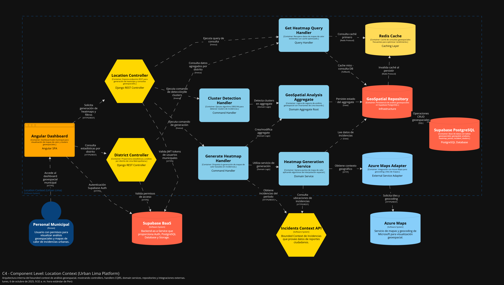

**Elementos Principales:**

- **Interface Layer:** LocationController, DistrictController
- **Application Layer:** GenerateHeatmapHandler, GetHeatmapQueryHandler, ClusterDetectionHandler (CQRS)
- **Domain Layer:** GeoSpatialAnalysis (Aggregate), HeatmapGenerationService, ClusterDetectionService
- **Infrastructure Layer:** GeoSpatialRepository, AzureMapsAdapter, RedisCache
- **External Systems:** Supabase PostgreSQL, Azure Maps, Incidents Context API

### 5.3.6. Bounded Context Software Architecture Code Level Diagrams

#### 5.3.6.1. Bounded Context Domain Layer Class Diagrams

El diagrama de clases representa la arquitectura completa del Location Context organizada según **Clean Architecture** con 4 capas claramente diferenciadas. Cada capa está agrupada en su namespace correspondiente mostrando la separación de responsabilidades.

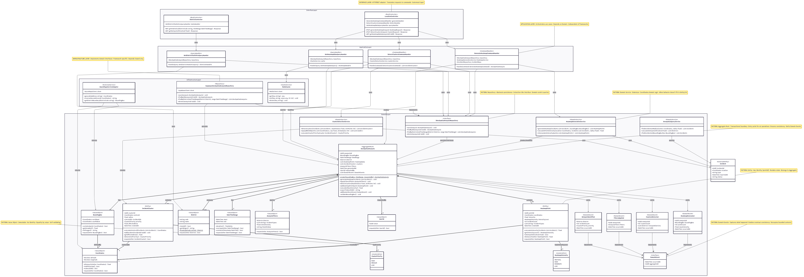

**Organización por Capas:**

1. **Domain Layer Namespace:**

   - Aggregates: `GeoSpatialAnalysis`
   - Entities: `HeatmapPoint`, `IncidentCluster`
   - Value Objects: `Coordinates`, `BoundingBox`, `District`, `DateTimeRange`, `AnalysisFilters`, `UserId`
   - Enums: `ClusterPriority`, `HeatmapIntensity`
   - Domain Services: `HeatmapGenerationService`, `ClusterDetectionService`, `GeospatialQueryService`
   - Domain Events: `HeatmapGenerated`, `ClustersDetected`, `FiltersApplied`, `HotspotIdentified`
   - Repository Interface: `IGeoSpatialAnalysisRepository`

2. **Application Layer Namespace:**

   - Command Handlers: `GenerateHeatmapCommandHandler`, `DetectClustersCommandHandler`
   - Query Handlers: `GetHeatmapDataQueryHandler`, `GetDistrictStatisticsQueryHandler`

3. **Infrastructure Layer Namespace:**

   - Repository Implementations: `SupabaseGeoSpatialAnalysisRepository`
   - External Services: `AzureMapsServiceAdapter`, `RedisCache`

4. **Interface Layer Namespace:**
   - Controllers: `LocationController`, `DistrictController`

**Dependency Flow (Regla de Dependencia de Clean Architecture):**

```
Interface Layer Controllers
    ↓ (usa)
Application Layer Handlers
    ↓ (usa)
Domain Layer (Aggregates, Services, Repository Interfaces)
    ↑ (implementa)
Infrastructure Layer (Repository Implementations, External Services)
```

Todas las flechas de dependencia apuntan **hacia el Domain Layer** (centro), respetando la regla fundamental de Clean Architecture.

**Patrones de Diseño Aplicados:**

- **Aggregate Pattern:** GeoSpatialAnalysis como transactional boundary
- **Entity Pattern:** HeatmapPoint, IncidentCluster con identidad única
- **Value Object Pattern:** Coordinates, BoundingBox, District (inmutables, equality by value)
- **Domain Service Pattern:** HeatmapGenerationService, ClusterDetectionService (lógica sin hogar natural)
- **Repository Pattern:** IGeoSpatialAnalysisRepository (abstracción de persistencia)
- **Domain Events Pattern:** HeatmapGenerated, ClustersDetected (comunicación entre contextos)
- **CQRS Pattern:** Separación de Command Handlers (escritura) y Query Handlers (lectura)
- **Dependency Inversion:** Infrastructure implementa interfaces definidas en Domain

**Invariantes Clave:**

- Coordinates deben estar dentro de Lima bounds (-12.25° a -11.80° lat, -77.15° a -76.70° lng)
- BoundingBox.northEast debe estar al noreste de southWest
- DateTimeRange no puede exceder 365 días de duración
- HeatmapPoint.intensity debe estar entre 0.0 y 1.0
- IncidentCluster debe contener al menos 2 incidencias

#### 5.3.6.2. Bounded Context Database Design Diagram

El diagrama de diseño de base de datos muestra la estructura de persistencia del Location Context en Supabase PostgreSQL, siguiendo un modelo normalizado (1NF, 2NF, 3NF) con tipos estándar de PostgreSQL.

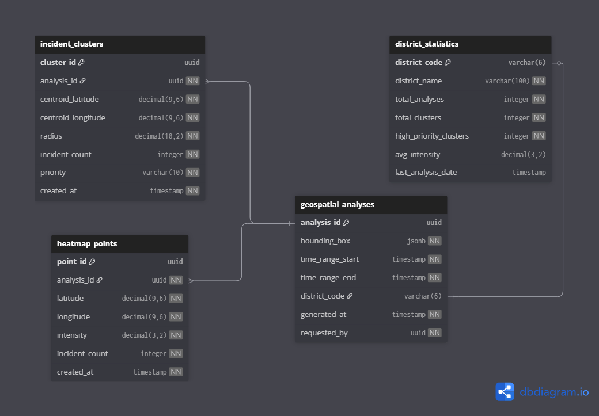

**Modelo de Datos:**

El modelo está compuesto por 4 tablas que cumplen las tres formas normales:

##### 1. geospatial_analyses (Tabla Principal)

Almacena los metadatos de cada análisis geoespacial generado por el personal municipal.

| Campo            | Tipo       | Constraint  | Descripción                           |
| ---------------- | ---------- | ----------- | ------------------------------------- |
| analysis_id      | uuid       | PRIMARY KEY | Identificador único del análisis      |
| bounding_box     | jsonb      | NOT NULL    | Área geográfica analizada {ne, sw}    |
| time_range_start | timestamp  | NOT NULL    | Inicio del período de análisis        |
| time_range_end   | timestamp  | NOT NULL    | Fin del período de análisis           |
| district_code    | varchar(6) | NULL        | Código UBIGEO del distrito (opcional) |
| generated_at     | timestamp  | NOT NULL    | Fecha de generación del análisis      |
| requested_by     | uuid       | NOT NULL    | ID del usuario municipal que solicitó |

##### 2. heatmap_points

Contiene los puntos individuales del mapa de calor con sus intensidades calculadas.

| Campo          | Tipo         | Constraint  | Descripción                          |
| -------------- | ------------ | ----------- | ------------------------------------ |
| point_id       | uuid         | PRIMARY KEY | Identificador único del punto        |
| analysis_id    | uuid         | FOREIGN KEY | Referencia a geospatial_analyses     |
| latitude       | decimal(9,6) | NOT NULL    | Latitud del punto (-12.25 a -11.80)  |
| longitude      | decimal(9,6) | NOT NULL    | Longitud del punto (-77.15 a -76.70) |
| intensity      | decimal(3,2) | NOT NULL    | Intensidad normalizada (0.00 a 1.00) |
| incident_count | integer      | NOT NULL    | Número de incidencias en este punto  |
| created_at     | timestamp    | NOT NULL    | Fecha de creación del punto          |

**Relación:** `heatmap_points.analysis_id → geospatial_analyses.analysis_id` (1:N, CASCADE)

##### 3. incident_clusters

Almacena los clusters de incidencias detectados mediante algoritmo DBSCAN.

| Campo              | Tipo          | Constraint  | Descripción                           |
| ------------------ | ------------- | ----------- | ------------------------------------- |
| cluster_id         | uuid          | PRIMARY KEY | Identificador único del cluster       |
| analysis_id        | uuid          | FOREIGN KEY | Referencia a geospatial_analyses      |
| centroid_latitude  | decimal(9,6)  | NOT NULL    | Latitud del centroide                 |
| centroid_longitude | decimal(9,6)  | NOT NULL    | Longitud del centroide                |
| radius             | decimal(10,2) | NOT NULL    | Radio del cluster en metros           |
| incident_count     | integer       | NOT NULL    | Cantidad de incidencias en el cluster |
| priority           | varchar(10)   | NOT NULL    | Prioridad: HIGH, MEDIUM, LOW          |
| created_at         | timestamp     | NOT NULL    | Fecha de detección del cluster        |

**Relación:** `incident_clusters.analysis_id → geospatial_analyses.analysis_id` (1:N, CASCADE)

##### 4. district_statistics (Materialized View)

Vista materializada con estadísticas pre-calculadas por distrito para optimizar consultas agregadas.

| Campo                  | Tipo         | Constraint  | Descripción                                |
| ---------------------- | ------------ | ----------- | ------------------------------------------ |
| district_code          | varchar(6)   | PRIMARY KEY | Código UBIGEO del distrito                 |
| district_name          | varchar(100) | NOT NULL    | Nombre oficial del distrito                |
| total_analyses         | integer      | NOT NULL    | Total de análisis generados en el distrito |
| total_clusters         | integer      | NOT NULL    | Total de clusters detectados               |
| high_priority_clusters | integer      | NOT NULL    | Clusters de prioridad alta                 |
| avg_intensity          | decimal(3,2) | NULL        | Intensidad promedio del heatmap            |
| last_analysis_date     | timestamp    | NULL        | Fecha del último análisis generado         |

**Relación Conceptual:** `district_statistics.district_code ↔ geospatial_analyses.district_code` (Agregación M:N)

# Capítulo VI: Solution UX Design

## 6.1. Style Guidelines.

### 6.1.1. General Style Guidelines.

En el General Style Guideline se reuniren los lineamientos visuales y de diseño que debe seguir un proyecto para mantener coherencia en su identidad. Su propósito principal es asegurar que todos los elementos gráficos, como logotipo, tipografía, paleta de colores, cuerpo de texto y botones, se utilicen de manera consistente, lo que refuerza la imagen del proyecto y facilita la experiencia del usuario. Además, de funcionar como una guía de referencia tanto para diseñadores como para desarrolladores, evitando inconsistencias y permitiendo que el producto evolucione sin perder unidad visual ni funcional.

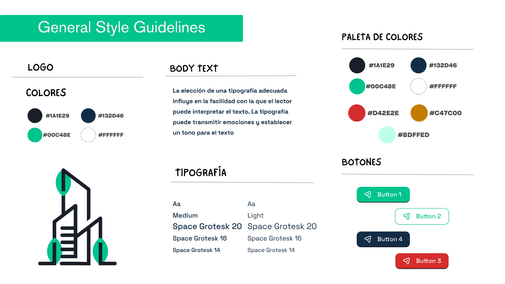
<br>

Se muestra el logo que refuerza el reconocimiento de marca y se utiliza en todas las interfaces principales. El _body text_ emplea una tipografía clara y legible, por ello se eligió Space Grotesk. La paleta de colores está cuidadosamente seleccionada para transmitir la personalidad del proyecto, aplicando tonos principales y secundarios de manera uniforme en fondos, textos y elementos destacados. Los botones se diseñan con estilos coherentes, respetando la paleta definida y manteniendo estados diferenciados que garantizan una experiencia de interacción uniforme.

### 6.1.2. Web, Mobile & Devices Style Guidelines.

**Mobile Style Guideline**

Esta guía establece los principios de diseño y usabilidad para aplicaciones móviles, con el objetivo de mantener consistencia visual y funcional en todas las pantallas. Su finalidad es optimizar la experiencia del usuario en dispositivos móviles, considerando aspectos clave como legibilidad en pantallas reducidas, uso eficiente del espacio, interacción táctil y navegación intuitiva. Este documento sirve como referencia para diseñadores y desarrolladores, garantizando que la aplicación móvil se construya bajo estándares unificados que refuercen la identidad del proyecto, aseguren accesibilidad y ofrezcan una experiencia fluida y coherente en diferentes tamaños de pantalla y sistemas operativos.

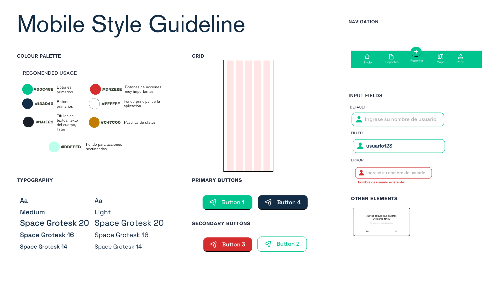

En los estilos presentados, se establece la paleta de colores con los colores principales de la aplicación además de la tipografía, el GRID que se usará para la aplicaicón móvil y la barra de navegación, entre otros componentes.

**Web Style Guideline**

En esta sección se defininen los estándares de diseño y presentación para aplicaciones y sitios web, con el objetivo de mantener coherencia visual, funcional y de marca en todas las páginas. Su propósito es guiar a diseñadores y desarrolladores en la implementación de elementos como tipografía, paleta de colores, botones, logotipo y layouts, asegurando que la experiencia del usuario sea uniforme, intuitiva y accesible en distintos navegadores y tamaños de pantalla. Además, esta guía facilita la creación de interfaces consistentes, mejora la usabilidad, refuerza la identidad visual del proyecto y permite que los equipos trabajen de manera alineada y eficiente.

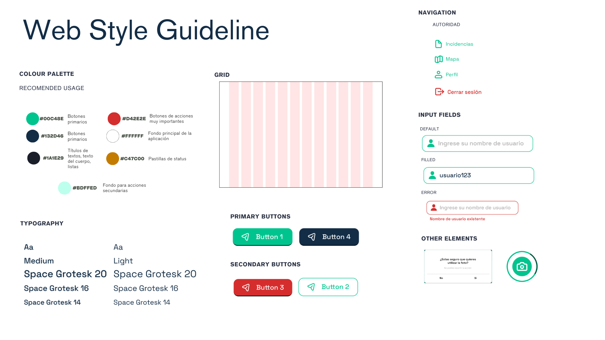

En los estilos presentados, se establece la paleta de colores con los colores principales de la aplicación además de la tipografía, el GRID que se usará para la aplicaicón web y la barra de navegación, entre otros componentes.

## 6.2. Information Architecture.

### 6.2.2. Labeling Systems.

<br>Este sistema de etiquetado se integró en nuestro tablero de gestión de tareas (Trello/Jira) y permite identificar rápidamente el tipo de trabajo pendiente ([FEAT], [FIX]), su prioridad ([P1], [P2]) y el módulo involucrado ([UI], [DB]). Por ejemplo, la tarea [FEAT][P1][UI][TODO] Crear pantalla de inicio indica que es una nueva funcionalidad prioritaria de interfaz aún pendiente de desarrollo.<br>

| **Etiqueta**            | **Descripción**           |
| ----------------------- | ------------------------- |
| **Tipo de tarea**       |                           |
| [FEAT]                  | Nueva característica      |
| [FIX]                   | Corrección de errores     |
| [REFACTOR]              | Refactorización de código |
| [DOCS]                  | Documentación             |
| [TEST]                  | Pruebas                   |
| **Prioridad**           |                           |
| [P1]                    | Alta prioridad            |
| [P2]                    | Prioridad media           |
| [P3]                    | Baja prioridad            |
| **Módulo o componente** |                           |
| [UI]                    | Interfaz de usuario       |
| [API]                   | Lógica de la API          |
| [DB]                    | Base de datos             |
| [AUTH]                  | Autenticación             |
| [PERF]                  | Rendimiento               |
| **Estado**              |                           |
| [TODO]                  | Por hacer                 |
| [WIP]                   | En progreso               |
| [REVIEW]                | En revisión               |
| [DONE]                  | Completado                |

### 6.2.3. Searching Systems.

El sistema de búsqueda propuesto para LimaUrban permitirá a los usuarios personalizar su experiencia de aventurera de acuerdo a sus preferencias. Este sistema facilitará el uso de la aplicación filtrandolo por zona, tipo, prioridad, fecha. Los filtros disponibles serán:

| Nombre del filtro | Descripción                                                  |
| ----------------- | ------------------------------------------------------------ |
| Zonas             | Permitirá ver los incidentes por zonas registradas.          |
| Tipo              | Permitirá organizar por tipo de incidente                    |
| Prioridad         | Permitirá filtrar por prioridad de incidentes.               |
| Fecha             | Permitirá filtrar por fecha en la que se cargó el incidente. |

### 6.2.4. SEO Tags and Meta Tags.

La implementación de estas etiquetas ayudan al posicionamiento de la página en los motores de búsqueda.
Título
Indica el tema de la página, debe ser corto y descriptivo, debe mantenerse entre los 55 y 60 caracteres.

    <title>LimaUrban</title>

**Descripción** <br>
Es una breve descripción de la página.

    <meta name= “description” content= “loremipsum loremipsum”/>

Robots
Indican a los motores de búsqueda de lo que deben hacer con la página.
index/noindex: Indica al motor de búsqueda si debe mostrar la página en el SERP o no.
follow/nofollow: Les dice a los motores qué hacer con los enlaces en ese objetivo.
Tipo de contenido
Es útil para que los motores de búsqueda identifiquen el idioma de la página.

    <meta http-equiv= “tipo de contenido” content= “text/html charset-utf-8” />
    <meta http-equiv= “tipo de contenido” content= “text/html charset-ISO-6059-1” />

Searchbox de enlaces
Se utiliza para controlar el cuadro de búsqueda de enlaces del sitio de Google

    <meta name= “google” content = “nositelinkssearchbox”/>

Viewport Meta Tag
Es crucial para asegurar que el contenido se vea bien en dispositivos móviles.

    <meta name="viewport" content="width=device-width, initial-scale=1.0">

### 6.2.5. Navigation Systems.

En la app móvil para los ciudadanos, se optó por el patrón de navegación tipo bottom bar, facilitando el acceso a secciones críticas con el pulgar. En la web para las autoridades, se emplea una barra lateral fija, siguiendo principios de navegación persistente, para evitar pérdida de contexto. Este diseño prioriza las tareas más frecuentes: explorar, buscar y gestionar cuenta, con énfasis visual en los íconos y retroalimentación activa al seleccionar secciones.

**Ciudadano**
| Nombre | Descripción |
|--------|--------------------------------------------------------------------------------------------------------------------------|
| Inicio | Le muestra un resumen personal de su interacción en la aplicación y su actividad reciente. |
| Incidencias | El ciudadano podrá ver pertes cercanos registrados por otros ciudadanos. |
| Reportar | El ciudadano podrá subir una foto con descripción adjunta para reportar una incidencia. |
| Perfil | Este apartado permite que el usuario gestione su cuenta. |
<br>

**Autoridad**
| Nombre | Descripción |
|--------------|------------------------------------------------------------------------------------------------------|
| Incidencias | Le muestra los incidentes de todos los ciudadanos. |
| Mapa | Mostrará un mapa y un mapa de calor con las incidencias. |
| Perfil | Este apartado permite que el usuario gestione su cuenta. |

## 6.3. Landing Page UI Design.

### 6.3.1. Landing Page Wireframe.

El wireframe es un esquema estructural de baja a media fidelidad que representa la arquitectura de la información y la disposición de elementos en la landing page de LimaUrban. Utiliza una paleta monocromática de grises para enfocarse únicamente en la estructura, jerarquía y distribución espacial.
**Características del Wireframe**

Secciones Documentadas:

- Navbar - Muestra la disposición del logo y menú horizontal
- Hero - Estructura del título principal, subtítulo y botones CTA
- About - Layout a dos columnas con bloques de texto e insignia
- Stats - Grid de 4 elementos con números destacados
- User Types - Dos tarjetas con listas de funcionalidades
- CTA - Sección centrada con título y botón
- Footer - Grid de 4 columnas con diferentes tipos de contenido
- Leyenda - Explicación de los elementos del wireframe

Planificar la estructura antes de invertir en diseño visual
Validar la organización de información con el equipo
Identificar problemas de usabilidad tempranamente
Comunicar la visión del proyecto a todos los stakeholders
Establecer prioridades de desarrollo basadas en la jerarquía visual.

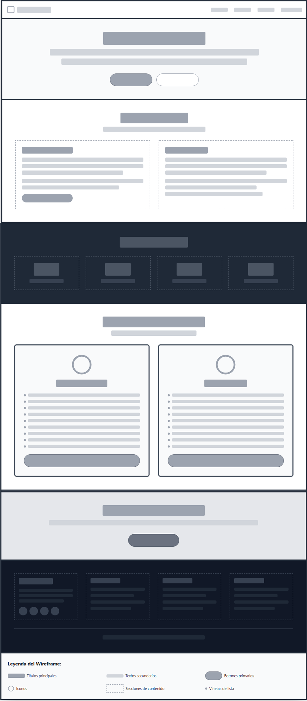

### 6.3.2. Landing Page Mock-up.

**Descripción General**
El mockup de la landing page de LimaUrban es una representación visual completa y funcional del sitio web, diseñada con HTML y CSS puro. Este prototipo de alta fidelidad muestra exactamente cómo se verá y comportará la página una vez implementada en producción.
**Características del Mockup**
Paleta de Colores Aplicada:

- #1A1E29 - Color principal para navbar, footer y elementos de fondo oscuro
- #00C48E - Color de acento para botones, enlaces y elementos destacados
- #132D46 - Utilizado en títulos y gradientes de secciones especiales
- #FFFFFF - Fondo principal para mantener limpieza y legibilidad

**Estructura de Contenido:**

- Navbar fijo - Permanece visible durante el scroll para facilitar la navegación
- Hero Section - Primera impresión con título impactante y llamados a la acción
- Sobre Nosotros - Presenta al equipo UPC con layout a dos columnas
- Estadísticas - Muestra el impacto del proyecto con métricas visuales
- Tipos de Usuarios - Dos tarjetas diferenciadas para Municipalidades y Ciudadanos
- CTA Final - Invitación clara a registrarse en la plataforma
- Footer completo - Información de contacto, enlaces y redes sociales

Este diseño sirve como referencia visual definitiva para desarrolladores, diseñadores y stakeholders. Al ser completamente funcional, permite realizar pruebas de usuario, ajustar detalles visuales y validar la experiencia de usuario antes del desarrollo final.

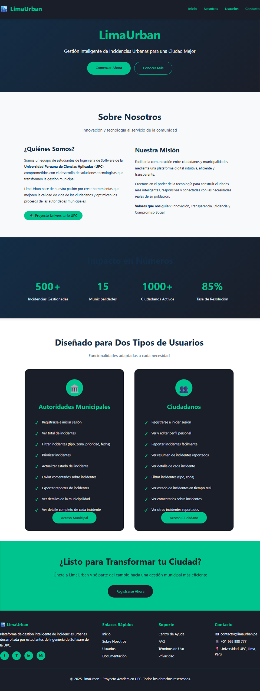

## 6.4. Applications UX/UI Design.

### 6.4.1. Applications Wireframes.

#### **Aplicación web**

**Inicio de sesión de la aplicación:** Esta sección es la primera vista que tendrán las autoridades. <br>
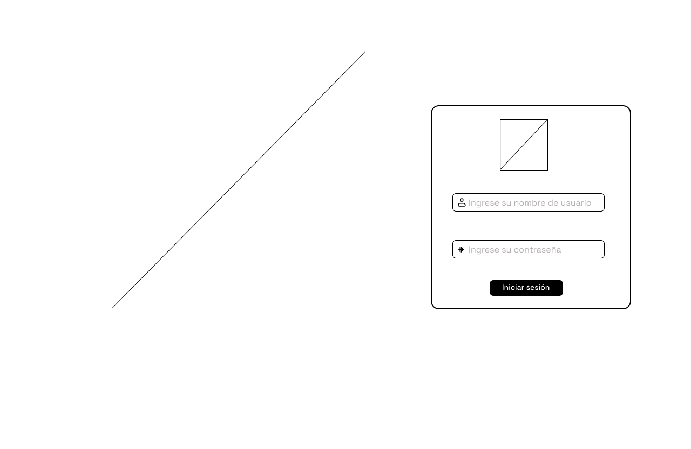

**Incidentes:** En esta sección se visualizan todos los incidentes registrados. <br>
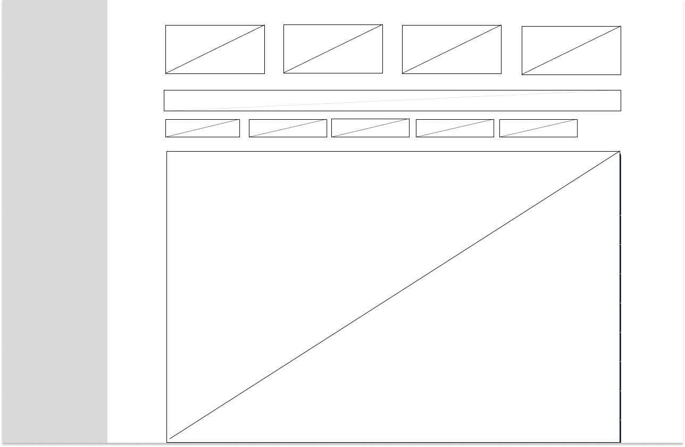

**Filtro de incidentes:** En esta sección se visualiza un ejemplo de uno de los filtros de la tabla general de incidentes.<br>
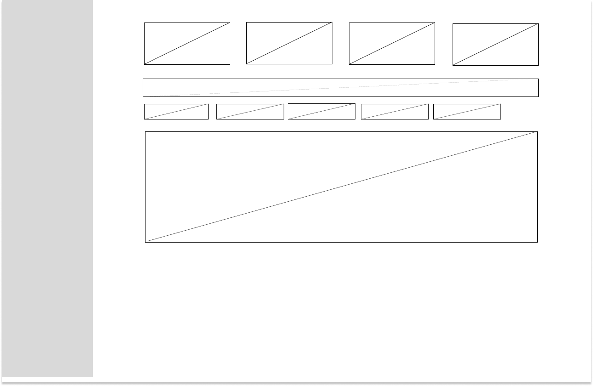

**Detalle de incidentes:** En esta sección se visualiza el detalle del incidente junto con los comentarios dejados por la autoridad y por el ciudadano. <br>
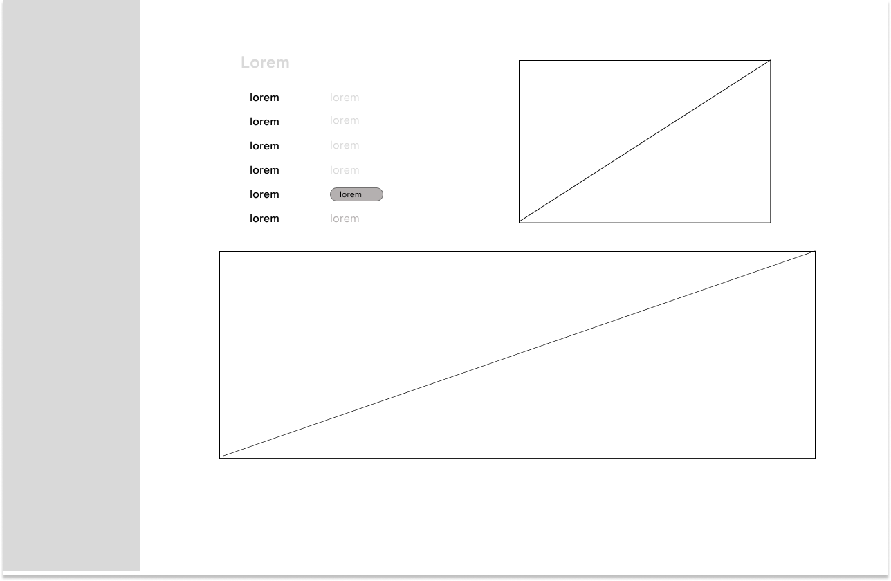

**Mapa de calor:** En la sección de mapas tenemos la vista del mapa de calor.<br>
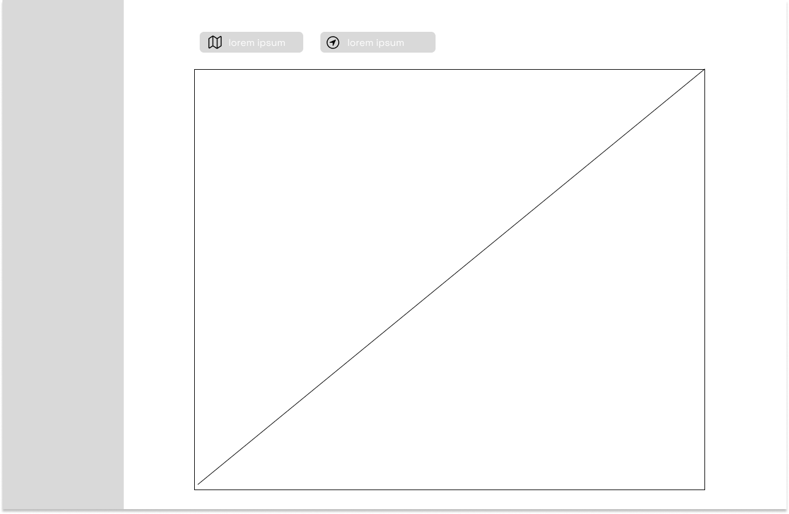

**Mapa de calor:** En la sección de mapas tenemos la vista del mapa geográfico.<br>
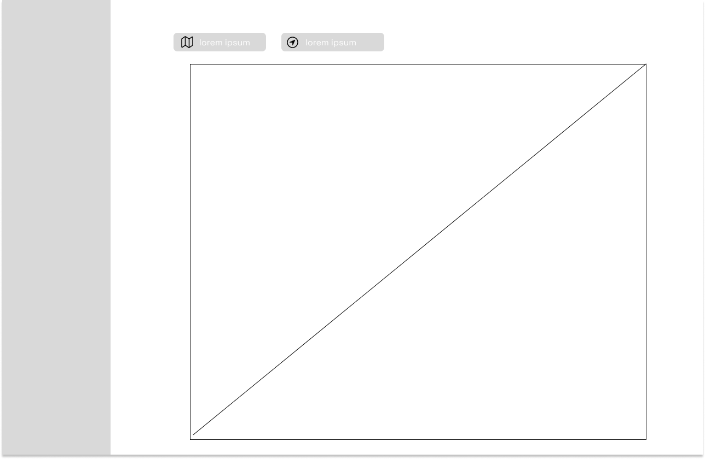

**Perfil municipal** En esta sección las autoridades podrásn ver mas información sobre su cuenta en Lima Urban. <br>
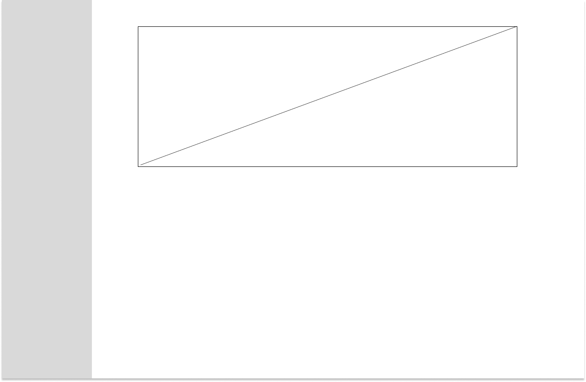

#### **Aplicación móvil**

## 6.4. Applications UX/UI Design

### 6.4.1. Applications Wireframes

#### **Aplicación web**

**Inicio de sesión de la aplicación:** Esta sección es la primera vista que tendrán las autoridades. <br>


**Incidentes:** En esta sección se visualizan todos los incidentes registrados. <br>


**Filtro de incidentes:** En esta sección se visualiza un ejemplo de uno de los filtros de la tabla general de incidentes.<br>


**Detalle de incidentes:** En esta sección se visualiza el detalle del incidente junto con los comentarios dejados por la autoridad y por el ciudadano. <br>


**Mapa de calor:** En la sección de mapas tenemos la vista del mapa de calor.<br>


**Mapa de calor:** En la sección de mapas tenemos la vista del mapa geográfico.<br>


**Perfil municipal** En esta sección las autoridades podrán ver más información sobre su cuenta en Lima Urban. <br>


#### Aplicación móvil

**Pantalla de inicio (Home):** Vista principal donde el ciudadano puede ver un resumen de su actividad y acceder a las funciones principales de la aplicación. <br>


**Captura de incidencia:** Interfaz de la cámara integrada que permite al ciudadano fotografiar la incidencia urbana detectada con guías visuales para una captura óptima. <br>
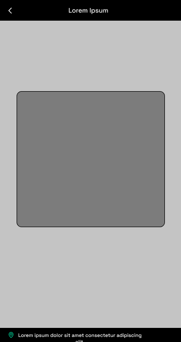

**Confirmación de fotografía:** Diálogo que permite al ciudadano revisar la imagen capturada y decidir si mantenerla o tomar una nueva foto antes de proceder con el reporte. <br>


**Procesamiento con IA:** Pantalla de carga que informa al usuario que el sistema está analizando la imagen mediante YOLO para clasificar automáticamente el tipo de incidencia. <br>


**Formulario de reporte:** Pantalla donde el ciudadano completa los detalles del reporte, incluyendo descripción, categoría sugerida por IA y ubicación automática detectada. <br>
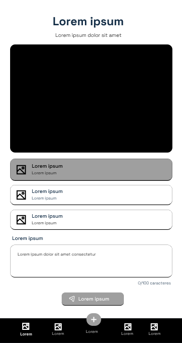

**Confirmación de reporte enviado:** Diálogo de confirmación que notifica al ciudadano que su reporte ha sido enviado exitosamente y proporciona un número de seguimiento. <br>


**Historial de reportes:** Lista completa de todas las incidencias reportadas por el ciudadano, mostrando estado actual, fecha y tipo de cada reporte para seguimiento personal. <br>
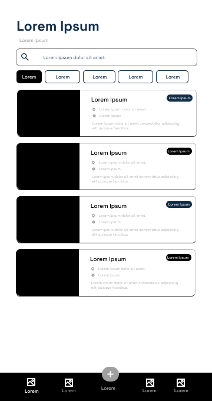

### 6.4.2. Applications Wireflow Diagrams.

Link: https://drive.google.com/file/d/1onclZ0R5X7AoF9n7aTHXxC5Y0Wz2iaH_/view?usp=sharing

#### **Aplicación web**

**User Goal: Como personal municipal, quiero iniciar sesión para acceder al panel de gestión de incidencias.** Este objetivo abarca la experiencia del usuario al explorar la página principal de la plataforma.<br>
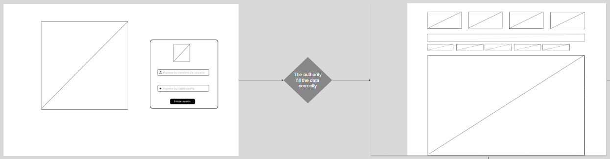

**User Goal: Como personal municipal, quiero ver el número total de incidencias registradas para monitorear el volumen general.** Este objetivo refleja la necesidad del usuario de ver un dashboard para la gestión de los incidentes. <br>
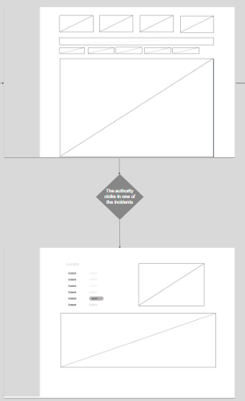

**User Goal: Como personal municipal, quiero enviar comentarios en las incidencias para comunicar acciones tomadas.** Este objetivo refleja la necesidad del usuario de ver los detalles del incidente y mantener informado al ciudadano sobre los avances.<br>
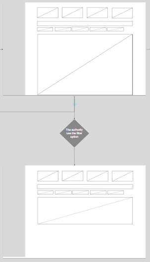

**User Goal: Como personal municipal, quiero visualizar incidencias en mapas de calor interactivos para priorizar intervenciones basadas en concentración espacial.** Este objetivo refleja la necesidad del usuario de ver un dashboard para la gestión de los incidentes.<br>
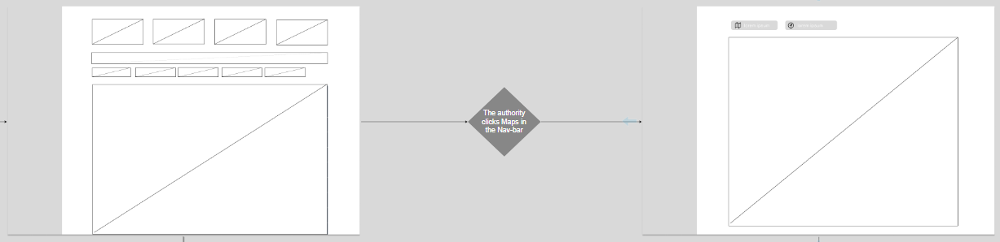

**User Goal: Como personal municipal, quiero ver los detalles de la municipalidad para acceder a información institucional centralizada.** Este objetivo refleja la necesidad del usuario de ver más información sobre su cuenta en LimaUrban. <br>
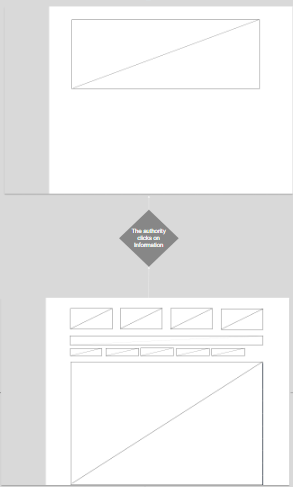

#### **Aplicación móvil**

**User Goal: Como ciudadano, quiero registrarme en la aplicación para poder reportar incidencias urbanas.** Este flujo describe el proceso de creación de una nueva cuenta, desde la pantalla de inicio hasta la confirmación del registro, permitiendo al usuario acceder a la plataforma. <br>
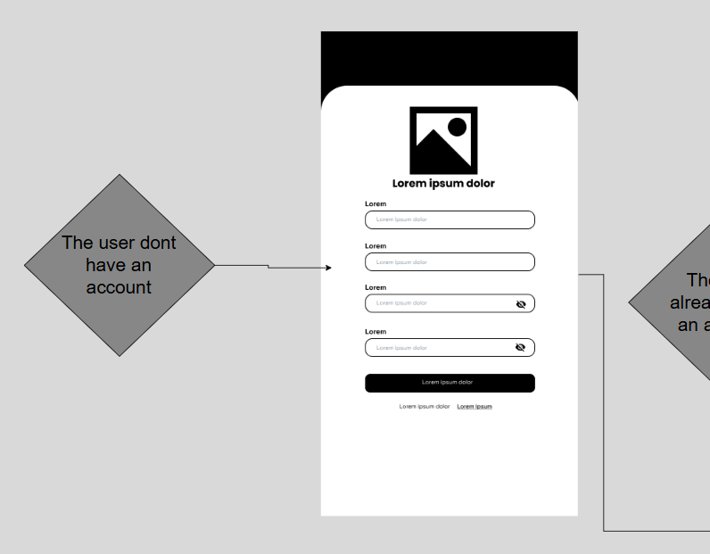

**User Goal: Como ciudadano, quiero iniciar sesión para acceder a mis reportes y funciones principales.** Este flujo muestra el proceso de autenticación de un usuario ya registrado, desde el ingreso de credenciales hasta el acceso al dashboard principal de la aplicación. <br>
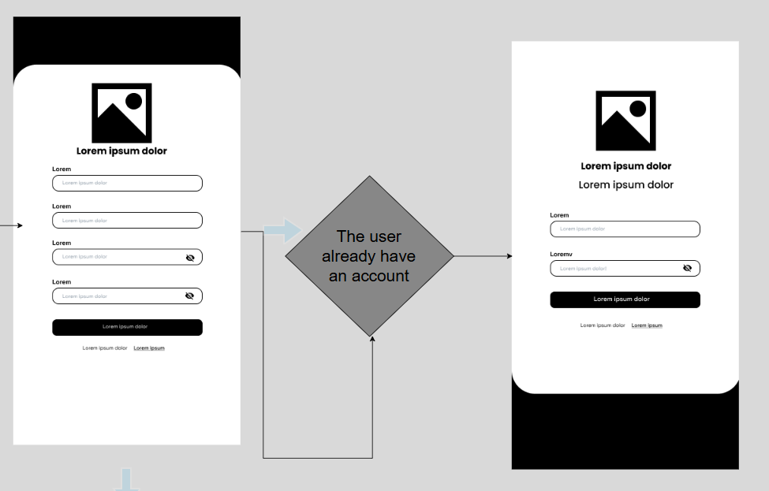

**User Goal: Como ciudadano, quiero reportar una incidencia urbana con una fotografía para documentar el problema de forma clara y eficiente.** Este es el flujo principal de la aplicación. Abarca desde la captura de la fotografía, la confirmación, el análisis por IA, el llenado de detalles adicionales y la confirmación final del envío del reporte. <br>
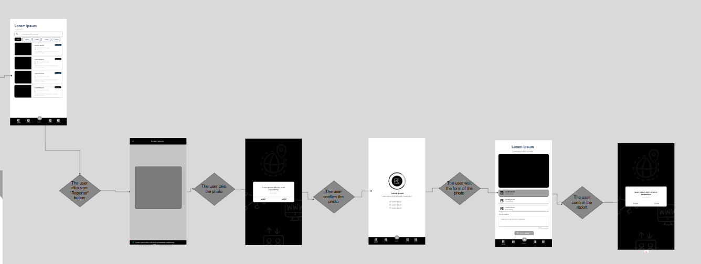

**User Goal: Como ciudadano, quiero consultar el historial de mis reportes para dar seguimiento al estado de cada incidencia.** Este flujo permite al usuario navegar desde la pantalla principal hasta la lista de sus reportes históricos, donde puede ver el estado y los detalles de cada uno. <br>
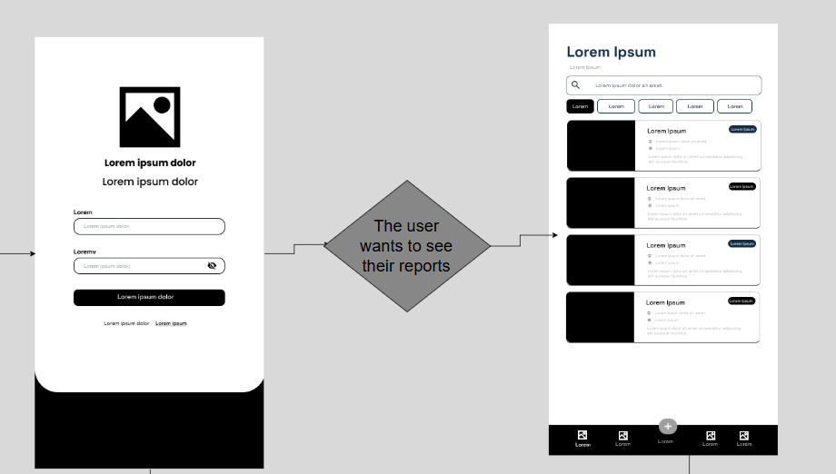

### 6.4.2. Applications Mock-ups.

#### **Aplicación web**

**Inicio de sesión de la aplicación:** Esta sección es la primera vista que tendrán las autoridades. <br>
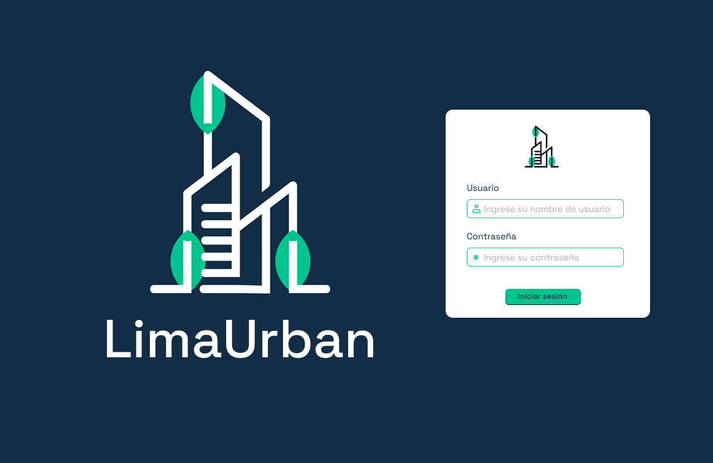

**Incidentes:** En esta sección se visualizan todos los incidentes registrados. <br>
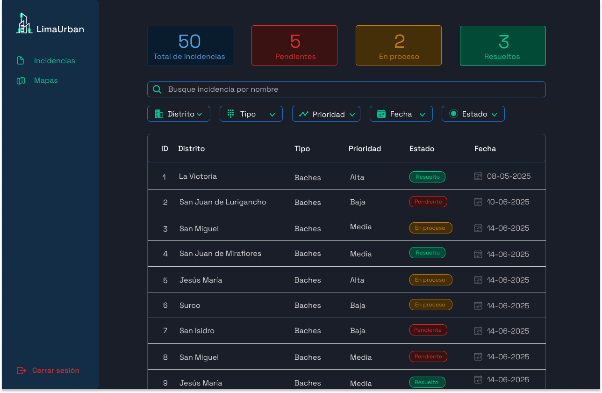

**Filtro de incidentes:** En esta sección se visualiza un ejemplo de uno de los filtros de la tabla general de incidentes.<br>
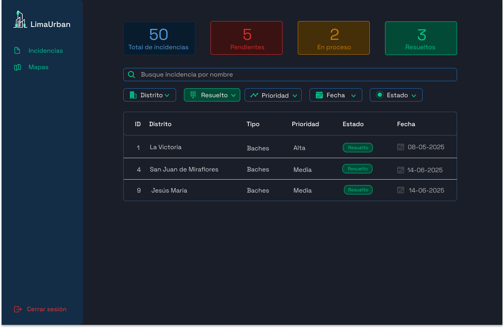

**Detalle de incidentes:** En esta sección se visualiza el detalle del incidente junto con los comentarios dejados por la autoridad y por el ciudadano. <br>
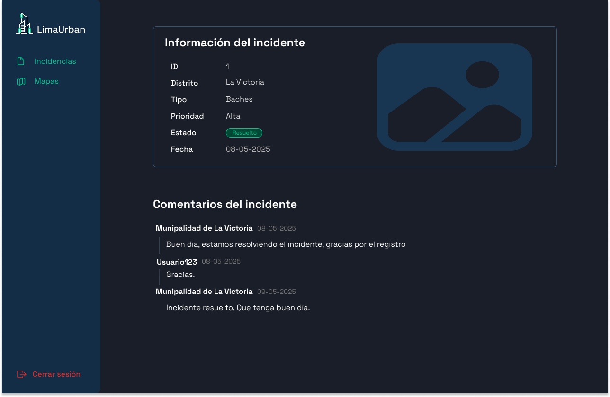

**Mapa de calor:** En la sección de mapas tenemos la vista del mapa de calor.<br>
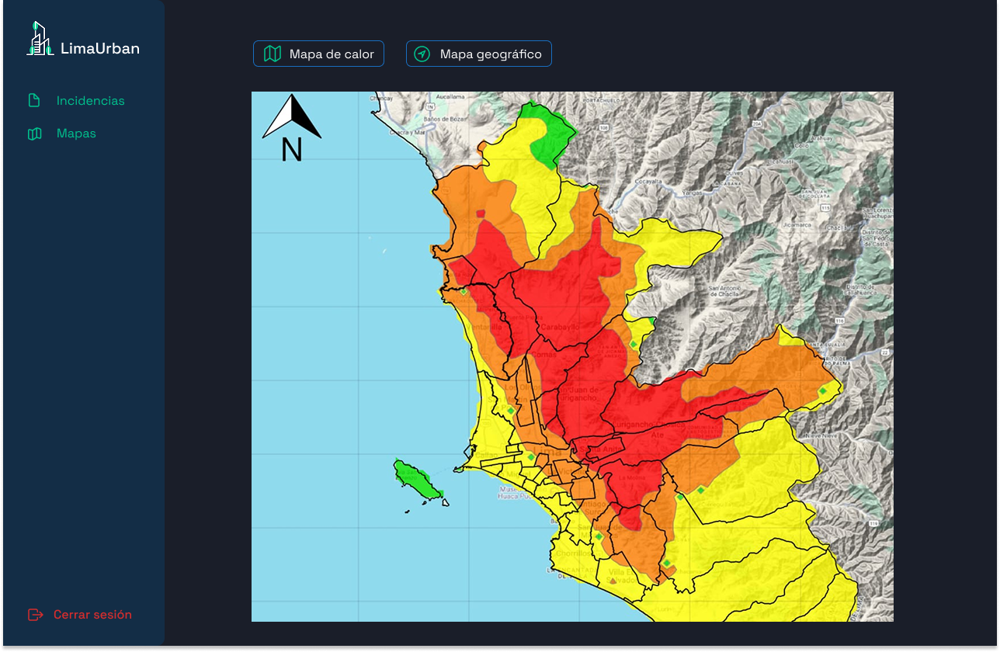

**Mapa de calor:** En la sección de mapas tenemos la vista del mapa geográfico.<br>
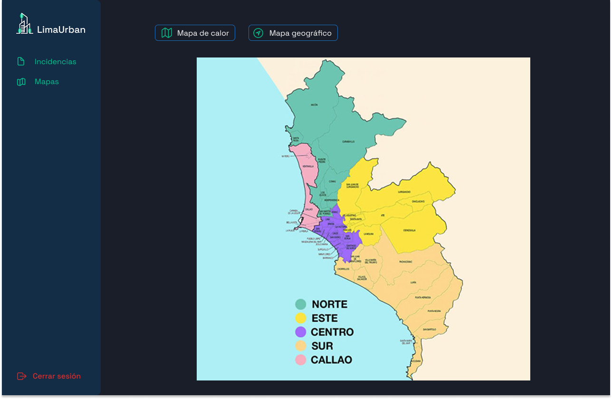

**Perfil municipal** En esta sección las autoridades podrásn ver mas información sobre su cuenta en Lima Urban. <br>


#### **Aplicación móvil**

**Pantalla de registro:** Mockup de alta fidelidad del proceso de creación de cuenta para nuevos ciudadanos con formulario de registro optimizado para dispositivos móviles. Incluye campos de entrada estilizados para email, contraseña y datos personales básicos, validaciones en tiempo real, políticas de privacidad integradas y diseño centrado en la facilidad de uso con tipografía Space Grotesk y paleta corporativa consistente. <br>
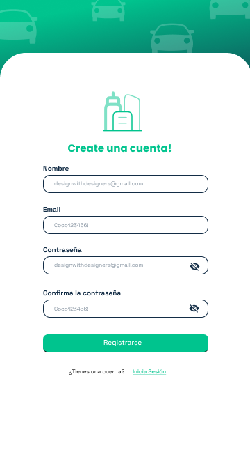

**Pantalla de inicio de sesión:** Diseño completo de la interfaz de autenticación con campos de entrada para email y contraseña, opciones de recuperación de cuenta, checkbox para recordar sesión y botones de acción principales claramente diferenciados. Incorpora elementos de seguridad visual, mensajes de error contextuales y acceso rápido al proceso de registro para usuarios nuevos, manteniendo coherencia con la identidad visual establecida. <br>


**Perfil de usuario:** Mockup completo de la pantalla de perfil personal que permite al ciudadano gestionar su información de cuenta, visualizar estadísticas de reportes realizados y configurar preferencias de notificación. Incluye sección de datos personales editables, resumen de actividad reciente, progreso de reportes históricos, configuraciones de privacidad y opción de cierre de sesión, todo diseñado con elementos visuales consistentes y navegación intuitiva. <br>
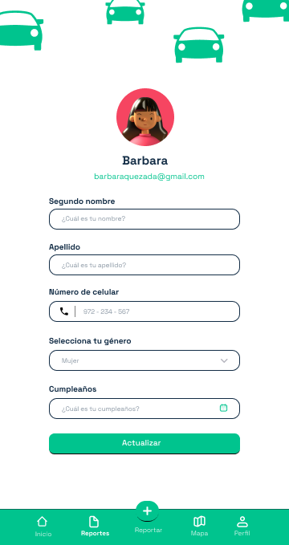

**Pantalla principal (Home):** Mockup de alta fidelidad que muestra el diseño final de la pantalla de inicio con colores corporativos, tipografía Space Grotesk y elementos interactivos. Incluye cards de resumen de actividad del usuario, accesos rápidos a funciones principales y feed de actualizaciones de la comunidad. <br>
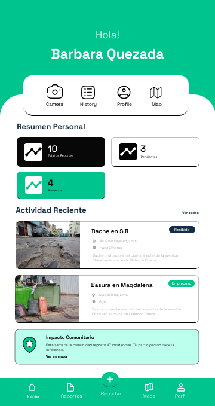

**Interfaz de cámara:** Diseño completo de la interfaz de captura fotográfica con overlay visual que guía al usuario para obtener imágenes óptimas de incidencias urbanas. Incorpora elementos de UI nativos, botones de acción claramente identificables y indicadores de estado GPS activo para geolocalización automática. <br>
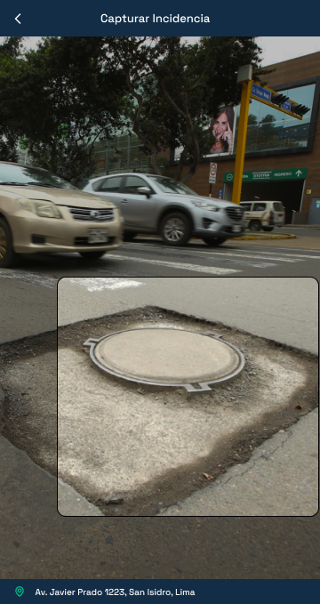

**Modal de confirmación fotográfica:** Mockup del diálogo modal con diseño visual finalizado que presenta la imagen capturada en preview completo, botones de acción con estilo corporativo (confirmar/rehacer) y opciones de edición básica antes de proceder con el reporte de la incidencia. <br>


**Pantalla de procesamiento IA:** Diseño final de la pantalla de carga con animaciones y elementos visuales que comunican el análisis inteligente de la imagen mediante algoritmos YOLO. Incluye indicadores de progreso, mensajes informativos sobre el proceso de clasificación automática y branding coherente con la identidad visual. <br>


**Formulario completo de reporte:** Mockup de alta fidelidad del formulario de creación de reporte con todos los campos de entrada estilizados, categoría pre-sugerida por IA, mapa interactivo de confirmación de ubicación y botones de envío con estados visuales diferenciados según la completitud de datos. <br>
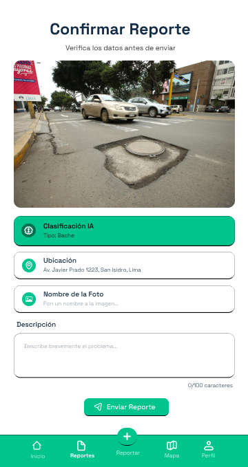

**Modal de confirmación de envío:** Diseño final del diálogo de éxito que confirma la recepción del reporte con elementos visuales de retroalimentación positiva, código de seguimiento generado automáticamente, tiempo estimado de respuesta y opciones para compartir o crear nuevo reporte. <br>


**Listado de reportes históricos:** Mockup completo de la pantalla de historial con diseño de cards optimizado para navegación móvil, estados visuales diferenciados por color, filtros de búsqueda integrados, indicadores de progreso y acceso directo a detalles de cada incidencia reportada por el usuario. <br>
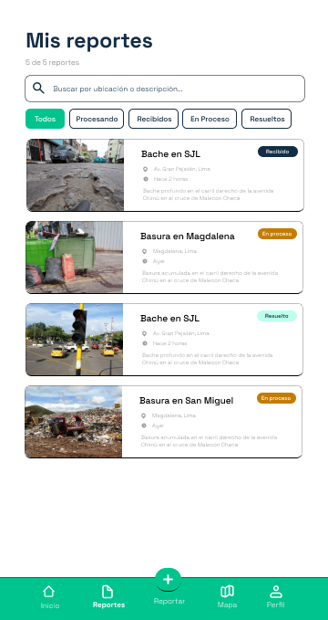

### 6.4.3. Applications User Flow Diagrams.

Link del User Flow: https://drive.google.com/file/d/1onclZ0R5X7AoF9n7aTHXxC5Y0Wz2iaH_/view?usp=sharing

#### **Aplicación web**

**User Goal: Como personal municipal, quiero iniciar sesión para acceder al panel de gestión de incidencias.** Este objetivo abarca la experiencia del usuario al explorar la página principal de la plataforma.
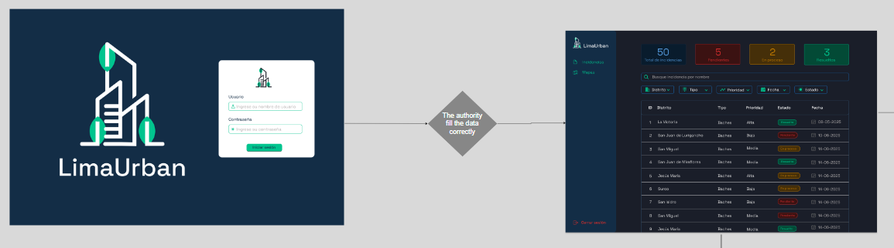

**User Goal: Como personal municipal, quiero ver el número total de incidencias registradas para monitorear el volumen general.** Este objetivo refleja la necesidad del usuario de ver un dashboard para la gestión de los incidentes.

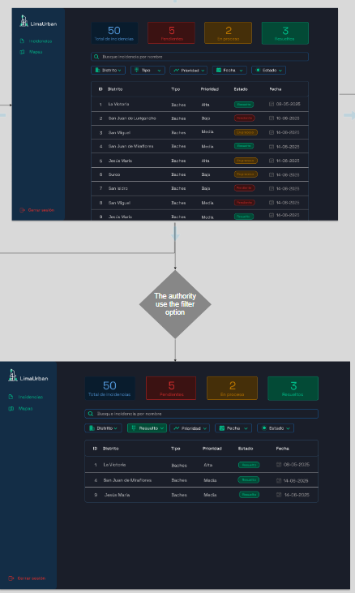

**User Goal: Como personal municipal, quiero enviar comentarios en las incidencias para comunicar acciones tomadas.** Este objetivo refleja la necesidad del usuario de ver los detalles del incidente y mantener informado al ciudadano sobre los avances.
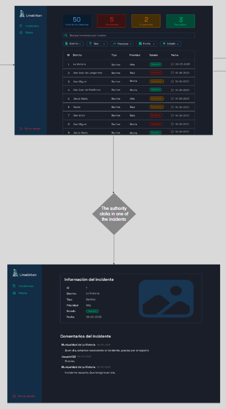

**User Goal: Como personal municipal, quiero visualizar incidencias en mapas de calor interactivos para priorizar intervenciones basadas en concentración espacial.** Este objetivo refleja la necesidad del usuario de ver un dashboard para la gestión de los incidentes.
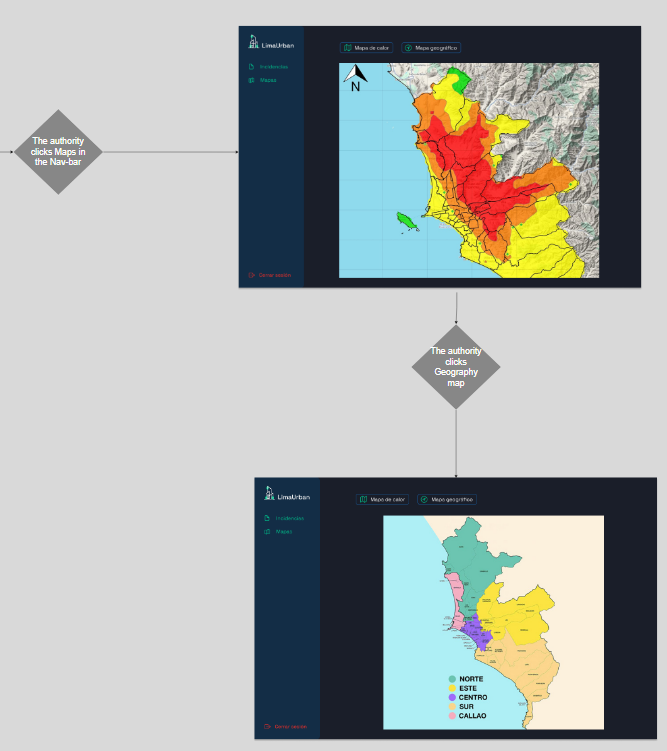

**User Goal: Como personal municipal, quiero ver los detalles de la municipalidad para acceder a información institucional centralizada.** Este objetivo refleja la necesidad del usuario de ver más información sobre su cuenta en LimaUrban.
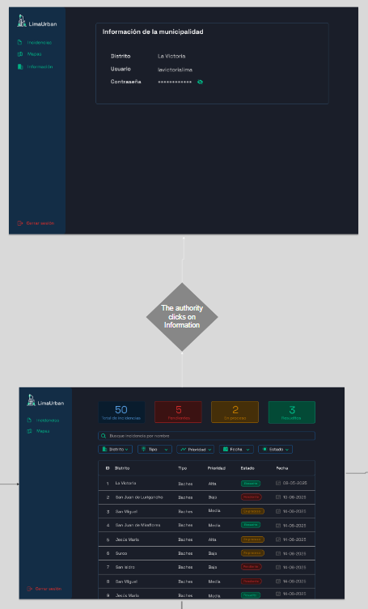

#### **Aplicación móvil**

**User Goal: Como ciudadano, quiero registrarme en la aplicación para poder reportar incidencias urbanas.** Este objetivo abarca el proceso completo de creación de cuenta desde cero, incluyendo la validación de datos y confirmación de registro.
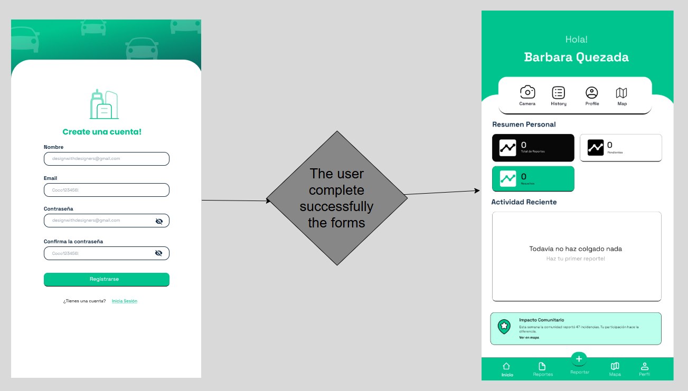

**User Goal: Como ciudadano, quiero iniciar sesión para acceder a mis reportes y funciones principales.** Este objetivo refleja el flujo de autenticación del usuario y acceso a la aplicación tras completar el registro.
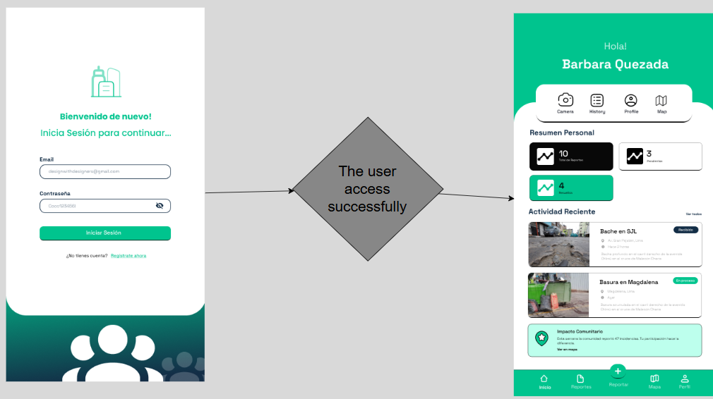

**User Goal: Como ciudadano, quiero reportar una incidencia urbana con fotografía para documentar problemas en mi ciudad.** Este objetivo comprende el flujo completo desde la captura de foto hasta la confirmación del reporte enviado, incluyendo el procesamiento con IA.
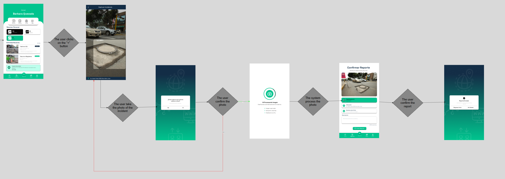

**User Goal: Como ciudadano, quiero ver el historial de mis reportes para dar seguimiento a las incidencias que he registrado.** Este objetivo permite al usuario consultar todos sus reportes previos y verificar el estado de cada uno.
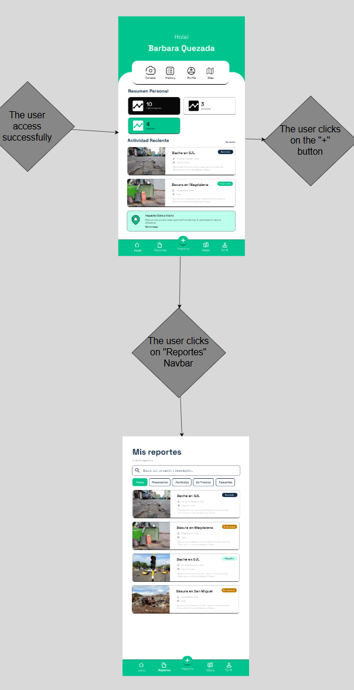
**User Goal: Como ciudadano, quiero ver la pantalla principal para acceder rápidamente a las funciones más importantes de la app.** Este objetivo refleja la experiencia del usuario al navegar por el dashboard personal con resumen de actividad.
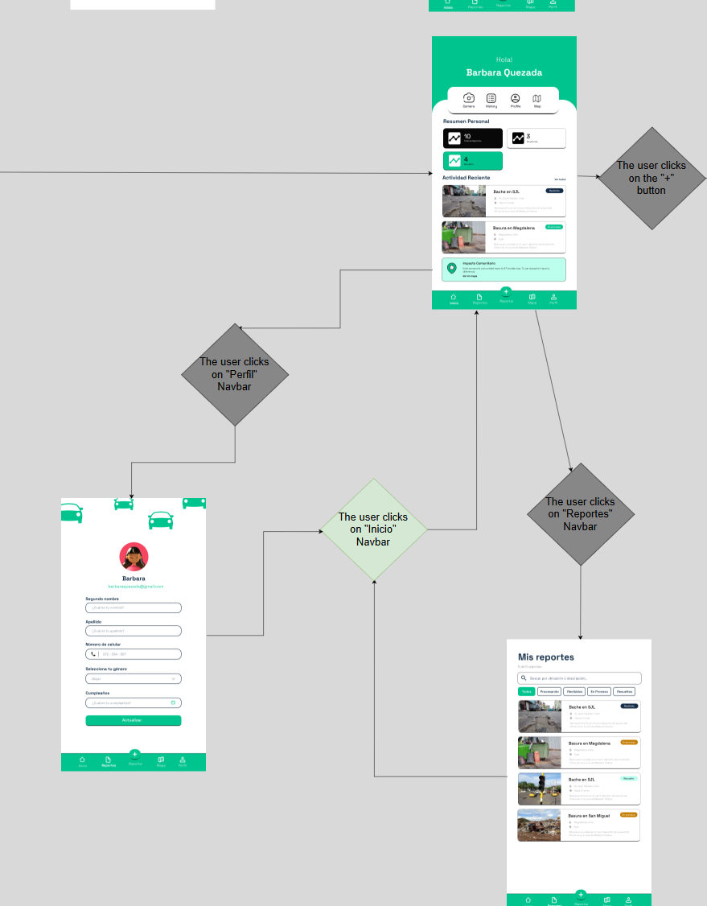

**User Goal: Como ciudadano, quiero gestionar mi perfil personal para mantener actualizados mis datos y configuraciones.** Este objetivo abarca la visualización y edición de información personal, estadísticas y preferencias de la cuenta.
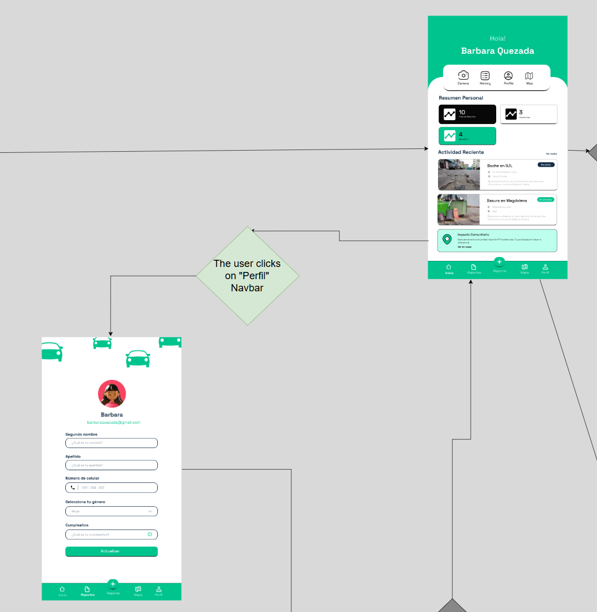

## 6.5. Applications Prototyping.

**Aplicación web**

- **Ver Total de Incidentes:** Consulta en tiempo real el número total de incidencias reportadas por los ciudadanos. Panel con métricas actualizadas que incluyen incidentes pendientes, en proceso y resueltos.
- **Ver Detalles de Incidente:** Accede a la información completa de cada reporte: descripción detallada, ubicación exacta, fotografías adjuntas, historial de actualizaciones, comentarios y seguimiento completo del caso.
- **Ver Detalles de la Municipalidad:** Consulta información institucional, zonas de cobertura, estadísticas generales del municipio y datos de contacto de los diferentes departamentos.
- **Filtrar Incidentes:** Sistema avanzado de filtros múltiples que permite organizar y visualizar incidentes según diferentes criterios:
  - Por Tipo: Alumbrado público, baches, limpieza, infraestructura, seguridad y otros
  - Por Distrito: San miguel, La Victoria, etc.
  - Por Prioridad: Alta, Media o Baja
  - Por Fecha: Selección de rango de fechas o fecha específica de reporte
- **Priorizar Incidentes:** Asigna o modifica el nivel de prioridad de cada incidente (Alta, Media, Baja) según la urgencia y el impacto en la comunidad. Sistema visual con código de colores para identificación rápida.
- **Actualizar Estado del Incidente:** Cambia el estado de las incidencias a medida que avanzan en el proceso de resolución:
  - Pendiente: Recién reportado, en espera de atención
  - En Proceso: Equipo asignado trabajando en la solución
  - Resuelto: Incidente completamente solucionado
- **Enviar Comentario sobre el Incidente:** Agrega notas, observaciones y actualizaciones en cada caso. Mantén un historial completo de comunicación y acciones tomadas para transparencia y seguimiento.
- **Mapa de Calor:** Identifica zonas críticas con mayor concentración de incidencias mediante gradientes de color por intensidad

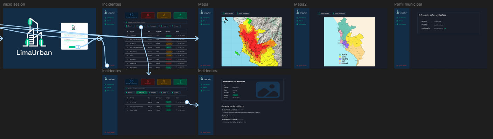

Video de explicación:<br> https://upcedupe-my.sharepoint.com/:v:/g/personal/u202210778_upc_edu_pe/EUFyDEGiCoRGjLFh4AG3XnkBXgXl8Mit2-oKXA4K_jJCyg?nav=eyJyZWZlcnJhbEluZm8iOnsicmVmZXJyYWxBcHAiOiJPbmVEcml2ZUZvckJ1c2luZXNzIiwicmVmZXJyYWxBcHBQbGF0Zm9ybSI6IldlYiIsInJlZmVycmFsTW9kZSI6InZpZXciLCJyZWZlcnJhbFZpZXciOiJNeUZpbGVzTGlua0NvcHkifX0&e=Cd5czk

#### **Aplicación móvil**

**Aplicación móvil**

- **Registro de Usuario:** Proceso simplificado para crear cuenta, con validación de email en tiempo real, verificación de contraseña segura y activación mediante código enviado por correo electrónico.
- **Inicio de Sesión:** Autenticación segura por email y contraseña, opción "Recordar sesión" y enlace para recuperación de contraseña.
- **Dashboard Principal (Home):** Pantalla central con resumen de actividad, reportes recientes, estadísticas de participación y accesos rápidos a funciones principales. Feed dinámico con actualizaciones y notificaciones.
- **Captura de Incidencia:** Interfaz de cámara intuitiva con guías visuales para fotografiar incidencias urbanas y geolocalización automática de la ubicación del problema.
- **Confirmación de Fotografía:** Pantalla de revisión para validar la imagen capturada, con opción de retomar la foto si no cumple estándares o repetir la captura.
- **Procesamiento con IA:** Pantalla de carga que informa sobre el análisis automático de la imagen mediante algoritmos YOLO, mostrando progreso y clasificación inteligente.
- **Formulario de Reporte:** Pantalla para finalizar el reporte con campos pre-rellenados por IA (categoría sugerida, descripción automática, ubicación confirmada), opción de agregar comentarios y verificación de datos antes del envío.
- **Confirmación de Envío:** Diálogo de éxito que confirma la recepción del reporte, muestra número de seguimiento, tiempo estimado de respuesta y opciones para compartir o crear nuevo reporte.
- **Historial de Reportes:** Lista cronológica de reportes realizados, mostrando estado actual, fecha, tipo de incidencia y acceso a detalles completos de cada caso.
- **Perfil de Usuario:** Sección para gestionar información personal, revisar estadísticas de participación, configurar notificaciones y acceder a soporte técnico y políticas de privacidad.

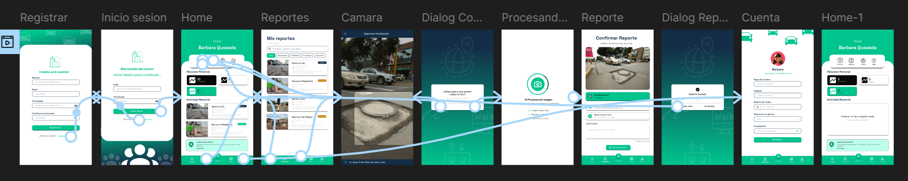

Video de explicación: <br> https://upcedupe-my.sharepoint.com/:v:/g/personal/u202211800_upc_edu_pe/EVJfSu7oGGhPgQ3bLK63i60BqMp_X1e4tRJfobOMkX7HJQ?nav=eyJyZWZlcnJhbEluZm8iOnsicmVmZXJyYWxBcHAiOiJPbmVEcml2ZUZvckJ1c2luZXNzIiwicmVmZXJyYWxBcHBQbGF0Zm9ybSI6IldlYiIsInJlZmVycmFsTW9kZSI6InZpZXciLCJyZWZlcnJhbFZpZXciOiJNeUZpbGVzTGlua0NvcHkifX0&e=i8v80v

# Capítulo VII: Product Implementation, Validation & Deployment

## 7.1. Software Configuration Management

### 7.1.1. Software Development Environment Configuration

A continuación se detallan los productos de software, herramientas y plataformas utilizadas por el equipo para el desarrollo, gestión y despliegue de **LimaUrban**.

---

**Project Management**

| Producto | Propósito | Ruta de Referencia/Descarga |
|----------|-----------|----------------------------|
| **Discord** | Comunicación en tiempo real del equipo, reuniones de planificación sprint y daily standups virtuales | https://discord.com |
| **Google Meet** | Videoconferencias para Sprint Planning, Sprint Review y Sprint Retrospective | https://meet.google.com |
| **Trello** | Gestión de tableros Kanban para seguimiento de User Stories, tareas del Sprint Backlog y flujo de trabajo del equipo | https://trello.com |
| **GitHub Projects** | Gestión integrada de issues, milestones y seguimiento de progreso vinculado directamente a los repositorios del código | https://github.com/features/project-management |


<br>

**Requirements Management**

| Producto | Propósito | Ruta de Referencia/Descarga |
|----------|-----------|----------------------------|
| **Miro** | Elaboración de Lean UX Canvas, Event Storming, User Personas, Empathy Maps, As-Is/To-Be Scenario Mapping y Context Mapping | https://miro.com |
| **Google Docs** | Documentación colaborativa de User Stories, criterios de aceptación y especificaciones de requerimientos | https://docs.google.com |
| **Notion** | Base de conocimiento centralizada para documentación de requerimientos, decisiones arquitectónicas y registro de validaciones con stakeholders | https://notion.so |


**Product UX/UI Design**

| Producto | Propósito | Ruta de Referencia/Descarga |
|----------|-----------|----------------------------|
| **Figma** | Diseño de wireframes, mockups, prototipos interactivos de baja y alta fidelidad para aplicación móvil (Flutter) y dashboard web (Next.js) | https://figma.com |


**Backend Development & Database**

| Producto | Propósito | Ruta de Referencia/Descarga |
|----------|-----------|----------------------------|
| **Supabase** | Backend-as-a-Service que proporciona PostgreSQL database, autenticación, storage de imágenes, APIs REST autogeneradas y Row Level Security | https://supabase.com |
| **PostgreSQL** | Base de datos relacional integrada en Supabase para almacenamiento estructurado de usuarios, incidencias, comentarios e historial | Incluido en Supabase |
| **PostGIS** | Extensión de PostgreSQL para consultas geoespaciales, cálculo de distancias y análisis de ubicaciones dentro de Supabase | Incluido en Supabase |
| **Supabase CLI** | Herramienta de línea de comandos para gestionar migraciones de base de datos, funciones y triggers localmente | https://supabase.com/docs/guides/cli |

**AI/ML Model Development**

| Producto | Propósito | Ruta de Referencia/Descarga |
|----------|-----------|----------------------------|
| **Python 3.11+** | Lenguaje de programación para desarrollo y entrenamiento del modelo YOLO de clasificación de incidencias | https://www.python.org/downloads/ |
| **PyTorch** | Framework de deep learning para entrenamiento e inferencia del modelo YOLO | https://pytorch.org/get-started/locally/ |
| **Ultralytics YOLO** | Implementación optimizada de YOLO para detección de baches y basura en imágenes de incidencias | https://docs.ultralytics.com |

<br>

**Frontend Web Development**
| Producto | Propósito | Ruta de Referencia/Descarga |
|----------|-----------|----------------------------|
| **Node.js 18 LTS** | Entorno de ejecución JavaScript para herramientas de desarrollo y build de Next.js | https://nodejs.org/en/download |
| **Next.js 14+** | Framework React con App Router para desarrollo del dashboard municipal con SSR, optimización de imágenes y rutas API | https://nextjs.org/docs |
| **React 18+** | Biblioteca de componentes UI para construcción de interfaces interactivas en el dashboard web | https://react.dev |
| **TypeScript 5.0+** | Superset de JavaScript con tipado estático para desarrollo más robusto en Next.js | https://www.typescriptlang.org/download |
| **Tailwind CSS** | Framework de CSS utility-first para diseño rápido y consistente de interfaces responsivas | https://tailwindcss.com/docs/installation |
| **Supabase JS Client** | SDK oficial de JavaScript para integración con Supabase desde Next.js (Auth, Database, Storage) | https://supabase.com/docs/reference/javascript |
| **MapBox GL JS** | SDK JavaScript para integración de mapas interactivos y visualización de mapas de calor en el dashboard | https://docs.mapbox.com/mapbox-gl-js/guides/install/ |

<br>

**Mobile Development**

| Producto | Propósito | Ruta de Referencia/Descarga |
|----------|-----------|----------------------------|
| **Flutter SDK 3.16+** | Framework multiplataforma (Android/iOS) para desarrollo de la aplicación ciudadana | https://docs.flutter.dev/get-started/install |
| **Dart 3.0+** | Lenguaje de programación utilizado por Flutter | https://dart.dev/get-dart |
| **Android Studio** | IDE oficial para desarrollo Android con emuladores y herramientas de debugging | https://developer.android.com/studio |
| **Supabase Flutter Client** | SDK oficial para integración con Supabase desde Flutter (Auth, Database, Storage) | https://supabase.com/docs/reference/dart |

**Version Control & Collaboration**

| Producto | Propósito | Ruta de Referencia/Descarga |
|----------|-----------|----------------------------|
| **Git 2.40+** | Sistema de control de versiones distribuido para gestión de código fuente | https://git-scm.com/downloads |
| **GitHub** | Plataforma de hosting para repositorios Git con gestión de pull requests, code reviews y CI/CD | https://github.com |
| **Visual Studio Code** | Editor de código principal con extensiones para Python, React, Flutter y integración con Git | https://code.visualstudio.com/download |


**Software Deployment**

| Producto | Propósito | Ruta de Referencia/Descarga |
|----------|-----------|----------------------------|
| **Supabase** | Backend-as-a-Service para PostgreSQL, autenticación, storage de imágenes y APIs generadas automáticamente | https://supabase.com |
| **Vercel** | Plataforma de hosting para despliegue del dashboard Next.js con optimizaciones automáticas, edge functions y preview deployments | https://vercel.com |
| **Python Flask/FastAPI** | Framework ligero para crear API endpoint que sirve el modelo YOLO entrenado para inferencia | https://flask.palletsprojects.com <br> https://fastapi.tiangolo.com |


**Software Documentation**

| Producto | Propósito | Ruta de Referencia/Descarga |
|----------|-----------|----------------------------|
| **Markdown** | Formato de documentación técnica para README.md, guías de instalación y documentación de APIs en repositorios GitHub | Nativo en editores de texto |
| **PlantUML** | Generación de diagramas UML (clases, secuencia, despliegue) mediante código declarativo | https://plantuml.com/download |
| **Google Docs** | Documentación de reportes de sprint, minutas de reuniones y deliverables académicos | https://docs.google.com |


### 7.1.2. Source Code Management

Para gestionar los múltiples cambios de código en los distintos módulos del sistema LimaUrban, se creó una organización en GitHub donde se alojan los repositorios independientes correspondientes al backend (API), frontend web, aplicación móvil y landing page.

**Organización y metodología de trabajo en GitHub**

Los repositorios siguen la metodología GitFlow, que facilita una colaboración estructurada y ágil entre los desarrolladores. Esta metodología promueve buenas prácticas y convenciones claras durante todo el ciclo de vida del desarrollo.

Se establecieron las siguientes nomenclaturas para las ramas de desarrollo:

- **Main:** Contiene una versión estable y funcional del sistema desplegada en producción. Es la rama utilizada por los usuarios finales y por los servicios desplegados en nube.

- **Develop:** Rama de integración donde confluyen los avances realizados durante cada sprint antes de su consolidación en producción.

- **Feature:** Ramas dedicadas al desarrollo de nuevas funcionalidades, como detección de incidencias por imágenes, integración de mapas de calor, optimización de interfaz móvil o mejoras en el dashboard municipal.
  - Formato: `feature/<nombre-funcionalidad>`
  - Ejemplos: `feature/auth`, `feature/buckets`, `feature/yolo-detection`

- **Fix:** Ramas empleadas para corregir errores detectados en desarrollo o pruebas.
  - Formato: `fix/<descripción-error>`
  - Ejemplos: `fix/chapter-02`, `fix/structure`

- **Hotfix:** Ramas empleadas exclusivamente para corregir errores críticos detectados en producción o versiones estables que requieren atención inmediata.

**Stack tecnológico**

Se seleccionó una arquitectura tecnológica modular basada en herramientas ampliamente adoptadas por la comunidad, compatibles con modelos de despliegue cloud:

**Backend (backend-limaurban)**

- Lenguaje: TypeScript
- Framework: NestJS 11 con Node.js 22+
- Base de datos: Supabase (PostgreSQL + PostGIS para operaciones geoespaciales)
- Autenticación: Passport JWT con estrategia basada en Supabase
- IA/ML: Integración con servicio YOLO en Azure para detección automática en imágenes
- Gestión de paquetes: pnpm

**Frontend Web (front-web-limaurban)**

- Lenguaje: TypeScript
- Framework: Next.js 15 (App Router + Pages Router)
- UI: React 18 + Tailwind CSS + shadcn/ui + Radix UI
- Mapas: Mapbox GL + React Map GL
- Backend: Supabase JS + SSR
- Validación: Zod
- Deployment: Vercel

**Aplicación Móvil (front-mobile)**

- Lenguaje: Dart 3.9.2+
- Framework: Flutter SDK
- Backend: Supabase Flutter
- Arquitectura: Clean Architecture con separación por features
- Plataformas soportadas: Android

**Landing Page (landing-page)**

- Tecnologías: HTML + CSS
- Página estática para máxima simplicidad y velocidad

**Convenciones de idioma**

El idioma base del código fuente, los nombres de ramas y los commits es el inglés, debido a que es el estándar de la industria tecnológica y facilita la escalabilidad internacional del proyecto.

El español será utilizado para la documentación interna, reportes institucionales y presentaciones ante stakeholders locales o instituciones municipales.

**Convenciones de versionamiento (Semantic Versioning 2.0.0)**

Para garantizar la trazabilidad de versiones, se adopta la convención de versionado semántico (SemVer), donde cada versión sigue el formato X.Y.Z, con las siguientes reglas:

- **X (versión mayor):** Se incrementa cuando se introducen cambios incompatibles con versiones anteriores (por ejemplo, migraciones de API o cambio en los formatos de entrada).

- **Y (versión menor):** Se incrementa cuando se añaden funcionalidades compatibles, como nuevos endpoints, módulos de mapas de calor o categorías de incidencias.

- **Z (parche):** Se incrementa solo cuando se corrigen errores sin afectar la compatibilidad (bugs menores o mejoras internas).

Ejemplo de evolución de versiones:
- Versión inicial: 0.1.0
- Se añade módulo de análisis predictivo: 0.2.0
- Se corrige un bug visual en el dashboard: 0.2.1

**Convenciones de Commits (Conventional Commits)**

Para mantener un historial limpio, comprensible y alineado a integraciones CI/CD, se adopta el estándar de Conventional Commits, el cual permite automatizar changelogs y facilitar el versionamiento semántico.

Estructura:
```
<type>[optional scope]: <description>
```

- **type:** El tipo de cambio (feat, fix, docs, refactor, test, etc.).
- **scope:** (opcional) El módulo afectado (auth, incidents, maps, yolo-detection, etc.).
- **description:** Breve resumen del cambio.

Ejemplos reales del proyecto:
- `feat: add integration tests for RolesGuard with real database interactions`
- `feat: implement authentication module with JWT strategy and role-based access control`
- `fix: body font`
- `docs(interviews): add details and evidence for interview 06`

**Repositorios y su propósito**

| Repositorio | Descripción | Tecnologías Principales |
|------------|-------------|------------------------|
| backend-limaurban | API REST para gestión de incidentes urbanos con detección IA | NestJS, TypeScript, Supabase, Azure YOLO |
| front-web-limaurban | Aplicación web para ciudadanos y municipalidades | Next.js, React, Tailwind, Mapbox |
| front-mobile | Aplicación móvil multiplataforma | Flutter, Dart, Supabase |
| landing-page | Página de aterrizaje informativa | HTML, CSS |
| report | Documentación académica del proyecto | Markdown |

### 7.1.3. Source Code Style Guide & Conventions

Con el fin de mantener un código limpio, mantenible y comprensible entre los miembros del equipo de LimaUrban, se establecieron las siguientes convenciones de estilo para los lenguajes y tecnologías utilizadas en el proyecto.

**TypeScript**

Estructura de archivos por módulo

Cada módulo debe estar organizado siguiendo la estructura estándar de NestJS con separación de controladores, servicios, guards, strategies y DTOs.

Convenciones de nombres

- Archivos y carpetas: kebab-case (jwt-auth.guard.ts, roles.guard.ts)
- Clases, Interfaces y Types: PascalCase (JwtAuthGuard, RolesGuard, UserEntity)
- Variables y funciones: camelCase (getUserById, currentUser, isValid)
- Constantes: UPPER_SNAKE_CASE (JWT_SECRET, MAX_FILE_SIZE)

Buenas prácticas

- Separar lógicamente el código en módulos (auth, incidents, health, config)
- Usar decoradores de NestJS correctamente (@Injectable(), @Controller(), @Get())
- Implementar DTOs con class-validator y class-transformer
- Aplicar Guards para autenticación y autorización
- Documentar endpoints con Swagger usando decoradores
- Usar inyección de dependencias apropiadamente

**TypeScript**

Estructura de archivos por característica

El frontend web sigue una arquitectura DDD con separación clara entre app (rutas), components (componentes reutilizables), hooks (custom hooks), contexts (React contexts), lib (utilidades) y types (definiciones de tipos).

Convenciones de nombres

- Archivos de componentes: kebab-case (incident-card.tsx, map-view.tsx)
- Componentes React: PascalCase (IncidentCard, MapView, UserProfile)
- Hooks personalizados: camelCase con prefijo use (useIncidents, useAuth)
- Variables y funciones: camelCase (fetchIncidents, handleSubmit, isLoading)
- Tipos e Interfaces: PascalCase (Incident, User, Municipality)

Buenas prácticas

- Usar Server Components por defecto, Client Components solo cuando sea necesario
- Implementar Server Actions para mutaciones
- Aplicar shadcn/ui para componentes consistentes
- Usar Zod para validación de esquemas
- Implementar loading.tsx y error.tsx para mejor UX
- Separar lógica de negocio en hooks personalizados
- Usar TypeScript strict mode

**Dart (Flutter - Mobile)**

Estructura de archivos por feature

La aplicación móvil sigue Clean Architecture con separación por capas: core (funcionalidad central), features (módulos por funcionalidad con subcarpetas data, domain y presentation).

Convenciones de nombres

- Archivos y carpetas: snake_case (login_page.dart, auth_repository.dart)
- Clases: PascalCase (LoginPage, AuthRepository, UserEntity)
- Variables y funciones: camelCase (fetchUser, isAuthenticated, userEmail)
- Constantes: lowerCamelCase (kPrimaryColor, kDefaultPadding)

Buenas prácticas

- Separar lógicamente el código en features (iam, incidents, maps)
- Aplicar Clean Architecture (presentation, domain, data)
- Usar Provider o Riverpod para gestión de estado
- Declarar constantes globales en archivos separados
- Utilizar const y final en lugar de var cuando sea posible
- Evitar lógica de negocio en widgets
- Implementar manejo de errores con clases Failure
- Usar named parameters en constructores

**HTML/CSS (Landing Page)**

Convenciones de nombres

- Archivos: kebab-case (index.html, styles.css)
- Clases CSS: kebab-case (.hero-section, .cta-button)
- IDs: camelCase (#mainNav, #contactForm)

Buenas prácticas

- Usar HTML5 semántico (header, nav, main, footer, article, section)
- Aplicar BEM methodology para clases CSS cuando sea apropiado
- Optimizar imágenes
- Incluir atributos alt en todas las imágenes
- Usar CSS Grid y Flexbox para layouts
- Implementar diseño responsive con media queries

**Gherkin (Testing de Aceptación)**

Gherkin es un lenguaje estructurado para describir escenarios de prueba de aceptación utilizando el enfoque Behavior Driven Development (BDD).

En el proyecto LimaUrban, se emplea para documentar cómo debería comportarse el sistema ante ciertas situaciones clave, como el reporte de incidencias urbanas, la detección automática por IA y la visualización de mapas de calor.

Sintaxis y Propósito

| Palabra clave | Propósito |
|---------------|-----------|
| Feature | Describe una funcionalidad del sistema a alto nivel |
| Scenario | Representa un caso de uso específico con pasos detallados |
| Given | Establece el estado inicial del sistema |
| When | Describe la acción o evento principal |
| Then | Describe el resultado esperado |
| And | Agrega más condiciones dentro de los bloques |
| Background | Define pasos comunes que se repiten en varios escenarios |

Buenas prácticas

- Usar lenguaje claro y orientado al usuario o negocio, no técnico
- Nombrar Features y Scenarios con sustantivos y verbos significativos
- Incluir solo una lógica o flujo por Scenario
- Evitar duplicación usando Background
- Asegurar que todos los Then tengan resultados verificables
- Mantener los escenarios independientes entre sí

### 7.1.4. Software Deployment Configuration

**Landing Page Deployment Configuration**

Para el despliegue de la Landing Page del proyecto LimaUrban, se utilizó GitHub Pages, una plataforma gratuita ofrecida por GitHub para alojar sitios web estáticos directamente desde un repositorio público.

El proceso de despliegue fue realizado siguiendo los pasos descritos a continuación:

1. Se creó un repositorio específico en GitHub para la Landing Page, incluyendo el archivo index.html y todos los recursos estáticos (CSS, imágenes) en la raíz del proyecto.
2. Desde la sección Settings del repositorio, se habilitó GitHub Pages accediendo al apartado Pages.
3. Se seleccionó la rama main y la carpeta raíz (/) como fuente de publicación.
4. Una vez guardada la configuración, GitHub generó automáticamente la URL pública del sitio.

Finalmente, se verificó el despliegue exitoso ingresando a la URL proporcionada.

**Frontend Web Deployment Configuration**

El frontend web de LimaUrban está configurado para deployment automático en Vercel.

Configuración actual:

- Platform: Vercel
- Framework: Next.js 15
- URL de producción: [https://lima-urban.vercel.app](https://lima-urban.vercel.app)
- Integración con Supabase: Variables de entorno automáticas mediante Supabase Vercel Integration

Proceso de deployment:

1. Conectar repositorio a Vercel: Se importó el repositorio front-web-limaurban desde GitHub. Vercel detecta automáticamente que es un proyecto Next.js.

2. Configurar variables de entorno en el dashboard de Vercel:
   - NEXT_PUBLIC_SUPABASE_URL
   - NEXT_PUBLIC_SUPABASE_ANON_KEY
   - SUPABASE_SERVICE_ROLE_KEY

3. Deploy automático: Cada push a main despliega automáticamente a producción. Cada push a otras ramas crea un preview deployment.

El deployment en Vercel permite aprovechar características como Edge Functions, Incremental Static Regeneration y Analytics integrado para monitorear el rendimiento de la aplicación web.

## 7.2. Solution Implementation

### 7.2.1. Sprint 1

#### 7.2.1.1. Sprint Planning 1

| Sprint # 	| Sprint 1 	|
|---	|---	|
| Sprint Planning Background 	|  	|
| Date 	| 23/10/2025 	|
| Time 	| 9:00 PM 	|
| Location 	| Reunión virtual en Discord 	|
| Prepared by 	| Castillo Robles, Steve Roger 	|
| Attendees (to planning meeting) 	| Baldeon Fabian, Aldo Alberto<br>Cama Salvatierra, Jimena Tamara<br>Castillo Robles, Steve Roger<br>Castillo Castillo, Jair Alexander<br>Quezada Portalatino, Barbara Susana 	|
| Sprint Goal & User stories 	|  	|
| Sprint 2 Goal 	| Entrenamiento del modelo de YOLO con un backend conectado funcional y un avance del frontend 	|
| Sprint n Velocity 	|  	|
| Sum of story points 	|  	|

#### 7.2.1.2. Sprint Backlog 1

#### 7.2.1.3. Development Evidence for Sprint Review

A continuación, se presentará la lista de commits realizados en los repositorios del proyecto LimaUrban durante el Sprint 1.

**Landing Page**

| Repository | Branch | Commit Id | Commit Message | Committed on (Date) |
|------------|--------|-----------|----------------|---------------------|
| landing-page | main | d635804 | feat: inicital commit | 06/10/2025 |
| landing-page | main | cca2bb7 | feat: add ico logo | 06/10/2025 |
| landing-page | main | dba0f64 | fix: body font | 06/10/2025 |

**Repositorio landing-page:** [https://github.com/Arquitectura-Software-Emergentes/landing-page](https://github.com/Arquitectura-Software-Emergentes/landing-page)

**Frontend Web**

| Repository | Branch | Commit Id | Commit Message | Committed on (Date) |
|------------|--------|-----------|----------------|---------------------|
| front-web-limaurban | master | b634dc7 | Enhanced incident fetching with user details | 10/11/2025 |
| front-web-limaurban | master | 86775ca | Improved incident detail components and styling | 10/11/2025 |
| front-web-limaurban | master | 3c76c17 | Sidebar functionality with mobile/desktop collapse | 10/11/2025 |
| front-web-limaurban | master | 81de671 | Incidents table enhancements with pagination | 10/11/2025 |
| front-web-limaurban | master | d0f9447 | Incident table display improvements | 10/11/2025 |
| front-web-limaurban | master | 1100815 | Incident detail and comments functionality implementation | 10/11/2025 |
| front-web-limaurban | master | fd2c50a | Enhanced authentication forms with accessibility improvements | 10/11/2025 |
| front-web-limaurban | master | 3beb011 | Loading context implementation with provider components | 10/11/2025 |
| front-web-limaurban | master | feebc3b | Session handling and user authentication checks | 10/11/2025 |
| front-web-limaurban | master | 97cc4d8 | Authentication forms refactoring; modularized fields | 13/11/2025 |
| front-web-limaurban | master | 5b2d73e | Enhanced Incident interface with AI detection fields | 13/11/2025 |
| front-web-limaurban | master | 3ba6b55 | User and role handling improvements for clarity | 13/11/2025 |
| front-web-limaurban | master | 59a83a8 | Role handling refactoring; replaced RoleType with Role | 13/11/2025 |

**Repositorio front-web-limaurban:** [https://github.com/Arquitectura-Software-Emergentes/front-web-limaurban](https://github.com/Arquitectura-Software-Emergentes/front-web-limaurban)

**Backend**

| Repository | Branch | Commit Id | Commit Message | Committed on (Date) |
|------------|--------|-----------|----------------|---------------------|
| backend-limaurban | main | ba5b4ef | feat: initialize NestJS application with health check module and environment validation | 13/11/2025 |
| backend-limaurban | main | 2c2d252 | feat: update environment configuration, add JWT secret, and enhance package dependencies | 13/11/2025 |
| backend-limaurban | main | f7e9643 | feat: implement authentication module with JWT strategy and role-based access control | 13/11/2025 |
| backend-limaurban | main | e3013ac | feat: add JWT authentication guard and role-based access control guard | 13/11/2025 |
| backend-limaurban | main | 6964ba3 | feat: implement health check module with Supabase connection verification | 13/11/2025 |
| backend-limaurban | main | 9bf28d2 | feat: add unit tests for RolesGuard with Supabase integration | 13/11/2025 |
| backend-limaurban | main | 4a4ad39 | feat: add integration tests for RolesGuard with real database interactions | 13/11/2025 |

**Repositorio backend-limaurban:** [https://github.com/Arquitectura-Software-Emergentes/backend-limaurban](https://github.com/Arquitectura-Software-Emergentes/backend-limaurban)

**Mobile App**

| Repository | Branch | Commit Id | Commit Message | Committed on (Date) |
|------------|--------|-----------|----------------|---------------------|
| front-mobile | main | 92e2287 | Initial commit | 27/10/2025 |
| front-mobile | main | 9809e7f | Add authentication pages, routing, and Supabase integration | 27/10/2025 |

**Repositorio front-mobile:** [https://github.com/Arquitectura-Software-Emergentes/front-mobile](https://github.com/Arquitectura-Software-Emergentes/front-mobile)

#### 7.2.1.4. Testing Suite Evidence for Sprint Review

A continuación, se presentan los escenarios de prueba de aceptación desarrollados en formato Gherkin para las principales User Stories implementadas en el Sprint 1.

**Repositorio acceptance-tests**

| Repository | Branch | Commit Id | Commit Message | Committed on (Date) |
|------------|--------|-----------|----------------|---------------------|
| Testing | main | 78620b7 | feat: add features US01 to US21 | 14/11/2025 |

**Repositorio Testing:** [https://github.com/Arquitectura-Software-Emergentes/Testing](https://github.com/Arquitectura-Software-Emergentes/Testing)

**E01_US13 - Registro de ciudadano**

```gherkin
Feature: Registro de ciudadano
  Como ciudadano
  Quiero registrarme en la plataforma
  Para poder reportar incidencias urbanas

  Scenario: Registro exitoso con datos válidos
    When el ciudadano ingresa el nombre completo "Juan Pérez"
    And el ciudadano ingresa el email "juan.perez@example.com"
    And el ciudadano ingresa una contraseña segura "Passw0rd123!"
    And el ciudadano confirma la contraseña "Passw0rd123!"
    And el ciudadano acepta los términos y condiciones
    And el ciudadano presiona el botón "Registrarse"
    Then el sistema debe crear la cuenta en Supabase
    And el sistema debe mostrar el mensaje "Registro exitoso"
    And el ciudadano debe ser redirigido a la pantalla de inicio de sesión
```

**E01_US14 - Inicio de sesión ciudadano**

```gherkin
Feature: Inicio de sesión ciudadano
  Como ciudadano
  Quiero iniciar sesión
  Para acceder a mis reportes y perfil

  Scenario: Inicio de sesión exitoso
    When el ciudadano ingresa el email "ciudadano@example.com"
    And el ciudadano ingresa la contraseña correcta "Passw0rd123!"
    And el ciudadano presiona el botón "Iniciar sesión"
    Then el sistema debe validar las credenciales en Supabase
    And el sistema debe generar un token de sesión
    And el ciudadano debe ser redirigido al dashboard
    And el sistema debe mostrar el mensaje "Bienvenido"
```

**E02_US16 - Reporte de incidencia con foto**

```gherkin
Feature: Reporte de incidencia con foto
  Como ciudadano
  Quiero reportar una incidencia urbana adjuntando fotografía y ubicación automática
  Para documentar el problema de forma completa

  Scenario: Reportar incidencia con foto y clasificación IA
    When el ciudadano presiona el botón "Reportar Incidencia"
    And el ciudadano captura una foto de un bache
    And el sistema detecta la ubicación GPS automáticamente
    And el ciudadano presiona "Confirmar foto"
    Then el sistema debe enviar la imagen al servicio YOLO en Azure
    And el servicio YOLO debe clasificar la imagen como "Bache"
    And el sistema debe mostrar el formulario con categoría pre-sugerida "Bache"
    And el mapa debe mostrar la ubicación detectada
```

**E03_US11 - Dashboard geoespacial municipal**

```gherkin
Feature: Dashboard geoespacial municipal
  Como personal municipal
  Quiero visualizar incidencias en mapas de calor interactivos
  Para priorizar intervenciones basadas en concentración espacial

  Scenario: Visualizar mapa de calor de incidencias
    When el personal accede a la sección "Mapas"
    Then el sistema debe cargar el mapa de Lima usando Mapbox GL
    And el sistema debe consultar las incidencias con coordenadas desde Supabase
    And el mapa debe renderizar un mapa de calor con degradado
    And las zonas con mayor concentración deben mostrarse en rojo
    And las zonas con menor concentración deben mostrarse en amarillo
```

**E03_US03 - Ver total de incidencias**

```gherkin
Feature: Ver total de incidencias
  Como personal municipal
  Quiero ver el número total de incidencias registradas
  Para monitorear el volumen general

  Scenario: Visualizar métricas generales
    When el personal accede al dashboard
    Then el sistema debe consultar las incidencias desde Supabase
    And el dashboard debe mostrar "Total: 150 incidencias"
    And debe mostrar "Pendientes: 45"
    And debe mostrar "En Proceso: 80"
    And debe mostrar "Resueltas: 25"
    And cada métrica debe estar en una card visual diferenciada
```

**E04_US07 - Enviar comentario sobre incidencia**

```gherkin
Feature: Enviar comentario sobre incidencia
  Como personal municipal
  Quiero enviar comentarios en las incidencias
  Para comunicar acciones tomadas

  Scenario: Enviar comentario de actualización
    When el personal escribe "Hemos enviado cuadrilla. Reparación en 48 horas."
    And el personal presiona "Enviar comentario"
    Then el sistema debe guardar el comentario en Supabase
    And el comentario debe asociarse a "INC-2025-001"
    And el comentario debe incluir timestamp actual
    And el comentario debe incluir nombre del personal
    And el sistema debe mostrar "Comentario enviado"
    And el comentario debe aparecer en el historial
    And el ciudadano debe poder ver el comentario en su app móvil
```

#### 7.2.1.5. Execution Evidence for Sprint Review

En esta sección se presentan las evidencias de ejecución del sistema LimaUrban desarrollado durante el Sprint 1, mostrando las funcionalidades implementadas y en funcionamiento.

**Landing Page**

Se implementó y desplegó la Landing Page del proyecto LimaUrban, la cual presenta información sobre la plataforma, sus características principales y llamados a la acción para ciudadanos y personal municipal.

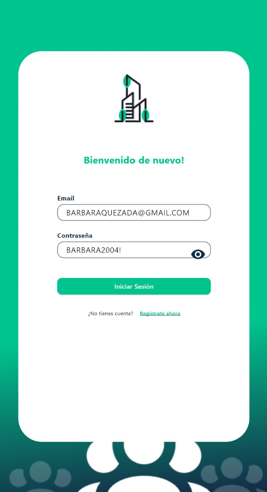

**Aplicación Web Frontend**

Se desarrolló e implementó la aplicación web frontend con Next.js 15, que permite al personal municipal gestionar las incidencias urbanas reportadas por los ciudadanos. Las principales funcionalidades implementadas incluyen el sistema de autenticación, dashboard geoespacial y gestión de incidencias.

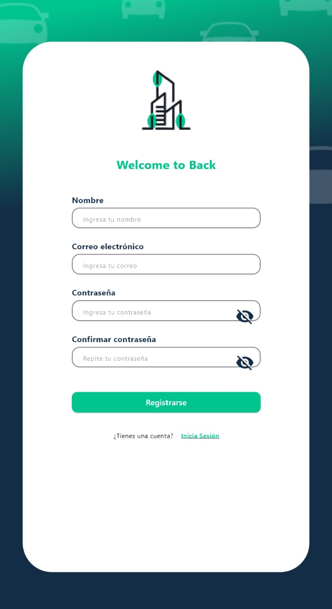

Durante este Sprint 1, se logró implementar exitosamente:

- Landing Page responsiva con información institucional
- Sistema de autenticación mediante Supabase Auth
- Dashboard principal del personal municipal
- Visualización geoespacial de incidencias con Mapbox GL
- Gestión básica de incidencias (visualización, filtrado)
- Integración con la base de datos PostgreSQL/PostGIS en Supabase

#### 7.2.1.6. Services Documentation Evidence for Sprint Review

#### 7.2.1.7. Software Deployment Evidence for Sprint Review

En esta sección se presentan las evidencias del despliegue de los componentes del sistema LimaUrban durante el Sprint 1.

**Landing Page Deployment**

La Landing Page del proyecto fue desplegada utilizando GitHub Pages. El proceso consistió en configurar el repositorio para servir contenido estático desde la rama main.

URL de acceso a la Landing Page: Se encuentra desplegada y accesible públicamente mediante GitHub Pages.

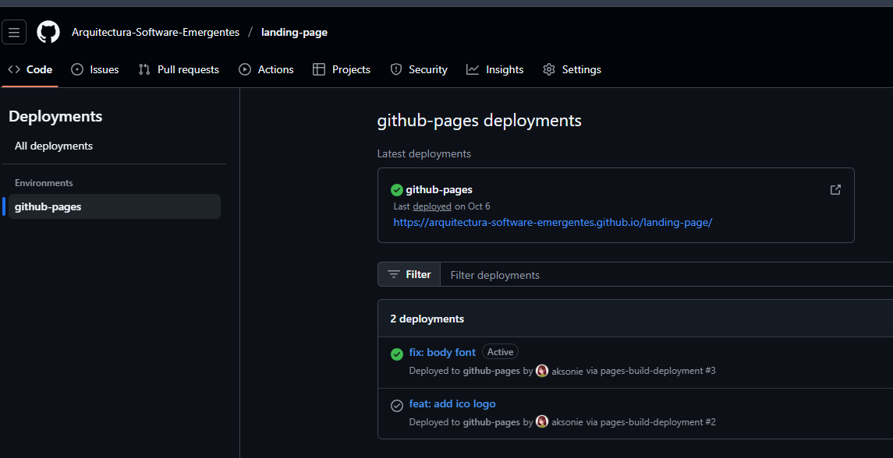

**Frontend Web Deployment**

La aplicación web frontend fue desplegada en Vercel, aprovechando su integración nativa con Next.js y GitHub. Cada push a la rama main genera automáticamente un nuevo deployment.

URL de producción: [https://lima-urban.vercel.app](https://lima-urban.vercel.app)

Características del deployment:
- Deployment automático desde GitHub
- Preview deployments para cada pull request
- Integración con Supabase mediante variables de entorno
- Edge Functions habilitadas
- Certificado SSL automático

#### 7.2.1.8. Team Collaboration Insights during Sprint

A continuación, se presentan las evidencias de colaboración del equipo durante el Sprint 1, mostrando los aportes realizados por cada miembro en los diferentes repositorios del proyecto.

**Repositorio Report - Documentación**

El equipo trabajó colaborativamente en la documentación del proyecto, distribuyendo responsabilidades por capítulos y manteniendo una comunicación constante para asegurar la coherencia del informe.

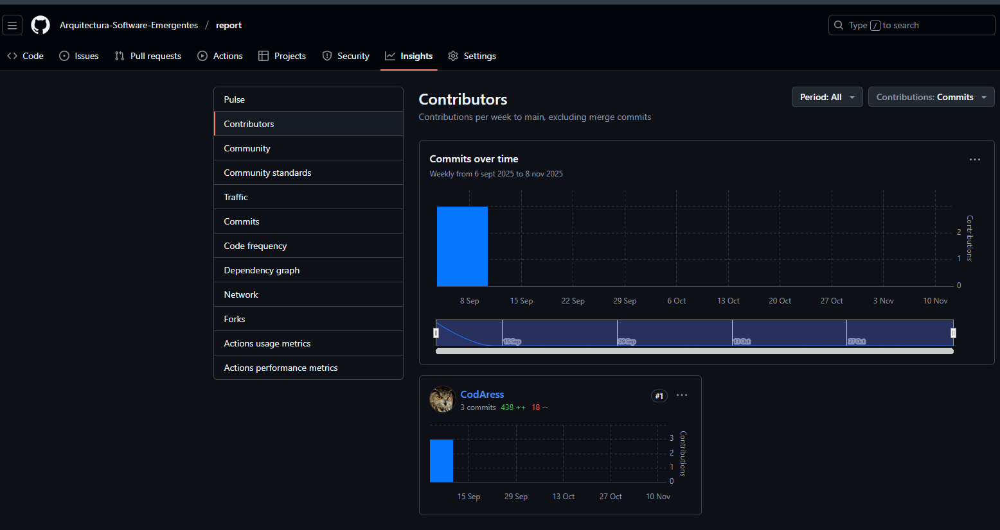

**Análisis de Contribuciones**

Durante el Sprint 1, el equipo demostró una colaboración efectiva mediante:

- **Commits distribuidos**: Cada miembro del equipo realizó contribuciones significativas en sus áreas asignadas
- **Reuniones de sincronización**: Se mantuvieron reuniones semanales para coordinar avances y resolver impedimentos
- **Revisión de código**: Se implementó un proceso de code review mediante pull requests antes de integrar cambios a las ramas principales
- **Uso de Gitflow**: Se siguió la metodología Gitflow para mantener un control de versiones ordenado
- **Comunicación asíncrona**: Se utilizó Discord para coordinar tareas y resolver dudas en tiempo real

**Repositorios Principales Trabajados**

| Repositorio | Contribuidores | Actividad Principal |
|-------------|----------------|---------------------|
| backend-limaurban | Equipo técnico | Implementación de autenticación, guards, health checks |
| front-web-limaurban | Equipo frontend | Desarrollo de dashboard, tablas de incidencias, mapas |
| front-mobile | Equipo móvil | Implementación de páginas de autenticación y routing |
| landing-page | Equipo diseño | Creación de landing page estática |
| Testing | Equipo QA | Desarrollo de tests de aceptación en Gherkin |
| report | Todo el equipo | Documentación colaborativa del proyecto |

El trabajo colaborativo permitió cumplir con los objetivos del Sprint 1, entregando componentes funcionales e integrados del sistema LimaUrban.
 


## 7.3. Validation Interviews

En esta sección se registran y explican las actividades de entrevistas de validación realizadas durante el proyecto. Estas entrevistas se llevaron a cabo con usuarios de los segmentos objetivo, quienes interactuaron con el **Landing Page** y las **aplicaciones** (móvil y dashboard municipal). El proceso incluyó el diseño de entrevistas, el registro de las mismas y evaluaciones basadas en heurísticas de usabilidad y experiencia de usuario.

### 7.3.1. Diseño de Entrevistas

El diseño de las entrevistas se estructuró en función de los segmentos objetivo definidos en el proyecto: .

##### **Segmento: Ciudadano Reportante**

**Objetivo:** Validar la experiencia de usuario en la **Landing Page** y la **aplicación móvil**, asegurando que los ciudadanos puedan completar tareas clave de manera intuitiva y eficiente.

**Elementos a incluir:**
- **Landing Page:** Evaluar claridad de la propuesta de valor, facilidad para encontrar información y motivación para registrarse.
- **Aplicación Móvil:** Validar los siguientes flujos:
  1. Registro de usuario.
  2. Seguimiento del estado de una incidencia reportada.
  3. Consulta de incidencias reportadas por otros ciudadanos.

**Criterios de éxito:**
- Completar cada flujo en menos de 40 segundos.
- Entender claramente el propósito de la plataforma desde la Landing Page.
- Percibir transparencia y trazabilidad en el seguimiento de incidencias.
 
##### **Segmento: Personal Municipal**

**Objetivo:** Validar la experiencia de usuario en el **dashboard municipal**, asegurando que el personal pueda gestionar incidencias de manera eficiente y tomar decisiones informadas.

**Elementos a incluir:**
- **Dashboard Municipal:** Validar los siguientes flujos:
  1. Inicio de sesión y acceso al panel principal.
  2. Visualización de incidencias en el mapa de calor.
  3. Filtrado de incidencias por tipo, prioridad y ubicación.

**Criterios de éxito:**
- Completar cada flujo en menos de 2 minutos.
- Identificar zonas críticas mediante el mapa de calor.
- Percibir claridad en la interfaz y facilidad para priorizar incidencias.


### 7.3.2. Registro de Entrevistas

Se realizaron entrevistas con 3 participantes por segmento objetivo, para un total de 6 entrevistas. Cada entrevista fue grabada en video y registrada con los siguientes datos:

##### **Entrevista: Ciudadano Reportante**
- **Nombre:** 
- **Edad:** 
- **Distrito:** 
- **Duración:**  minutos
- **URL del video:** [Entrevista Carlos Mendoza](https://example.com/entrevista-carlos)
- **Resumen:** 

##### **Entrevista: Ciudadano Reportante**
- **Nombre:** Silvia Salvatierra
- **Edad:** 51 años
- **Distrito:** Bellavista
- **Duración:** 5:18 minutos

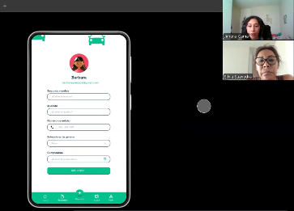

- **URL del video:** https://upcedupe-my.sharepoint.com/:v:/g/personal/u202210778_upc_edu_pe/IQCkdMwJ9ooIQrICczW9D9BPAd_3SWZK75wU_09Jo1paPQo?nav=eyJyZWZlcnJhbEluZm8iOnsicmVmZXJyYWxBcHAiOiJPbmVEcml2ZUZvckJ1c2luZXNzIiwicmVmZXJyYWxBcHBQbGF0Zm9ybSI6IldlYiIsInJlZmVycmFsTW9kZSI6InZpZXciLCJyZWZlcnJhbFZpZXciOiJNeUZpbGVzTGlua0NvcHkifX0&e=mg1RzE 

- **Resumen:** En la Landing Page Silvia indicó que la información era correcta y completa, que le parece bastante amigable el diseño y que podría navegar sin orientación. Además mencionó que le pareción muy intuitiva la aplicación móvil, los colores los consideró adecuados al igual que los contrastes. Los botones bastante intuitivos y en general mencionó que encontró amigable la aplicación.


##### **Entrevista: Personal Municipal**
- **Nombre:** Fernanda López
- **Edad:** 27 años
- **Distrito:** Comas
- **Duración:** 5:48 minutos


- **URL del video:** https://upcedupe-my.sharepoint.com/:v:/g/personal/u202211800_upc_edu_pe/IQAN6ECuAzA-TZDKZDwq7MlhAT5Fwn5x86uoF7w5dzvt7u8?nav=eyJyZWZlcnJhbEluZm8iOnsicmVmZXJyYWxBcHAiOiJPbmVEcml2ZUZvckJ1c2luZXNzIiwicmVmZXJyYWxBcHBQbGF0Zm9ybSI6IldlYiIsInJlZmVycmFsTW9kZSI6InZpZXciLCJyZWZlcnJhbFZpZXciOiJNeUZpbGVzTGlua0NvcHkifX0&e=ecn1XW
- **Resumen:** Fernanda destacó que la Landing Page le parece visualmente atractiva y profesional, con colores y diseño claros. Sin embargo, señaló que algunas secciones contienen demasiado texto. Consideró útil la información presentada, pero expresó la necesidad de ver ejemplos concretos y casos de éxito de otros municipios que hayan implementado la plataforma. En cuanto a la navegación, la encontró fácil de usar, aunque sugirió que los botones de acción como "Regístrate" deberían ser más visibles. Finalmente, recomendó incluir estadísticas y datos que respalden la efectividad de la plataforma, específicamente el tiempo promedio de resolución de incidencias.


### 7.3.3. Evaluaciones según heurísticas

**CARRERA:** Ingeniería de Software  
**CURSO:** Arquitecturas de Software Emergentes  
**SECCIÓN:**  7295
**PROFESORES:** Royer Edelwer Rojas Malasquez
**AUDITOR:** Arquitectura-Software-Emergentes  
**CLIENTE(S):** 
  1. Fernanda López (Personal Municipal)

**SITE o APP A EVALUAR:**  
Landing Page - Plataforma de Gestión de Incidencias Urbanas

**TAREAS A EVALUAR:**  
El alcance de esta evaluación incluye la revisión de la usabilidad de las siguientes tareas:
1. Navegación general por la Landing Page
2. Comprensión de la propuesta de valor
3. Búsqueda de información sobre beneficios
4. Localización de botones de registro
5. Acceso a casos de éxito o testimonios

No están incluidas en esta versión de la evaluación las siguientes tareas:
1. Proceso de registro completo
2. Contacto directo con ventas
4. Descarga de recursos adicionales

**ESCALA DE SEVERIDAD:**  
Los errores serán puntuados tomando en cuenta la siguiente escala de severidad

| Nivel | Descripción |
|-------|-------------|
| 1 | Problema superficial: puede ser fácilmente superado por el usuario ó ocurre con muy poca frecuencia. No necesita ser arreglado a no ser que exista disponibilidad de tiempo. |
| 2 | Problema menor: puede ocurrir un poco más frecuentemente o es un poco más difícil de superar para el usuario. Se le debería asignar una prioridad baja resolverlo de cara al siguiente release |
| 3 | Problema mayor: ocurre frecuentemente o los usuarios no son capaces de resolverlos. Es importante que sean corregidos y se les debe asignar una prioridad alta. |
| 4 | Problema muy grave: un error de gran impacto que impide al usuario continuar con el uso de la herramienta. Es imperativo que sea corregido antes del lanzamiento. |

**TABLA RESUMEN:**

| # | Problema | Escala de severidad | Heurística/Principio violada(o) |
|---|----------|-------------------|--------------------------------|
| 1 | Exceso de texto en algunas secciones | 2 | Usability: Estética y diseño minimalista |
| 2 | Falta de casos de éxito y ejemplos concretos | 3 | Information Architecture: Is it findable? |
| 3 | Botones de acción poco visibles | 3 | Usability: Visibilidad del estado del sistema |
| 4 | Ausencia de estadísticas de efectividad | 2 | Information Architecture: Is it credible? |

**DESCRIPCIÓN DE PROBLEMAS:**

**PROBLEMA #1:** Exceso de texto en algunas secciones  
**Severidad:** 2  
**Heurística violada:** Usabilidad - Estética y diseño minimalista  
**Problema:**  
Las secciones de la Landing Page contienen demasiado texto, lo que puede abrumar al usuario y dificultar la lectura rápida de información clave. Esto va contra el principio de diseño minimalista que sugiere presentar solo la información esencial.  
**Recomendación:**  
Reducir el texto y utilizar elementos visuales como íconos, infografías o bullets points para comunicar la información de manera más concisa y atractiva.

**PROBLEMA #2:** Falta de casos de éxito y ejemplos concretos  
**Severidad:** 3  
**Heurística violada:** Information Architecture - Is it findable?  
**Problema:**  
Los usuarios del segmento municipal necesitan evidencia concreta de la efectividad de la plataforma antes de tomar decisiones de implementación. La ausencia de casos de éxito reduce la credibilidad y confianza en la propuesta.  
**Recomendación:**  
Incluir una sección dedicada a casos de éxito con testimonios específicos, estadísticas de municipios que han implementado la plataforma y ejemplos visuales de resultados obtenidos.

**PROBLEMA #3:** Botones de acción poco visibles  
**Severidad:** 3  
**Heurística violada:** Usabilidad - Visibilidad del estado del sistema  
**Problema:**  
Los botones principales como "Regístrate" no son suficientemente prominentes, lo que puede resultar en una baja tasa de conversión y dificultad para que los usuarios completen acciones deseadas.  
**Recomendación:**  
Rediseñar los botones de acción con colores más contrastantes, mayor tamaño y posicionamiento estratégico para mejorar su visibilidad y accesibilidad.

**PROBLEMA #4:** Ausencia de estadísticas de efectividad  
**Severidad:** 2  
**Heurística violada:** Information Architecture - Is it credible?  
**Problema:**  
La falta de datos cuantitativos sobre la efectividad de la plataforma (como tiempo promedio de resolución de incidencias) limita la capacidad del usuario para evaluar el valor real de la solución.  
**Recomendación:**  
Incluir métricas clave como tiempo promedio de resolución, porcentaje de mejora en eficiencia, número de incidencias gestionadas exitosamente, entre otras estadísticas relevantes para el segmento municipal.

## 7.4. Video About-the-Product

# Conclusiones

Con este proyecto demostramos de manera integral la viabilidad y el impacto positivo de una plataforma urbana inteligente, diseñada para conectar de forma efectiva a la ciudadanía con el personal municipal y crear un ecosistema digital colaborativo que transforma la gestión de la ciudad. Desarrollamos un sistema que centraliza la gestión de incidencias, trámites y otros procesos municipales, lo que nos permite atender de manera más eficiente y ordenada las necesidades de los ciudadanos, asegurando un registro estructurado y trazable de cada solicitud.

Nuestra arquitectura se concibe como escalable y adaptable, brindándonos la capacidad de integrar nuevas funcionalidades, ajustar los procesos existentes y responder con agilidad a las demandas emergentes de la ciudad, garantizando la sostenibilidad tecnológica del proyecto a mediano y largo plazo.

Durante todo el desarrollo aplicamos metodologías ágiles y el enfoque de Lean UX, lo que nos permite iterar continuamente sobre nuestras soluciones, priorizar la experiencia del usuario y validar tempranamente cada funcionalidad, asegurando que cada componente del sistema cumpla con las expectativas y necesidades reales de los usuarios finales. De esta manera, el proyecto no solo optimiza la eficiencia operativa y la gestión de recursos municipales, sino que también fortalece la participación activa de los ciudadanos, promueve la transparencia y genera confianza en la gestión pública.

En conjunto, nuestras acciones aportan un valor estratégico tangible para la municipalidad, facilitando la toma de decisiones basada en datos confiables, fomentando la innovación urbana y consolidando una ciudad más organizada, segura y receptiva a las necesidades de su población.
