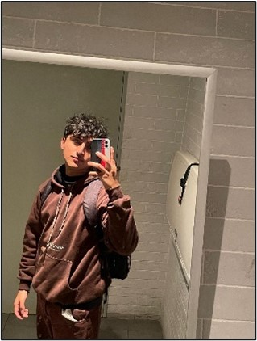

    <h3>Universidad Peruana de Ciencias Aplicadas</h3>
    </img> 
    <strong>Ingeniería de Software - 8vo Ciclo</strong> 
    <strong>Arquitecturas De Software Emergentes</strong> 
    <strong>1ASI0572</strong> 
    <strong>Profesor: Royer Edelwer Rojas Malasquez</strong> 
     <strong>Report</strong> 
    <!--<strong>name solution</strong>-->
    <!--<strong>name startup</strong>-->

<h3> Team Members: </h3>

| Member                              |    Code    |
| :---------------------------------- | :--------: |
| Baldeon Fabian, Aldo Alberto        | u202122633 |
| Cama Salvatierra, Jimena Tamara     | u202210778 |
| Castillo Robles, Steve Roger        | u202121679 |
| Castillo Castillo, Jair Alexander   | u202211390 |
| Quezada Portalatino, Barbara Susana | u202211800 |

<h3 align="center">Septiembre, 2025</h3>

  

## Registro de Versiones del Informe

El objetivo de esta sección es resumir las modificaciones relevantes que se realizan al informe durante el ciclo de vida del proyecto. Esta sección inicia en una página nueva e incluye un cuadro con la siguiente estructura:

<table>
  <thead>
    <tr>
      <th>Versión</th>
      <th>Fecha</th>
      <th>Autor</th>
      <th>Descripción de modificación</th>
    </tr>
  </thead>
  <tbody>
    <tr>
      <td>0.1</td>
      <td>07/09/2025</td>
      <td>Equipo completo</td>
      <td>Creación inicial del informe con la estructura base y distribución de responsabilidades</td>
    </tr>
  </tbody>
</table>
 

# Project Report Collaboration Insights

 Para desarrollar el proyecto, se empleó GitHub como herramienta para gestionar versiones y facilitar la colaboración en tiempo real. A continuación, se proporciona el enlace al repositorio del proyecto:

|     **Descripción**      |                              **Enlace**                               |
| :----------------------: | :-------------------------------------------------------------------: |
| Repositorio del Proyecto | https://github.com/orgs/Arquitectura-Software-Emergentes/repositories |
| Link de la Organización  |       https://github.com/orgs/Arquitectura-Software-Emergentes        |

**TB1:**

Para el TB1, se asignaron responsabilidades específicas a cada integrante, las cuales se detallan a continuación:

| Miembro del Equipo | Tarea Asignada |
| :----------------: | :------------: |
|    Aldo Baldeon    |                |
|  Barbara Quezada   |                |
|   Steve Castillo   |                |
|    Jimena Cama     |                |
|   Jair Castillo    |                |

Cabe destacar que, durante la creación del informe, se realizaron commits específicos para cada tarea asignada, lo que permitió garantizar un control de versiones y una colaboración efectiva en tiempo real. El equipo mantuvo reuniones semanales de sincronización para asegurar la coherencia entre los diferentes capítulos y compartir avances.

Miembros

- Aldo Baldeon (CodAress)
- Barbara Quezada (BarbaraQP15)
- Steve Castillo (Salchichon057)
- Jimena Cama (aksonie)
- Jair Castillo (U202211390)

El uso de GitHub ha permitido gestionar versiones y fomentar la colaboración en tiempo real, facilitando que los integrantes del equipo trabajen tanto de forma asincrónica como sincrónica en el proyecto. Asimismo, la metodología Gitflow ha posibilitado la creación de diversas ramas para el desarrollo de las tareas asignadas, promoviendo un trabajo autónomo y colaborativo entre los miembros.

La rama "develop" se utilizó como un entorno para integrar las tareas de cada miembro de manera estructurada y organizada, mientras que la rama "main" se destinó a la entrega de la versión final del proyecto. Esta estrategia permitió una revisión conjunta del contenido antes de su integración final, reduciendo errores y asegurando la calidad del informe presentado.

# Contenido

## Tabla de Contenidos

## Capítulo I: Introducción

- [1.1. Startup Profile](#11-startup-profile)
  - [1.1.1. Descripción de la Startup](#111-descripción-de-la-startup)
  - [1.1.2. Perfiles de integrantes del equipo](#112-perfiles-de-integrantes-del-equipo)
- [1.2. Solution Profile](#12-solution-profile)
  - [1.2.1. Antecedentes y problemática](#121-antecedentes-y-problemática)
  - [1.2.2. Lean UX Process](#122-lean-ux-process)
    - [1.2.2.1. Lean UX Problem Statements](#1221-lean-ux-problem-statements)
    - [1.2.2.2. Lean UX Assumptions](#1222-lean-ux-assumptions)
    - [1.2.2.3. Lean UX Hypothesis Statements](#1223-lean-ux-hypothesis-statements)
    - [1.2.2.4. Lean UX Canvas](#1224-lean-ux-canvas)
- [1.3. Segmentos objetivo](#13-segmentos-objetivo)

## Capítulo II: Requirements Elicitation & Analysis

- [2.1. Competidores](#21-competidores)
  - [2.1.1. Análisis competitivo](#211-análisis-competitivo)
  - [2.1.2. Estrategias y tácticas frente a competidores](#212-estrategias-y-tácticas-frente-a-competidores)
- [2.2. Entrevistas](#22-entrevistas)
  - [2.2.1. Diseño de entrevistas](#221-diseño-de-entrevistas)
  - [2.2.2. Registro de entrevistas](#222-registro-de-entrevistas)
  - [2.2.3. Análisis de entrevistas](#223-análisis-de-entrevistas)
- [2.3. Needfinding](#23-needfinding)
  - [2.3.1. User Personas](#231-user-personas)
  - [2.3.2. User Task Matrix](#232-user-task-matrix)
  - [2.3.3. Empathy Mapping](#233-empathy-mapping)
  - [2.3.4. As-is Scenario Mapping](#234-as-is-scenario-mapping)
- [2.4. Ubiquitous Language](#24-ubiquitous-language)

## Capítulo III: Requirements Specification

- [3.1. To-Be Scenario Mapping](#31-to-be-scenario-mapping)
- [3.2. User Stories](#32-user-stories)
- [3.3. Impact Mapping](#33-impact-mapping)
- [3.4. Product Backlog](#34-product-backlog)

## Capítulo IV: Strategic-Level Software Design

- [4.1. Strategic-Level Attribute-Driven Design](#41-strategic-level-attribute-driven-design)
  - [4.1.1. Design Purpose](#411-design-purpose)
  - [4.1.2. Attribute-Driven Design Inputs](#412-attribute-driven-design-inputs)
    - [4.1.2.1. Primary Functionality (Primary User Stories)](#4121-primary-functionality-primary-user-stories)
    - [4.1.2.2. Quality attribute Scenarios](#4122-quality-attribute-scenarios)
    - [4.1.2.3. Constraints](#4123-constraints)
    - [4.1.2.4. Architectural Drivers Backlog](#4124-architectural-drivers-backlog)
  - [4.1.3. Architectural Design Decisions](#413-architectural-design-decisions)
  - [4.1.4. Quality Attribute Scenario Refinements](#414-quality-attribute-scenario-refinements)
- [4.2. Strategic-Level Domain-Driven Design](#42-strategic-level-domain-driven-design)
  - [4.2.1. EventStorming](#421-eventstorming)
  - [4.2.2. Candidate Context Discovery](#422-candidate-context-discovery)
  - [4.2.3. Domain Message Flows Modeling](#423-domain-message-flows-modeling)
  - [4.2.4. Bounded Context Canvases](#424-bounded-context-canvases)
  - [4.2.5. Context Mapping](#425-context-mapping)
- [4.3. Software Architecture](#43-software-architecture)
  - [4.3.1. Software Architecture System Landscape Diagram](#431-software-architecture-system-landscape-diagram)
  - [4.3.2. Software Architecture Context Level Diagrams](#432-software-architecture-context-level-diagrams)
  - [4.3.3. Software Architecture Container Level Diagrams](#433-software-architecture-container-level-diagrams)
  - [4.3.4. Software Architecture Deployment Diagrams](#434-software-architecture-deployment-diagrams)

### [Conclusiones](#conclusiones)

### [Bibliografía](#bibliografía)

### [Anexos](#anexos)

# Student Outcome

El curso contribuye al cumplimiento del Student Outcome ABET:
**ABET – EAC - Student Outcome 5**
**Criterio:** La capacidad de funcionar efectivamente en un equipo cuyos miembros
juntos proporcionan liderazgo, crean un entorno de colaboración e inclusivo,
establecen objetivos, planifican tareas y cumplen objetivos.
En el siguiente cuadro se describe las acciones realizadas y enunciados de
conclusiones por parte del grupo, que permiten sustentar el haber alcanzado el logro del ABET – EAC - Student Outcome 5.

<table>
    <tr>
        <th><b>Criterio específico</b></th>
        <th><b>Acciones realizadas</b></th>
        <th><b>Conclusiones</b></th>
    </tr>
    <tr>
        <td rowspan="1"><b>Trabaja en equipo para proporcionar liderazgo en forma conjunta</b></td>
        <td>
            <b>TB1:</b> 
            <b>Baldeon Fabian, Aldo Alberto</b> 
            - 
               
            <b>Cama Salvatierra, Jimena Tamara</b> 
            - 
              
            <b>Castillo Castillo, Jair Alexander</b> 
            - 
              
            <b>Castillo Robles, Steve Roger</b> 
            - 
              
            <b>Quezada Portalatino, Barbara Susana</b> 
            - 
              
            <b>TP1:</b> 
            <b>Baldeon Fabian, Aldo Alberto</b> 
            - 
              
            <b>Cama Salvatierra, Jimena Tamara</b> 
            - 
              
            <b>Castillo Castillo, Jair Alexander</b> 
            - 
              
            <b>Castillo Robles, Steve Roger</b> 
            - 
              
            <b>Quezada Portalatino, Barbara Susana</b> 
            - 
              
        </td>
        <td>
            <b>TB1:</b> 
            Hemos demostrado un liderazgo compartido al asumir responsabilidades clave en cada capítulo del proyecto, asegurando que cada integrante tome la iniciativa en distintas áreas. La colaboración entre Aldo y Jair en la introducción y conceptualización del problema, el liderazgo de Franz en la investigación de requerimientos, y la toma de decisiones técnicas y estratégicas por parte de Jimena y Bárbara reflejan un liderazgo distribuido y coherente. Esto ha permitido que el equipo avance con una visión unificada del proyecto y tome decisiones informadas en conjunto.
              
            <b>TP1:</b> 
            Como equipo, ejercimos un liderazgo conjunto al asumir responsabilidades según nuestras fortalezas individuales, distribuyendo tareas de forma equitativa y coordinada. A lo largo del proyecto, tomamos decisiones colaborativas que permitieron mantener una visión unificada del sistema, y nos apoyamos mutuamente para superar obstáculos técnicos y organizativos. Esta dinámica nos permitió liderar desde distintos frentes del desarrollo —diseño, backend, frontend y gestión—, asegurando que todos los módulos avanzaran de forma integrada y con sentido de propósito común.
        </td>
    </tr>
    <tr>
        <td rowspan="1"><b>Crea un entorno colaborativo e inclusivo, establece metas, planifica tareas y cumple objetivos.</b></td>
        <td>
            <b>TB1:</b> 
            <b>Baldeon Fabian, Aldo Alberto</b> 
            - 
               
            <b>Cama Salvatierra, Jimena Tamara</b> 
            - 
              
            <b>Castillo Castillo, Jair Alexander</b> 
            - 
              
            <b>Castillo Robles, Steve Roger</b> 
            - 
              
            <b>Quezada Portalatino, Barbara Susana</b> 
            - 
              
            <b>TP1:</b>
            <b>Baldeon Fabian, Aldo Alberto</b> 
            - 
              
            <b>Cama Salvatierra, Jimena Tamara</b> 
            - 
              
            <b>Castillo Castillo, Jair Alexander</b> 
            - 
              
            <b>Castillo Robles, Steve Roger</b> 
            - 
              
            <b>Quezada Portalatino, Barbara Susana</b> 
            - 
              
        </td>
        <td>
            <b>TB1:</b> 
            A lo largo del desarrollo del proyecto, hemos construido un entorno de trabajo colaborativo y respetuoso, donde cada voz ha sido escuchada y valorada. La planificación de tareas se realizó en base a las fortalezas individuales, estableciendo metas claras para cada entrega. La comunicación constante entre los miembros del grupo permitió resolver dudas, alinear criterios y asegurar el cumplimiento de los objetivos establecidos. Esta dinámica no solo optimizó la ejecución del proyecto, sino que fortaleció la cohesión del equipo.
              
        </td>
    </tr>
</table>

# Capítulo I: Introducción

## 1.1. Startup Profile

### 1.1.1. Descripción de la Startup

[actualizar]

### 1.1.2. Perfiles de integrantes del equipo

## 1.1.2. Perfiles de integrantes del equipo

| Foto                                                        | Información                                                                                                                                                                                                                                                                                                                                                                                                                                                                                                                                                                                                                                                                                                                                                                           |
| ----------------------------------------------------------- | ------------------------------------------------------------------------------------------------------------------------------------------------------------------------------------------------------------------------------------------------------------------------------------------------------------------------------------------------------------------------------------------------------------------------------------------------------------------------------------------------------------------------------------------------------------------------------------------------------------------------------------------------------------------------------------------------------------------------------------------------------------------------------------- |
|        | **Nombre y Apellido:** Aldo Alberto Baldeon Fabian **Código:** U202122633 **Carrera:** Ingeniería de Software **Acerca de:** Soy Aldo Alberto Baldeon Fabian, estudio la carrera de Ingeniería de Software en la UPC. Escogí esta carrera porque me interesó el desarrollo de aplicaciones. Soy responsable y me gusta trabajar en equipo. Poseo conocimientos básicos en C#, java, JavaScript, HTML y CSS. También, poseo conocimientos intermedios en C + +, SQL y MongoDB, además de contar con experiencia en Git y GitHub.                                                                                                                                                                                                                                              |
|  | **Nombre y Apellido:** Barbara Susana Quezada Portalatino **Código:** U202211800 **Carrera:** Ingeniería de Software **Acerca de:** Barbara Susana Quezada Portalatino, cursando el séptimo ciclo de la carrera de software, trabajo mayormente bajo un rol de líder que me ayuda a poder organizar no solo la ideas de mi grupo sino que las ideas aterricen en la ejecución. Soy una persona muy disciplinada y detallista.                                                                                                                                                                                                                                                                                                                                                |
|    | **Nombre y Apellido:** Jimena Tamara Cama Salvatierra **Código:** U2022210778 **Carrera:** Ingeniería de Software **Acerca de:** Soy estudiante de la carrera de Ingeniería de Software en la UPC y actualmente estoy cursando el 8vo ciclo. Me considero una persona curiosa, determinada y organizada. Con la experiencia en proyectos de startup y trabajos en equipo, trabajaré junto a mis compañeros para lograr un óptimo resultado del proyecto.                                                                                                                                                                                                                                                                                                                     |
|        | **Nombre y Apellido:** Jair Alexander Castillo Castillo **Código:** U202211390 **Carrera:** Ingeniería de Software **Acerca de:** Soy estudiante de la carrera de Ingeniería de Software en la UPC y me encuentro en el 7to ciclo. Me considero una persona dedicada, comprensiva y metódica. Con mis habilidades de liderazgo y mi capacidad para trabajar en equipo en un ambiente de respeto, estoy segura de que podré dirigir la implementación de la startup de nuestro proyecto de manera exitosa.                                                                                                                                                                                                                                                                    |
|      | **Nombre y Apellido:** Steve Roger Castillo Robles **Código:** U202012378 **Carrera:** Ingeniería de Software **Acerca de:** Soy Steve, estudiante del 9no ciclo de Ingeniería de Software y desarrollador Full-Stack, con experiencia en tecnologías como Angular, React.js, Next.js, Spring Boot, Flutter, PostgreSQL y servicios cloud como Azure, Firebase y Supabase. Mi experiencia abarca desde el desarrollo y migración de aplicaciones hasta el diseño y optimización de bases de datos, aplicando principios de arquitectura limpia, DDD y metodologías ágiles como Scrum. Me destaco por mi capacidad para trabajar en equipo, mi enfoque metódico y mi constante pasión por aprender y aplicar nuevas tecnologías para llevar los proyectos al siguiente nivel. |

## 1.2. Solution Profile

**[Nombre del proyecto]**

Nuestra propuesta es crear una plataforma urbana inteligente centrada en Lima, que aprovecha tecnologías de visión por computadora y análisis geoespacial para transformar la gestión de incidencias urbanas. A través de una aplicación móvil, los limeños podrán reportar problemas específicos como baches y acumulación de basura, adjuntando fotografías y ubicación automática. Estas imágenes serán procesadas por un backend con inteligencia artificial, donde un sistema de visión por computadora YOLO entrenado con un dataset local mínimo de 2,000 imágenes identificará y clasificará automáticamente cada incidencia en estas dos categorías prioritarias.

Simultáneamente, la plataforma generará mapas de calor georreferenciados utilizando herramientas de análisis geoespacial, mostrando en tiempo real las zonas con mayor concentración de reportes. Estas herramientas permitirán a las autoridades visualizar la distribución de incidencias por distrito y planificar intervenciones de forma estratégica.

### 1.2.1. Antecedentes y problemática

Lima Metropolitana, capital de Perú, alberga cerca de 10.29 millones de habitantes (30,2 % de la población nacional) y es una de las ciudades más densamente pobladas de América Latina, con distritos que superan los 30,000 habitantes por km². Esta alta densidad genera desafíos significativos en infraestructura y movilidad: según reportes oficiales, los limeños pierden en promedio 155 horas al año en el tráfico. Sin embargo, la conectividad digital es elevada: el 85.3 % de los residentes utiliza Internet, lo que abre oportunidades para soluciones tecnológicas de reporte ciudadano.

A pesar de este potencial, la gestión de incidencias urbanas en Lima sigue siendo mayoritariamente reactiva y fragmentada. La mayoría de municipios atiende reportes aislados por teléfono o presencialmente, sin un sistema digital unificado. La información sobre baches y otros problemas se dispersa entre diferentes plataformas y registros físicos, dificultando la identificación de patrones y la toma de decisiones preventivas. Como consecuencia, muchas incidencias permanecen sin resolver y los ciudadanos perciben que sus reclamos no son atendidos oportunamente.

**¿Qué problema resuelve la plataforma?**

El principal reto es la gestión reactiva de incidencias urbanas. Lima carece de una plataforma única que detecte y procese tempranamente los problemas en calles y espacios públicos. Sin integración tecnológica, las autoridades dependen de reportes aislados y no pueden visualizar fácilmente los focos recurrentes de deterioro, lo que deriva en intervenciones tardías y frecuentes quejas ciudadanas.

**¿Cuándo ocurre la problemática?**

La situación es constante, pero se agrava en momentos críticos como temporadas de lluvias, picos de actividad urbana (festividades, marchas) y emergencias ambientales (inundaciones, deslizamientos), donde la falta de información en tiempo real retrasa la respuesta municipal y aumenta los daños.

**¿Dónde impacta?**

El impacto se concentra en Lima Metropolitana, especialmente en distritos céntricos y de alta densidad como San Juan de Lurigancho, Ate y Surquillo, donde el deterioro vial y la acumulación de basura son más frecuentes. También afecta barrios periféricos con menor inversión en infraestructura y canales informales de reporte. La plataforma cubrirá toda la ciudad, permitiendo mapear incidencias en los 43 distritos limeños.

**¿Quiénes son los beneficiarios?**

- **Ciudadanos limeños:** Vecinos que reportan problemas y pueden dar seguimiento a sus solicitudes, obteniendo transparencia en el proceso de resolución.
- **Autoridades municipales:** Personal técnico y de gestión (gerencias de obras, mantenimiento, servicios públicos) que requieren herramientas para supervisar infraestructuras, priorizar recursos y asignar cuadrillas de manera eficiente.

**¿Por qué persiste el problema?**

La gestión reactiva se mantiene por baja adopción tecnológica, información fragmentada, recursos limitados y una brecha digital operativa. Aunque la mayoría de limeños está conectada, las plataformas gubernamentales no aprovechan esa conectividad, generando desconfianza y falta de respuesta eficiente.

**Detalle de la Solución**

La plataforma se compone de tres módulos principales:

- **Aplicación Móvil Ciudadana:** Interfaz intuitiva para reportar incidencias con foto y geolocalización automática. Un sistema de visión por computadora integrado valida que la imagen corresponde a un problema urbano, evitando reportes falsos. La app funciona offline y envía los datos cuando se recupera la conexión.
- **Backend Inteligente y Base de Datos:** Motor central en la nube que procesa y almacena los reportes. Un sistema de visión por computadora entrenado con datos locales identifica el tipo de incidencia. Los reportes se almacenan en una base de datos espacial, permitiendo consultas georreferenciadas y análisis predictivo. El backend ofrece APIs seguras para integración con sistemas municipales y protocolos de privacidad.
- **Visualización Geoespacial y Dashboard Analítico:** Herramientas para interpretar los datos y apoyar la toma de decisiones. Se generan mapas de calor urbanos y dashboards con gráficos de tendencias y KPIs relevantes, facilitando la gestión basada en datos.

**¿Cuánto afecta?**

Las consecuencias son notables: la congestión vehicular y el deterioro vial obligan a los limeños a perder tiempo y calidad de vida. Atender problemas de forma reactiva puede incrementar hasta un 40 % el costo de mantenimiento vial frente a una gestión preventiva. La solución requiere una inversión moderada en desarrollo de software, servidores, almacenamiento y capacitación, pero estos gastos se justifican por los ahorros en tiempo y recursos.

**Beneficiarios directos e impacto adicional**

La plataforma impacta a casi toda la población de Lima (~10.29 millones), permitiendo a las autoridades municipales detectar incidencias temprano, asignar recursos óptimamente y tomar decisiones informadas. El personal municipal visualiza puntos críticos mediante mapas de calor y dashboards analíticos, facilitando la priorización y asignación eficiente de recursos. Los ciudadanos cuentan con un canal claro para reportar problemas y recibir transparencia en el seguimiento. Además, Lima avanzaría hacia una ciudad más inteligente y resiliente, optimizando inversiones y mejorando la preparación ante emergencias.

**Innovación tecnológica y valor diferencial**

El proyecto integra tecnologías emergentes adaptadas al contexto limeño:

- Visión por computadora avanzada: Sistemas entrenados con imágenes locales para detección en tiempo real, compatibles con dispositivos móviles.
- Herramientas de análisis geoespacial interactivas: Soluciones para mapas dinámicos y exploración visual.
- Inteligencia artificial predictiva y optimización: Algoritmos para anticipar problemas y optimizar rutas de mantenimiento.

**Valor diferencial:**

- Para autoridades: Detección automatizada, mapas de calor y KPIs en tiempo real.
- Para ciudadanos: Canal directo y transparente para reportar problemas y seguimiento.
- Para Lima: Transformación hacia una smart city, reducción de costos operativos y cierre de la brecha digital.

### 1.2.2. Lean UX Process

#### 1.2.2.1. Lean UX Problem Statement

**Problem Statement:**

La gestión de incidencias urbanas en Lima Metropolitana es actualmente reactiva, fragmentada y opaca para el ciudadano. Los canales existentes (teléfono, formularios municipales aislados o visitas presenciales) no ofrecen confirmación estructurada, trazabilidad del estado ni consolidación de datos para análisis transversal.

**Problema:**

Ciudadanos conectados digitalmente (18–45 y segmentos activos de reporte cívico) experimentan frustración y desconfianza al no poder visualizar el progreso de sus reportes de baches y acumulación de basura, dos de las incidencias urbanas más frecuentes del espacio público. Paralelamente, las gerencias municipales carecen de un repositorio unificado y de analítica geoespacial que permita detectar patrones (hotspots) y priorizar intervenciones preventivas. Esto ocasiona: duplicidad de reclamos, tiempos prolongados a primera acción, uso ineficiente de cuadrillas y percepción negativa de respuesta institucional.

**Impacto:**

La ausencia de un circuito transparente y analítico retrasa intervenciones, incrementa costos correctivos frente a mantenimiento preventivo y deteriora la participación cívica sostenida. Un sistema integrado con reporte estructurado, validación automática de imágenes, clasificación asistida por IA y dashboards geoespaciales habilita: reducción de tiempos de priorización, asignación más eficiente de recursos, incremento de confianza ciudadana y generación de datos abiertos para innovación externa. El éxito temprano se medirá a través de adopción inicial (reportes válidos únicos), precisión de clasificación, disminución de reportes inválidos/duplicados, tiempo a primera acción y retención (usuarios que reportan nuevamente en ventana piloto).

#### 1.2.2.2. Lean UX Assumptions

**Business Outcomes:**

- ≥70% de reportes creados en el piloto con todos los campos completos (foto válida, ubicación, categoría confirmada).
- ≥80% de precisión promedio del modelo de clasificación de incidencias en dataset de validación local.
- <15% de reportes inválidos o duplicados tras filtrado automático + revisión mínima.
- ≥30% de usuarios recurrentes (segundo reporte dentro de 45 días).
- ≥25% de reducción del tiempo promedio a primera acción municipal registrada (baseline vs. piloto).
- ≥1 gerencia municipal (distrito piloto) usando el dashboard semanalmente (≥4 sesiones mensuales) durante piloto.
- ≥40% de reducción del tiempo de priorización manual al disponer de mapas de calor y ranking automatizado.

**Users (Segmentos Objetivo Simplificados):**

- Ciudadano Reportante: residente urbano con smartphone que observa incidencias y registra evidencia (foto + ubicación) mediante la aplicación móvil.
- Municipalidad (Gerencia / Unidad Responsable): personal técnico y de gestión que consume analítica (mapas de calor, KPIs) para priorizar y dar seguimiento a intervenciones.

**User Outcomes & Benefits:**

Ciudadano Reportante:

- Registro rápido (≤3 pantallas) y confirmación inmediata de recepción.
- Visibilidad del estado de su incidencia que reduce incertidumbre y motiva reuso.
- Retroalimentación de cierre que incrementa percepción de efectividad institucional.

Municipalidad:

- Consolidación automática y visual (mapas de calor, filtros temporales) para priorizar.
- Reducción de ruido (reportes inválidos/duplicados) que optimiza revisión.
- Métricas operativas (tiempo a primera acción, distribución por tipo, severidad) para gestión y rendición de cuentas.

**Feature Assumptions:**

- Captura guiada (foto + geolocalización automática + sugerencia de categoría por IA).
- Clasificación automática y validación básica de calidad de imagen.
- Estado visible del ciclo de vida (recibido, en verificación, programado, en proceso, cerrado).
- Dashboard geoespacial con mapas de calor, filtros por tipo, tiempo y severidad.
- Modo offline con sincronización diferida.
- Notificaciones (push / correo) en hitos clave.

**Business Assumptions:**

- Creemos que el ciudadano reportará nuevamente si percibe confirmación y avance dentro de un plazo razonable.
- Creemos que la gerencia municipal adoptará el dashboard si reduce tiempo de priorización y consolida evidencias georreferenciadas.
- Creemos que la diferenciación radica en la unión de captura estructurada + clasificación automática + visualización geoespacial continua.
- Creemos que financiamiento inicial puede surgir de presupuesto de modernización o cooperación interinstitucional.
- Riesgo principal: baja precisión temprana del modelo o falta de acción visible en reportes, afectando retención.
- Mitigación: ajuste iterativo del modelo con dataset local y acuerdos de SLA mínimos para primera acción.

**User Assumptions:**

- ¿Quién es el usuario?

  Dos segmentos núcleo:

  - Ciudadano Reportante
  - Municipalidad (gerencia responsable)

¿Qué problema resuelve nuestro producto?

- Para el ciudadano: falta de canal único y trazable para reportar incidencias. Para la municipalidad: ausencia de consolidación y priorización geoespacial rápida.

¿Qué características son importantes?

- Ciudadano: flujo corto, confirmación inmediata, estado visible. Municipalidad: analítica visual, filtrado, métricas operativas.

¿Dónde encaja en su rutina?

- Ciudadano: durante desplazamientos cuando detecta una incidencia. Municipalidad: sesiones de revisión y planificación diaria/semanal.

¿Cuándo y cómo se usa?

- App móvil (ciudadano) en el momento del hallazgo; dashboard web (municipalidad) para priorizar y monitorear indicadores.

¿Cómo debe verse y comportarse?

- App: simple, rápida, ≤3 pasos, validación inmediata. Dashboard: panel claro con mapas responsivos y filtros eficientes.

#### 1.2.2.3. Lean UX Hypothesis Statements

A continuación, se presentan las hipótesis clave relacionadas con las funcionalidades y comportamientos esperados. Cada hipótesis es específica y medible.

- Hypothesis Statement 1:
  Creemos que un flujo de reporte simplificado (foto + geolocalización + sugerencia de categoría) reducirá la fricción inicial y aumentará la completitud de datos.
  Sabremos que hemos tenido éxito cuando ≥70% de los reportes del primer mes incluyan foto válida, coordenadas y categoría confirmada sin edición manual.

- Hypothesis Statement 2:
  Creemos que la clasificación automática mediante un modelo entrenado localmente disminuirá la proporción de reportes inválidos o irrelevantes.
  Sabremos que hemos tenido éxito cuando la tasa de reportes descartados manualmente sea <15% y la precisión validada sea ≥80%.

- Hypothesis Statement 3:
  Creemos que mostrar estados visibles del ciclo de vida incrementará la retención y el re-reporte responsable.
  Sabremos que hemos tenido éxito cuando ≥30% de los usuarios con un primer reporte registren un segundo dentro de 45 días.

- Hypothesis Statement 4:
  Creemos que un dashboard geoespacial con mapas de calor temporales permitirá priorizar intervenciones preventivas de forma más eficiente.
  Sabremos que hemos tenido éxito cuando al menos 1 gerencia lo use semanalmente y reporte una reducción ≥20% en tiempo de priorización comparado con la línea base.

- Hypothesis Statement 5:
  Creemos que notificaciones de avance y cierre aumentarán la percepción de transparencia y satisfacción.
  Sabremos que hemos tenido éxito cuando >60% de encuestados indiquen satisfacción con la visibilidad del proceso y el NPS del seguimiento sea ≥30.

- Hypothesis Statement 6:
  Creemos que el modo offline incrementará la cobertura en zonas de conectividad limitada.
  Sabremos que hemos tenido éxito cuando ≥15% de los reportes provengan de sesiones iniciadas sin conexión y sincronizadas posteriormente.

Estas hipótesis se priorizarán por impacto y nivel de incertidumbre; las de mayor riesgo (precisión del modelo, adopción institucional, retención inicial) serán abordadas en los primeros ciclos experimentales para reducir desperdicio de esfuerzo.

#### 1.2.2.4. Lean UX Canvas

El siguiente Lean UX Canvas presentado busca estructurar la propuesta presentada. Diseñada bajo los principios de Lean UX con el fin de validar tempranamente las hipótesis de valor y factibilidad. Este marco sintetiza el problema central, los objetivos de negocio, los usuarios clave y las soluciones planteadas, permitiendo orientar el diseño hacia resultados medibles y enfocados en las verdaderas necesidades de ciudadanos y autoridades municipales.

Esta propuesta aborda la gestión fragmentada de incidencias urbanas en Lima mediante una aplicación móvil ciudadana, un backend con inteligencia artificial de visión por computadora y un dashboard geoespacial para autoridades. Los principales beneficiarios son los ciudadanos, que ganan un canal confiable y trazable, y las municipalidades, que obtienen herramientas de priorización basadas en datos.

El éxito se medirá en términos de reportes válidos, precisión en la clasificación, reducción de tiempos de respuesta y adopción institucional. La hipótesis central sostiene que la combinación de captura estructurada, validación automática y analítica geoespacial generará mayor eficiencia y confianza. Para validar esto, el primer aprendizaje clave es confirmar la disposición de las municipalidades a adoptar la plataforma, lo cual se evaluará con un prototipo de baja fidelidad en pruebas iniciales con ciudadanos y funcionarios.

### 1.3. Segmentos Objetivo

Esta sección define los segmentos objetivo iniciales sobre los cuales se construirá y validará la propuesta de valor de la plataforma. La selección se orienta a maximizar aprendizaje validado en el menor tiempo, reduciendo incertidumbre sobre adopción y utilidad. Se priorizan únicamente dos segmentos núcleo para mantener foco operativo y claridad en las métricas tempranas.

### 1.3.1 **Segmento: Ciudadano Reportante**

**Descripción:** Residente urbano con smartphone (predominio Android) que se desplaza por la ciudad y está dispuesto a registrar incidencias visibles específicamente baches y acumulación de basura mediante fotografía y ubicación automática. Utilizará exclusivamente la aplicación móvil.

**Necesidades Clave:**

- Canal único y confiable para reportar incidencias sin procesos burocráticos.
- Confirmación visible y trazable del estado del reporte.
- Retroalimentación que evidencie que su acción genera efecto.

**Propuesta de Valor Específica:** Reducir fricción del registro a menos de 40 segundos, entregar confirmación inmediata y mostrar evolución de estado para incentivar reuso y participación cívica continua.

**Indicadores (Métricas Tempranas):**

- Tasa de completitud de reporte (foto válida + geolocalización + categoría confirmada). Objetivo piloto: ≥70%.
- Usuarios recurrentes (segundo reporte dentro de 45 días). Objetivo piloto: ≥30%.
- Tiempo medio de creación de reporte (apertura → envío). Objetivo piloto: <40 s.
- Satisfacción percibida sobre transparencia (encuesta corta in‑app). Objetivo piloto: ≥60% positiva.

**Riesgos Principales:**

- Falta de percepción de impacto (disminuye retención).
- Problemas de conectividad (impide envío inmediato).

**Mitigaciones:**

- Notificaciones de avance / cierre.
- Modo offline con sincronización diferida.
- Mensajes educativos breves sobre cómo tomar fotos válidas.

### 1.3.2 **Segmento: personal Municipal (técnico y de gestión)**

**Descripción:** Equipo técnico y de gestión (obras, mantenimiento, servicios públicos o innovación) que revisa, prioriza y asigna recursos para intervención de incidencias. Consumirá exclusivamente el dashboard web (visualización geoespacial, panel de métricas y filtros).

**Necesidades Clave:**

- Consolidación automática de reportes ciudadanos filtrando ruido y duplicados.
- Priorización visual (mapas de calor, ranking por severidad / frecuencia).
- Métricas operativas para soporte de decisiones y rendición de cuentas.

**Propuesta de Valor Específica:** Disminuir el tiempo de priorización y brindar evidencia georreferenciada para justificar asignación de cuadrillas y presupuestos menores a mantenimiento correctivo tardío.

**Indicadores (Métricas Tempranas):**

- Uso semanal del dashboard (≥1 sesión/semana). Objetivo piloto: ≥1 gerencia sostenida.
- Reducción del tiempo medio de priorización respecto a línea base. Objetivo: ≥40%.
- Porcentaje de incidencias con primera acción registrada dentro del SLA definido. Objetivo piloto: ≥25% de mejora vs. baseline.
- Tasa de reportes inválidos tras depuración automática. Objetivo: <15%.

**Riesgos Principales:**

- Falta de adopción institucional por procesos internos rígidos.
- Precisión insuficiente del clasificador que genere desconfianza.

**Mitigaciones:**

- Piloto acotado con feedback quincenal.
- Ajuste incremental del modelo con dataset local.
- SLA interno acordado para registrar primera acción.

# Capítulo II: Requirements Elicitation & Analysis

## 2.1. Competidores

Se identificaron los siguientes competidores y proyectos relacionados dentro del contexto académico y de soluciones ciudadanas:

| Competidor / Trabajo                              |                              Tipo | Descripción breve                                                                                                          | Fortalezas principales                                                  |
| ------------------------------------------------- | --------------------------------: | -------------------------------------------------------------------------------------------------------------------------- | ----------------------------------------------------------------------- |
| **TheShield App**                                 |        App de seguridad ciudadana | Aplicación móvil orientada a reportes y alertas de seguridad; incluye gestión y moderación de incidencias.                 | Orientación comunitaria; reglas de moderación; adopción vecinal.        |
| **Proyectos UPC — Módulos Reportes/Dashboard**    |  Prototipos / Trabajos académicos | Varios trabajos que incluyen paneles de control y módulos de reporte ciudadano; suelen ser prototipos o MVPs de gestión.   | Conceptos validados; prototipos funcionales; enfoque analítico.         |
| **Tesis y estudios — Conservación vial / Baches** | Investigación académica / Técnica | Tesis enfocadas en identificación de baches, métricas de mantenimiento y propuestas de intervención; menos foco en UX/app. | Rigor técnico; metodologías aplicables a priorización de mantenimiento. |

### 2.1.1. Análisis competitivo

**Objetivo:** Identificar similitudes, diferencias y ventajas competitivas frente a los trabajos y soluciones detectadas.

**Resumen comparativo (alto nivel):**

| Ítem / Atributo       |                                                                         Nuestra Plataforma (Propuesta) | TheShield App                                                      | Proyectos UPC (Reportes/Dashboard)                                       | Tesis Conservación Vial                                           |
| --------------------- | -----------------------------------------------------------------------------------------------------: | ------------------------------------------------------------------ | ------------------------------------------------------------------------ | ----------------------------------------------------------------- |
| **Perfil / overview** | App móvil + backend con detección IA (YOLO), PostGIS y dashboards geoespaciales para reportes urbanos. | App centrada en seguridad ciudadana (reportes y alertas).          | Prototipos con paneles de control y gestión de reportes.                 | Estudios técnicos sobre identificación y priorización de baches.  |
| **Valor ofrecido**    |       Detección automática + mapas de calor + priorización para municipalidades; API para integración. | Canal de reporte y gestión de incidentes de seguridad.             | Visualización de datos y métricas; enfoque académico/prueba de concepto. | Metodologías y métricas para mantenimiento vial; poco foco en UX. |
| **Mercado objetivo**  |                                                               Ciudadanos limeños y personal municipal. | Vecinos y comités de seguridad.                                    | Organizaciones que requieren gestión de procesos y reporting.            | Autoridades técnicas y consultoras de infraestructura.            |
| **Fortalezas**        |                                             IA geoespacial y priorización; enfoque integrable con SIG. | Adopción comunitaria y reglas de moderación.                       | Prototipos funcionales y validados en contexto académico.                | Rigor técnico y metodológico en mantenimiento vial.               |
| **Debilidades**       |                           Necesidad de dataset local y validación municipal; recursos para despliegue. | Alcance limitado a seguridad; no enfocado en infraestructura vial. | Escalabilidad y soporte limitados; entregables académicos.               | No orientado a producto; falta UX / integración con apps.         |

### 2.1.2. Estrategias y tácticas frente a competidores

A continuación se detallan estrategias (nivel estratégico) y tácticas (acciones operativas) recomendadas para posicionar la plataforma y enfrentar a los competidores identificados.

#### Estrategias (alto nivel)

- **Diferenciación técnica por IA + enfoque geoespacial:** modelo YOLO entrenado específicamente para detectar baches y basura con dataset local mínimo de 2,000 imágenes, complementado con mapas de calor para priorizar incidencias.
- **Go-to-Market B2G / B2C:** pilotos con municipalidades pequeñas para validar flujo operativo y KPIs.
- **Posicionamiento dual ciudadano-municipal:** canal directo para reportes ciudadanos con herramientas analíticas para personal municipal.
- **Verificación híbrida (IA + validación humana):** reducir falsos reportes y aumentar la confianza municipal.

#### Tácticas (acciones concretas)

- **Producto:** Implementar filtro inicial con IA en el móvil, sincronización offline y flag de confianza en cada reporte. Documentar endpoints de la API en anexos.
- **Piloto:** Ofrecer un piloto de 3 meses con un distrito pequeño. KPIs sugeridos: tiempo medio de atención, % de reportes verificados, reducción de falsos positivos.
- **Comercial:** Talleres de adopción con gerencias de obras; dashboards personalizados para supervisores.
- **Marketing / Comunidad:** Programa de embajadores vecinales para promover uso ciudadano responsable.
- **Alianzas:** MOUs con municipalidades para acceso a datos SIG y flujos de atención.
- **Defensa competitiva:** Lanzar MVP centrado en una categoría (p.ej. baches) y mostrar resultados cuantificables antes de escalar.

## 2.2. Entrevistas

### 2.2.1. Diseño de entrevistas

Para comprender las necesidades, comportamientos y expectativas de nuestros segmentos objetivo, se ha diseñado un proceso de entrevistas estructurado con guías específicas por perfil. Estas entrevistas buscan validar hipótesis clave sobre el uso de la plataforma y descubrir insights no anticipados.

#### **Objetivos generales de las entrevistas**

- Validar el problema percibido de gestión reactiva de incidencias urbanas
- Entender el flujo actual de reporte y seguimiento de problemas urbanos
- Identificar barreras potenciales para la adopción de la plataforma
- Descubrir preferencias específicas sobre experiencia de usuario y funcionalidades
- Recopilar información sobre patrones de uso de tecnología móvil

#### **A. Entrevista: Ciudadano Reportante**

Preguntas demográficas y contextuales

1. ¿Cuál es su nombre y edad?
2. ¿En qué distrito de Lima reside actualmente?

Experiencia actual con problemas urbanos

1. ¿Ha observado problemas de infraestructura en su distrito durante el último mes? ¿Cuáles?
2. Cuando detecta un problema urbano (bache, basura acumulada, poste caído), ¿suele reportarlo? ¿Por qué sí o por qué no?
3. Si ha reportado alguna vez, ¿qué canales utilizó? ¿Cómo fue su experiencia?
4. ¿Recibió algún tipo de seguimiento o confirmación? ¿Observó que el problema fuera resuelto?

Validación de concepto

1. ¿Qué le parece la idea de una aplicación que le permita reportar problemas urbanos con una foto y geolocalización automática?
2. ¿Qué beneficios personales percibiría al usar esta plataforma?
3. ¿Le interesaría ver reportes de otros ciudadanos en su zona? ¿Por qué?
4. ¿Qué factores lo motivarían a utilizar la aplicación de forma recurrente?

#### **B. Entrevista: Personal Municipal**

Preguntas de contexto profesional

1. ¿Cuál es su nombre y cargo dentro de la municipalidad?
2. ¿Cuánto tiempo lleva trabajando en gestión municipal?
3. ¿Cuáles son sus principales responsabilidades relacionadas con infraestructura urbana?

Proceso actual de gestión de incidencias

1. ¿Cómo llegan actualmente los reportes ciudadanos sobre problemas de infraestructura?
2. ¿Qué proceso siguen desde que se recibe un reporte hasta su resolución?
3. ¿Cómo determinan la prioridad de atención entre múltiples reportes?

Métricas y toma de decisiones

1. ¿Utilizan actualmente mapas o visualizaciones geográficas para análisis de incidencias?
2. ¿Cuentan con información histórica sobre patrones de problemas urbanos? ¿Cómo la utilizan?

Validación de concepto

1. ¿Qué utilidad le ve a una plataforma con estas características?
2. ¿Qué métricas o visualizaciones específicas serían más valiosas para su trabajo? _(Ejem: Concentración de incidencias según zona, satisfacción cuidadana tras la resolucipon del problema, etc)_
3. ¿Qué preocupaciones tendría sobre la implementación de este sistema?
4. ¿Sería compatible con sus sistemas actuales? ¿Qué consideraciones de integración serían importantes?

### 2.2.2. Registro de entrevistas

#### Entrevista 01

- **Nombres:** Rosalynn
- **Apellidos:** Saavedra
- **Edad:** 47 años
- **Distrito:** Lurigancho - Chosica
- **Perfil:** Ciudadano Reportante
- **Evidencia de la reunión:**

- **Inicio:** 0:00
- **Fin:** 3:24
- **Enlace de entrevista:** [https://drive.google.com/file/d/1k16nT_7CvDAej8H3e1fnXmgkZEBjm6CN/view?usp=sharing](https://drive.google.com/file/d/1k16nT_7CvDAej8H3e1fnXmgkZEBjm6CN/view?usp=sharing)

#### Entrevista 02

- **Nombres:** Silvia
- **Apellidos:** Salvatierra
- **Edad:** 51 años
- **Distrito:** Callao - Bellavista
- **Perfil:** Ciudadano Reportante
- **Evidencia de la reunión:**

- **Inicio:** 0:00
- **Fin:** 3:05
- **Enlace de entrevista:** [https://drive.google.com/file/d/1Trk5RaI-7b8vEiCClu6NsdXGdaMnVTXr/view?usp=sharing](https://drive.google.com/file/d/1Trk5RaI-7b8vEiCClu6NsdXGdaMnVTXr/view?usp=sharing)

#### Entrevista 03

- **Nombres:** xxx
- **Apellidos:** xxx
- **Edad:** xxx
- **Distrito:** xxx
- **Perfil:** Ciudadano Reportante
- **Evidencia de la reunión:**
- **Inicio:** xxx
- **Fin:** xxx
- **Enlace de entrevista:**
  [Entrevistas - Ciudadanos.mp4](https://drive.google.com/file/d/1234567890/view)

#### Entrevista 04

- **Nombres:** xxx
- **Apellidos:** xxx
- **Edad:** xxx
- **Distrito:** xxx
- **Perfil:** Personal Municipal
- **Evidencia de la reunión:**
<!--  -->

- **Inicio:** xxx
- **Fin:** xxx
- **Enlace de entrevista:**
  [Entrevistas - Municipios.mp4](https://drive.google.com/file/d/1234567890/view)

### Entrevista 05

- **Nombres:** xxx
- **Apellidos:** xxx
- **Edad:** xxx
- **Distrito:** xxx
- **Perfil:** Personal Municipal
- **Evidencia de la reunión:**
<!--  -->

- **Inicio:** xxx
- **Fin:** xxx
- **Enlace de entrevista:**
  [Entrevistas - Municipios.mp4](https://drive.google.com/file/d/1234567890/view)

#### Entrevista 06

- **Nombres:** Ana
- **Apellidos:** Torres
- **Edad:** 32
- **Distrito:** San Miguel
- **Perfil:** Personal Municipal
- **Evidencia de la reunión:**

- **Inicio:** 0:00
- **Fin:** 2:05
- **Enlace de entrevista:**
  [Entrevistas - Municipios.mp4](https://drive.google.com/file/d/1234567890/view)

### 2.2.3. Análisis de entrevistas

Para el proyecto de Plataforma Urbana Inteligente para Lima, se realizaron entrevistas a 3 ciudadanos reportantes y 3 funcionarios municipales de diversos distritos de Lima Metropolitana. A partir de sus respuestas, se identificaron las siguientes características y patrones:

#### Hallazgos clave - Ciudadanos Reportantes:

- **Perfil demográfico**: [Porcentaje]% de los entrevistados tienen entre [rango de edad] años, con residencia principalmente en los distritos de [nombres de distritos].

- **Experiencia con problemas urbanos**: [Porcentaje]% ha observado problemas de infraestructura en su distrito durante el último mes, siendo los más comunes [listar problemas frecuentes].

- **Comportamiento de reporte**: [Porcentaje]% ha intentado reportar algún problema urbano, principalmente a través de [canales más utilizados].

- **Nivel de satisfacción con canales actuales**: [Porcentaje]% expresa frustración con los mecanismos de reporte existentes, principalmente debido a [razones principales].

- **Seguimiento de reportes**: [Porcentaje]% indica no haber recibido ningún tipo de confirmación o seguimiento después de reportar un problema.

- **Uso de dispositivos móviles**: [Porcentaje]% utiliza smartphones de forma regular para diversas actividades, con [sistema operativo predominante] como plataforma principal.

- **Aceptación del concepto**: [Porcentaje]% muestra interés alto o muy alto en utilizar una aplicación para reportar problemas urbanos con foto y geolocalización automática.

- **Motivadores para adopción recurrente**:
  - [Porcentaje]% valora la transparencia y visibilidad del estado del reporte
  - [Porcentaje]% considera importante ver el impacto real de sus reportes
  - [Porcentaje]% mencionó la importancia de una interfaz sencilla y rápida

#### Hallazgos clave - Personal Municipal:

- **Perfil profesional**: Los entrevistados tienen un promedio de [número] años de experiencia en gestión municipal, con responsabilidades en [áreas principales].

- **Proceso actual de gestión**: [Porcentaje]% indica que los reportes ciudadanos llegan principalmente a través de [canales más comunes], siguiendo un flujo que toma en promedio [tiempo] para ser procesados.

- **Herramientas de análisis**: [Porcentaje]% no utiliza actualmente mapas o visualizaciones geográficas para el análisis de incidencias urbanas.

- **Priorización de atención**: La mayoría determina la prioridad basándose en [criterios más comunes], sin un sistema estructurado de clasificación.

- **Información histórica**: [Porcentaje]% no cuenta con sistemas eficientes para utilizar datos históricos en la prevención o planificación de mantenimiento urbano.

- **Aceptación del concepto**: [Porcentaje]% considera que una plataforma con las características propuestas sería [nivel de utilidad] para su trabajo.

- **Métricas valoradas**: Las visualizaciones y métricas más valoradas por el personal municipal incluyen:

  - [Porcentaje]% - [Métrica o visualización específica]
  - [Porcentaje]% - [Métrica o visualización específica]
  - [Porcentaje]% - [Métrica o visualización específica]

- **Preocupaciones de implementación**: Las principales inquietudes expresadas fueron:
  - [Preocupación 1]
  - [Preocupación 2]
  - [Preocupación 3]

#### Validación de hipótesis:

| Hipótesis                                                              | Resultado              | Evidencia                                                                                            |
| ---------------------------------------------------------------------- | ---------------------- | ---------------------------------------------------------------------------------------------------- |
| Los ciudadanos están frustrados con los canales actuales de reporte    | [Validada/No validada] | [Porcentaje]% expresó frustración con los canales actuales debido a [razones principales]            |
| Los problemas de conectividad son una barrera significativa            | [Validada/No validada] | [Porcentaje]% reporta problemas frecuentes de conectividad en [situaciones específicas]              |
| La retroalimentación sobre estado del reporte es crítica para adopción | [Validada/No validada] | [Porcentaje]% mencionó la importancia de recibir actualizaciones sobre el estado de sus reportes     |
| Los municipios carecen de herramientas para visualizar patrones        | [Validada/No validada] | [Porcentaje]% de funcionarios municipales confirmó no utilizar mapas o visualizaciones geoespaciales |
| La clasificación automática de incidencias agilizaría procesos         | [Validada/No validada] | [Porcentaje]% de funcionarios identificó valor en la automatización de la clasificación              |

#### Conclusiones y recomendaciones:

1. **[Conclusión principal 1]**: Basado en [hallazgos específicos], recomendamos [acción concreta].

2. **[Conclusión principal 2]**: Los datos muestran que [patrón identificado], por lo que se debería priorizar [característica o enfoque].

3. **[Conclusión principal 3]**: La brecha entre [expectativa] y [realidad actual] representa una oportunidad para [propuesta de valor específica].

4. **[Conclusión principal 4]**: Para incrementar la adopción y retención de usuarios, es fundamental [recomendación basada en entrevistas].

5. **[Conclusión principal 5]**: Las preocupaciones sobre [tema específico] deben ser abordadas mediante [estrategia o característica].

## 2.3. Needfinding

### 2.3.1. User Personas

#### Ciudadano Reportante

**Carlos Mendoza** representa al segmento de ciudadanos proactivos que utilizan la tecnología para mejorar su entorno urbano. Con 34 años y residente de Comas, Carlos combina su rutina diaria de trabajo y responsabilidades familiares con una participación cívica consciente. Su experiencia con aplicaciones móviles y frustración con los canales tradicionales de reporte lo convierten en el usuario ideal para adoptar una plataforma digital que le permita reportar problemas urbanos de manera eficiente. Su principal motivación es contribuir al mejoramiento de su distrito mientras obtiene transparencia sobre el seguimiento de sus reportes.

#### Personal Municipal

**Fátima Garaycochea** encarna el perfil del funcionario municipal moderno que busca optimizar la gestión de incidencias urbanas mediante herramientas tecnológicas. Como Supervisora de Mantenimiento Urbano en Surquillo con 8 años de experiencia, Fátima enfrenta diariamente el desafío de coordinar recursos limitados para atender múltiples reportes ciudadanos. Su expertise en gestión de equipos y análisis de datos la posiciona como usuaria clave para adoptar dashboards geoespaciales que le permitan tomar decisiones basadas en evidencia, reducir tiempos de priorización y mejorar la eficiencia operativa de su equipo.

### 2.3.2. User Task Matrix

Los segmentos considerados para este análisis son:

- **Carlos Mendoza** (Ciudadano Reportante): Representa a residentes urbanos que identifican y reportan problemas de infraestructura
- **Fátima Garaycochea** (Personal Municipal): Representa al equipo técnico municipal que gestiona y resuelve incidencias urbanas

#### Matriz de Tareas - Carlos Mendoza (Ciudadano Reportante)

| **Tareas**                                                         | **Frecuencia** | **Importancia** |
| ------------------------------------------------------------------ | :------------: | :-------------: |
| **Observar problemas urbanos durante desplazamientos diarios**     |      Alta      |      Alta       |
| **Tomar fotografías de incidencias detectadas**                    |     Media      |      Alta       |
| **Reportar problemas identificados a autoridades**                 |     Media      |      Alta       |
| **Buscar información sobre estado de reportes enviados**           |     Media      |      Alta       |
| **Consultar rutas alternativas para evitar zonas problemáticas**   |      Alta      |      Media      |
| **Verificar ubicación exacta de problemas antes de reportar**      |     Media      |      Media      |
| **Comunicarse con vecinos sobre problemas comunes del área**       |      Baja      |      Media      |
| **Buscar canales oficiales de comunicación municipal**             |      Baja      |      Alta       |
| **Documentar horarios o condiciones específicas de los problemas** |      Baja      |      Media      |

#### Matriz de Tareas - Fátima Garaycochea (Personal Municipal)

| **Tareas**                                                         | **Frecuencia** | **Importancia** |
| ------------------------------------------------------------------ | :------------: | :-------------: |
| **Revisar reportes ciudadanos recibidos**                          |      Alta      |      Alta       |
| **Validar veracidad de reportes**                                  |      Alta      |      Alta       |
| **Priorizar incidencias según urgencia**                           |      Alta      |      Alta       |
| **Asignar cuadrillas de trabajo a incidencias específicas**        |      Alta      |      Alta       |
| **Generar reportes de gestión semanales**                          |     Media      |      Alta       |
| **Consultar mapas para ubicar incidencias geográficamente**        |      Alta      |      Media      |
| **Monitorear cumplimiento de plazos de resolución**                |      Alta      |      Alta       |
| **Comunicar avances a ciudadanos reportantes**                     |      Baja      |      Media      |
| **Analizar patrones geográficos de incidencias**                   |      Baja      |      Media      |
| **Evaluar efectividad de intervenciones realizadas**               |      Baja      |      Alta       |
| **Coordinar con otras áreas municipales**                          |     Media      |      Media      |
| **Actualizar estados de incidencias en sistemas internos**         |      Alta      |      Media      |
| **Planificar mantenimiento preventivo basado en datos históricos** |      Baja      |      Alta       |

#### Análisis de Resultados

**Principales diferencias entre User Personas:**

La diferencia fundamental radica en la naturaleza de sus responsabilidades: Carlos se enfoca en detectar y comunicar problemas como ciudadano individual, mientras que Fátima gestiona recursos y coordina equipos como funcionaria municipal. Esto se refleja en el volumen y complejidad de sus tareas, Carlos maneja actividades más directas y puntuales relacionadas con la observación y reporte, mientras que Fátima supervisa procesos continuos que requieren análisis, priorización y coordinación institucional. Además, el impacto de sus decisiones varía significativamente: las acciones de Carlos afectan principalmente su experiencia personal y entorno inmediato, mientras que las decisiones de Fátima impactan a múltiples ciudadanos y determinan la eficiencia del servicio público municipal.

**Principales coincidencias entre User Personas:**

Ambos usuarios comparten la necesidad fundamental de información precisa sobre ubicaciones geográficas, aunque con propósitos diferentes, Carlos para reportar correctamente y Fátima para planificar intervenciones efectivas. También valoran el seguimiento y monitoreo del progreso de las incidencias: Carlos necesita transparencia sobre el estado de sus reportes para mantener confianza en el sistema, mientras que Fátima requiere visibilidad para cumplir con los plazos de resolución y rendir cuentas. Finalmente, ambos se benefician de una comunicación bidireccional eficiente, donde Carlos puede transmitir información clara sobre problemas urbanos y Fátima puede proporcionar actualizaciones sobre las acciones tomadas, creando un ciclo de retroalimentación que fortalece la participación ciudadana y mejora la gestión municipal.

### 2.3.3. Empathy Mapping

#### Ciudadano Reportante

#### Personal Municipal

### 2.3.4. As-is Scenario Mapping

#### Ciudadano Reportante

La siguiente tabla representa el escenario actual (as-is) desde la perspectiva del Ciudadano Reportante. Se detallan las fases que atraviesa un usuario al identificar un problema en el espacio público, desde su detección hasta la espera de una solución por parte de la municipalidad. Se incluyen las acciones que realiza (Doing), los pensamientos asociados (Thinking) y las emociones que experimenta (Feeling), junto con la identificación de puntos positivos, negativos y áreas donde se requiere mayor aprendizaje.  

| **Phases**                   | **Doing**                                                                                                                                                          | **Thinking**                                                                                                                                    | **Feeling**                                                                                                                                                      |
| ---------------------------- | ------------------------------------------------------------------------------------------------------------------------------------------------------------------ | ----------------------------------------------------------------------------------------------------------------------------------------------- | ---------------------------------------------------------------------------------------------------------------------------------------------------------------- |
| **Detectar problema urbano** | - Observa baches, basura o postes dañados en la vía pública.   - Identifica que afecta su tránsito o seguridad.   - A veces toma fotos con su celular.       | - “Esto debería arreglarlo la municipalidad.”   - “No sé si alguien ya lo habrá reportado.”   - “¿Vale la pena gastar mi tiempo en esto?” | - Frustración al ver que los problemas se repiten.   - Desconfianza hacia la gestión municipal.   - Indiferencia si el problema no lo afecta directamente. |
| **Decidir si reportar**      | - Evalúa si usar teléfono, web o ir presencial.   - Considera el esfuerzo vs. posible respuesta.   - A veces comenta el problema con vecinos.                | - “¿Realmente harán algo si lo reporto?”   - “Tal vez alguien más ya lo informó.”   - “Si es muy grave, no me queda otra.”                | - Duda e inseguridad sobre el impacto de su acción.   - Falta de motivación.   - Molestia por procesos engorrosos.                                         |
| **Realizar reporte**         | - Llama por teléfono, escribe correo o llena un formulario web.   - Explica la ubicación y tipo de problema.   - Puede adjuntar foto si el canal lo permite. | - “Ojalá no sea tan complicado.”   - “Espero que entiendan bien lo que describo.”   - “¿Me pedirán demasiados datos?”                     | - Cansancio si el proceso es largo.   - Alivio si logra enviar el reporte.   - Impotencia si no recibe confirmación.                                       |
| **Esperar respuesta**        | - Revisa si alguien de la municipalidad responde.   - Pregunta a vecinos si vieron alguna acción.   - Vuelve a pasar por el lugar para verificar.            | - “Seguro no harán nada.”   - “¿Cuánto tiempo más tendré que esperar?”   - “¿A dónde reclamo si no contestan?”                            | - Impaciencia por falta de comunicación.   - Desconfianza en las autoridades.   - Desmotivación para futuros reportes.                                     |
| **Verificar resolución**     | - Observa si el problema sigue en la calle.   - Comenta con otros vecinos si hubo solución.   - Deja de hacer seguimiento si no ve cambios.                  | - “Al final nunca arreglaron nada.”   - “Funcionó esta vez, pero no sé si pasará siempre.”   - “¿Debo volver a reportar?”                 | - Satisfacción si el problema fue resuelto.   - Frustración si nada cambió.   - Resignación si el problema persiste.                                       |

#### Personal Municipal

La siguiente tabla describe el escenario actual (as-is) desde el punto de vista del Personal Municipal encargado de gestionar las incidencias reportadas por los ciudadanos. El flujo contempla las fases que inician con la recepción de un reporte, su verificación, priorización y posterior asignación para resolución. Asimismo, se presentan las acciones realizadas (Doing), los pensamientos (Thinking) y las emociones (Feeling) experimentadas, resaltando tanto los aspectos favorables como las limitaciones y oportunidades de mejora. 

| **Phases**                   | **Doing**                                                                                                                                                                                                    | **Thinking**                                                                                                                                            | **Feeling**                                                                                                                                          |
| ---------------------------- | ------------------------------------------------------------------------------------------------------------------------------------------------------------------------------------------------------------ | ------------------------------------------------------------------------------------------------------------------------------------------------------- | ---------------------------------------------------------------------------------------------------------------------------------------------------- |
| **Recepción de reportes**    | - Recibe llamadas, correos, formularios o quejas presenciales.   - Escucha quejas repetitivas de ciudadanos.   - Revisa bandejas de entrada varias veces al día.                                       | - “Nos llegan demasiados reportes dispersos.”   - “No todos son relevantes o urgentes.”   - “¿Cómo organizamos todo esto?”                        | - Sobrecarga por el volumen de reportes.   - Estrés por falta de recursos.   - Impotencia al no poder atender todo.                            |
| **Registro y clasificación** | - Anota manualmente la información en hojas de cálculo o sistemas básicos.   - Categoriza incidencias según tipo (baches, basura, postes).   - A veces transcribe información incompleta o poco clara. | - “Los reportes llegan sin formato estándar.”   - “Perdemos tiempo en organizar lo mismo siempre.”   - “No tenemos datos consistentes.”           | - Cansancio por tareas repetitivas.   - Frustración al lidiar con información incompleta.   - Desmotivación por la falta de apoyo tecnológico. |
| **Priorización**             | - Evalúa la urgencia según gravedad, visibilidad o quejas acumuladas.   - Consulta con superiores en casos críticos.   - Elabora una lista de atención por orden de prioridad.                         | - “No tenemos criterios claros ni objetivos.”   - “Atendemos lo más urgente, lo demás queda pendiente.”   - “Siempre faltan recursos para todo.”  | - Ansiedad al tener que decidir qué dejar sin atender.   - Estrés por presión ciudadana.   - Resignación ante limitaciones.                    |
| **Coordinación de atención** | - Contacta cuadrillas de mantenimiento o contratistas.   - Informa ubicación y naturaleza del problema.   - Hace seguimiento por llamadas o visitas presenciales.                                      | - “Ojalá las cuadrillas tengan disponibilidad.”   - “Si no hay presupuesto, esto no se hará.”   - “Necesito comprobar que realmente intervengan.” | - Alivio cuando logra coordinar con éxito.   - Incomodidad si no hay respuesta rápida.   - Frustración por falta de recursos materiales.       |
| **Cierre y comunicación**    | - Verifica si el problema fue atendido.   - A veces notifica al ciudadano, otras no.   - Archiva el caso en registros internos.                                                                        | - “No siempre podemos avisar a todos los que reportaron.”   - “Los vecinos creen que no hacemos nada.”   - “Falta un sistema más transparente.”   | - Satisfacción al cerrar casos.   - Frustración por falta de seguimiento formal.   - Desgaste emocional por quejas constantes.                 |

---

## 2.4. Ubiquitous Language

Los términos seleccionados se presentan en inglés, con su equivalente en español entre paréntesis, y se acompañan de definiciones claras y concisas en español.

1. **Incident (Incidencia):** Situación reportada por un ciudadano relacionada con un problema urbano, como baches, basura acumulada, luminarias dañadas o infraestructura en mal estado.
2. **Reporter (Reportante):** Ciudadano que notifica una incidencia mediante la aplicación o canales municipales.
3. **Geolocation (Geolocalización):** Identificación de la ubicación exacta de una incidencia mediante coordenadas GPS.
4. **Status Tracking (Seguimiento de estado):** Proceso de monitoreo del avance de una incidencia desde su registro hasta su cierre.
5. **Verified Report (Reporte verificado):** Incidencia revisada y confirmada por el personal municipal como válida y prioritaria.
6. **Heatmap (Mapa de calor):** Visualización geoespacial que muestra la concentración de incidencias en determinadas zonas de la ciudad.
7. **Priority (Prioridad):** Nivel de urgencia asignado a una incidencia según su impacto en la seguridad, salud pública o movilidad urbana.
8. **Resolution Time (Tiempo de resolución):** Periodo estimado o real que toma atender y cerrar una incidencia desde su registro hasta la solución.
9. **Escalation (Escalamiento):** Proceso mediante el cual una incidencia es derivada a una unidad municipal de mayor jerarquía o especialización.
10. **Citizen Feedback (Retroalimentación ciudadana):** Opinión o calificación proporcionada por el ciudadano respecto al manejo y resolución de su reporte.
11. **Closed Report (Reporte cerrado):** Estado de una incidencia que ya fue atendida y solucionada por la municipalidad.
12. **Unresolved Case (Caso no resuelto):** Incidencia registrada que permanece sin solución debido a falta de recursos, información o coordinación.
13. **Urban Asset (Activo urbano):** Elemento de la infraestructura pública sujeto a supervisión y mantenimiento, como postes, semáforos, parques o calles.
14. **Case Traceability (Trazabilidad del caso):** Registro histórico que permite seguir cada paso de la gestión de una incidencia.

# Capítulo III: Requirements Specification

## 3.1. To-Be Scenario Mapping

El To-Be Scenario Mapping presenta la visión futura de cómo los dos segmentos objetivo interactuarán con la plataforma urbana inteligente una vez implementada. Este análisis se basa directamente en las necesidades clave, propuestas de valor e indicadores definidos en la sección 1.3 Segmentos Objetivo, diseñando experiencias que cumplan con las métricas tempranas establecidas y mitiguen los riesgos identificados.

### 3.1.1. To-Be Scenario: Segmento Ciudadano Reportante

Basándose en la propuesta de valor de "reducir fricción del registro a menos de 40 segundos, entregar confirmación inmediata y mostrar evolución de estado", el escenario futuro optimiza cada fase del journey ciudadano.

| **Phases**                           | **Doing**                                                                                                                                                                                           | **Thinking**                                                                                                                                                      | **Feeling**                                                                                                                                                   |
| ------------------------------------ | --------------------------------------------------------------------------------------------------------------------------------------------------------------------------------------------------- | ----------------------------------------------------------------------------------------------------------------------------------------------------------------- | ------------------------------------------------------------------------------------------------------------------------------------------------------------- |
| **Detectar incidencia urbana**       | - Abre la app móvil al observar bache o acumulación de basura.   - Activa modo cámara con geolocalización automática.   - Ve overlay de guía para captura óptima de la incidencia específica.       | - "La app reconoce automáticamente mi ubicación."   - "Las guías me ayudan a tomar una foto clara del bache/basura."   - "Solo necesito enfocar el problema específico."               | - Confianza por simplicidad del proceso.   - Motivación al ver que la tecnología facilita la participación.   - Empoderamiento por facilidad de uso.  |
| **Registrar reporte (meta: <40s)**   | - Captura foto con un tap.   - Confirma categoría sugerida por IA (bache o basura).   - Agrega descripción opcional en 1-2 palabras.   - Envía con confirmación inmediata.  | - "El sistema identificó correctamente que es un bache/basura."   - "Solo tomó 30 segundos completar todo."   - "Ya tengo mi código de seguimiento #URB2025001."   | - Satisfacción por cumplir meta temporal.   - Alivio al recibir confirmación inmediata.   - Confianza en el sistema de trazabilidad.                  |
| **Seguimiento transparente**         | - Recibe notificación push: "Reporte verificado por municipalidad".   - Consulta estado en app: "En programación - Est. 7 días".   - Ve progreso en tiempo real con actualizaciones.       | - "Puedo ver exactamente en qué etapa está."   - "La municipalidad me mantiene informado automáticamente."   - "Sé cuándo esperar la solución."             | - Tranquilidad por transparencia del proceso.   - Confianza en las autoridades por comunicación activa.   - Paciencia informada por expectativas.     |
| **Cierre y retroalimentación**       | - Recibe notificación: "Incidencia resuelta" con foto de evidencia.   - Califica atención en escala 1-5.   - Ve impacto de sus reportes en dashboard comunitario de zona.                  | - "Veo que realmente atendieron el problema con evidencia."   - "Mi opinión cuenta para mejorar el servicio."   - "Mis reportes generan impacto real."      | - Satisfacción por ver resultados tangibles.   - Valoración personal por contribución efectiva.   - Orgullo cívico por participación constructiva.    |
| **Adopción recurrente (meta: ≥30%)** | - Explora mapa de zona para ver patrones de incidencias.   - Reporta nueva incidencia con mayor confianza.   - Comparte experiencia positiva con vecinos y familiares.                     | - "Entiendo mejor los problemas de mi distrito."   - "Vale la pena seguir participando."   - "Otros vecinos deberían usar esto también."                   | - Empoderamiento cívico sostenido.   - Sentido de pertenencia comunitaria.   - Agencia personal en mejoramiento urbano continuo.                       |

**Métricas To-Be Logradas:**
- Tiempo de reporte: 25-35 segundos (meta <40s ✓)
- Completitud: >85% reportes con foto válida + geolocalización + categoría (meta ≥70% ✓)
- Satisfacción transparencia: >75% rating positivo (meta ≥60% ✓)
- Retención: 45% usuarios reportan segunda vez en 45 días (meta ≥30% ✓)

### 3.1.2. To-Be Scenario: Segmento Personal Municipal

Basándose en la propuesta de valor de "disminuir tiempo de priorización y brindar evidencia georreferenciada", el escenario futuro transforma la gestión municipal hacia un enfoque estratégico y basado en datos.

| **Phases**                             | **Doing**                                                                                                                                                                                            | **Thinking**                                                                                                                                                     | **Feeling**                                                                                                                                                   |
| -------------------------------------- | ---------------------------------------------------------------------------------------------------------------------------------------------------------------------------------------------------- | ---------------------------------------------------------------------------------------------------------------------------------------------------------------- | ------------------------------------------------------------------------------------------------------------------------------------------------------------- |
| **Consolidación automática**           | - Accede al dashboard web con reportes pre-validados.   - Ve clasificación por IA con nivel de confianza ≥80%.   - Filtra por zona, tipo (baches/basura) y urgencia.           | - "Los reportes llegan organizados y pre-categorizados."   - "Puedo confiar en la clasificación automática."   - "Solo reviso casos de baja confianza." | - Alivio por reducción de carga administrativa.   - Confianza en calidad de datos automatizada.   - Optimismo por eficiencia operativa ganada.        |
| **Priorización visual (meta: ≥40%)**   | - Consulta mapas de calor para identificar hotspots de incidencias.   - Usa ranking automático por severidad/frecuencia.   - Genera plan de asignación optimizado por rutas y recursos.      | - "Los patrones geográficos son evidentes y accionables."   - "La priorización automática tiene lógica clara."   - "Puedo justificar decisiones con data." | - Confianza en decisiones basadas en evidencia.   - Reducción de estrés por criterios objetivos.   - Profesionalismo por herramientas avanzadas.      |
| **Coordinación eficiente**             | - Asigna casos a cuadrillas desde dashboard con ubicación exacta.   - Monitorea progreso con notificaciones automáticas.   - Recibe alertas sobre demoras o impedimentos reportados.         | - "Las cuadrillas tienen información completa y precisa."   - "Tengo visibilidad total del progreso sin llamadas."   - "Los problemas se detectan antes." | - Control operativo efectivo sin microgestión.   - Tranquilidad por supervisión automatizada.   - Proactividad en resolución de impedimentos.         |
| **Seguimiento y métricas (SLA +25%)**  | - Sistema actualiza automáticamente a ciudadanos por cada cambio de estado.   - Genera reportes semanales con métricas clave.   - Documenta cierre con evidencia fotográfica obligatoria.    | - "La comunicación ciudadana es automática y consistente."   - "Tengo métricas claras de mi gestión."   - "La documentación es completa sin esfuerzo."    | - Liberación de carga comunicacional repetitiva.   - Orgullo por transparencia y profesionalismo.   - Satisfacción por calidad de documentación.      |
| **Gestión estratégica**                | - Analiza tendencias históricas y patrones predictivos.   - Identifica zonas para mantenimiento preventivo.   - Justifica presupuestos con analítica de costos por tipo de intervención.     | - "Puedo anticipar problemas antes de que se agraven."   - "Los datos respaldan mis solicitudes de presupuesto."   - "Estamos siendo preventivos, no reactivos." | - Empoderamiento profesional por herramientas de gestión moderna.   - Satisfacción por impacto estratégico institucional.   - Motivación por innovación en servicio público. |

**Métricas To-Be Logradas:**
- Reducción tiempo priorización: 50% vs baseline (meta ≥40% ✓)
- Uso semanal dashboard: 100% gerencias piloto con ≥4 sesiones (meta ≥1 gerencia ✓)
- SLA primera acción: +35% mejora vs baseline (meta ≥25% ✓)
- Reportes inválidos: <10% tras depuración automática (meta <15% ✓)

### 3.1.3. Transformación Sistémica Habilitada

**Circuito de Retroalimentación Optimizado:**
El To-Be elimina las fricciones identificadas en el As-is creando un ciclo virtuoso donde:
- Ciudadanos reportan más por facilidad y transparencia (≥30% recurrencia)
- Municipalidad prioriza mejor con datos georreferenciados (≥40% reducción tiempo)
- Resoluciones más rápidas incrementan confianza ciudadana (≥60% satisfacción)
- Mayor volumen de reportes calificados mejora la analítica predictiva

**Diferenciación vs Competidores:**
- **TheShield App:** Enfoque integral urbano vs solo seguridad
- **Proyectos UPC:** Producción escalable vs prototipos académicos  
- **Tesis viales:** UX ciudadana + dashboard municipal vs solo metodología técnica

**Alineación con Arquitectura:**
- **App móvil:** React Native con modo offline (ciudadanos)
- **Backend:** Microservicios con IA de clasificación (automatización)
- **Dashboard:** Mapas de calor PostGIS en tiempo real (municipalidad)
- **APIs:** Integración con sistemas municipales existentes (escalabilidad)

## 3.2. User Stories

## 3.3. Impact Mapping

## 3.4. Product Backlog

# Capítulo IV: Strategic-Level Software Design

## 4.1. Strategic-Level Attribute-Driven Design

### 4.1.1. Design Purpose

El propósito del diseño arquitectónico de LimaUrban es establecer una base técnica sólida que permita la transformación digital de la gestión de incidencias urbanas, integrando tecnologías emergentes como análisis geoespacial e inteligencia artificial para crear un ecosistema eficiente de reporte y gestión ciudadana.

**Problemática:**

Los ciudadanos limeños enfrentan desafíos significativos para reportar incidencias urbanas debido a la falta de canales de comunicación eficientes y transparentes con las autoridades municipales. Los sistemas tradicionales de reporte son lentos, poco intuitivos y no ofrecen seguimiento en tiempo real, lo que genera desconfianza ciudadana y retrasos en la resolución de problemas urbanos críticos como baches, semáforos dañados, acumulación de basura y vandalismo.

**Objetivos principales del diseño:**

1. **Automatización inteligente del procesamiento de incidencias:** Mediante sistemas de visión por computadora con modelos YOLO entrenados localmente con un dataset mínimo de 2,000 imágenes, la arquitectura debe procesar automáticamente reportes ciudadanos con fotografías, clasificando y validando únicamente dos categorías prioritarias (baches y basura) en tiempo real para reducir el trabajo manual y mejorar la precisión. Esta limitación estratégica responde a los requisitos prácticos de entrenamiento de modelos YOLO que requieren mínimo 1,000 imágenes por categoría para alcanzar precisión operativa.

2. **Escalabilidad y disponibilidad urbana:** La solución debe soportar la carga de 10 mil habitantes, garantizando disponibilidad del 99.5% y capacidad de procesar miles de reportes simultáneos durante emergencias urbanas o eventos críticos.

3. **Integración geoespacial avanzada:** La arquitectura debe facilitar la generación de mapas de calor dinámicos que permitan a las autoridades municipales identificar la zona con más reportes de incidencias.

4. **Experiencia ciudadana simplificada:** Diseñar interfaces que reduzcan el tiempo de reporte a menos de 40 segundos, incluyendo captura fotográfica, geolocalización automática y confirmación de recepción.

5. **Interoperabilidad institucional:** Establecer APIs estandarizadas que permitan la integración con sistemas municipales existentes, facilitando el intercambio de datos y la adopción por parte de diferentes distritos de Lima Metropolitana.

### 4.1.2. Attribute-Driven Design Inputs

#### 4.1.2.1. Primary Functionality (Primary User Stories)

Las siguientes User Stories representan las funcionalidades primarias que tienen mayor impacto arquitectónico y son críticas para el éxito de la plataforma:

| Epic/User Story ID | Título | Descripción | Criterios de Aceptación | Relacionado con (Epic ID) |
|-------------------|--------|-------------|------------------------|-------------------------|
| **US16** | **Reporte de Incidencia con Foto** | Como ciudadano, quiero reportar una incidencia urbana adjuntando fotografía y ubicación automática para documentar el problema de forma completa. | **Escenario 1:** Captura exitosa **Dado que** detecto una incidencia **Cuando** tomo una foto **Entonces** el sistema guarda la foto y coordenadas GPS automáticamente  **Escenario 2:** Rechazo de captura **Dado que** no deseo usar la foto tomada **Cuando** tomo otra foto **Entonces** el sistema me permite reemplazarla  **Escenario 3:** Validación de completitud **Dado que** no adjunto foto **Cuando** intento confirmar el reporte **Entonces** el sistema solicita completar la información requerida | E02 |
| **US11** | **Dashboard Geoespacial Municipal** | Como personal municipal, quiero visualizar incidencias en mapas de calor interactivos para priorizar intervenciones basadas en concentración espacial. | **Escenario 1:** Visualización de hotspots **Dado que** existen múltiples reportes en el sistema **Cuando** accedo al dashboard geoespacial **Entonces** veo mapas de calor actualizados que muestren concentración de incidencias  **Escenario 2:** Filtrado temporal y espacial **Dado que** aplico filtros de búsqueda por fecha y zona **Cuando** selecciono los criterios **Entonces** el mapa se actualiza mostrando solo los datos filtrados  **Escenario 3:** Manejo de zonas sin datos **Dado que** no hay incidencias en una zona específica **Cuando** consulto esa área **Entonces** el sistema muestra mensaje "No hay incidencias en esta zona" | E05 |
| **US06** | **Actualizar Estado de Incidencia** | Como personal municipal, quiero actualizar el estado de una incidencia para reflejar su progreso y comunicar avances al ciudadano. | **Escenario 1:** Cambio de estado exitoso **Dado que** selecciono una incidencia **Cuando** cambio su estado a "En Proceso" o "Resuelto" **Entonces** el sistema guarda el cambio, actualiza la visualización y envía notificación automática al ciudadano reportante  **Escenario 2:** Validación de flujo de estados **Dado que** una incidencia está en estado "Cerrado" **Cuando** intento reabrirla **Entonces** el sistema solicita confirmación y justificación  **Escenario 3:** Trazabilidad de cambios **Dado que** actualizo el estado **Cuando** se registra el cambio **Entonces** el sistema mantiene historial completo de modificaciones con timestamps | E03 / E04 |
| **US21** | **Seguimiento de Estado** | Como ciudadano, quiero ver el progreso de mi reporte para mantenerme informado sobre su resolución y tener transparencia del proceso municipal. | **Escenario 1:** Visualización de cambios en tiempo real **Dado que** el personal municipal actualiza el estado de mi reporte **Cuando** accedo a mis incidencias **Entonces** veo el nuevo estado reflejado inmediatamente  **Escenario 2:** Transparencia del proceso completo **Dado que** consulto el historial de mi reporte **Cuando** abro los detalles **Entonces** veo cronología completa de estados, fechas y acciones realizadas  **Escenario 3:** Notificaciones automáticas **Dado que** mi reporte cambia de estado **Cuando** la municipalidad registra la actualización **Entonces** recibo notificación push con resumen del cambio | E02 / E04 |
| **US05** | **Priorizar Incidencias** | Como personal municipal, quiero asignar niveles de prioridad a las incidencias para gestionar recursos de forma eficiente y atender primero los casos más críticos. | **Escenario 1:** Asignación de prioridad basada en criterios **Dado que** analizo una incidencia nueva **Cuando** evalúo su impacto, ubicación y tipo **Entonces** puedo asignar prioridad Alta, Media o Baja con justificación  **Escenario 2:** Reordenamiento dinámico **Dado que** cambio la prioridad de una incidencia **Cuando** guardo la modificación **Entonces** el sistema reordena automáticamente las listas de trabajo  **Escenario 3:** Visualización por prioridad **Dado que** filtro incidencias por nivel de prioridad **Cuando** selecciono "Alta prioridad" **Entonces** solo se muestran incidencias críticas ordenadas por fecha | E03 |

### **Funcionalidades de Soporte Críticas:**

| Epic/User Story ID | Título | Impacto Arquitectónico | Relacionado con (Epic ID) |
|-------------------|--------|------------------------|-------------------------|
| **US01/US02** | **Gestión de Autenticación Municipal** | Sistema de autenticación diferenciado para personal municipal con integración Azure AD | E01 |
| **US13/US14** | **Gestión de Autenticación Ciudadana** | Sistema de registro y autenticación para ciudadanos con validación de email | E01 |
| **TS07** | **WebSocket para Notificaciones** | Comunicación en tiempo real para actualizaciones de estado y badges de notificación | E01 |
| **TS04** | **Georreferenciación Azure Maps** | Integración con servicios de mapas para visualización geoespacial y heatmaps | E05 |

Aquí están las secciones actualizadas para reflejar los cambios en Primary Functionality:

## 4.1.2.2. Quality Attribute Scenarios
En esta sección se incluye la especificación de la primera versión de los escenarios de atributos de calidad que tienen mayor impacto en la arquitectura de la solución LimaUrban. Los escenarios identificados están directamente relacionados con las funcionalidades primarias del sistema y abordan aspectos críticos como disponibilidad, rendimiento, precisión de IA, escalabilidad y usabilidad. Estos escenarios sirven como input fundamental para el proceso de diseño arquitectónico y permiten validar que la solución cumple con los estándares de calidad requeridos para la gestión urbana inteligente.

### Escenario QA-01: Disponibilidad durante Alta Concurrencia

| **Campo** | **Descripción** |
|-----------|-----------------|
| **Escenario** | Ciudadano reporta incidencia urbana durante hora pico matutina cuando miles de usuarios acceden simultáneamente al sistema para registrar problemas de infraestructura en toda Lima Metropolitana. |
| **ID** | QA-01 |
| **User Stories** | US16 – Reporte de Incidencia con Foto |
| **Atributo de Calidad** | Disponibilidad |
| **Fuente de Estímulo** | Ciudadano limeño |
| **Estímulo** | Usuario intenta reportar una incidencia durante hora pico (8:00-9:00 AM) cuando el sistema experimenta alta concurrencia de 5,000+ usuarios simultáneos. |
| **Artefacto** | Aplicación móvil Flutter y backend Django |
| **Entorno** | Operación normal con alta concurrencia durante horarios de mayor movilidad urbana en Lima |
| **Respuesta** | El sistema procesa el reporte, captura la geolocalización, almacena la fotografía y confirma la recepción sin interrupciones. |
| **Medida de respuesta** | El sistema debe mantener 99.5% de disponibilidad mensual y procesar reportes en menos de 3 segundos durante picos de carga. |

### Escenario QA-02: Rendimiento del Dashboard Geoespacial

| **Campo** | **Descripción** |
|-----------|-----------------|
| **Escenario** | Personal municipal necesita visualizar patrones geoespaciales de incidencias para planificar intervenciones preventivas y optimizar asignación de recursos de mantenimiento urbano. |
| **ID** | QA-02 |
| **User Stories** | US11 – Dashboard Geoespacial Municipal |
| **Atributo de Calidad** | Rendimiento |
| **Fuente de Estímulo** | Personal municipal autorizado |
| **Estímulo** | Funcionario municipal accede al dashboard para generar mapas de calor con filtros temporales sobre una base de datos con 500+ reportes acumulados. |
| **Artefacto** | Dashboard Angular integrado con sistema de análisis geoespacial PostGIS |
| **Entorno** | Sesión de trabajo normal con base de datos poblada con reportes históricos de múltiples distritos |
| **Respuesta** | El sistema genera visualizaciones interactivas de mapas de calor, aplicando filtros y mostrando concentraciones de incidencias por zona geográfica. |
| **Medida de respuesta** | Visualización completa de mapas de calor en menos de 2 segundos, incluyendo aplicación de filtros temporales y geográficos. |

### Escenario QA-03: Escalabilidad durante Emergencias

| **Campo** | **Descripción** |
|-----------|-----------------|
| **Escenario** | Durante una emergencia urbana (inundación, terremoto), miles de ciudadanos reportan incidencias simultáneamente, sobrecargando el sistema con un volumen excepcional de datos. |
| **ID** | QA-03 |
| **User Stories** | US16 – Reporte de Incidencia con Foto, US06 – Actualizar Estado de Incidencia |
| **Atributo de Calidad** | Escalabilidad |
| **Fuente de Estímulo** | Múltiples usuarios durante emergencia |
| **Estímulo** | 10,000 ciudadanos intentan reportar incidencias simultáneamente durante una emergencia urbana que afecta múltiples distritos de Lima. |
| **Artefacto** | Arquitectura modular monolítica desplegada en Azure |
| **Entorno** | Pico de carga excepcional durante emergencia que supera 10x el tráfico normal |
| **Respuesta** | El sistema mantiene operatividad sin degradación significativa, procesando todos los reportes y mantiendo tiempos de respuesta aceptables. |
| **Medida de respuesta** | Capacidad de procesar 10,000+ reportes por hora manteniendo latencia <5 segundos sin pérdida de datos. |

### Escenario QA-04: Usabilidad para Usuarios Nuevos

| **Campo** | **Descripción** |
|-----------|-----------------|
| **Escenario** | Un ciudadano sin experiencia técnica previa utiliza la aplicación móvil por primera vez para reportar una incidencia urbana, requiriendo una experiencia intuitiva y eficiente. |
| **ID** | QA-04 |
| **User Stories** | US16 – Reporte de Incidencia con Foto |
| **Atributo de Calidad** | Usabilidad |
| **Fuente de Estímulo** | Ciudadano nuevo |
| **Estímulo** | Usuario sin experiencia previa descarga la aplicación e intenta completar su primer reporte de incidencia urbana siguiendo la interfaz intuitiva. |
| **Artefacto** | Interfaz móvil Flutter |
| **Entorno** | Usuario real sin capacitación previa, utilizando smartphone estándar en condiciones normales de uso |
| **Respuesta** | El usuario completa exitosamente el reporte incluyendo fotografía, geolocalización y categorización sin asistencia externa. |
| **Medida de respuesta** | 90% de usuarios nuevos deben completar su primer reporte en menos de 40 segundos sin errores críticos. |

### Escenario QA-05: Comunicación en Tiempo Real

| **Campo** | **Descripción** |
|-----------|-----------------|
| **Escenario** | Ciudadano reportante y personal municipal requieren comunicación bidireccional en tiempo real sobre el progreso de incidencias para mantener transparencia y coordinación efectiva. |
| **ID** | QA-05 |
| **User Stories** | US21 – Seguimiento de Estado, US06 – Actualizar Estado de Incidencia |
| **Atributo de Calidad** | Disponibilidad de Comunicación |
| **Fuente de Estímulo** | Sistema de notificaciones WebSocket |
| **Estímulo** | Personal municipal actualiza el estado de una incidencia de "En Verificación" a "En Proceso" y necesita notificar automáticamente al ciudadano reportante. |
| **Artefacto** | Sistema de notificaciones WebSocket y módulo de gestión de estados |
| **Entorno** | Operación normal con múltiples usuarios conectados simultáneamente |
| **Respuesta** | El sistema envía notificación push al ciudadano, actualiza badge de notificaciones y registra el cambio en el historial de la incidencia. |
| **Medida de respuesta** | 95% de notificaciones entregadas en menos de 5 segundos, con badge actualizado automáticamente. |

### Escenario QA-06: Interoperabilidad con Sistemas Municipales

| **Campo** | **Descripción** |
|-----------|-----------------|
| **Escenario** | Sistemas municipales existentes requieren integración con la plataforma para intercambiar datos de incidencias y mantener sincronización con procesos operativos actuales. |
| **ID** | QA-06 |
| **User Stories** | US11 – Dashboard Geoespacial Municipal |
| **Atributo de Calidad** | Interoperabilidad |
| **Fuente de Estímulo** | Sistema municipal externo |
| **Estímulo** | Sistema SIG municipal solicita datos de incidencias vía API para integración con flujos de trabajo de mantenimiento existentes. |
| **Artefacto** | API pública de la plataforma LimaUrban |
| **Entorno** | Integración con sistemas municipales heredados que utilizan estándares GIS convencionales |
| **Respuesta** | La API entrega datos estructurados en formatos estándar compatibles con sistemas municipales existentes. |
| **Medida de respuesta** | 100% compatibilidad con estándares GeoJSON y OGC, con tiempo de respuesta API <1 segundo para consultas estándar. |

---

## 4.1.2.3. Constraints
Las siguientes restricciones técnicas han sido establecidas por el cliente y son no negociables para la elaboración de la solución:

| Technical Story ID | Título | Descripción | Criterios de Aceptación | Relacionado con (Epic ID) |
|-------------------|--------|-------------|------------------------|-------------------------|
| TS01 | Infraestructura Azure | Como equipo de desarrollo, quiero desplegar la plataforma exclusivamente en servicios de Microsoft Azure para cumplir con las políticas de infraestructura municipal establecidas y garantizar soporte técnico oficial. | **Escenario 1:** Despliegue exitoso en Azure **Dado que** necesitamos cumplir políticas municipales de infraestructura cloud **Cuando** desplegamos el backend y base de datos **Entonces** debe utilizarse Azure App Service para el backend y Azure Database para almacenamiento **Y** todos los servicios deben estar dentro del ecosistema Azure  **Escenario 2:** Validación de servicios **Dado que** la infraestructura debe ser exclusivamente Azure **Cuando** se configura el entorno de producción **Entonces** no debe utilizarse ningún servicio de AWS, Google Cloud u otros proveedores **Y** debe documentarse la justificación de cada servicio Azure seleccionado | Todos los Epics |
| TS02 | Base de Datos Escalable | Como equipo técnico, quiero configurar una base de datos en Azure SQL Database con escalabilidad automática para manejar el crecimiento de información de incidencias y usuarios. | **Escenario 1:** Configuración inicial exitosa **Dado que** se crea la base de datos en Azure SQL **Cuando** se conecta con la plataforma **Entonces** queda lista para almacenar información  **Escenario 2:** Escalabilidad automática **Dado que** aumenta la cantidad de registros **Cuando** la carga supera el umbral **Entonces** la base de datos escala automáticamente | Todos los Epics |
| TS03 | Frontend Web Angular | Como desarrollador frontend, quiero implementar el dashboard municipal en Angular para mantener coherencia con los sistemas municipales existentes y aprovechar la expertise del equipo en este framework. | **Escenario 1:** Compatibilidad con sistemas municipales **Dado que** existen sistemas Angular en la municipalidad **Cuando** desarrollo el dashboard municipal **Entonces** debe usar Angular 15+ con TypeScript **Y** debe ser compatible con navegadores Chrome, Firefox y Edge  **Escenario 2:** Integración API exitosa **Dado que** necesito conectar con el backend **Cuando** implemento las funcionalidades del dashboard **Entonces** debe integrarse correctamente con APIs REST **Y** debe manejar errores de conectividad de forma elegante | E05 |
| TS04 | Aplicación Móvil Flutter | Como desarrollador móvil, quiero desarrollar la aplicación ciudadana en Flutter para soportar Android e iOS con una sola base de código y reducir costos de desarrollo y mantenimiento. | **Escenario 1:** Multiplataforma exitosa **Dado que** necesito soporte para Android e iOS **Cuando** desarrollo la aplicación móvil **Entonces** debe usar Flutter 3.0+ con Dart 3.0+ **Y** debe funcionar nativamente en ambas plataformas  **Escenario 2:** Acceso a funcionalidades nativas **Dado que** requiero acceso a cámara y GPS **Cuando** implemento el reporte de incidencias **Entonces** debe acceder correctamente a hardware del dispositivo **Y** debe solicitar permisos de forma clara al usuario | E02 |
| TS05 | Comunicación WebSocket | Como developer, quiero implementar comunicación en tiempo real mediante WebSocket para las notificaciones, para que los badges de incidentes y los mensajes se actualicen automáticamente sin necesidad de refrescar la aplicación. | **Escenario 1:** Envío de notificación en tiempo real **Dado que** se registra un nuevo incidente **Cuando** el servidor lo transmite mediante WebSocket **Entonces** el cliente recibe la notificación automáticamente  **Escenario 2:** Actualización de badge en tiempo real **Dado que** hay un incidente nuevo **Cuando** el cliente recibe el evento **Entonces** el badge del ícono de notificaciones incrementa su valor  **Escenario 3:** Reinicio de badge **Dado que** el badge muestra incidentes pendientes **Cuando** el usuario abre el módulo de notificaciones **Entonces** el badge se reinicia a 0 | E04 |
| TS06 | Georreferenciación Azure Maps | Como equipo de desarrollo, quiero integrar servicios de mapas de Azure Maps para mostrar incidencias en un tablero geoespacial con mapas de calor interactivos. | **Escenario 1:** Visualización en mapa **Dado que** existen incidencias registradas **Cuando** se abre el tablero **Entonces** se muestran las incidencias en el mapa con su ubicación georreferenciada  **Escenario 2:** Generación de mapas de calor **Dado que** el usuario necesita ver concentraciones **Cuando** selecciona vista de mapa de calor **Entonces** se generan visualizaciones de densidad por zona geográfica | E05 |

---

## 4.1.2.4. Architectural Drivers Backlog
Resultado del proceso de Quality Attribute Workshop, priorizando drivers por importancia para stakeholders e impacto en complejidad técnica arquitectónica:

| **Driver ID** | **Título** | **Descripción** | **Importancia** | **Complejidad** |
|---------------|------------|-----------------|----------------|-----------------|
| **QA01** | Disponibilidad durante Alta Concurrencia | Mantener 99.5% disponibilidad mensual procesando reportes en <3 segundos durante picos de 5,000+ usuarios simultáneos | High | High |
| **QA02** | Rendimiento Dashboard Geoespacial | Generar mapas de calor interactivos en <2 segundos con filtros temporales para 500+ reportes acumulados | High | High |
| **C01** | Restricción Tecnológica Azure | Desplegar exclusivamente en Azure cumpliendo políticas municipales de infraestructura cloud | High | Medium |
| **FD01** | Reporte con Geolocalización Flutter | Permitir captura automática de ubicación GPS y fotografía mediante app Flutter multiplataforma | High | Medium |
| **FD02** | Gestión de Estados de Incidencias | Sistema de actualización de estados con notificaciones automáticas bidireccionales entre ciudadanos y personal municipal | High | Medium |
| **QA03** | Escalabilidad durante Emergencias | Soportar 10,000+ reportes por hora manteniendo latencia <5 segundos durante emergencias urbanas | High | High |
| **QA04** | Experiencia de Usuario Móvil | Lograr que 90% de usuarios nuevos completen reportes en <40 segundos con interfaz Flutter intuitiva | High | Medium |
| **C02** | Frontend Angular Municipal | Desarrollar dashboard web en Angular para coherencia con sistemas municipales existentes | Medium | Low |
| **C03** | Comunicación WebSocket Tiempo Real | Implementar notificaciones automáticas con badges dinámicos para transparencia del proceso municipal | Medium | Medium |
| **C04** | Georreferenciación Azure Maps | Integrar Azure Maps para visualización geoespacial y generación de mapas de calor interactivos | Medium | Medium |
| **QA05** | Interoperabilidad Municipal | Facilitar integración con sistemas SIG municipales mediante APIs compatibles con estándares GeoJSON y OGC | Medium | Medium |
| **QA06** | Seguridad de Datos Ciudadanos | Proteger información personal y prevenir reportes maliciosos mediante autenticación robusta | Medium | High |

## 4.2. Strategic-Level Domain-Driven Design

El proceso de **Domain-Driven Design** aplicado en Urban Lima nos permitió organizar el dominio de la solución en áreas delimitadas de responsabilidad. Esta división se realizó en dos fases: primero con la sesión de **EventStorming**, donde se visualizaron los eventos centrales del sistema y sus relaciones, y posteriormente con el **Candidate Context Discovery**, donde se definieron los **Bounded Contexts** específicos del proyecto.

- **Miro Board - Event Storming y DDD:** [Tablero de Event-Storming](https://miro.com/welcomeonboard/ek8ya3dQQW54WFdodkVEckNPNWVxUmlEVURYKytJVVpndXB5dklQbGVQY3ZydjVIV2FUdkpROG81V1krWThYSzFqQXF0NHMxanZHYWJtUmM1RTgzTy9lUnk0bFdmNkVFWnFhamo2cEJaZ2xEN1BOQzBDUkN0M205eDFLclN3N3VNakdSWkpBejJWRjJhRnhhb1UwcS9BPT0hdjE=?share_link_id=250207850579)

### 4.2.1. EventStorming
La sesión de EventStorming se centró en mapear los flujos clave del sistema a partir de las historias de usuario priorizadas. Durante la dinámica se identificaron los siguientes elementos relevantes para el proyecto:

- **Eventos principales**: *Usuario municipal registrado*, *Ciudadano registrado*, *Sesión iniciada*, *Incidencia creada*, *Estado actualizado*, *Reporte exportado*, *Mapa geoespacial generado*.  
- **Comandos clave**: *Registrar usuario*, *Iniciar sesión*, *Reportar incidencia con foto y ubicación*, *Actualizar estado*, *Asignar prioridad*, *Generar reporte CSV*.  
- **Agregados principales**: *Usuario*, *Incidencia*, *Reporte*.  
- **Sistemas externos**: *Azure Active Directory* (autenticación), *Azure SQL Database* (persistencia y escalabilidad), *Azure Maps* (georreferenciación).  

El análisis permitió seguir una línea temporal desde el registro de los actores (municipales y ciudadanos), la creación y gestión de incidencias, hasta la explotación de la información a nivel de reportes y dashboards. Con este mapeo se identificaron dependencias críticas (ejemplo: no es posible registrar incidencias sin un usuario autenticado) y se evidenciaron las transiciones que marcan puntos de separación natural dentro del sistema.

### 4.2.2. Candidate Context Discovery

A partir del EventStorming, se llevó a cabo la sesión de Candidate Context Discovery, cuyo objetivo fue organizar los eventos y comandos en **Bounded Contexts** que respondieran a responsabilidades específicas. El resultado fue la definición de cuatro contextos estratégicos en Urban Lima:

#### IAM Context
Este contexto agrupa todo lo relacionado con la **gestión de identidades y accesos**. Incluye los procesos de registro y autenticación tanto para ciudadanos como para personal municipal. También contempla la integración con **Azure Active Directory** para reforzar la seguridad y garantizar la administración centralizada de credenciales. Su relevancia radica en ser el punto de entrada seguro a la plataforma.

#### Incidencias Context
Se ocupa de todos los procesos de **registro, autenticación y control de acceso** tanto para ciudadanos como para personal municipal. Aquí se definieron funcionalidades como la creación de cuentas, inicio y cierre de sesión, y la validación de credenciales a través de Azure Active Directory.  

En Urban Lima, este contexto asegura que la plataforma solo sea utilizada por usuarios autorizados, protegiendo la información sensible y garantizando el cumplimiento de políticas de seguridad municipales.

#### Analytics Context
Reúne las capacidades de **generación de reportes y análisis de datos**. Abarca la visualización de totales de incidencias, filtros por múltiples criterios y la construcción de dashboards de seguimiento.  

En Urban Lima, este contexto es clave para que la municipalidad pueda tomar decisiones informadas, asignar recursos y medir la efectividad de sus intervenciones. Su delimitación independiente permite concentrar las reglas de negocio relacionadas con el análisis, sin mezclarlas con la operación diaria de incidencias.

#### Location Context
Enfocado en la **dimensión geoespacial** de la información, este contexto integra Azure Maps para mostrar incidencias en mapas de calor, aplicar filtros geográficos y permitir la exploración espacial de los reportes.  

Para Urban Lima, este contexto añade un valor diferencial, ya que convierte los reportes ciudadanos en información territorial, facilitando la priorización de zonas críticas y la planificación urbana basada en datos reales.

El ejercicio permitió transformar un conjunto amplio de historias de usuario en un modelo estratégico con **cuatro Bounded Contexts claramente definidos**: IAM, Incidencias, Analytics y Location. Cada uno representa una frontera natural dentro del dominio, con responsabilidades claras y un lenguaje propio. Esta separación estratégica constituye la base para implementar una **arquitectura monolítica modular en Urban Lima**, manteniendo la coherencia del dominio y evitando solapamientos entre áreas.

### 4.2.3. Domain Message Flows Modeling
##### 1) Registro de ciudadano
El ciudadano completa un formulario en la app con email, contraseña y datos de perfil.  
La app envía la solicitud al **Servicio de Usuarios**, que valida que el correo no exista, cifra la contraseña y crea la cuenta en estado “pendiente de confirmación”.  
Luego envía un correo con enlace/token de confirmación y devuelve a la app el identificador del usuario.

##### **Éxito:** cuenta creada y correo de verificación enviado.  
##### **Errores comunes:** email duplicado, contraseña débil, fallo al enviar el correo (reintento asíncrono).

---

##### 2) Inicio de sesión del personal municipal 
El agente municipal pulsa “Iniciar sesión” en el **Panel Web** y envía sus credenciales al **Servicio de Autenticación** propio.  
El servicio verifica usuario/contraseña, genera un **token de sesión** y el **Servicio de Usuarios** devuelve el perfil local con roles y permisos.  
Si el perfil no existe, el sistema realiza un **alta automática** con los datos mínimos.

##### **Éxito:** sesión iniciada con los privilegios correctos.  
##### **Errores típicos:** credenciales inválidas/expiradas, usuario sin rol asignado.

---

##### 3) Reporte de incidencia con foto
El ciudadano captura una foto, describe el problema y la app sube la imagen a un **almacenamiento de archivos**, obteniendo su URL.  
La app resuelve la dirección/zona con un **servicio de mapas** y envía todo al **Servicio de Incidencias**.  
El servicio valida datos, intenta **deduplicar** reportes similares y publica el evento *IncidentCreated*, devolviendo `201` con el id y estado inicial.

##### **Éxito:** incidencia registrada y lista para seguimiento en tiempo real.  
##### **Errores comunes:** subida fallida, coordenadas fuera del municipio, duplicado detectado.

---

##### 4) Dashboard geoespacial municipal
El planificador abre el tablero en el panel y este solicita al **Servicio de Analytics** el heatmap para un rango de fechas.  
Analytics responde con la URL del **tileset**, leyenda y totales; el panel carga esas capas en el **proveedor de mapas** y renderiza el mapa interactivo.  
El usuario explora y filtra por zona, tipo y fecha para priorizar intervenciones.

##### **Éxito:** mapa interactivo con métricas agregadas.  
##### **Errores probables:** tileset no disponible, rango sin datos, límites de cuota del servicio de mapas.

### 4.2.4. Bounded Context Canvases
##### Gestión de Usuarios Bounded Context Canvase

##### Reporte de Incidencias Bounded Context Canvase

##### Gestión y Monitoreo de Incidencias Bounded Context Canvase

##### Comunicación y Notificaciones Bounded Context Canvase

### 4.2.4. Bounded Context Canvases
##### Gestión de Usuarios Bounded Context Canvase

##### Reporte de Incidencias Bounded Context Canvase

##### Gestión y Monitoreo de Incidencias Bounded Context Canvase

##### Comunicación y Notificaciones Bounded Context Canvase

### 4.2.5. Context Mapping

## 4.3. Software Architecture

### 4.3.1. Software Architecture System Landscape Diagram

Este diagrama panorámico (System Landscape) presenta una vista simplificada del ecosistema de la plataforma "Urban Lima". Agrupa a los usuarios, el sistema principal y los sistemas externos en bloques únicos para ofrecer una visión de alto nivel sobre las interacciones principales: los usuarios (ciudadanos y personal municipal) reportan y consultan incidencias; la plataforma central procesa y visualiza datos geoespaciales; y los sistemas externos (servicios de mapas y envío de correos) son consumidos por la plataforma. Es útil para audiencias no técnicas y para situar la plataforma dentro de su contexto operativo.

### 4.3.2. Software Architecture Context Level Diagrams

El diagrama de contexto muestra con mayor detalle los actores externos y las relaciones directas con el sistema "Urban Lima - Plataforma de Inteligencia Urbana". Identifica claramente:
- Actores: Ciudadano y Personal Municipal.
- Servicios externos consumidos: EmailJS (envío de notificaciones) y Mapbox (servicios geoespaciales).

El objetivo de este nivel es dejar explícitas las dependencias externas, los flujos de datos principales (por ejemplo, envío de notificaciones y peticiones de mapas) y las expectativas de interoperabilidad con otros sistemas municipales.

### 4.3.3. Software Architecture Container Level Diagrams

El diagrama de contenedores desglosa el sistema en componentes desplegables y lógicos: aplicaciones cliente (aplicación móvil Flutter, aplicación web Angular y landing page), el backend (API REST), el servicio de modelos IA, la base de datos y servicios auxiliares (p. ej. EmailJS, Mapbox). Muestra cómo los contenedores se comunican (REST, WebSocket para notificaciones, almacenamiento de archivos) y cuáles son sus responsabilidades principales —por ejemplo, el backend expone la API REST que implementa los bounded contexts y coordina el acceso a la base de datos y servicios externos—.

### 4.3.4. Software Architecture Deployment Diagrams

Descripción breve del Diagrama de Despliegue:

Diagrama que muestra de forma concisa la topología de despliegue de Urban Lima: clientes (móvil y web), el servidor backend (API REST), servidores de apoyo (IA para inferencia y base de datos PostGIS) y servicios externos (mapas y correo). Indica las comunicaciones principales (HTTPS para clientes y servicios externos, SQL para la base de datos y HTTP para inferencia) y sirve como referencia general para decisiones de dimensionamiento y seguridad en el despliegue.
